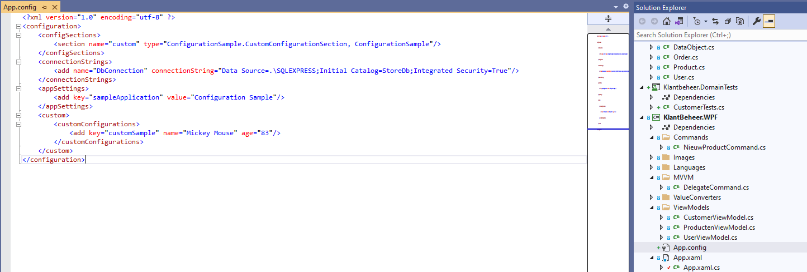
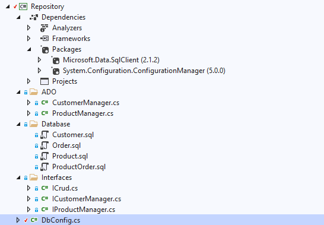

# Configureerbare waarden in app.config

Als voorbeeld configureren we een zogenaamde "connection string" naar een SQLServer databank als een waarde die eenvoudig gewijzigd kan worden in een xml bestand dat geraadpleegd wordt bij het opstarten van je applicatie: (her-)compileren is niet nodig.

Het configuratiebestand moet je toevoegen aan de console applicatie of de WPF applicatie die je opstart, niet aan de assembly waarin je uiteindelijk de configuratie opvraagt via broncode:



Let op: je App.config bestand moet steeds aangeven, als eerste regel, dat het een xml bestand betreft:

```xml
<?xml version="1.0" encoding="utf-8" ?>
```

 Vervolgens is de tag "configuration" verplicht. Wens je een connection string op te nemen, dan moet dit gebeuren binnen de tag "connectionStrings" als volgt:

```xml
<connectionStrings>
		<add name="DbConnection" connectionString="Data Source=.\SQLEXPRESS;Initial Catalog=StoreDb;Integrated Security=True"/>
</connectionStrings>
```

Gebruik de nuget package manager om pakket System.Configuration.ConfigurationManager toe te voegen aan de assembly waarin je de geconfigureerde waarde wenst op te vragen:



Voeg bovenaan volgende "using" toe:

```c#
using System.Configuration;
```

Vervolgens kan je de connection string als volgt opvragen (je krijgt een string terug):

```c#
var connectionString = ConfigurationManager.ConnectionStrings["DbConnection"]?.ConnectionString;
```

