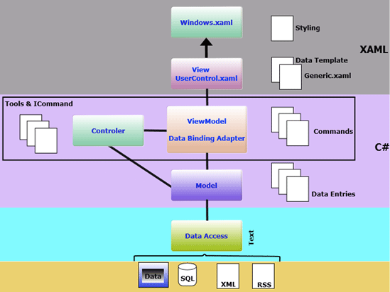
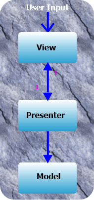
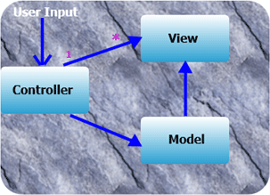
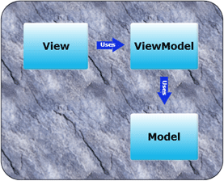

# MVVM

## Waarom MVVM?

Als een ontwikkelaar eenmaal vertrouwd is met WPF en MVVM, kan het moeilijk zijn om de twee van elkaar te onderscheiden. MVVM is zeer geschikt voor het WPF platform, en WPF is ontworpen om het gemakkelijk te maken applicaties te bouwen met het MVVM patroon.

Het belangrijkste aspect van WPF dat MVVM een geweldig patroon maakt om te gebruiken is de data binding infrastructuur, die het mogelijk maakt om de View (de presentatie aan de gebruiker) te scheiden van de data en de logica. De View kan worden ontworpen in Expression Blend terwijl het ViewModel kan worden ontwikkeld in Visual Studio .NET. Andere kenmerken van WPF zijn datatemplates en het resource systeem.

## MVVM architectuur



## Verschil tussen MVP, MVC en MVVM

Meestal is het erg verwarrend om het verschil te zien tussen MVP (Model-View-Presenter), MVC (Model-View-Controller) en MVVM (Model-View-View-Model).

### MVP (Model-View-Presenter)

In het MVP patroon stuurt de gebruiker de input naar de view, de view stuurt het door naar de presenter en de presenter wijzigt dan de view of het model, afhankelijk van het type gebruikersactie. De view en de presenter zijn nauw met elkaar verbonden door een bi-directionele relatie. Het model weet niets van de presentator. De view zelf is passief, daarom heet het ook presenter pattern, omdat de presenter de gegevens in de view duwt.



### MVC (Model-View-Controller

In dit patroon is er maar één controller die alle invoer direct krijgt, hij wijzigt de gegevens in het model afhankelijk van het type invoer. Zowel het model als de view worden gemaakt door de controller. De view weet alleen van het model, maar het model weet niets van andere objecten.



### MVVM (Model-View-ViewModel)

Het Model View ViewModel (MVVM) is een architectuurpatroon gebruikt in software engineering dat afkomstig is van Microsoft. Het is gebaseerd op het Model-view-controller patroon (MVC), en is gericht op moderne UI ontwikkelingsplatformen waarin er een UX ontwikkelaar is die andere eisen stelt dan een meer "traditionele" ontwikkelaar. MVVM is een manier om client applicaties te maken die gebruik maakt van kern kenmerken van het WPF platform, eenvoudige unit testen van applicatie functionaliteit mogelijk maakt, en ontwikkelaars en ontwerpers helpt samen te werken met minder technische moeilijkheden.

VIEW

Een View wordt gedefinieerd in XAML en zou geen logica in de code-behind moeten hebben. Het bindt aan het view-model door enkel gebruik te maken van data binding. De View bevat de visuele controls die aan de gebruiker getoond zullen worden en kan ook animaties, navigatie-aspecten, thema's en andere interactieve features bevatten ten behoeve van de visuele presentatie. De View is rechtstreeks gebonden aan het Model. Delen van het Model worden eenvoudig getoond in de View door eenrichtingsgegevensbinding. Andere delen van het model kunnen worden bewerkt door besturingselementen rechtstreeks in twee richtingen aan de gegevens te binden. Het fungeert als een brug tussen uw software en de gebruikers ervan.

MODEL

Model is verantwoordelijk voor het blootstellen van gegevens op een manier die gemakkelijk door WPF kan worden gebruikt.  Wanneer het ophalen van gegevens duur is, abstraheert het de dure operaties en blokkeert nooit de UI thread. Het is de gegevens- of bedrijfslogica, volledig UI-onafhankelijk, die de toestand opslaat en de verwerking van het probleemdomein uitvoert. Het model is geschreven in code of wordt wordt mapped op gegevens in relationele tabellen of XML of iets dergelijks.

VIEWMODEL

Een ViewModel is een model voor een view in de applicatie of we kunnen zeggen als abstractie van de view. Het moet INotifyPropertyChanged en/of INotifyCollectionChanged implementeren, al naar gelang het geval. Het stelt gegevens bloot die relevant zijn voor het uitzicht en stelt de gedragingen voor de uitzichten bloot, gewoonlijk via Commando's. Het ViewModel is de lijm tussen de gegevens (het model) en de buitenwereld. Het ViewModel is waar de View aan gebonden is. Het verschaft een specialisatie van het Model dat de View kan gebruiken voor gegevens-binding.



## De eenvoudigste implementatie: een paar hulpklassen

ViewModelBase en RelayCommand heb je minstens nodig om eenvoudige code te schrijven.

### ViewModelBase

```c#
using System.ComponentModel;
using System.Runtime.CompilerServices;

namespace ViewModel
{
    public abstract class ViewModelBase : INotifyPropertyChanged
    {
        public event PropertyChangedEventHandler PropertyChanged;

        protected void Set<T>(ref T target, T value, [CallerMemberName] string propertyName = "")
        {
            if(target.Equals(value)) return;
            target = value;
            RaisePropertyChanged(propertyName);
        }

        protected void RaisePropertyChanged([CallerMemberName] string propertyName = "")
        {
            PropertyChanged?.Invoke(this, new PropertyChangedEventArgs(propertyName));
        }
    }
}
```

### ComputedViewModelBase

```c#
using System.Collections.Generic;
using System.Reflection;

namespace ViewModel
{
    public abstract class ComputedViewModelBase : ViewModelBase
    {
        public ComputedViewModelBase()
        {
            var properties = new Dictionary<string, HashSet<string>>();
            foreach (var property in this.GetType().GetTypeInfo().DeclaredProperties)
            {
                var computedAttribute = property.GetCustomAttribute<PropertySourceAttribute>();
                if (computedAttribute == null) 
                {
                    continue;
                }

                foreach (var sourceName in computedAttribute.Sources)
                {
                    if (!properties.ContainsKey(sourceName)) 
                    {
                        properties[sourceName] = new HashSet<string>();
                    }

                    properties[sourceName].Add(property.Name);
                }
            }

            PropertyChanged += (sender, e) => 
            {
                if (properties.ContainsKey(e.PropertyName)) 
                {
                    foreach (var computedPropertyName in properties[e.PropertyName])
                    {
                        RaisePropertyChanged(computedPropertyName);
                    }
                }
            };
        }
    }
}
```

### PropertySourceAttribute

```c#
using System;
using System.Collections.Generic;

namespace ViewModel
{
    [AttributeUsageAttribute(AttributeTargets.Property)]
    public class PropertySourceAttribute : Attribute
    {
        public IEnumerable<string> Sources { get; private set; }

        public PropertySourceAttribute(params string[] sources)
        {
            Sources = sources;
        }
    }
}
```

### RelayCommand: te plaatsen in WPF assembly!

```C#
using System;
using System.Diagnostics;
using System.Windows.Input;

namespace ViewModel
{
    public class RelayCommand : ICommand
	{
    	#region Fields 
	    readonly Action<object> _execute;
	    readonly Predicate<object> _canExecute;
	    #endregion // Fields 
            
    	#region Constructors 
	    public RelayCommand(Action<object> execute) : this(execute, null) { }
        
	    public RelayCommand(Action<object> execute, Predicate<object> canExecute)
    	{
        	if (execute == null)
            	throw new ArgumentNullException("execute");
	        _execute = execute; _canExecute = canExecute;
    	}
	    #endregion // Constructors 
            
	    #region ICommand Members 
	    [DebuggerStepThrough]
    	public bool CanExecute(object parameter)
	    {
    	    return _canExecute == null ? true : _canExecute(parameter);
	    }
        
	    public event EventHandler CanExecuteChanged
    	{
        	add { CommandManager.RequerySuggested += value; }
	        remove { CommandManager.RequerySuggested -= value; }
    	}
	    public void Execute(object parameter) { _execute(parameter); }
	    #endregion // ICommand Members 
	}
}
```


### xUnit test: ViewModelBase

```c#
using ViewModel;
using Xunit;

namespace Tests
{  
    class Pet : ViewModelBase
    {
            private string _name;
            public string Name { get => _name; set => Set(ref _name, value); }
    }
    
    public class ViewModelBaseTest
    {
        [Fact]
        public void TestAll()
        {
            var called = false;
            var calledPropertyName = "";
            var puppy = new Pet();
            puppy.PropertyChanged += (sender, e) =>
            {
                called = true;
                calledPropertyName = e.PropertyName;
            };
            Assert.False(called);
            var newName = "Bassie";
            puppy.Name = newName;
            Assert.True(called);
            Assert.Equal(nameof(puppy.Name), calledPropertyName);
            Assert.Equal(newName, puppy.Name);
        }
    }
}
```

### xUnit test: PropertySource

```c#

using ViewModel;
using Xunit;

namespace Tests
{
    class Contact : ComputedViewModelBase
    {
            private string _name;
            public string Name { get => _name; set => Set(ref _name, value); }

            private string _surname;
            public string Surname { get => _surname; set => Set(ref _surname, value); }

            [PropertySource(nameof(Name), nameof(Surname))]
            public string Fullname => $"{Name} {Surname}".Trim();
    }
    
    public class ComputedViewModelBaseTest
    {
        [Fact]
        public void TestAll() 
        {
            var computedCalledTimes = 0;
            var lastFullname = "";
            var myContact = new Contact();
            myContact.PropertyChanged += (sender, e) =>
            {
                if (e.PropertyName == nameof(myContact.Fullname))
                {
                    computedCalledTimes += 1;
                    lastFullname = myContact.Fullname;
                }
            };
            Assert.Equal(0, computedCalledTimes);
            Assert.Equal("", lastFullname);
            myContact.Name = "Luc";
            Assert.Equal(1, computedCalledTimes);
            Assert.Equal("Luc", lastFullname);
            myContact.Surname = "Vervoort";
            Assert.Equal(2, computedCalledTimes);
            Assert.Equal("Luc Vervoort", lastFullname);
            Assert.Equal("Luc Vervoort", myContact.Fullname);
        }
    }
}
```

## Voorbeeld

### Domain ("Model")

```c#
namespace Domain
{
    public class Student
    {
        #region Properties
        public int Age { get; set; }
        public string FirstName { get; set; }
        #endregion

        #region Ctor
        public Student() // constructor
        {
            Age = 18;
        }
        #endregion

        #region Dtor
        ~Student() // destructor
        {
            System.Diagnostics.Debug.WriteLine("Destroying student " + FirstName);
        }
        #endregion
    }
}
```

### ViewModel

```c#
using System.Collections.ObjectModel;
using System.Windows.Input;

namespace ViewModels
{
    public class StudentsViewModel : ViewModelBase
    {
        public ObservableCollection<Student> StudentList { get; set; } = new ObservableCollection<Student>
        {
                new Student { FirstName = "Bruce" },
                new Student { FirstName = "Harry" },
                new Student { FirstName = "Stuart" },
                new Student { FirstName = "Robert" }
        };

        public string SelectedStudent { get; set; }

        private string _selectedName;
        public string SelectedName
        {
            get => _selectedName;
            set
            {
                if (_selectedName == value)
                {
                    return;
                }
                _selectedName = value;
                // Het doorgeven van het veld is niet meer nodig:
                RaisePropertyChanged(/*"SelectedName"*//*nameof(SelectedName)*/);
            }
        }

        private ICommand _updateStudentNameCommand;
        public ICommand UpdateStudentNameCommand
        {
            get => _updateStudentNameCommand;
            set => _updateStudentNameCommand = value;
        }

        // Om te tonen hoe je Mode=TwoWay gebruikt: wordt aangepast wanneer een student geselecteerd wordt
        private Student _selectedStudentItem;
        public Student SelectedStudentItem
        {
            get => _selectedStudentItem;
            set { if (_selectedStudentItem != value) { _selectedStudentItem = value; } }
        }

        public StudentsViewModel()
        {
            UpdateStudentNameCommand = new RelayCommand(o => SelectedStudentDetails(o), o => CanStudentBeShown());
        }

        // Wanneer het command uitgevoerd wordt:
        public void SelectedStudentDetails(object parameter)
        {
            if (parameter != null)
                SelectedName = (parameter as Student)?.FirstName;
        }

        // Criterium dat bruikbaarheid van knop bepaalt:
        public bool CanStudentBeShown()
        {
            return _selectedStudentItem != null;
        }
    }
}
```

### View

```xml
<Window x:Class="Views.Students"
        xmlns="http://schemas.microsoft.com/winfx/2006/xaml/presentation"
        xmlns:x="http://schemas.microsoft.com/winfx/2006/xaml"
        xmlns:d="http://schemas.microsoft.com/expression/blend/2008"
        xmlns:mc="http://schemas.openxmlformats.org/markup-compatibility/2006"
        xmlns:local="clr-namespace:ViewModels"
        mc:Ignorable="d"
        Title="Students" Height="450" Width="800">
    <Window.DataContext>
        <local:StudentsViewModel x:Name="ViewModel"/>
    </Window.DataContext>
    <Grid>
        <Grid.RowDefinitions>
            <RowDefinition Height="Auto"/>
            <RowDefinition Height="Auto"/>
            <RowDefinition Height="Auto"/>
            <RowDefinition Height="Auto"/>
            <RowDefinition Height="Auto"/>
        </Grid.RowDefinitions>
        <Grid.ColumnDefinitions>
            <ColumnDefinition Width="Auto" />
        </Grid.ColumnDefinitions>
        <StackPanel Grid.RowSpan="2">
            <ListView Name="ListViewStudentDetails" Grid.Row="2" ItemsSource="{Binding StudentList}" SelectedItem="{Binding SelectedStudentItem,Mode=TwoWay}">
                <ListView.View>
                    <GridView>
                        <GridViewColumn Header="Name" DisplayMemberBinding="{Binding FirstName}"/>
                    </GridView>
                </ListView.View>
            </ListView>
            <Button Command="{Binding UpdateStudentNameCommand}" CommandParameter="{Binding ElementName=ListViewStudentDetails,Path=SelectedItem}" Content="Display selected student"/>
            <TextBlock FontWeight="Bold" Text="Selected student is: "><Run Text="{Binding SelectedName, Mode=TwoWay}"/></TextBlock>
        </StackPanel>
    </Grid>
</Window>

```

```c#
using System.Windows;

namespace Views
{
    /// <summary>
    /// Interaction logic for Students.xaml
    /// </summary>
    public partial class Students : Window
    {
        public Students()
        {
            InitializeComponent();
            // DataContext is reeds gezet in xaml
        }
    }
}
```

