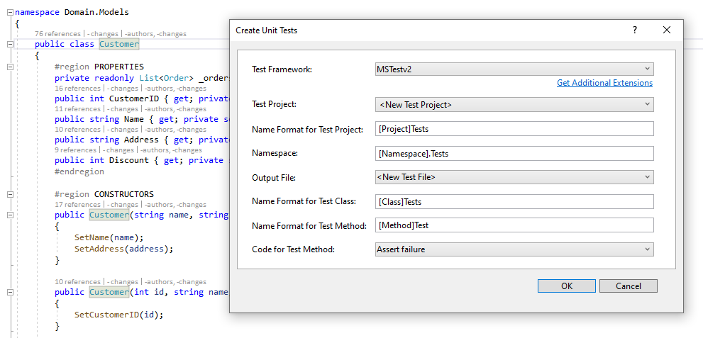
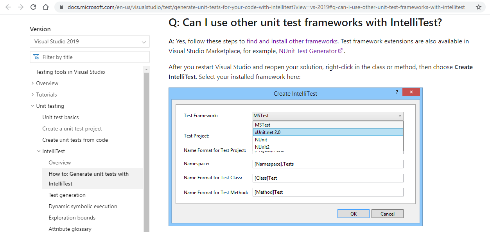
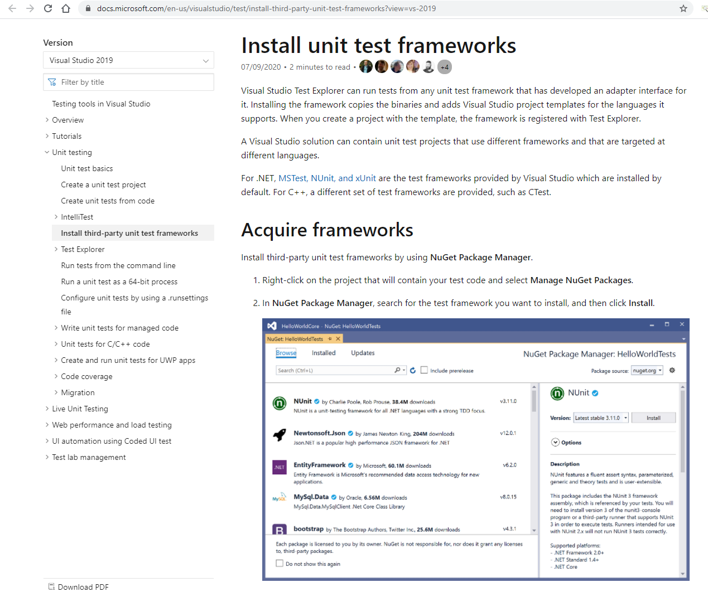
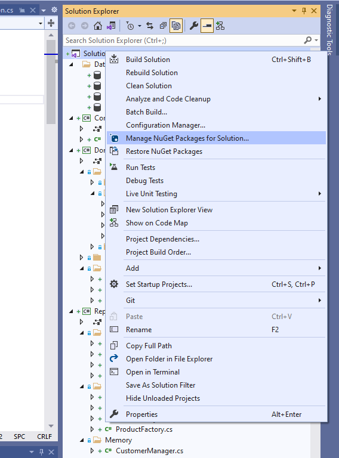
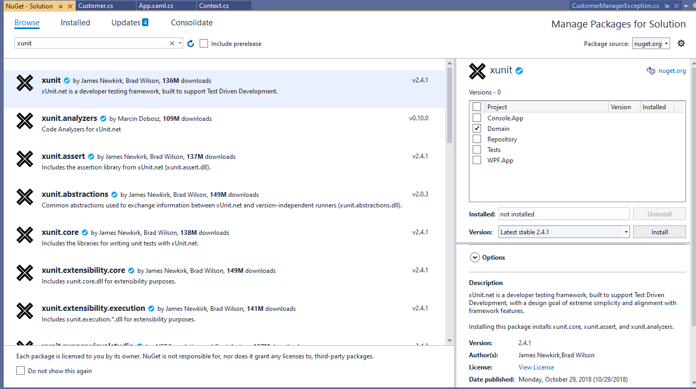
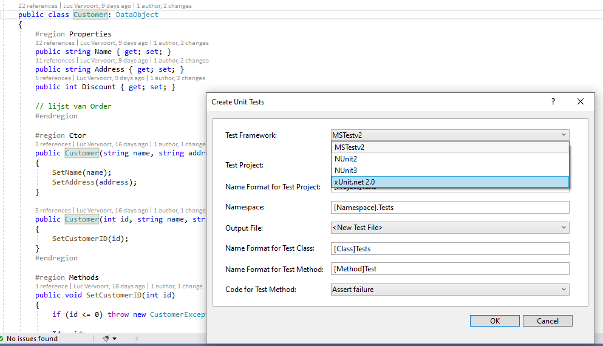
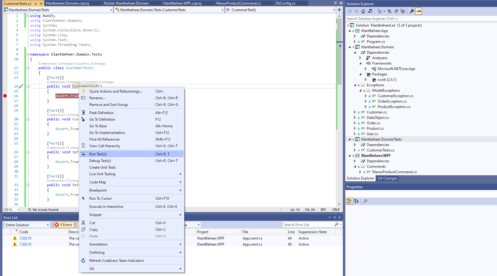
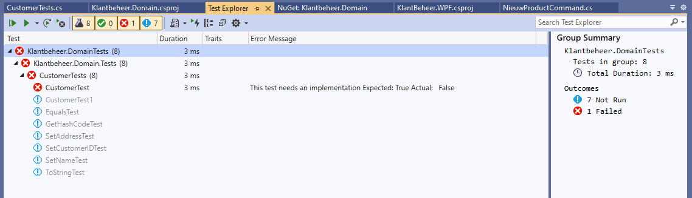

# XUnit test suite

xUnit is een open source unit testing tool voor .Net framework dat compatibel is met ReSharper, CodeRush, TestDriven.Net, Xamarin, Visual Studio. 

Klik rechts op een class naam en selecteer "Create Unit Tests". Kijk na of je bij "Test Framework:" "xUnit.net 2.0" kan selecteren. 

Indien niet, installeer dan met de nuget package manager het xUnit pakket (voor de bibliotheek die je wenst te testen). We begeleiden je met screenshots:













Het is mogelijk dat je Visual Studio 2019 moet herstarten alvorens je "xUnit.net 2.0" kan selecteren:







## **Feiten en theorieën**

In tegenstelling tot het populaire [Test] -attribuut dat je misschien kent, moet je het [Fact] -attribuut gebruiken om je unit-testmethoden te schrijven met xUnit.net. Merk op dat xUnit.net twee soorten unit-tests ondersteunt: feiten en theorieën.

Hoewel feiten worden gebruikt om invariante voorwaarden te testen, zijn theorieën tests die waar zijn voor een bepaalde set gegevens die als argument aan de methode worden doorgegeven. Normaal gesproken gebruik je het [Fact] -attribuut om unit-tests te schrijven die geen methode-argumenten hebben.

Het [Theory] -attribuut heeft echter een of meer DataAttribute instanties nodig om als methode-argumenten te worden doorgegeven. In wezen gebruik je het attribuut [Theory] voor het schrijven van gegevensgestuurde unit tests. Datagestuurde unit tests zijn tests die worden uitgevoerd op verschillende verzamelingen gegevens.

Aangenomen dat xUnit.Net en zijn runner voor Visual Studio is geïnstalleerd, laten we eerst een eenvoudige unit test schrijven met behulp van het [Fact] -attribuut. 

```c#
[Fact]
public void CheckEqualityTest()
{
   Assert.Equal(10, Sum(5, 5));
}
```

De Sum-methode accepteert twee gehele getallen en geeft de som ervan terug.

```c#
private int Sum(int x, int y)
{
  return x + y;
}
```

Wanneer je deze test uitvoert, slaagt de unit test - je kan dat zien in de Test Explorer Windows in Visual Studio. Laten we nu onderzoeken hoe we met theorieën kunnen werken om unit tests uit te voeren die "data gestuurd" zijn.

```c#
[Theory, InlineData("This is a data driven test", "data")]
public void CheckInputTest(string input, string substring)
{
   Assert.Equal(true, input.Contains(substring));
}
```

Let op het gebruik van het [Theory] -attribuut. Tenzij je unit tests data gestuurd zijn, kies je voor het [Fact] -attribuut in je unit test methoden. Merk op hoe parameters worden doorgegeven in de testmethode voor data gestuurde unit tests. Het InlineData-attribuut levert de gegevens. In dit voorbeeld worden de gegevens via inline-waarden aan de unit-testmethode doorgegeven. Je kanook meer InlineData-attributen gebruiken - je moet ze alleen maar scheiden met een komma:

```c#
[Theory, InlineData("This is a data driven test", "data"),
      InlineData("This is another set of data for the data driven test", "data")]
public void CheckInputTest(string input, string substring)
{
   Assert.Equal(true, input.Contains(substring));
}
```

Wanneer je de bovenstaande data gestuurde test uitvoert, wordt de CheckInputTest-methode twee keer uitgevoerd - één keer voor elke set invoergegevens.

