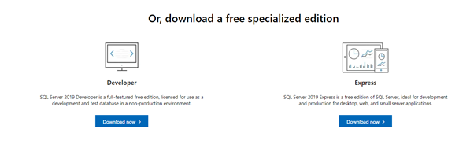
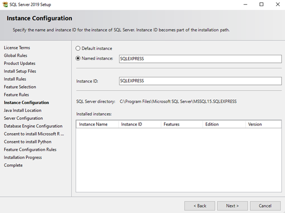
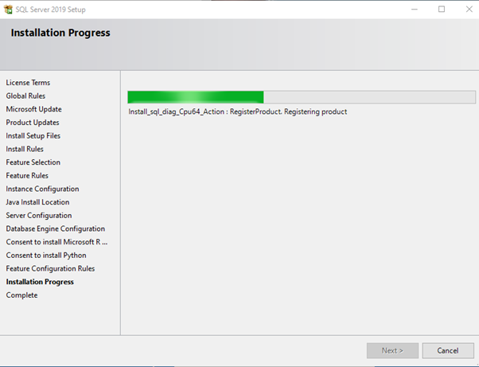
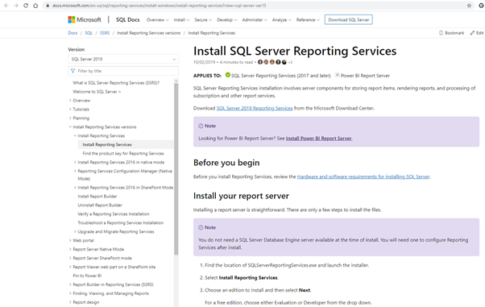

## 1. SqlExpress: a standalone database server

### Download

Go to:

https://www.microsoft.com/en-us/sql-server/sql-server-downloads

### Install the “Express” edition (on the right side of the following screenshot):

Chose: “Download now”

                          

Install everything but “SQL Server Reporting Services”. We start by clicking on “New SQL Server stand-alone installation or add features to an existing installation”.

 

 

Chose “Custom”:

 

 

 

Accept license terms:

 

Select “Use Microsoft Update”:

 

 

  


We will open up the required network ports later on, using a script:

 

Keep current selection:

 

Keep proposed name (named instance was “SqlExpress” on another computer):

 

 

Keep default configuration:

 

 You can chose to use only “Windows authentication mode” or mixed mode (Windows authentication mode and user/password):

 

 

 

 


## 2.  Install SQL Server Management Studio

Go to:

https://docs.microsoft.com/en-us/sql/ssms/download-sql-server-management-studio-ssms?view=sql-server-ver15

 

 

Go to:

https://docs.microsoft.com/en-us/sql/ssdt/download-sql-server-data-tools-ssdt?view=sql-server-ver15

 

 

Do not install:

 


## 3.  Configure SQL Server

 

- ·     Enable Named Pipes
- ·     Enable TCP/IP

Restart SqlServer.

## 4.  Open ports firewall

https://docs.microsoft.com/en-us/sql/sql-server/install/configure-the-windows-firewall-to-allow-sql-server-access?view=sql-server-ver15

 

 

```
netsh firewall set portopening protocol = TCP port = 1433 name = SQLPort mode = ENABLE scope = SUBNET profile = CURRENT
```

As Administrator:

```
netsh advfirewall firewall add rule name = SQLPort dir = in protocol = tcp action = allow localport = 1433 remoteip = localsubnet profile = DOMAIN
```

## 5.  NorthWind, Pubs and AdventureWorks example databases

https://docs.microsoft.com/en-us/dotnet/framework/data/adonet/sql/linq/downloading-sample-databases

https://github.com/Microsoft/sql-server-samples/tree/master/samples/databases/northwind-pubs

**Run the scripts in SSMS**

1. Open SSMS.
2. Connect to the target SQL Server.
3. Open the script in a new query window.
4. Run the script.

**Run the scripts in SSDT or Visual Studio**

1. Open SSDT or Visual Studio.
2. Open the SQL Server Object Explorer.
3. Connect to the target SQL Server.
4. Open the script in a new query window.
5. Run the script.

 

 


Copy to C:\Program Files\Microsoft SQL Server\MSSQL15.SQLEXPRESS\MSSQL\Backup:

 

Restore using SQLServer Management Studio:

 

Refresh:

 

AdventureWorks:

https://github.com/Microsoft/sql-server-samples/releases/tag/adventureworks

 

## 6.  Northwind database

 

## 7.  Upgrading

https://medium.com/cloudnimble/upgrade-visual-studio-2019s-localdb-to-sql-2019-da9da71c8ed6