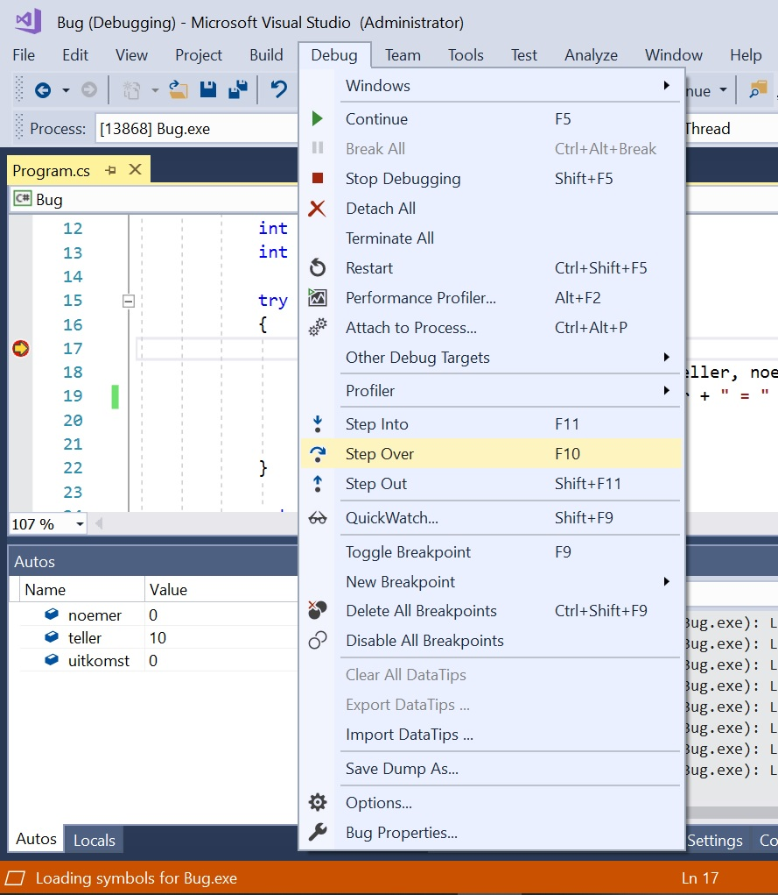

# Large scale applicaties

## Logging en tracing

## Debug Object

Tot dusver hebben we het één en ander op het scherm getoond met **Console.WriteLine**(s).  Op zich niks mis met deze aanpak, maar op een gegeven moment wil je de meldingen niet meer laten doen verschijnen. Je moet dan de desbetreffende *Console.WriteLines(s)*  uitzetten.

We kunnen ook een debug object gebruiken om het programma te laten tonen wat het doet en waarmee. Een debug object heeft weer haar eigen plekje voor het tonen van haar output. We vervangen in de exception handler de *Console.WriteLine*(s) door een aantal **Debug.WriteLine**(s) :

```c#
catch(Exception ex)
{
    // Op scherm
    Console.WriteLine("Iets gaat fout...\r\n");
    // Debug object
    Debug.WriteLine("--------------------------------");
    Debug.WriteLine("* Debug object *"``);
    Debug.WriteLine("Input:");
    Debug.Indent();
    Debug.WriteLine("- teller: {0}", teller);
    Debug.WriteLine("- noemer: {0}", noemer);
    Debug.Unindent();
    Debug.WriteLine("Fout:");
    Debug.Indent();
    Debug.WriteLine(ex.Message);
    Debug.Unindent();
    Debug.WriteLine("--------------------------------");
    // Gezien?
    Console.WriteLine("Gezien? Hit any key to continue...");
    Console.ReadKey();
}
```

En we zien dat de melding “*Iets gaat fout…*” nog steeds op het scherm verschijnt en dat komt doordat we een *Console.WriteLine* hebben gebruikt. Het resultaat van de **Debug.WriteLine**(s) krijgen we daarentegen niet te zien op het scherm, maar in de Visual Studio **Output** Window:

[](./Bug-Output-Window.jpg)


Een debug object is alleen maar bedoeld voor de ontwikkelomgeving en in de ontwikkelomgeving is meestal een Output Window aanwezig waarin een debug object haar output kan tonen.

De C# broncode zal uiteindelijk gecompileerd worden naar een **build**. Een *build* is in het geval van een Windows Console App (meestal) een .exe bestand dat direct uitgevoerd kan worden door vanuit de File Explorer erop te dubbelklikken.

We zien in de IDE (Integrated Development Environment) van Visual Studio dat we bij het maken van een *build* de opties **Debug** en **Release** hebben. De *Debug* optie is bedoeld voor het maken van een build voor de ontwikkelomgeving. De *Release* optie is bestemd voor het maken van een build voor een productieomgeving. De build voor de productieomgeving zal uiteindelijk verschillen van de build voor de ontwikkelomgeving. Bij de build voor de productieomgeving ligt de nadruk op performance waarbij overhead zoals debug objecten niet wordt meegenomen.


Maar wat als het programma draait in een productieomgeving en het programma doet het niet of het doet niet datgene wat we verwachten? Ook dan willen we detail informatie hebben over wat het programma doet zodat we aan de hand daarvan naar de bug kunnen zoeken.

Een debug object wordt niet meegenomen naar de release build en een Visual Studio Output Window zal meestal ook niet aanwezig zijn in een productieomgeving. We kunnen voor productieomgeving toestanden gelukkig gebruik maken van een **Trace object**.

Voor een trace object moeten we aangeven waar de output naar toe moet. De output mag in dit voorbeeld gewoon naar het scherm en we gebruiken daarvoor een **ConsoleTraceListener**:

```c#
// Trace object - waar moet de output naar toe?
TraceListener consoleTraceListener = new ConsoleTraceListener();
Trace.Listeners.Add(consoleTraceListener);
```

Je kan de output ook naar een bestand/medium sturen en C# biedt een ruime keus aan te gebruiken trace listeners. Trace listeners die je kunt gebruiken:

* de [XMLWriterTraceListener](https://www.mrasoft.nl/de-xmlwritertracelistener-in-csharp/)
* de TextWriterTraceListener
* de EventLogTraceListener
* de DelimitedTextTraceListener
* de EventSchemaTraceListener

Wij doen in de exception handler een aantal **Trace.WriteLine**(s) en het interesseert ons verder niet waar de output naar toe gaat. Dat wordt geregeld door de eerder gekozen trace listener.

```c#
catch(Exception ex)
{
    // Op scherm
    Console.WriteLine("Iets gaat fout..." + System.Environment.Newline);
    // Trace object - waar moet de output naar toe?
    TraceListener consoleTraceListener = new ConsoleTraceListener();
    Trace.Listeners.Add(consoleTraceListener);
    // Trace object
    Trace.WriteLine("--------------------------------");
    Trace.WriteLine("* Trace object *");
    Trace.WriteLine("Input:");
    Trace.Indent();
    Trace.WriteLine("- teller: " + Convert.ToString(teller));
    Trace.WriteLine("- noemer: " + Convert.ToString(noemer));
    Trace.Unindent();
    Trace.WriteLine("Fout:");
    Trace.Indent();
    Trace.WriteLine(ex.Message);
    Trace.Unindent();
    Trace.WriteLine("--------------------------------");
    // Gezien?
    Console.WriteLine("Gezien? Hit any key to continue...");
    Console.ReadKey();
}
```

En we zien dat de output van het trace object naar het scherm wordt gestuurd omdat we een *ConsoleTraceListener* hebben gebruikt:


Debug en trace objecten, heel leuk en je zal met de eerder besproken [**stack trace**](https://www.mrasoft.nl/exceptions-in-csharp/) ongetwijfeld veel aanwijzingen krijgen over de plek waar de bug zich kan ophouden. Maar het zijn en blijven aanwijzingen en voor het echte zoekwerk hebben we toch een debugger van een IDE nodig waarmee we het betere debug werk kunnen doen.

Zie onderstaande afbeelding hoe we kunnen debuggen in Visual Studio. Je kunt break points plaatsen vanaf waar je het debuggen kunt laten beginnen. En je kan, gewapend met een *Step Into* (F11) en een *Step Over* (F10) beginnen met je jacht op de bug..



De **Assert** methode is de moeite van het vermelden waard. Zowel de debug als de trace object hebben deze methode en je kan de *Assert* methode toepassen als een extra controlemiddel.

In het voorbeeld in deze posting doen we een deling en als de noemer nul is dan heeft het eigenlijk geen zin om verder te gaan. We voegen derhalve wat *Assert*(s) toe aan de code:

```c#
// Assert voor Debug object
Debug.Assert(noemer != 0, "Debug.Assert:Delen door nul is flauwekul."); 
// Assert voor Trace object
Trace.Assert(noemer != 0, "Trace.Assert: Delen door nul is flauwekul.");
// de deling
uitkomst = teller / noemer;
```

En we krijgen, als de noemer nul is deze pup-up waarbij de optie aanwezig is om door te gaan (*ignore*), maar eigenlijk heeft dat geen zin, want *delen door nul blijft flauwekul*:


Programmeren en debuggen; ze zijn onlosmakelijk met elkaar verbonden en debuggen kan zeer uitdagend en frustrerend zijn. Met name als het een door meerdere programmeurs uitgewoond stuk programmatuur betreft waar ongebreideld steeds meer aan is toegevoegd waardoor de programmatuur een verschrikkelijk (spaghetti) monster is geworden:


Een voordeel als de bug geen klein motje meer is, maar een heuse Tyrannosaurus Rex. Je hoeft de bug niet te zoeken. De bug vindt jou wel.

Alle hulpmiddelen ten spijt, voor het echte zoekwerk hebben we toch een debugger van een IDE nodig waarbij we vanuit een ontwikkelomgeving het betere debug werk kunnen doen.

Log4net,NLog, Serilog

*Log4net is meest gebruikt: veel documentatie, maar gebruikt niet de nieuwste .NET mogelijkheden en biedt geen gestructureerde logging aan

NLog is moderner, biedt gestructureerde logging aan, ondersteunt NoSQL databases

https://stackify.com/nlog-vs-log4net-vs-serilog/

Serilog is a newer logging framework for .NET. It was built with [structured logging](https://stackify.com/what-is-structured-logging-and-why-developers-need-it/) in mind. It makes it easy to record custom object properties and even output your logs to JSON.

Note: You can actually check out our other tutorials for [NLog](https://stackify.com/nlog-guide-dotnet-logging/) and [log4net](https://stackify.com/log4net-guide-dotnet-logging/) to learn how to do structured logging with them also!

**In this article, we are going to review some of the key features, benefits, and best practices of Serilog.**

## What Is Serilog? Why Should You Use It, or Any C# Logging Framework?

Logging is one of the most basic things that every application needs. It is fundamental to troubleshoot any application problems.

Logging frameworks make it easy to **send your logs to different places** via simple configurations. Serilog uses what are called sinks to send your logs to a text file, database, or log management solutions, or potentially dozens of other places, all without changing your code.

### How to Install Serilog via Nuget and Get Started

Starting with Serilog is as easy as installing a Serilog Nuget package. You will also want to pick some logging sinks to direct where your log messages should go, including the console and a text file.

If you are new to Serilog, check out their website: [Serilog.net](https://serilog.net/)

```
Install-Package Serilog
```

```
Install-Package Serilog.Sinks.Console
```


### Logging Sinks: What They Are and Common Sinks You Need to Know

Sinks are how you direct where you want your logs sent. The most popular of the standard sinks are the File and Console targets. I would also try the Debug sink if you want to see your log statements in the Visual Studio Debug window so you don’t have to open a log file.

Serilog’s sinks are configured in code when your application first starts. Here is an example:

```
using (var log = new LoggerConfiguration()
```

```
    .WriteTo.Console()
```

```
    .CreateLogger())
```

```
{
```

```
    log.Information("Hello, Serilog!");
```

```
    log.Warning("Goodbye, Serilog.")
```

```
}
```


If you are using a Console, you should check out the ColoredConsole sink:


### How to Enable Serilog’s Own Internal Debug Logging

If you are having any problems with Serilog, you can subscribe to its internal events and write them to your debug window or a console.

```
Serilog.Debugging.SelfLog.Enable(msg => Debug.WriteLine(msg));
```

```
Serilog.Debugging.SelfLog.Enable(Console.Error);
```

Please note that the internal logging will not write to any user-defined sinks.

### Make Good Use of Multiple Serilog Logging Levels and Filter by Them

Be sure to use verbose, debug, information, warning, error, and fatal logging levels as appropriate.

This is really valuable if you want to specify only certain levels to be logged to specific logging sinks or to reduce logging in production.

If you are using a central logging solution, you can easily search for logs by the logging level. This makes it easy to find warnings, errors, and fatals quickly.

### How to Do Structured Logging, or Log an Object or Properties With a Message

When Serilog was first released, this was one of the biggest reasons to use it. It was designed to easily log variables in your code.

As you can see in his example, it is easy to use these custom variables:

```
Log.Debug("Processing item {ItemNumber} of {ItemCount}", itemNumber, itemCount);
```


Serilog takes it to the next level because those same variables can also easily be recorded as JSON or sent to a log management solution like [Retrace](https://stackify.com/retrace/).

If you want to really get the value of [structured logging](https://stackify.com/what-is-structured-logging-and-why-developers-need-it/), you will want to send your logs to a log management tool that can index all the fields and enable powerful searching and analytics capabilities.

```
Warning: Saving logs to a database doesn't scale
```


Querying a SQL database for logging data is a terrible idea if aren’t using full-text indexing. It is also an expensive place to save logging data.

You are much better off sending your logs to a [log management](https://stackify.com/retrace-log-management/) service that can provide full-text indexing and more functionality with your logs.

### Do Not Send Emails on Every Exception

Everyone has made this mistake only once. Sending an email every time an exception happens quickly leads to all the emails being ignored, or your inbox gets flooded when a spike in errors occurs.

If you love getting flooded with emails, there is an [email sink](https://github.com/serilog/serilog-sinks-email) you can use.

### How to Send Alerts for Exceptions

If you want to send alerts when a new exception occurs, send your exceptions to an [error reporting](https://stackify.com/error-reporting/) solution, like [Stackify Retrace](https://stackify.com/retrace/), that is designed for this. Retrace can deduplicate your errors so you can figure out when an error is truly new or regressed. You can also track its history, error rates, and a bunch of other cool things.

### How to Search Logs Across Servers

Capturing logs and logging them to a file on disk is great, but it doesn’t scale and isn’t practical on large apps. If you want to search your logs across multiple servers and applications, you need to send all of your logs to a centralized logging server.

You can easily send your logs to Stackify with our custom sink:

```
var log = new LoggerConfiguration()
```

```
    .WriteTo.Stackify()
```

```
    .CreateLogger();
```

Products like [Stackify Retrace](https://stackify.com/retrace-log-management/) make it easy to view all of your logs in one place and search across all of them. They also support things like log monitoring, alerts, structured logging, and much more.

Screenshot of [Retrace’s log viewer](https://stackify.com/retrace-log-management/):


If you want to query all your text files on disk, consider using [VisualLogParser](https://visuallogparser.codeplex.com/).

### Use Filters to Suppress Certain Logging Statements

Serilog has the ability to [specify log levels](https://github.com/serilog/serilog/wiki/Configuration-Basics#overriding-per-sink) to send to specific sinks or suppress all log messages. Use the restrictedToMinimumLevel parameter.

```
Log.Logger = new LoggerConfiguration()
```

```
    .MinimumLevel.Debug()
```

```
    .WriteTo.File("log.txt")
```

```
    .WriteTo.Console(restrictedToMinimumLevel: LogEventLevel.Information)
```

```
    .CreateLogger();
```

### You Can Make Your Own Custom Sinks

If you want to do something that the standard Serilog sinks do not support, you can search online for one or write your own.

One example could be a target for writing to Azure Storage.

As an example of a custom target, you can review the [source code for our Serilog sink ](https://github.com/stackify/Serilog.Sinks.Stackify/blob/master/Serilog.Sinks.Stackify/Sinks/Stackify/StackifySink.cs)for sending logs to [Retrace](https://stackify.com/retrace/).

### Customize the Output Format of Your Logs

With Serilog you can [control the format](https://github.com/serilog/serilog/wiki/Formatting-Output#formatting-plain-text) of your logs, such as which fields you include, their order, and etc.

Here is a simple example:

```
Log.Logger = new LoggerConfiguration()
```

```
    .WriteTo.Console(outputTemplate:
```

```
        "[{Timestamp:HH:mm:ss} {Level:u3}] {Message:lj}{NewLine}{Exception}")
```

```
    .CreateLogger();
```

The following fields can be used in a custom output template:

- Exception
- Level
- Message
- NewLine
- Properties
- Timestamp

If that isn’t enough, you can implement ITextFormatter to have even more control of the output format.

Serilog has also great support from writing your log files as JSON. It has a built-in JSON formatter that you can use.

```
Log.Logger = new LoggerConfiguration()
```

```
    .WriteTo.File(new CompactJsonFormatter(), "log.txt")
```

```
    .CreateLogger();
```

### Enrich Your Logs With More Context

Most logging frameworks provide some way to **log additional context values** across all logging statements. This is perfect for setting something like a UserId at the beginning for a request and having it included in every log statement.

Serilog implements this by what they call [enrichment](https://github.com/serilog/serilog/wiki/Enrichment).

Below is a simple example of how to add the current thread id to the logging data captured.

```
var log = new LoggerConfiguration()
```

```
    .Enrich.WithThreadId()
```

```
    .WriteTo.Console()
```

```
    .CreateLogger();
```

To really use enrichment with your own app, you will want to use the LogContext.

```
var log = new LoggerConfiguration()
```

```
    .Enrich.FromLogContext()
```

After configuring the log context, you can then use it to push properties into the context of the request. Here is an example:

```
log.Information("No contextual properties");
```

```
using (LogContext.PushProperty("A", 1))
```

```
{
```

```
    log.Information("Carries property A = 1");
```

```
    using (LogContext.PushProperty("A", 2))
```

```
    using (LogContext.PushProperty("B", 1))
```

```
    {
```

```
        log.Information("Carries A = 2 and B = 1");
```

```
    }
```

```
    log.Information("Carries property A = 1, again");
```

```
}
```


### How to Correlate Log Messages by Qeb Request Transaction

One of the toughest things about logging is correlating multiple log messages to the same web request. This is especially hard in async code.

You can use one of the enrichment libraries to add various ASP.NET values to each of your log messages.

```
var log = new LoggerConfiguration()
```

```
    .WriteTo.Console()
```

```
    .Enrich.WithHttpRequestId()
```

```
    .Enrich.WithUserName()
```

```
    .CreateLogger();
```

It also has some cool options to add things like WithHttpRequestRawUrl, WithHttpRequestClientHostIP, and other properties.

If you are using .NET full framework or .NET Core, check out these enrichment libraries:

- [Full .NET Framework](https://github.com/serilog-web/classic)
- [ASP.NET Core](https://github.com/serilog/serilog-aspnetcore)

Note: There are also some other enrichment libraries for other various ASP.NET frameworks.

### How to View Serilog Logs by ASP.NET Web Request

Log files can quickly become a spaghetti mess of log messages. Especially with web apps that have lots of AJAX requests going on that all do logging.

I highly recommend using [Prefix](https://stackify.com/prefix), Stackify’s free .NET Profiler to view your logs per web request along with SQL queries, HTTP calls, and much more.


[TailBlazer](https://github.com/RolandPheasant/TailBlazer)

## Introspectie

### Reflection

## Audit trail

## Versiebeheer: hoe werkt een team met git?

## Deployment

### Obfuscation

- https://github.com/NotPrab/.NET-Obfuscator
- https://github.com/XenocodeRCE/neo-ConfuserEx
- https://github.com/dotnet/runtimelab/tree/feature/NativeAOT

### Packaging en publishing

### Self-contained op lokaal medium

### Cloud: Azure, AWS

### Docker en .NET 5.0

### .NET 5.0 on Raspberry Pi 4

https://github.com/pjgpetecodes/dotnet5pi

## Advanced debugging techniques

### ILSpy

## Emailing