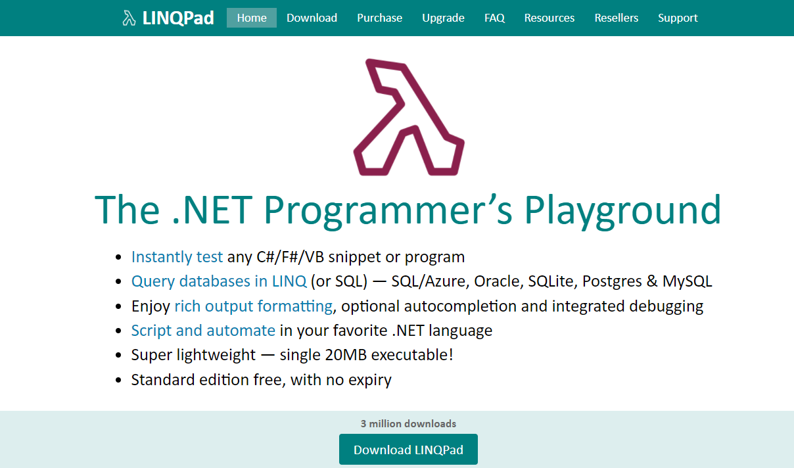

# LINQ: inleiding

LINQ, de afkorting van **Language Integrated Query**, is een technologie binnen het .NET framework waardoor je op een gemakkelijke manier data kan zoeken en manipuleren via uiteenlopende bronnen. Met ander woorden, Je kunt op dezelfde manier werken, of de bron nu een simpele lijst is, een woordenboek, een XML bestand of een database tabel. LINQ kent twee syntax-smaken: De *Query syntax* en de *Method syntax*. 

Een snelle demonstratie:

```c#
var names = new List<string>()  
{  
    "John Doe",  
    "Jane Doe",  
    "Jenna Doe",  
    "Joe Doe"  
};  

// Get the names which are 8 characters or less, using LINQ  
var shortNames = from name in names where name.Length <= 8 orderby name.Length select name;

foreach (var name in shortNames)  
    System.Diagnostics.Debug.WriteLine(name);
```

In slechts één regel, dank zij de LINQ **query syntax**, kunnen we naar alle namen in de lijst vragen die 8 letters (of minder) lang zijn, en deze tevens laten sorteren op lengte! Met maar één regel code tonen we slechts een fractie van wat LINQ kan.

# Uitgestelde uitvoering

De meeste programmeurs zijn er aan gewend dat code regel voor regel wordt uitgevoerd. Vandaar dat het als een verrassing komt dat een LINQ query niet wordt uitgevoerd zodra de regel met het query gedeelte aan de beurt is. In plaats daarvan wordt LINQ pas uitgevoerd zodra je data gaat gebruiken, bv. wanneer je een iteratie uitvoert of een method aanroept zoals ToList() of Count(). Dat betekent ook dat je een query kan bouwen die meerdere regels omvat, waarop je meerdere operaties loslaat: de data worden pas opgehaald als je ze echt nodig hebt. We illustreren dit met een verlengde versie van ons vorige voorbeeld en we kiezen voortaan voor de **method syntax** in plaats van de query syntax.

```c#
var names = new List<string>()
{
    "John Doe",
    "Jane Doe",
    "Jenna Doe",
    "Joe Doe"
};

// Get the names which are 8 characters or less, using LINQ
var shortNames = names.Where(name => name.Length <= 8);
// Order it by length
shortNames = shortNames.OrderBy(name => name.Length);
// Add a name to the original list
names.Add("Zoe Doe");

// Iterate over it - the query has not actually been executed yet!
// It will be as soon as we hit the foreach loop though!
foreach (var name in shortNames)
    System.Diagnostics.Debug.WriteLine(name);
```

De commentaar is bewust toegevoegd om de code eenvoudiger begrijpbaar te maken. Na de query voegen we bewust een naam toe aan de oorspronkelijke lijst. Als nu de query al was uitgevoerd, dan zou dit natuurlijk niets uitmaken voor het resultaat, maar dat doet het wel, omdat het wordt toegevoegd na de query maar VOORDAT we de data echt gaan gebruiken, en dat gebeurt in de *foreach* loop.

Dit is niet van groot belang bij een query bij een lijst van 4 of 5 namen. Maar stel je voor dat we een lijst hadden met 10 miljoen gegevens, of misschien ergens een remote database. In dat geval is het erg belangrijk dat we niet meerdere queries uitvoeren wanneer we alles met slechts één query kunnen doen.

# Query en method syntax

```c#
 var listOfNames = new List<string>()
{
    "John Doe",
    "Jane Doe",
    "Jenna Doe",
    "Joe Doe"
};

// Query syntax
var qNames = from name in listOfNames where name.Length <= 8 select name;
// Method syntax
var mNames = listOfNames.Where(name => name.Length <= 8);
```

Terwijl beide regels precies hetzelfde opleveren, is het verschil in syntaxis duidelijk: De **query syntax** lijkt meer op andere query talen, bv. SQL en minder op een gewoon C# statement. De **method syntax** echter, lijkt meer op gebruikelijke C# code.

Het enige verschil is echt de syntax. Daarom zie je dat beide variaties gebruikt worden wanneer je C# artikelen leest en antwoorden vindt op jouw vragen. Het schijnt dat de query syntax populairder is dan de method syntax omdat sommigen die gemakkelijker vinden om te lezen. Dit zouden wel eens informatici kunnen zijn die gewoon zijn om gegevens op te halen met SQL. Anderzijds zou je de method syntax gemakkelijker kunnen vinden om te lezen wanneer je wél ervaring hebt met C# maar je nog nooit eerder een query taal als SQL hebt gebruikt. 

Voor op zijn minst een aantal operaties, zoals het tellen van de items in het resultaat van de query, zul je de method syntax moeten gebruiken.

# Lambda expressies

In het voorbeeld van de method syntax zou je iets kunnen zien dat je al eerder leerde kennen, zoals de Where() method. Deze ziet er als volgt uit:

```c#
name => name.Length <= 8
```

Dit heet een lambda expressie en hoewel het niet een specifiek onderdeel is van de LINQ functionaliteit, wordt het VEEL gebruikt in de wereld van LINQ. Daarom zul je het ook vaak zien in de volgende artikelen. Terwijl we elders dieper ingaan op Lambda expressies, is dit een goed moment om een zeer oppervlakkige indruk te krijgen van hoe ze werken.

Een Lambda Expressie heeft een linkerkant en een rechterkant, verdeeld door de **=>** operator (niet te verwarren met de "groter dan of gelijk aan" operator, die er zo uit ziet: >=).

Aan de **linkerkant** hebben we de input parameter(s), (dat kunnen er verscheidene zijn, maar hier slechts één) die de *name* variabele is.

Aan de **rechterkant** hebben we het expressie/statement gedeelte. Hier genereren we het verwachte resultaat, in dit geval een boolean waarde die de Where() method vertelt of de naam in kwestie moet worden toegevoegd of niet. We beantwoorden dat met een expressie, waarbij we zeggen dat we naam willen toevoegen als hij 8 letters (of minder) lang is. We kunnen (maar dat is geen vereiste) de input (links) gebruiken om dat te bepalen. We refereren ernaar als "name", maar we zouden het ook "x" kunnen noemen. In dat geval zou het statement er zo uitzien:

```c#
var mNames = listOfNames.Where(x => x.Length <= 8);
```

Lambda expressies zijn wat meer dan alleen maar onderdeel van LINQ queries, maar ze zijn belangrijk wanneer je LINQ gebruikt. 

# Filteren: Where

Een van de meest eenvoudige (maar ook de meest krachtige) operaties die je kan loslaten op een reeks data is die waarmee je enkele gegevens uit die reeks kan filteren. We zagen al een glimp van wat je kunt doen met de **Where()** method, maar we graven nu een beetje dieper. We hebben al besproken hoeveel LINQ methods een Lambda expressie kunnen gebruiken om het werk te doen en de Where() method is er één van. Deze maakt van elk item de input en vervolgens kan jij de logica leveren die gaat bepalen of het item wordt toegevoegd (teruggegeven als true) of wordt buitengesloten (teruggegeven als false) uit het uiteindelijke resultaat. 

Hier is een voorbeeld:

```c#
List<int> numbers = new List<int>()
{
    1, 2, 4, 8, 16, 32
};
var smallNumbers = numbers.Where(n => n < 10);
foreach (var n in smallNumbers)
    System.Diagnostics.Debug.WriteLine(n);
```

In bovenstaande wordt elk getal gecheckt tegen onze expressie, die true zal terugggeven als het getal kleiner is dan 10 en false als het 10 is of hoger. Als resultaat krijgen we een versie van de oorspronkelijke lijst, waar alleen getallen kleiner dan 10 staan, wat dan naar de console wordt gestuurd.

Maar de expressie hoeft niet zó simpel te zijn. We kunnen er gemakkelijk meer vereisten aan toevoegen, net alsof het een regulier statement was:

```c#
List<int> numbers = new List<int>()
{
    1, 2, 4, 8, 16, 32
};
var smallNumbers = numbers.Where(n => n > 1 && n != 4 &&  n < 10);
foreach (var n in smallNumbers)
    System.Diagnostics.Debug.WriteLine(n);
```

We specificeren dat het getal groter moet zijn dan 1, maar dan niet het specifieke getal 4, en kleiner dan 10.

We kunnen natuurlijk ook allerlei methods aanroepen gebruiken in onze expressie, zolang het eindresultaat een boolean waarde is, zodat de Where() method weet of je het item wilt toevoegen of niet. Hier is een voorbeeld:

```c#
List<int> numbers = new List<int>()
{
    1, 2, 4, 7, 8, 16, 29, 32, 64, 128
};
List<int> excludedNumbers = new List<int>()
{
    7, 29
};
var validNumbers = numbers.Where(n => !excludedNumbers.Contains(n));
foreach (var n in validNumbers)
    System.Diagnostics.Debug.WriteLine(n);
```

In dit voorbeeld declareren we een tweede lijst met getallen, een soort zwarte lijst van getallen die we niet erbij willen hebben! In de Where() method gebruiken we de **Contains()** method bij de zwarte lijst om te bepalen of een getal in de eindlijst kan worden opgenomen of niet.

En natuurlijk werkt dat ook bij complexere objecten dan getallen en strings, en is het nog altijd erg gemakkelijk te gebruiken. Kijk naar het voorbeeld waar we objecten met gebruikersinformatie gebruiken in plaats van getallen. We gebruiken de Where() method om een lijst van gebruikers te krijgen waarvan de naam met de letter "J" begint, en met een leeftijd van 39 of jonger:

```c#
using System;
using System.Collections.Generic;
using System.Linq;

namespace LinqWhere2
{
    class Program
    {
    static void Main(string[] args)
    {
        List<User> listOfUsers = new List<User>()
        {
        new User() { Name = "John Doe", Age = 42 },
        new User() { Name = "Jane Doe", Age = 34 },
        new User() { Name = "Joe Doe", Age = 8 },
        new User() { Name = "Another Doe", Age = 15 },
        };

        var filteredUsers = listOfUsers.Where(user => user.Name.StartsWith("J") && user.Age < 40);
        foreach (User user in filteredUsers)
        System.Diagnostics.Debug.WriteLine(user.Name + ": " + user.Age);
    }

    class User
    {
        public string Name { get; set; }
        public int Age { get; set; }
    }
    }
}
```

En alleen ter vergelijking: zie hoe de where operatie eruit zou zien als we de **query syntax** hadden gebruikt in plaats van de method syntax.

```c#
// Method syntax
var filteredUsers = listOfUsers.Where(user => user.Name.StartsWith("J") && user.Age < 40);

// Query syntax
var filteredUsersQ = from user in listOfUsers where user.Name.StartsWith("J") && user.Age < 40 select user;
```

Het werkelijke resultaat van een LINQ expressie wordt pas gerealiseerd als je de data echt nodig hebt, bv. wanneer je er een 'loop' op loslaat, gaat tellen, of gaat itereren (zoals wij deden in onze voorbeelden). Dat betekent ook dat je multiple Where() methods aan elkaar kunt schakelen als je denkt dat dat beter leesbaar is. Bij zeer complexe expressies kan dat beslist het geval zijn! 

Hier is een gewijzigde versie van ons vorige voorbeeld:

```c#
List<int> numbers = new List<int>()
{
    1, 2, 4, 8, 16, 32
};
var smallNumbers = numbers.Where(n => n > 1).Where(n => n != 4).Where(n => n < 10);
foreach (var n in smallNumbers)
    System.Diagnostics.Debug.WriteLine(n);
```

Het resultaat is precies hetzelfde, en hoewel de eerste versie misschien niet complex genoeg was om de split te rechtvaardigen, kom je naar alle waarschijnlijkheid in situaties waar het verstandig is dat wel te doen. We willen benadrukken dat dit in termen van 'performance' niets extra kost, omdat de echte "where" operatie(s) pas worden uitgevoerd bij het onderdeel waar we een 'loop' uitvoeren bij het resultaat. Tegen die tijd hebben compiler en interpreter jouw query zo snel als mogelijk geoptimaliseerd, ongeacht hoe je die hebt geschreven.

# Sorteren: OrderBy() en ThenBy()

Nu we geleerd hebben om gegevens (data) uit de data bron te halen via LINQ en die te filteren met de Where() method, zou de volgende stap het sorteren van data kunnen zijn. We hebben lijsten van objecten gebruikt, zowel numerieke als gebaseerd op bv. een User class. Dus de volgorde waarin  we de items binnenkregen, was dezelfde als waarmee ze aan de lijst waren toegevoegd. Echter, zoals eerder besproken, kan jouw data bron voor LINQ operaties zowel een XML document zijn als een database. Daarom is de mogelijkheid om data goed te sorteren cruciaal. Gelukkig heeft LINQ een aantal gemakkelijk te gebruiken methods om data te sorteren. 

We proberen er een paar:

```c#
List<int> numbers = new List<int>()
{
    1, 7, 2, 61, 14
};
List<int> sortedNumbers = numbers.OrderBy(number => number).ToList();
foreach (int number in sortedNumbers)
    System.Diagnostics.Debug.WriteLine(number);
```

Dat was gemakkelijk, nietwaar? Roep de **OrderBy()** method aan en doe er het te sorteren object of de member van het object bij, en je krijgt er een gesorteerde lijst van terug. En natuurlijk kun je dat net ze gemakkelijk doen met strings, zoals we zullen zien in het volgende voorbeeld. Maar laten we de items in aflopende (grootste naar kleinste/van Z naar A) volgorde zetten:

```c#
List<string> cityNames = new List<string>()
{
    "Amsterdam", "Berlin", "London", "New York"
};
List<string> sortedCityNames = cityNames.OrderByDescending(city => city).ToList();
foreach (string cityName in sortedCityNames)
    System.Diagnostics.Debug.WriteLine(cityName);
```

We doen hetzelfde als zojuist maar nu gebruiken we niet de OrderBy() method maar de **OrderByDescending()** method. En natuurlijk kan je je lijst van integers en strings gemakkelijk gesorteerd krijgen, dat stelt niks voor! Maar dankzij LINQ is het vrijwel net zo gemakkelijk om complexere objecten te sorteren. Hier is een voorbeeld:

```c#
using System;
using System.Collections.Generic;
using System.Linq;

namespace LinqOrder2
{
    class User
    {
        public string Name { get; set; }
        public string Mail { get; set; }
        public int Age { get; set; }
    }
    
    class Program
    {
    static void Main(string[] args)
    {
        List<User> listOfUsers = new List<User>()
        {
        new User() { Name = "John Doe", Mail = "john@doe.com", Age = 42 },
        new User() { Name = "Jane Doe", Mail = "jane@doe.com", Age = 34 },
        new User() { Name = "Joe Doe", Mail = "joe@doe.com", Age = 8 },
        new User() { Name = "Another Doe", Mail = "another@doe.com", Age = 15 },
        };

        List<User> usersByAge = listOfUsers.OrderBy(user => user.Age).ToList();
        foreach (User user in usersByAge)
        System.Diagnostics.Debug.WriteLine(user.Name + ": " + user.Age + " years");
    }
    }
}
```

Dit is natuurlijk een completer voorbeeld, met de User class en een geïnitialiseerde lijst van gebruikers, maar zoals je kan zien, is het sorteren nog steeds erg kort en precies: Bij het aanroepen van de OrderBy() method, leveren we alleen maar een naam van een parameter en gebruiken vervolgens deze parameter om toegang te krijgen tot de Age property van de User objects. Het resultaat is een perfect op naam gesorteerde lijst! Maar wat te doen als we als we opmeer dan één property willen ordenen?

In bovenstaand voorbeeld sorteerden we de lijst van gebruikers volgens leeftijd. Maar als er nu enkele gebruikers zijn met dezelfde leeftijd? Een tamelijk voorkomend scenario, zelfs in ons kleine voorbeeld. Stel dat Jane en John even oud zijn en hun kinderen zijn tweelingen. Dan zou het praktisch zijn om de volgorde te kunnen bepalen zelfs nadat de databron op leeftijd was gezet. Hiervoor kunnen we de **ThenBy()** en **ThenByDescending()** methods gebruiken. Ze doen precies wat de naam zegt: bepaal de volgorde na een initiële sortering. We kunnen dat gebruiken om de lijst van gebruikers éérst op leeftijd en daarna alfabetisch op naam te sorteren:

```c#
List<User> listOfUsers = new List<User>()
{
    new User() { Name = "John Doe", Mail = "john@doe.com", Age = 42 },
    new User() { Name = "Jane Doe", Mail = "jane@doe.com", Age = 42 },
    new User() { Name = "Joe Doe", Mail = "joe@doe.com", Age = 8 },
    new User() { Name = "Jenna Doe", Mail = "another@doe.com", Age = 8 },          
};

List<User> sortedUsers = listOfUsers.OrderBy(user => user.Age).ThenBy(user => user.Name).ToList();
foreach (User user in sortedUsers)
    System.Diagnostics.Debug.WriteLine(user.Name + ": " + user.Age + " years");
```

Simpel maar heel effectief! Je kunt zelfs multipele ThenBy() method calls schakelen, voor het geval jouw data complexer zijn dan de data uit onze test case. En natuurlijk kun je de OrderBy(), OrderByDescending(), ThenBy() en ThenByDescending() methods mengen en vergelijken hoe je maar wilt:

```c#
List<User> sortedUsers = listOfUsers.OrderBy(user => user.Age).ThenByDescending(user => user.Name).ToList();
foreach (User user in sortedUsers)  
    System.Diagnostics.Debug.WriteLine(user.Name + ": " + user.Age + " years");
```

We gebruiken meestal de methode-gebaseerde syntaxis van LINQ, maar zoals altijd, nemen we één van de voorbeelden in het artikel en laten je zien hoe het eruit zou zien met de query syntax. Hier is het laatste voorbeeld met de **LINQ query syntax** versie:

```c#
// Method syntax
List<User> sortedUsers = listOfUsers.OrderBy(user => user.Age).ThenByDescending(user => user.Name).ToList();

// Query syntax
List<User> sortedUsersQ = (from user in listOfUsers orderby user.Age ascending, user.Name descending select user).ToList();
```

Zoals je ziet is de syntax enigszins verschillend. De richting (stijgend of dalend/ascending or descending) wordt direct gespecificeerd na het veld volgens welk geordend moet worden (ascending is eigenlijk impliciet, maar ik zette het erbij om het verschil te laten zien). Er is ook geen "ThenBy" in plaats daarvan. Je hoeft alleen maar multipele sorteerinstructies met een komma te scheiden. Natuurlijk leveren beide queries uiteindelijk hetzelfde resultaat.

Met behulp van de **OrderBy()** en **ThenBy()** methods (zowel als met hun "descending" tegenhangers), kun je gemakkelijk data sorteren zoals jij dat wilt. En denk eraan dat net als bij elke andere LINQ method de actuele databron niet verandert. In plaats daarvan krijg je een gesorteerde kopie van de originele databron, waarmee je aan het werk kan.

# Subset: beperk je data met Take() en Skip()

Tot nu toe hebben we in dit LINQ hoofdstuk verschillende manieren ontdekt om via LINQ met databronnen te werken. Nu is de tijd daar om te zien of we de hoeveelheid data kunnen beperken. Dit is vooral nuttig wanneer je een database als bron gebruikt, omdat die vaak enorme hoeveelheden rijen omvat, die echte capaciteit-vreters zijn om op te halen.

De methoden die we in dit artikel bespreken heten **Take()** en **Skip()**, en in combinatie doen ze het erg goed bij zoiets als het pagineren bij een website. In feite worden ze vaak samen gebruikt, maar ze kunnen natuurlijk ook apart gebruikt worden. De **Take()** method brengt je een X aantal items uit de databron, terwijl **Skip()** toestaat dat je de eerste X items negeert. 

Een simpel voorbeeld zou er zo uit kunnen zien:

```c#
List<string> names = new List<string>()
{
    "John Doe",
    "Jane Doe",
    "Joe Doe",
    "Jenna Doe",
};
var middleNames = names.Skip(1).Take(2).ToList();
foreach (var name in middleNames)
    System.Diagnostics.Debug.WriteLine(name);
```

We creëren een eenvoudige lijst van namen en daarna, voor de output, slaan we de eerste naam (Skip(1)) over, en nemen vervolgens de volgende twee namen (Take(2)), waardoor we slechts de middelste twee namen uit de lijst overhouden.

## Paginatie

Zoals je ziet zijn de beide Take() en Skip() methods heel eenvoudig te gebruiken, maar het wordt interessanter bij gebruik van meer data dan voorheen. We nemen de vrijheid om een iets complexer voorbeeld te bedenken, wat beter laat zien hoe deze methods je kunnen helpen. 

Eerst dan maar de code:

```c#
using System;
using System.Globalization;
using System.Linq;
using System.Xml.Linq;

namespace LinqTakeSkip1
{
    class Program
    {
    static void Main(string[] args)
    {
        CultureInfo usCulture = new CultureInfo("en-US");
        XDocument xDoc = XDocument.Load("http://www.ecb.europa.eu/stats/eurofxref/eurofxref-daily.xml");
        var cubeNodes = xDoc.Descendants().Where(n => n.Name.LocalName == "Cube" && n.Attribute("currency") != null).ToList();
        var currencyRateItems = cubeNodes.Select(node => new
        {
	        Currency = node.Attribute("currency").Value,
    	    Rate = double.Parse(node.Attribute("rate").Value, usCulture)
        });

        int pageSize = 5, pageCounter = 0;
        var pageItems = currencyRateItems.Take(pageSize);
        while(pageItems.Count() > 0)
        {
	        foreach (var item in pageItems)
    	        System.Diagnostics.Debug.WriteLine(item.Currency + ": " + item.Rate.ToString("N2", usCulture));
        	System.Diagnostics.Debug.WriteLine("Press any key to get the next items...");
	        System.Diagnostics.Debug.ReadKey();
    	    pageCounter++;
        	// Here's where we use the Skip() and Take() methods!
	        pageItems = currencyRateItems.Skip(pageSize * pageCounter).Take(pageSize);
        }
        System.Diagnostics.Debug.WriteLine("Done!");        
    }
    }
}
```

Een heleboel, maar laten we er even doorheen lopen. In de eerste helft 'parsen' we een publiek toegankelijke [XML bron van wisselkoersen](http://www.ecb.europa.eu/stats/eurofxref/eurofxref-daily.xml). Dit geeft ons de gelegenheid om je een idee te geven van LINQ en XML, wat een erg mooi onderdeel is van het LINQ eco-systeem. We bespreken elders, maar weet nu al dat we het gebruiken om de belangrijke knooppunten uit de XML bron te trekken en die in anonieme objecten te stoppen, die bestaan uit de naam en de huidige wisselkoers, die we later zullen gebruiken.

We hebben nu een databron van valuta informatie in de currencyRateItems variabele. In de laatste helft van het voorbeeld gebruiken we deze bron om wat eenvoudige paginering te doen. We verwijderen 5 items en vragen de gebruiker om een toets in te drukken voor de volgende vijf (of hoeveel er nog maar over zijn in de bron). We doen dat door de eerste vijf items ervan af te trekken en gebruiken een while 'loop' voor de volgende vijf, tot de bron leeg is. Het pakken van de *volgende* 5 items wordt gedaan met een combinatie van **Skip()** en **Take()**.

The Skip() en Take() methods zijn simpel in het gebruik, maar uiterst nuttig in tal van situaties. Zoals gezegd worden ze vaak samen gebruikt, maar vooral de Take() method kan net zo goed alleen gebruikt worden.

# Transformatie: Select()

Tot nu toe hebben we in dit LINQ hoofdstuk gewerkt met eenvoudige databronnen, bv. een lijst van integers, strings of simpele objects als de User class. We gaan hiermee door omdat het erg praktisch is dat je voorbeelden krijgt van de verschillende LINQ methods. Denk er echter aan dat bij LINQ de databron net zo goed een complex XML document kan zijn als een enorme database.

```c#
using System;  
using System.Collections.Generic;  
using System.Linq;  

namespace LinqSelect1  
{  
    class User  
    {  
        public string Name { get; set; }  
        public int Age { get; set; }  
    }  
    
    class Program  
    {  
    static void Main(string[] args)  
    {  
        List<User> listOfUsers = new List<User>()  
        {  
        new User() { Name = "John Doe", Age = 42 },  
        new User() { Name = "Jane Doe", Age = 34 },  
        new User() { Name = "Joe Doe", Age = 8 },  
        new User() { Name = "Another Doe", Age = 15 },  
        };  

        List<string> names = listOfUsers.Select(user => user.Name).ToList();  

        foreach (string name in names)  
        System.Diagnostics.Debug.WriteLine(name);  
    }  
    }  
}
```

Notice how I can take a list of objects, in this case of the type User, and then use the Select() method to shape this list into a new type of list. In this example, I turn the list of objects into a list of strings containing the names of the users. This is extremely practical in so many situations, where you need your data to look differently, or when you only need a subset of it. Of course, it also works the other way around - you can easily create a list of User objects from a list of names (you will have to manually add their age later though):

```c#
List<User> listOfUsers = new List<User>()
{
    new User() { Name = "John Doe", Age = 42 },
    new User() { Name = "Jane Doe", Age = 34 },
    new User() { Name = "Joe Doe", Age = 8 },
    new User() { Name = "Another Doe", Age = 15 },
};

List<string> names = listOfUsers.Select(user => user.Name).ToList();

List<User> users = names.Select(name => new User { Name = name }).ToList();

foreach (User user in users)
    System.Diagnostics.Debug.WriteLine(user.Name);
```

Notice how I can create new objects with the Select() method - it's an extremely powerful feature, which allows you to do pretty much anything with your data, on the fly! A common usage for this functionality is to make less complex versions of an object, e.g. to return over a web service as JSON or XML. Imagine that you have a User class with a LOT of properties (Birthday, Gender, Mail, Address, Country etc.), but you only want to return a limited set of these properties - that might also make sense, security-wise, to make sure that you don't return common User properties like Username and Password. Here's a simplified example - just imagine a much more complex User class:

```c#
using System;
using System.Collections.Generic;
using System.Linq;

namespace LinqSelect2
{ 
    class User
    {
        public string Name { get; set; }
        public int Age { get; set; }
        public string Mail { get; set; }
    }
    
    class Program
    {
    static void Main(string[] args)
    {
        List<User> listOfUsers = new List<User>()
        {
        	new User() { Name = "John Doe", Mail = "john@doe.com", Age = 42 },
	        new User() { Name = "Jane Doe", Mail = "jane@doe.com", Age = 34 },
	        new User() { Name = "Joe Doe", Mail = "joe@doe.com", Age = 8 },
    	    new User() { Name = "Another Doe", Mail = "another@doe.com", Age = 15 },
        };

        var simpleUsers = listOfUsers.Select(user => new
        {
	        Name = user.Name,
	        Age = user.Age
        });
        foreach (var user in simpleUsers)
    	    System.Diagnostics.Debug.WriteLine(user.Name);
    }
    }
}
```

In this example, we use the Select() method to return a list of anonymous types, which contains only a subset of the properties found on the data source. We then do the classical output of these objects to the console, but you should just imagine us returning them to a website or somewhere else, where it's important to keep the result as simple as possible, without revealing any secrets like passwords etc.

As we already discussed, I will mostly be using the method syntax of LINQ in these examples, but of course the operations we perform in this example can be expressed with the LINQ query syntax as well:

```c#
// Method syntax
var simpleUsers = listOfUsers.Select(user => new
{
    Name = user.Name,
    Age = user.Age
});

// Query syntax
var simpleUsersQ = (from user in listOfUsers
        		    select new
            		{
	            		Name = user.Name,
	    	        	Age = user.Age
	    	        }).ToList();

foreach (var user in simpleUsersQ)
    System.Diagnostics.Debug.WriteLine(user.Name);
```

The Select() method allows you to transform and shape data from your data source into new variants, for instance by selecting only a single property or returning objects which only contains a subset of the properties found on the source object.

# Groeperen: GroupBy()

Tot nu toe hebben we voornamelijk met lijsten van gegevens gewerkt. We hebben deze gesorteerd, gelimiteerd en omgevormd tot nieuwe objecten, maar er mist nog één belangrijk onderdeel: het groeperen van data. Wanneer je data groepeert, neem je een lijst van iets en verdeel je deze, gebaseerd op een of meerdere eigenschappen, in verschillende groepen. Stel nu dat we een gegevensbron hebben als de volgende:

```c#
var users = new List<User>()
{
    new User { Name = "John Doe", Age = 42, HomeCountry = "USA" },
    new User { Name = "Jane Doe", Age = 38, HomeCountry = "USA" },
    new User { Name = "Joe Doe", Age = 19, HomeCountry = "Germany" },
    new User { Name = "Jenna Doe", Age = 19, HomeCountry = "Germany" },
    new User { Name = "James Doe", Age = 8, HomeCountry = "USA" },
};
```

Een 'flat list' van gebruiker objecten, maar het zou interessant kunnen zijn om deze gebruikers te groeperen op basis van bv. hun thuisland of hun leeftijd. Met behulp van LINQ is dit erg gemakkelijk, ook al kan het gebruik van de GroupBy() methode op het eerste gezicht een beetje verwarrend zijn. Laten we eens kijken hoe het werkt:

```c#
using System;    
using System.Collections.Generic;    
using System.Linq;    

namespace LinqGroup    
{    
    public class User    
    {    
        public string Name { get; set; }    
        public int Age { get; set; }    
        public string HomeCountry { get; set; }    
    } 
    
    class Program    
    {    
    static void Main(string[] args)    
    {    
        var users = new List<User>()    
        {    
        new User { Name = "John Doe", Age = 42, HomeCountry = "USA" },    
        new User { Name = "Jane Doe", Age = 38, HomeCountry = "USA" },    
        new User { Name = "Joe Doe", Age = 19, HomeCountry = "Germany" },    
        new User { Name = "Jenna Doe", Age = 19, HomeCountry = "Germany" },    
        new User { Name = "James Doe", Age = 8, HomeCountry = "USA" },    
        };    
        var usersGroupedByCountry = users.GroupBy(user => user.HomeCountry);    
        foreach(var group in usersGroupedByCountry)    
        {    
        System.Diagnostics.Debug.WriteLine("Users from " + group.Key + ":");    
        foreach(var user in group)    
            System.Diagnostics.Debug.WriteLine("* " + user.Name);
        }    
    }       
    }    
}
```

Het resultaat ziet er als volgt uit:

```output
Users from USA:
* John Doe
* Jane Doe
* James Doe
Users from Germany:
* Joe Doe
* Jenna Doe
```

Het voorbeeld kan wat aan de lange kant zijn, maar zal je snel realiseren dat het meeste werk zit in het voorbereiden van de databron. Denk eraan dat alle data net zo goed van een XML document zouden kunnen komen of van een database. Het is dus gemakkelijker het te demonstreren met een databron die je zonder meer kan gebruiken.

Het interessante gedeelte is waar we de **usersGroupedByCountry** variabele creëren. We maken die door de **GroupBy()** method op onze databron los te laten, waarbij we precies die parameter gebruiken om de data mee te groeperen. In dit geval willen we de gebruikers groeperen naar land, dus die property zetten we bij de GroupBy() method. Het resultaat is een object met een Key property, die de waarde heeft van de property waarmee we groepeerden (HomeCountry in dit geval), zowel als van alle objecten die tot de groep behoren. We gebruiken dat in de volgende regels en itereren over de groepen die we gecreëerd hebben. En voor elke groep printen we de Key (HomeCountry) en dan itereren we en drukken al de User objects van de groep af.

## Eigen group keys

Zoals je ziet is het groeperen door een bestaande property een 'makkie', maar zoals je nu inmiddels weet, zijn de LINQ methods erg flexibel. op dezelfde gemakkelijke manier kan je eigen groepen creëren, gebaseerd op wat je maar wilt. Een voorbeeld daarvan zou het volgende kunnen zijn, waar we groepen creëren, die gebaseerd zijn op de eerste twee letters van de naam van de gebruiker:

```c#
using System;
using System.Collections.Generic;
using System.Linq;

namespace LinqGroup
{
    public class User
    {
        public string Name { get; set; }
        public int Age { get; set; }
        public string HomeCountry { get; set; }
    }
    
    class Program
    {
    static void Main(string[] args)
    {
        var users = new List<User>()
        {
        new User { Name = "John Doe", Age = 42, HomeCountry = "USA" },
        new User { Name = "Jane Doe", Age = 38, HomeCountry = "USA" },
        new User { Name = "Joe Doe", Age = 19, HomeCountry = "Germany" },
        new User { Name = "Jenna Doe", Age = 19, HomeCountry = "Germany" },
        new User { Name = "James Doe", Age = 8, HomeCountry = "USA" },
        };
        var usersGroupedByFirstLetters = users.GroupBy(user => user.Name.Substring(0, 2));
        foreach(var group in usersGroupedByFirstLetters)
        {
        System.Diagnostics.Debug.WriteLine("Users starting with " + group.Key + ":");
        foreach(var user in group)
            System.Diagnostics.Debug.WriteLine("* " + user.Name);
        }
    }
    }
}
```

We gebruiken de Substring() method bij de naam om de eerste twee letters te krijgen, en vervolgens creëert LINQ de groepen van gebruikers die daarop gebaseerd zijn. Het resultaat ziet er zo uit:

```c#
Users starting with Jo:
* John Doe
* Joe Doe
Users starting with Ja:
* Jane Doe
* James Doe
Users starting with Je:
* Jenna Doe
```

Zoals je ziet kunnen we zonder mereer een method binnen de GroupBy() method aanroepen. In feite kunnen we doen wat we willen, zolang we iets teruggeven dat LINQ kan gebruiken om items te groeperen. We kunnen zelfs een method creëren die een nieuw stuk informatie over een item teruggeeft en dat vervolgens gebruiken om een groep te creëren, zoals we gaan doen in het volgende voorbeeld:

```c#
using System;
using System.Collections.Generic;
using System.Linq;

namespace LinqGroup
{
    class Program
    {
    static void Main(string[] args)
    {
        var users = new List<User>()
        {
	        new User { Name = "John Doe", Age = 42, HomeCountry = "USA" },
	        new User { Name = "Jane Doe", Age = 38, HomeCountry = "USA" },
	        new User { Name = "Joe Doe", Age = 19, HomeCountry = "Germany" },
    	    new User { Name = "Jenna Doe", Age = 19, HomeCountry = "Germany" },
        	new User { Name = "James Doe", Age = 8, HomeCountry = "USA" },
        };
        var usersGroupedByAgeGroup = users.GroupBy(user => user.GetAgeGroup());
        foreach(var group in usersGroupedByAgeGroup)
        {
	        System.Diagnostics.Debug.WriteLine(group.Key + ":");
    	    foreach(var user in group)
        	    System.Diagnostics.Debug.WriteLine("* " + user.Name + " [" + user.Age + " years]");
        }
    }

    public class User
    {
        public string Name { get; set; }
        public int Age { get; set; }
        public string HomeCountry { get; set; }

        public string GetAgeGroup()
        {
        	if (this.Age < 13)
            	return "Children";
	        if (this.Age < 20)
    	        return "Teenagers";
        	return "Adults";
        }
    }
    }
}
```

Zie hoe we een **GetAgeGroup()** method hebben geïmplementeerd in de User class. Die geeft een string terug die de leeftijdsgroep van de gebruiker definieert en we roepen deze eenvoudigweg aan in de GroupBy() method om  te gebruiken als groep key. Het resultaat ziet er dan zo uit:

```output
Adults:
* John Doe [42 years]
* Jane Doe [38 years]
Teenagers:
* Joe Doe [19 years]
* Jenna Doe [19 years]
Children:
* James Doe [8 years]
```

We kozen ervoor om de GetAgeGroup() method te implementeren in de User class, omdat deze soms nuttig kan zijn op andere plaatsen. Soms heb je echter een stukje logica nodig om de groepen te creëren, wat dan niet ergens anders hergebruikt kan worden. In die situaties staat het je vrij om de logica meteen aan de GroupBy() method mee te geven, als een lambda expressie, zoals hier:

```c#
var usersGroupedByAgeGroup = users.GroupBy(user =>
        {
	        if (user.Age < 13)
    	        return "Children";
        	if (user.Age < 20)
            	return "Teenagers";
	        return "Adults";
        });
```

## Group via een samengestelde key

Tot nu bestonden de keys van onze groepen uit een enkele waarde, bv. een property of het resultaat van een method call. Het staat je echter vrij om je eigen keys te creëren die diverse waarden bevatten: dit noemen we samengestelde (composite) keys. Een voorbeeld kan zijn een groepering van onze gebruikers, gebaseerd op zowel thuisland als leeftijd:

```c#
using System;
using System.Collections.Generic;
using System.Linq;

namespace LinqGroup2
{
    class Program
    {
    static void Main(string[] args)
    {
        var users = new List<User>()
        {
	        new User { Name = "John Doe", Age = 42, HomeCountry = "USA" },
    	    new User { Name = "Jane Doe", Age = 38, HomeCountry = "USA" },
        	new User { Name = "Joe Doe", Age = 19, HomeCountry = "Germany" },
	        new User { Name = "Jenna Doe", Age = 19, HomeCountry = "Germany" },
    	    new User { Name = "James Doe", Age = 8, HomeCountry = "USA" },
        };

        var usersGroupedByCountryAndAge = users.GroupBy(user => new { user.HomeCountry, user.Age });
        foreach(var group in usersGroupedByCountryAndAge)
        {
        	System.Diagnostics.Debug.WriteLine("Users from " + group.Key.HomeCountry + " at the age of " + group.Key.Age + ":");
	        foreach (var user in group)
    	        System.Diagnostics.Debug.WriteLine("* " + user.Name + " [" + user.Age + " years]");
        }
    }

    public class User
    {
        public string Name { get; set; }
        public int Age { get; set; }
        public string HomeCountry { get; set; }
    }
    }
}
```

Let op de syntax in de GroupBy() method. In plaats van één enkele property te geven, creëren we een nieuw anoniem object, dat de HomeCountry en the Age properties bevat. LINQ creëert nu groepen gebaseerd op deze twee properties en koppelt het anonieme object aan de Key property van de groep. 

Het staat ons vrij beide properties te gebruiken als we de bewerking herhalen bij de groepen, zoals je kunt zien. Het resultaat ziet er dan zo uit:

```output
Users from USA at the age of 42:
* John Doe [42 years]
Users from USA at the age of 38:
* Jane Doe [38 years]
Users from Germany at the age of 19:
* Joe Doe [19 years]
* Jenna Doe [19 years]
Users from USA at the age of 8:
* James Doe [8 years]
```

Zoals altijd hebben we de LINQ Method syntax gebruikt, maar sta ons toe je te tonen hoe dit kan met de LINQ Query syntax:

```c#
// Method syntax
var usersGroupedByCountryAndAge = users.GroupBy(user => new { user.HomeCountry, user.Age });
// Query syntax
var usersGroupedByCountryAndAgeQ = from user in users group user by new { user.HomeCountry, user.Age } into userGroup select userGroup;
```

Zoals je waarschijnlijk ziet uit de voorbeelden is de GroupBy() method van LINQ extreem krachtig. Je kunt er echt jouw data mee gebruiken op nieuwe manieren, en met heel weinig code. Voorheen zou dit óf erg lastig zijn óf een relationele database vereisen. Met LINQ kun je om het even welke databron gebruiken die je maar wilt en nog steeds dezelfde bruikbare functionaliteit krijgen.

# Oefening: LINQ en File IO gecombineerd

Invoerbestand:

```output
50,22,30,10,50,5,40
25,10,10,46,16,17,90
15, c80x, 2
x, 2,3,
```

Wat is het totaal van alle rijen?

* Houd rekening met null waarden (zie laatste regel)
* Houd rekening met hexadecimale waarden
* Houd rekening met spaties, tabs, ...

```c#
using System.Linq;

public static class IntExtension
{
    public static int? ParseNullable(string text)
    {
        int result;
        return int.TryParse(text, out result) ? result : (int?)null;
    }
}

public class Program 
{
    public static void Main(string[] args)
    {
        var fileStream = new FileStream("inputdata.txt", FileMode.Open, FileAccess.Read);
	    string currentLine;
		int total;
		using (var streamReader = new StreamReader(fileStream, Encoding.UTF8))
    		while((currentLine = streamReader.ReadLine()) != null)
        		total += currentLine.Trim().Split(',').Sum(x => IntExtension.ParseNullable(x) ?? 0);
        System.Diagnostics.Debug.WriteLine("Totaal: " + total);
        fileStream.Dispose();
    }
}
```

# Operatoren

## Overzicht

1. Restriction: `Where`
2. Projection: `Select`, `SelectMany`
3. Partitioning: `Take`, `Skip`, `TakeWhile`, `SkipWhile`
4. Ordering: `OrderBy`, `OrderByDescending`, `ThenBy`, `ThenByDescending`, `Reverse`
5. Grouping: `GroupBy`
6. Set: `Concat`, `Union`, `Intersect`, `Except`
7. Conversion: `ToArray`, `ToList`, `ToDictionary`, `ToLookup`, `OfType`, `Cast`
8. Element: `First`, `FirstOrDefault`, `Last`, `LastOrDefault`, `Single`, `SingleOrDefault`, `ElementAt`, `ElementAtOrDefault`, `DefaultIfEmpty`
9. Generation: `Empty`, `Range`, `Repeat`
10. Quantifiers: `Any`, `All`, `Contains`, `SequenceEqual`
11. Aggregate: `Count`, `LongCount`, `Sum`, `Min`, `Max`, `Average`, `Aggregate`
12. Joining: `Join`, `GroupJoin`, `Zip`

## Restrictie

Beperkingsoperatoren nemen een input-reeks en geven een output-reeks terug met een beperkt aantal elementen ("gefilterd").

## Where

De elementen, die deel uitmaken van de output-reeks, zijn die elementen die overeenkomen met de opgegeven beperking. Individuele uitvoerelementen worden niet gewijzigd of getransformeerd.

```c#
Personen[] personen =
{
    new Personen { Name = "Jan", Leeftijd = 60 },
    new Personen { Name = "An", Leeftijd = 100 },
    new Personen { Name = "Peter", Leeftijd = 15 },
    new Personen { Name = "Marijke", Leeftijd = 40 },
    new Personen { Name = "Judith", Leeftijd = 20 }
};
IEnumerable<Personen> vijftigPlussers = personen.
    Where(x => x.Leeftijd >= 50);
System.Diagnostics.Debug.WriteLine("Vijftigplussers:");
foreach (Personen persoon in vijftigPlussers)
{
    System.Diagnostics.Debug.WriteLine(persoon.Name);
}
```

De code toont het gebruik van de `Where `operator. Het predicaat `x => x.Leeftijd >= 50` retourneert true voor elke persoon die 50 jaar is of meer. De code produceert de volgende output:

```output
Jan
An
```

Een predicaat is een functie die een boolean true teruggeeft als aan een bepaalde voorwaarde is voldaan.

Met een overload van `Where `kan je de positieindex van een element aan het pedicaat meegeven. In het voorbeeld heeft Jan een positieindex van 0 en Judith een positieindex van 4. De volgende query retourneert Jan en Judith:

```c#
Personen[] personen =
{
    new Personen { Name = "Jan", Leeftijd = 60 },
    new Personen { Name = "An", Leeftijd = 100 },
    new Personen { Name = "Peter", Leeftijd = 15 },
    new Personen { Name = "Marijke", Leeftijd = 40 },
    new Personen { Name = "Judith", Leeftijd = 20 }
};
IEnumerable<Personen> vijftigPlussers = 
    personen.Where((persoon, index) => 
    persoon.Name == "Jan" || index == 4);
System.Diagnostics.Debug.WriteLine("Vijftigplussers:");
foreach (Personen persoon in vijftigPlussers)
{
    System.Diagnostics.Debug.WriteLine(persoon.Name);
}
```

Deze lambda-expressie is verschillend. In deze code is de predikaat functie van het type `Func<Personen, int, bool>`. De parameter `int `geeft de positie van het element in de invoersequentie weer.

## Projectie

## Select

De `Select `queryoperator transformeert elk element in de invoersequentie naar een element in de uitvoersequentie. In de uitvoerreeks zitten evenveel elementen als in de invoerreeks.

De volgende query projecteert de inputreeks van `Personen `elementen op een outputreeks van `string `elementen. De lambda-expressie is een beschrijving van de projectie: het nemen van elk element in `personen `invoerreeks en het terugsturen van een `string `element.

```C#
Personen[] personen =
{
    new Personen { Name = "Jan", Leeftijd = 60 },
    new Personen { Name = "An", Leeftijd = 100 },
    new Personen { Name = "Peter", Leeftijd = 15 },
    new Personen { Name = "Marijke", Leeftijd = 40 },
    new Personen { Name = "Judith", Leeftijd = 20 }
};
IEnumerable<string> persoonsNamen = personen.Select(x => x.Name);
System.Diagnostics.Debug.WriteLine("Namen van de personen:");
foreach (string name in persoonsNamen)
{
    System.Diagnostics.Debug.WriteLine(name);
}
```

De lambda-expressie kan behoorlijk complex worden zoals in het volgende voorbeeld:

```c#
Personen[] personen =
{
    new Personen { Name = "Jan", Leeftijd = 60 },
    new Personen { Name = "An", Leeftijd = 100 },
    new Personen { Name = "Peter", Leeftijd = 15 },
    new Personen { Name = "Marijke", Leeftijd = 40 },
    new Personen { Name = "Judith", Leeftijd = 20 }
};
IEnumerable<string> persoonsNamen = personen.Select(
    x => String.Format("De lengte van de naam {0} is {1}.", 
        x.Name, x.Name.Length));
System.Diagnostics.Debug.WriteLine("Namen van de personen:");
foreach (string name in persoonsNamen)
{
    System.Diagnostics.Debug.WriteLine(name);
}
```

## SelectMany

Voegt collecties in een enkele collectie samen. Is vergelijkbaar met cross join van SQL.

Deze lambda-expressie monster kruist twee arrays, en produceert een Cartesiaans product.

```c#
Personen[] personen =
{
    new Personen { Name = "Jan", Leeftijd = 60 },
    new Personen { Name = "An", Leeftijd = 100 },
    new Personen { Name = "Peter", Leeftijd = 15 },
    new Personen { Name = "Marijke", Leeftijd = 40 },
    new Personen { Name = "Judith", Leeftijd = 20 }
};
string[] fruitSoorten = { "Appel", "Sinaasappel", "Druif" };
var PersonenDieFruitEten = personen.SelectMany(persoon => 
    fruitSoorten, (p, f) => new { persoon = p, fruitSoorten = f });
System.Diagnostics.Debug.WriteLine("Namen van de personen en het fruit dat ze kunnen eten:");
foreach (var persoonDieFruitEet in PersonenDieFruitEten)
{
    System.Diagnostics.Debug.WriteLine(String.Format("{0} eet {1}.",
        persoonDieFruitEet.persoon.Name,
        persoonDieFruitEet.fruitSoorten));
}
```

Deze creëert een output-reeks waarvan elk bestaat uit een Personen element en een Fruitsoort element.

## Partionering

Een partitionerings-query neemt een inputreeks en retourneren een "stuk" als output-reeks. Deze operatoren kan je gebruiken om grote sequenties in "pagina's" op te breken. Dat heet paging,

## Take

De Take query operator neemt een input reeks en geeft het opgegeven aantal elementen terug als uitvoerreeks.

De volgende code laat zien hoe je de Take query operator kan gebruiken om de eerste drie personen in de Personen reeks te retourneren.

```c#
static void LinqTakeOperator()
{
    Personen[] personen =
    {
        new Personen { Name = "Jan", Leeftijd = 60 },
        new Personen { Name = "An", Leeftijd = 100 },
        new Personen { Name = "Peter", Leeftijd = 15 },
        new Personen { Name = "Marijke", Leeftijd = 40 },
        new Personen { Name = "Judith", Leeftijd = 20 }
    };
    IEnumerable<Personen> eersteDriePersonen = personen.Take(3);
    System.Diagnostics.Debug.WriteLine("Namen van de eerste drie personen:");
    foreach (Personen persoon in eersteDriePersonen)
    {
        System.Diagnostics.Debug.WriteLine(persoon.Name);
    }
}
```

## TakeWhile

De `TakeWhile `queryoperator retourneert geen van te voren vast bepaald aantal elementen, maar blijft daarentegen elementen retourneren zolang een gespecificeerd predikaat waar is.

In de volgende code worden Personen teruggegeven zolang de leeftijd niet 11 is.

```c#
Personen[] personen =
{
    new Personen { Name = "Jan", Leeftijd = 60 },
    new Personen { Name = "An", Leeftijd = 100 },
    new Personen { Name = "Peter", Leeftijd = 15 },
    new Personen { Name = "Hans", Leeftijd = 11 },
    new Personen { Name = "Marijke", Leeftijd = 40 },
    new Personen { Name = "Judith", Leeftijd = 20 }
};
IEnumerable<Personen> personenZolangGeenElfJaar = 
    personen.TakeWhile(x => x.Leeftijd != 11);
System.Diagnostics.Debug.WriteLine("Namen tot er een persoon van 11 jaar wordt tegengekomen:");
foreach (Personen persoon in personenZolangGeenElfJaar)
{
    System.Diagnostics.Debug.WriteLine(persoon.Name);
}
```

# Aggregatie

Following examples show how to use LINQ aggregation methods defined in **Enumerable** class.

## Enumerable.Sum

Returns **sum** of values in numeric collection.

numbers: 8, 2, 6, 3


```c#
int result = numbers.Sum();
```

result: 19


Returns **zero** for empty collection.

numbers: (empty)

```c#
int result = numbers.Sum();
```

result: 0

## Enumerable.Max

Returns **maximal value** in numeric collection.

numbers: 8, 2, 6, 3


```c#
int result = numbers.Max();
```
result: 8


Throws **InvalidOperationException** for empty collection.

numbers: (empty)


```c#
int result = numbers.Max();
```


## Enumerable.Min

Returns **minimal value** in numeric collection.

numbers: 8, 2, 6, 3

```c#
int result = numbers.Min();
```

result: 2


Throws **InvalidOperationException** for empty collection.

numbers: (empty)

```c#
int result = numbers.Min();
```

## Enumerable.Count

Returns **number of items** in a collection.

items: A, B, C, D

```c#
int result = items.Count();
```

result: 4


Returns **zero** for empty collection.

items: (empty)

int result = items.Count();

result: 0

## Enumerable.LongCount

Returns **number of items** in a collection. The result is of type **long** (Int64), so the number of items can be greater than Int32.MaxValue (2,147,483,647).

items: A, B, C, D


```c#
long result = items.LongCount();
```

result: 4


Returns **zero** for empty collection.

items: (empty)

long result = items.LongCount();

result: 0


## Enumerable.Average

Returns **average value** of numeric collection.

numbers: 8, 2, 6, 3

```c#
double result = numbers.Average();
```


result: 4.75


Throws **InvalidOperationException** for empty collection.

numbers: (empty)

```c#
double result = numbers.Average();
```


## Enumerable.Aggregate

Aggregate method **applies a function to each item** of a collection. In this example the function to be applied is adding (operator +).

numbers: 8, 2, 6, 3


```c#
int sum = numbers.Aggregate( func: (result,item) => result+item );
```

sum: 19


Throws **InvalidOperationException** for empty collection.

 numbers: (empty)

```c#
int sum = numbers.Aggregate( func: (result,item) => result+item );
```


# LINQPad



Voor voorbeelden die uitvoerbaar zijn via LINQPad, zie gecomprimeerd bestand [LinqPadExamples.zip](./LinqPadExamples.zip).