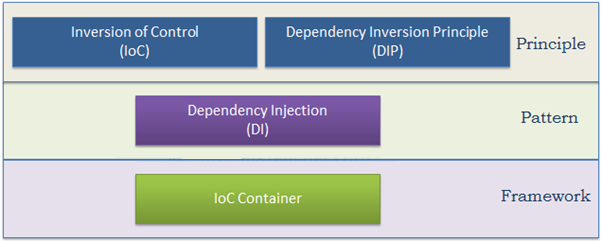
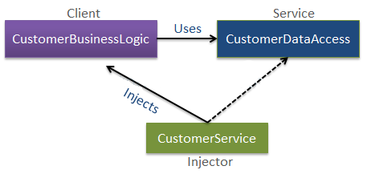

# Inversion of Control

## Inleiding

Wanneer je object-georiënteerde **“loosely coupled”** software wil opzetten, loop je al vrij snel tegen de uitdaging aan dat objecten elkaar nodig hebben. Er zijn allerhande *design best practices* om met deze afhankelijkheden om te gaan en de mogelijkheden van Inversion of Control (IOC) raamwerken (frameworks) horen hierbij.

De centrale rol en grote kracht van het begrip *interface* wordt in dit kader meteen duidelijk.

Een IOC-raamwerk neemt de verantwoordelijkheid voor het aanmaken van objecten en het managen van de lifecycle van deze objecten over van de applicatie. Stel bijvoorbeeld dat je een proces voor het inlezen, verwerken en versturen van tekstbestanden wilt automatiseren. Dan zou je onderstaande code mogelijk terugzien in de software:


De instantiering van de importer, de processor en de writer staan hier hard in de code. Zou je dit vervangen door een IOC-framework dan zal er waarschijnlijk iets staan als:


Op het oog misschien niet zo’n spectaculaire verbetering, maar toch zijn er zeer grote voordelen behaald:

- De code is geautomatiseerd te testen doordat het gedrag van de IOC-container in de unittest eenvoudig is aan te passen. Bovendien is bijvoorbeeld Moq makkelijk toe te passen!
- De code werkt middels interfaces waardoor het gedrag van dit proces is aan te passen zonder de code te wijzigen.

Dat laatste punt wordt zichtbaar doordat een hoop IOC-raamwerken de mogelijkheid hebben om hun gedrag via configuratie in te stellen. We geven een voorbeeld op basis van Microsoft Unity, een raamwerk waarmee we verderop kennis zullen maken:


Met andere woorden: inversion of control is een absolute aanrader om in je gereedschapskist als ontwikkelaar te hebben.

Vaak gebeurt het dat informaticaconcepten moeilijker te begrijpen zijn, terwijl ze op zich eenvoudig in elkaar steken als principe en we er soms zonder het te beseffen gebruik van maken.

Dit is ook het geval met **Inversion of Control** (IOC) en **Dependency Injection** (DI).

De termen Inversion of Control (IoC), Dependency Inversion Principle (DIP), Dependency Injection (DI) en IoC-containers zijn je misschien wel bekend, maar weet je wat elke term precies betekent?


Laten we bovenstaande buzz-words begrijpen. De volgende afbeelding verduidelijkt of het principes dan wel patronen betreft:



Zoals geïllustreerd zijn IoC en DIP ontwerpprincipes die best aangewend worden bij het implementeren van toepassingen. Omdat het principes zijn, reiken ze "beste praktijken" (best practices) aan, maar geven ze geen specifieke details over de implementatie. Dependency Injection (DI) is een patroon en IoC-container is een raamwerk.

Laten we elke term toelichten vooraleer we op details ingaan.

### Inversie van controle

IoC is een ontwerpprincipe dat de omkering van controle in een object-georiënteerd ontwerp aanbeveelt om een ​​losse koppeling tussen toepassingsklassen te bereiken. In dit geval verwijst "controle" naar alle aanvullende verantwoordelijkheden die een klasse heeft, uitgenomen de hoofdverantwoordelijkheid, zoals controle over de stroom van een applicatie of controle over het creëren en binden van het afhankelijke object (onthoud SRP - Single Responsibility Principle).

Als je TDD (Test Driven Development) wilt doen, dan moet je het IoC-principe gebruiken, zonder welke TDD niet mogelijk is.

### Principe van inversie-afhankelijkheid

Het DIP-principe helpt bij het bereiken van losse koppeling tussen klassen. Het wordt sterk aanbevolen om DIP en IoC samen te gebruiken om een ​​losse koppeling te bereiken.

DIP suggereert dat modules op hoger niveau niet afhankelijk mogen zijn van modules op lager niveau. Beiden moeten afhangen van een abstractie.

Het DIP-principe is uitgevonden door Robert Martin (ook bekend als **Uncle Bob**). Hij is een van de grondleggers van de SOLID-principes.

### Afhankelijkheidsinjectie

Dependency Injection (DI) is een ontwerppatroon dat het IoC-principe implementeert om de creatie van afhankelijke objecten om te keren.

### IoC-container

De IoC-container is een raamwerk (framework) dat wordt gebruikt om automatische injectie van afhankelijkheden in de hele applicatie te beheren, zodat wij als programmeurs er minder tijd en moeite in hoeven te steken. Er zijn verschillende IoC-containers voor .NET, zoals Unity, Ninject, StructureMap, Autofac, enzovoort. We sommen er verderop in de toelichting verschillende op en vergelijken ze heel kort (zie eerste appendix).

De volgende afbeelding illustreert hoe we stap voor stap een losjes gekoppeld ontwerp gaan realiseren.


Bij IoC draait alles om het omkeren van controle. Stel dat je met een auto naar je werkplek rijdt: je bestuurt dan zelf de auto. Het IoC-principe stelt voor om de besturing om te keren, wat betekent dat je in plaats van zelf te rijden een taxi huurt, waarbij een andere persoon de auto zal besturen. Dit wordt dus omkering van de controle genoemd - van jou naar de taxichauffeur. Je hoeft zelf geen auto te besturen en je kunt de chauffeur zelf laten rijden zodat je je kan concentreren op je hoofdtaak. Denk aan het delegatieprincipe: elke klasse is in principe zo "lui" mogelijk en besteedt alle taken uit behalve de eigen kerntaak.

Het IoC-principe helpt bij het ontwerpen van losjes gekoppelde klassen en maakt deze testbaar, onderhoudbaar en uitbreidbaar.

## Basics: manieren om Dependency Injection te doen

Je herinnert je zeker nog je schooldagen? Soms worden er events georganiseerd en vaak wonen we saaie lezingen bij.


Laat ons een poging doen om *College* en *Events* te relateren met behulp van *Inversion of Control* (IOC).

### IoC (Inversion of Control)

#### Vooraf

Stel dat je twee classes hebt: College en TechEvents. Zoals je kan zien in bovenstaande figuur kunnen er verschillende problemen opduiken:


Beide classes zijn sterk gekoppeld. Je kan geen College hebben zonder TechEvents omdat het TechEvents object aangemaakt wordt in de constructor van College.
Wanneer we TechEvents wijzigen, moeten we College hercompileren, het is te zeggen: aanpassen. College controleert de creatie van Events. College kent het event dat georganiseerd wordt. Indien er een specifiek event georganiseerd moet worden zoals Weekend, FootballEvent of PartyEvent, dan moet class College aangepast worden aangezien College direct refereert aan Events.

Dit probleem moet opgelost worden aangezien we anders niet in staat zijn om andere Events in een College te hebben.

De oplossing kan zijn om de controle van het organiseren van events eruit te trekken en op een andere plek te positioneren. Dit noemen we **Inversion of Control** (IOC): een andere entiteit dan College organiseert events.

Wat is het principe van IOC?

**Don't Call Us, We Will Call You**

Met andere woorden, de hoofdklasse mag geen concrete implementatie hebben van een geaggregeerde klasse maar moet gebruik maken van een abstractie van die klasse door gebruik te maken van een interface of abstracte klasse.

### Dependency Injection

Herinner je **SOLID**. "D" staat voor *Dependency Injection*.

IOC kan bereikt worden door **Dependency Injection** (DI). Deze techniek laat toe om een concrete implementatie te injecteren in een klasse die een abstractie gebruikt, dit wil zeggen een interface. Het hoofdidee is om de sterke koppeling van classes te verminderen - de concrete implementatie van een abstractie wordt buiten de klasse getrokken!


Dit kan op 4 manieren bereikt worden:

1. Injectie via Constructor

Het object van de concrete class die de implementatie voor zijn rekening neemt, wordt doorgegeven via de constructor van de afhankelijke class.

```csharp
class College  
{  
        private IEvent _events;  
        public College(IEvent ie)  
        {  
            _events = ie;
        }  
  
       public void GetEvents()  
        {  
            this._events.LoadEventDetail();  
        }  
  
}
```

Je ziet dat het event object geinjecteerd wordt via de constructor om de implementatie los gekoppeld te houden. Veel gebruikt en geschikt voor unit testing.

```csharp
College coll = new College(new FootballEvent());
```

Het bijkomende voordeel is dat wanneer er wijzigingen zijn aan events of indien er events toegevoegd worden, College hier niets van hoeft te weten en dus niet geimpacteerd is.

2. Injectie via Property

Ken het object toe aan een property van het type *interface*.

```csharp
class College  
{  
        private IEvent _events;  
        public IEvent MyEvent  
        {  
            set  
            {  
                _events = value;  
            }  
        }  
}
```

De klasse *College* is niet meer afhankelijk van een concreet object van klasse event "Event" en krijgt dit object geinjecteerd van buitenaf.

```csharp
College coll = new College();  
coll.MyEvent = new FootballEvent();
```

3. Injectie via Method

Ook via een method kunnen we een concrete implementatie van een interface doorgeven:

```csharp
class College  
{  
        private IEvent _events;  
        public void GetEvent(IEvent myevent)  
        {  
            this._events = myevent;
        }  
}
```

Voorbeeld van een toepassing:

```csharp
College coll = new College();  
coll.GetEvent(new FootballEvent());
```

4. Injectie via een Service Locator

Een **service locator** kan ageren als een eenvoudige *runtime mapper*. Deze laat toe om *at runtime* zonder hercompilatie te vereisen van de applicatie en zelfs zonder te moeten herstarten een bepaald object als implementatie van een interface te kiezen.

```csharp
class College  
    {  
        private IEvent _events = null;  
        EventLocator el = new EventLocator();  
        public College(int index)  
        {  
            this._events = el.LocateEvent(index);  
        }  
    }  
  
    class EventLocator  
    {  
        public IEvent LocateEvent(int index)  
        {  
            if (index == 1)  
                return new FootballEvent();  
            else if (index == 2)  
                return new PartyEvent();  
            else  
                return new TechEvents();  
        }  
   }
```

De *EventLocator* class tussen *Events* en *College* helpt ons de service localiseren zonder het concrete type te kennen van het object dat de implementatie voor zijn rekening neemt: we geven een indexwaarde door in de constructor die op zijn beurt de derde partij oproept om het concrete event te localiseren en terug te geven. Dit betekent dat alle wijzigingen aan *EventLocator* geen effect hebben op de *College* class.

```csharp
College coll = new College(1);  
coll.GetEvents();
```

### Voordelen

- ontkoppeling van classes.
- door ontkoppeling wordt de herbruikbaarheid van code vergroot.
- betere onderhoudbaarheid en testbaarheid van code.

## IoC en lagenarchitectuur

### Inleidend

In een object-georiënteerd ontwerp moeten klassen losjes gekoppeld ontworpen worden. Losjes gekoppeld betekent dat wijzigingen in een klasse andere klassen niet zouden moeten dwingen te veranderen, zodat de hele applicatie onderhoudbaar en uitbreidbaar is. Laat ons vertrekken van een typische n-tier-architectuur, zoals weergegeven in de volgende afbeelding:


In de n-tier-architectuur spreekt de gebruikersinterface (UI) de servicelaag aan om gegevens op te halen of op te slaan. De servicelaag spreekt op zijn beurt de business-logica-klasse aan om bedrijfsregels op de gegevens toe te passen. De business-logica-klasse is afhankelijk van de data access klasse die de gegevens ophaalt of opslaat in de onderliggende database. Dit is een eenvoudig n-tier architectuurontwerp. Laten we ons concentreren op de BusinessLogic- en DataAccess-klassen om IoC te begrijpen.

Een voorbeeld:

```csharp
public class CustomerBusinessLogic
{
    DataAccess _dataAccess;

    public CustomerBusinessLogic()
    {
        _dataAccess = new DataAccess();
    }

    public string GetCustomerName(int id)
    {
        return _dataAccess.GetCustomerName(id);
    }
}

public class DataAccess
{
    public DataAccess()
    {
    }

    public string GetCustomerName(int id) {
        return "Dummy Customer Name"; // get it from DB in real app
    }
}
```

Zoals je in het bovenstaande voorbeeld kunt zien, CustomerBusinessLogic hangt af van DataAccess. Het creëert een object van de DataAccess-klasse om de klantgegevens op te halen.

Laten we bekijken wat er beter kan.

CustomerBusinessLogic en DataAccess zijn nauw verbonden omdat CustomerBusinessLogic een referentie naar DataAccess bevat - hard coded. CustomerBusinessLogic creëert ook een object DataAccess en beheert de levensduur van het object.

Problemen in de bovenstaande voorbeeldklassen:

CustomerBusinessLogic en DataAccess zijn nauw gekoppelde klassen. Wijzigingen in de DataAccess-klasse leiden zo tot wijzigingen in de CustomerBusinessLogic-klasse. Als we bijvoorbeeld een methode in de DataAccess-klasse toevoegen, verwijderen of hernoemen, moeten we de CustomerBusinessLogic-klasse overeenkomstig wijzigen.
Stel dat de klantgegevens afkomstig zijn uit verschillende databases of webservices en dat we in de toekomst mogelijk verschillende klassen moeten maken, dan zal dit aanleiding geven tot veranderingen in de CustomerBusinessLogic-klasse. De CustomerBusinessLogic-klasse maakt een object van de DataAccess-klasse. Er kunnen meerdere klassen zijn die de DataAccess-klasse gebruiken en objecten ervan maken. Dus, als je de naam van de klas verandert, dan moet je alle plaatsen in je broncode vinden waar je er objecten van hebt gemaakt en wijzigingen in de hele code aanbrengen. Zo ontstaat repetitieve code voor het maken van objecten van dezelfde klasse en het behouden van afhankelijkheden.
Omdat de CustomerBusinessLogic-klasse een object van de concrete DataAccess-klasse maakt, kan deze niet onafhankelijk worden getest (TDD). De DataAccess-klasse kan niet worden vervangen door een nep-klasse (dummy of mock).
Om alle bovenstaande problemen op te lossen en een losjes gekoppeld ontwerp te krijgen, kunnen we de IoC- en DIP-principes combineren. Onthoud dat IoC een principe is, geen patroon. Het geeft alleen ontwerprichtlijnen op hoog niveau, maar legt geen implementatie op. Je bent vrij om het IoC-principe te implementeren zoals je dat wilt.

Het volgende patroon implementeert bijvoorbeeld het IoC-principe, maar er zijn alternatieven.


Laten we het Factory-patroon gebruiken om IoC te implementeren, als de eerste stap naar losjes gekoppelde klassen.

Maak eerst een eenvoudige Factory-klasse die een object van de DataAccess-klasse teruggeeft:

```csharp
public class DataAccessFactory
{
    public static DataAccess GetDataAccessObj() 
    {
        return new DataAccess();
    }
}
```

Gebruik deze DataAccessFactory-klasse nu in de CustomerBusinessLogic-klasse om een ​​klasseobject te krijgen:

```csharp
public class CustomerBusinessLogic
{

    public CustomerBusinessLogic()
    {
    }

    public string GetCustomerName(int id)
    {
        DataAccess _dataAccess =  DataAccessFactory.GetDataAccessObj();

        return _dataAccess.GetCustomerName(id);
    }
}
```

Zoals je kan zien, gebruikt de CustomerBusinessLogic-klasse de DataAccessFactory.GetCustomerDataAccessObj()-methode om een ​​object van de DataAccess-klasse op te halen in plaats van deze te maken met new. We hebben dus de controle omgedraaid om een ​​object van een afhankelijke klasse te maken: het initiatief gaat van de CustomerBusinessLogic-klasse naar de DataAccessFactory-klasse.

Dit is een eenvoudige implementatie van IoC en de eerste stap op weg naar een volledig los gekoppeld ontwerp. We kunnen echter geen volledige losjes gekoppeld ontwerp realiseren door alleen IoC te gebruiken. Naast IoC moeten we ook DIP, het Strategy-patroon en DI (Dependency Injection) gebruiken.

In de volgende stap bekijken we wat het Dependency Inversion Principle (DIP) is. DIP is een van de SOLID object-georiënteerde principes uitgevonden door Robert Martin (ook bekend als *Uncle Bob*).

DIP-definitie

Modules op hoger niveau mogen niet afhankelijk zijn van modules op lager niveau. Beide moeten afhangen van een abstractie (bijvoorbeeld een interface of abstract class). Abstracties mogen niet afhankelijk zijn van details (concrete implementaties). Details (concrete implementaties) moeten afhangen van abstractie (bijvoorbeeld een interface of abstract class).

```csharp
public class CustomerBusinessLogic
{
    public CustomerBusinessLogic()
    {
    }

    public string GetCustomerName(int id)
    {
        DataAccess _dataAccess = DataAccessFactory.GetDataAccessObj();

        return _dataAccess.GetCustomerName(id);
    }
}

public class DataAccessFactory
{
    public static DataAccess GetDataAccessObj() 
    {
        return new DataAccess();
    }
}

public class DataAccess
{
    public DataAccess()
    {
    }

    public string GetCustomerName(int id) {
        return "Dummy Customer Name"; // get it from DB in real app
    }
}
```

In het bovenstaande voorbeeld hebben we het Factory-patroon gebruikt om IoC te bereiken. De CustomerBusinessLogic-klasse gebruikt echter nog steeds de concrete DataAccess-klasse. Daarom is er nog steeds sprake van een nauwe koppeling, ook al hebben we de creatie van afhankelijke objecten omgezet naar de Factory-klasse.

Laten we DIP toepassen op CustomerBusinessLogic- en DataAccess-klassen en beide losser koppelen.

Volgens de DIP-definitie mag een module op hoger niveau niet afhankelijk zijn van modules op lager niveau. Beiden moeten afhangen van een abstractie. Bepaal dus eerst wat de module op hoog niveau (klasse) en de module op laag niveau is. Een module op hoger niveau is een module die afhankelijk is van andere modules. In ons voorbeeld hangt CustomerBusinessLogic af van de DataAccess-klasse, dus CustomerBusinessLogic is een module op hoger niveau en DataAccess is een module op lager niveau. Bijgevolg, volgens de eerste regel van DIP mag CustomerBusinessLogic niet afhangen van de concrete DataAccess-klasse: beide klassen moeten afhangen van een abstractie. In C# is dit bij voorkeur een interface.

De tweede regel in DIP is: "Abstracties mogen niet afhangen van details (concrete implementaties). Details (concrete implementaties) moeten afhangen van abstracties".

Wat is een abstractie?

Abstractie en inkapseling (encapsulation) zijn belangrijke principes van object-georiënteerd programmeren. Er zijn veel verschillende definities van verschillende oorsprong.

In het Engels betekent abstractie iets dat niet concreet is. In programmeertermen zijn bovenstaande CustomerBusinessLogic en DataAccess concrete klassen, wat betekent dat we er objecten (instanties) van kunnen maken. Abstractie in programmeren betekent dus het creëren van een interface of een abstracte klasse die niet concreet is. Van een interface of een abstracte klasse kunnen we geen object of instantie maken. Volgens DIP mag CustomerBusinessLogic (module op hoog niveau) niet afhangen van klasse DataAccess (module op laag niveau). Beide klassen moeten afhankelijk zijn van een abstractie, wat concreet in C# betekent dat beide klassen afhankelijk moeten zijn van een interface.

Wat zou er nu in de interface voorzien moeten worden? Zoals je kunt zien, CustomerBusinessLogic gebruikt de GetCustomerName()-methode van de DataAccess-klas (in het echte leven zullen er veel klantgerelateerde methoden in de DataAccess-klas zijn). Laten we dus de GetCustomerName(int id)-methode in de interface opnemen:

```csharp
public interface ICustomerDataAccess
{
    string GetCustomerName(int id);
}
```

Implementeer nu ICustomerDataAccess in de CustomerDataAccess-klasse, zoals hieronder weergegeven (dus laten we in plaats van de DataAccess-klasse de nieuwe CustomerDataAccess-klasse definiëren).

```csharp
public class CustomerDataAccess: ICustomerDataAccess
{
    public CustomerDataAccess()
    {
    }

    public string GetCustomerName(int id)
    {
        return "Dummy Customer Name";
    }
}
```

Nu moeten we onze Factory-klasse wijzigen zodat deze een instantie teruggeeft die beantwoordt aan de interface ICustomerDataAccess in plaats van de concrete DataAccess-klasse:

```csharp
public class DataAccessFactory
{
    public static ICustomerDataAccess GetCustomerDataAccessObj() 
    {
        return new CustomerDataAccess();
    }
}
```

Verander nu de CustomerBusinessLogic-klasse zodat de instantie die de interface ICustomerDataAccess implementeert, gebruikt wordt in plaats van de concrete DataAccess instantie:

```csharp
public class CustomerBusinessLogic
{
    ICustomerDataAccess _custDataAccess;

    public CustomerBusinessLogic()
    {
        _custDataAccess = DataAccessFactory.GetCustomerDataAccessObj();
    }

    public string GetCustomerName(int id)
    {
        return _custDataAccess.GetCustomerName(id);
    }
}
```

Het volgende is het volledige DIP-voorbeeld dat tot nu toe is besproken.

```csharp
public interface ICustomerDataAccess
{
    string GetCustomerName(int id);
}

public class CustomerDataAccess: ICustomerDataAccess
{
    public CustomerDataAccess() {
    }

    public string GetCustomerName(int id)
    {
        return "Dummy Customer Name";
    }
}

public class DataAccessFactory
{
    public static ICustomerDataAccess GetCustomerDataAccessObj()
    {
        return new CustomerDataAccess();
    }
}

public class CustomerBusinessLogic
{
    ICustomerDataAccess _custDataAccess;

    public CustomerBusinessLogic()
    {
        _custDataAccess = DataAccessFactory.GetCustomerDataAccessObj();
    }

    public string GetCustomerName(int id)
    {
        return _custDataAccess.GetCustomerName(id);
    }
}
```

Je zou het ook zo kunnen stellen: DataAccessFactory geeft een object terug dat gegarandeerd in staat is de "dienst" ICustomerDataAccess voor zijn rekening te nemen. Op termijn zou dit een heel andere concrete implementatie kunnen worden.

De voordelen van de uitvoering DIP in het bovenstaande voorbeeld is dat CustomerBusinessLogicen CustomerDataAccessklassen losjes gekoppeld klassen, omdat CustomerBusinessLogicniet afhangt van de concrete DataAccessklasse, in plaats daarvan omvat deze term van de ICustomerDataAccess interface. Dus nu kunnen we gemakkelijk een andere klasse gebruiken die ICustomerDataAccess heel anders implementeert maar correct uitvoert.

Toch hebben we nog geen volledig losjes gekoppelde klassen omdat de CustomerBusinessLogicklasse een Factory-klasse bevat om de instantie die ICustomerDataAccess implementeert, te bekomen. Hier helpt het Dependency Injection-patroon ons dan weer.

Dependency Injection (DI) is een ontwerppatroon dat wordt gebruikt om IoC te implementeren. Hiermee kunnen afhankelijke objecten buiten een klasse worden gemaakt en deze objecten op verschillende manieren aan een klasse worden doorgegeven. Met DI verplaatsen we het maken en binden van de afhankelijke objecten buiten de klasse die ervan afhangt.

Het Dependency Injection-patroon omvat 3 soorten klassen.

- Client class: De "client"-klasse (afhankelijke klasse) is een klasse die afhankelijk is van de service-klasse.
- Service class: de "service"-klasse (afhankelijkheid) is een klasse die een dienst levert aan de client-klasse.
- Injector class: De injector-klasse injecteert het service-klasse object in de client-klasse.

De volgende afbeelding illustreert de relatie tussen deze klassen:


Zoals je kan zien, maakt de injector-klasse een object van de service-klasse en injecteert dat object in een client-object. Het DI-patroon ontslaat de client-klasse van de verantwoordelijkheid om een object van de service-klasse aan te maken.

We tonen aan de hand van het nieuwe voorbeeld nog eens de drie manieren waarop de service-klasse doorgegeven kan worden (constructor, property, method):

```csharp
public interface ICustomerDataAccess
{
    string GetCustomerName(int id);
}

public class CustomerDataAccess: ICustomerDataAccess
{
    public CustomerDataAccess() {
    }

    public string GetCustomerName(int id)
    {
        return "Dummy Customer Name";
    }
}

public class DataAccessFactory
{
    public static ICustomerDataAccess GetCustomerDataAccessObj()
    {
        return new CustomerDataAccess();
    }
}

public class CustomerBusinessLogic
{
    ICustomerDataAccess _custDataAccess;

    public CustomerBusinessLogic()
    {
        _custDataAccess = DataAccessFactory.GetCustomerDataAccessObj();
    }

    public string GetCustomerName(int id)
    {
        return _custDataAccess.GetCustomerName(id);
    }
}
```

Het probleem met het bovenstaande voorbeeld is dat we DataAccessFactory binnen de CustomerBusinessLogic-klasse hebben gebruikt. Stel dat er een andere implementatie is van ICustomerDataAccess en we die nieuwe klasse willen gebruiken in CustomerBusinessLogic. We moeten in dat geval ook de broncode van de CustomerBusinessLogic-klasse wijzigen. Het Dependency-injectie patroon lost dit probleem op door afhankelijke objecten te injecteren via een constructor, een property of een method.

De volgende afbeelding illustreert de implementatie van het DI-patroon voor het bovenstaande voorbeeld:



```csharp
public class CustomerBusinessLogic
{
    ICustomerDataAccess _dataAccess;

    public CustomerBusinessLogic(ICustomerDataAccess custDataAccess)
    {
        _dataAccess = custDataAccess;
    }

    public CustomerBusinessLogic()
    {
        _dataAccess = new CustomerDataAccess();
    }

    public string ProcessCustomerData(int id)
    {
        return _dataAccess.GetCustomerName(id);
    }
}

public interface ICustomerDataAccess
{
    string GetCustomerData(int id);
}

public class CustomerDataAccess: ICustomerDataAccess
{
    public CustomerDataAccess()
    {
    }

    public string GetCustomerName(int id)
    {
        //get the customer name from the db in real application
        return "Dummy Customer Name";
    }
}
```

Voorbeeld: injecteer afhankelijkheid

```csharp
public class CustomerService
{
    CustomerBusinessLogic _customerBL;

    public CustomerService()
    {
        _customerBL = new CustomerBusinessLogic(new CustomerDataAccess());
    }

    public string GetCustomerName(int id) 
    {
        return _customerBL.GetCustomerName(id);
    }
}
```

Voorbeeld: Property Injection

```csharp
public class CustomerBusinessLogic
{
    public CustomerBusinessLogic()
    {
    }

    public string GetCustomerName(int id)
    {
        return DataAccess.GetCustomerName(id);
    }

    public ICustomerDataAccess DataAccess { get; set; }
}

public class CustomerService
{
    CustomerBusinessLogic _customerBL;

    public CustomerService()
    {
        _customerBL = new CustomerBusinessLogic();
        _customerBL.DataAccess = new CustomerDataAccess();
    }

    public string GetCustomerName(int id) 
    {
        return _customerBL.GetCustomerName(id);
    }
}
```

Voorbeeld: method injection

```csharp
interface IDataAccessDependency
{
    void SetDependency(ICustomerDataAccess customerDataAccess);
}

public class CustomerBusinessLogic : IDataAccessDependency
{
    ICustomerDataAccess _dataAccess;

    public CustomerBusinessLogic()
    {
    }

    public string GetCustomerName(int id)
    {
        return _dataAccess.GetCustomerName(id);
    }

    public void SetDependency(ICustomerDataAccess customerDataAccess)
    {
        _dataAccess = customerDataAccess;
    }
}

public class CustomerService
{
    CustomerBusinessLogic _customerBL;

    public CustomerService()
    {
        _customerBL = new CustomerBusinessLogic();
        ((IDataAccessDependency)_customerBL).SetDependency(new CustomerDataAccess());
    }

    public string GetCustomerName(int id) 
    {
        return _customerBL.GetCustomerName(id);
    }
}
```

## IoC Container Unity

### Unity: inleiding

Tot dusver hebben we verschillende principes en patronen gebruikt om losjes gekoppelde klassen te bereiken. Bij professionele projecten zijn er veel afhankelijke klassen en het implementeren van deze patronen kost veel tijd. Hier helpt de IoC-container (ook bekend als de DI-container) ons.

Een IoC Container is een raamwerk voor het implementeren van automatische afhankelijkheidsinjectie. Het beheert het maken van objecten, beheert de lifecycle van deze objecten, maakt dus een object van de opgegeven klasse en injecteert ook alle afhankelijkheidsobjecten via een constructor, een eigenschap of een methode en verwijdert deze op het juiste moment. Dit wordt gedaan zodat we geen objecten handmatig hoeven te maken en beheren.

Een IoC Container moet gemakkelijke ondersteuning bieden voor de volgende DI-levenscyclusaspecten:

- **Registreren**: de container moet weten welke afhankelijkheid moet worden geïnstantieerd wanneer deze een bepaald type tegenkomt. Dit proces heet registratie. Kortom, het moet een manier bevatten om type mapping te registreren.
- **Ophalen**: bij het gebruik van de IoC-container hoeven we geen objecten handmatig te maken. De container doet het voor ons. Dit heet resolutie. De container moet enkele methoden bevatten om het opgegeven type op te halen; de container maakt een object van het opgegeven type, injecteert de vereiste afhankelijkheden indien aanwezig en geeft het object terug.
- **Wegwerpen**: De container moet de levensduur van de afhankelijke objecten beheren. De meeste IoC-containers bevatten verschillende lifetime managers om de levenscyclus van een object te beheren en te verwijderen.

Er zijn veel open source en commerciële IoC containers beschikbaar voor .NET.

Unity-container is een open source IoC-container voor .NET-toepassingen die door Microsoft wordt ondersteund. Het is een lichte en uitbreidbare IoC-container. De broncode voor Unity-container is beschikbaar op https://github.com/unitycontainer/unity.

Een selectie van Unity kenmerken (deze komen verderop aan bod):

- Vereenvoudigde type mapping registratie.
- Injecteert automatisch het geregistreerde type tijdens runtime via een constructor, een eigenschap of een methode.
- Ondersteunt uitgestelde resolutie.
- Automatische verwijdering van instanties op basis van lifetime managers.
- Service locator mogelijkheden; clients kunnen de IoC container opslaan of cachen.
- Interception mogelijkheden.
- Makkelijk uit te breiden.

### Unity in de praktijk

#### Voorwoord

We tonen hieronder enkel de essentie van het gebruik van Unity. Voor meer complexe of heel specifieke situaties biedt Unity nog heel wat bijkomende oplossingen, denken we bijvoorbeeld maar aan configuratie. Het is met andere woorden een goed idee om de mogelijkheden die Unity biedt, verder te bestuderen wanneer je er in de praktijk mee aan de slag gaat.

#### Installatie

We installeren de Unity-container in Visual Studio met behulp van NuGet.

Eerst moeten we een project maken om Unity te gebruiken. Dit kan een project van eender welk type zijn (klassenbibliotheek, console app, web app, WPF app, ...). We kiezen voor een console-toepassing om de Unity-container te demonstreren. Klik dus op "Nieuw project" op de startpagina van Visual Studio. Het opent de pop-up "Nieuw project" zoals hieronder.


Voer een naam in voor het project en een locatie en klik op OK. Dit zal een nieuw console-project creëren.


Nu moeten we Unity in dit project installeren om Unity dependency injection in het project te kunnen gebruiken. Klik dus met de rechtermuisknop op het projectknooppunt in de solution explorer en selecteer "NuGet-pakketten beheren", zoals hieronder wordt weergegeven.


Nu kunnen we zoeken naar Unity via het blader-tabblad van NuGet. Voer "Unity" in het zoekvak in en het zal alle bibliotheken of plugins weergeven die het woord "Unity" bevatten, zoals hieronder getoond.


Klik nu op de knop Installeren in het rechterdeelvenster, zoals hieronder weergegeven.

Hiermee worden alle referenties van Unity aan uw project toegevoegd, zoals hieronder wordt weergegeven.


Nu zijn we klaar om Unity te gebruiken. Hier zullen we leren hoe we type mapping kunnen registreren en ophalen (resolving) met Unity.

Zoals we hebben geleerd in het hoofdstuk over IoC-containers moet elke container een manier bieden om afhankelijkheden te registreren en op te halen. Unity biedt de RegisterType() en Resolve()-methods.

#### Basisvoorbeeld

We gaan de volgende voorbeeldklassen gebruiken om de registratie en resolving van afhankelijkheden te demonstreren.

```csharp
public interface ICar
{
    int Run();
}

public class BMW : ICar
{
    private int _miles = 0;

    public int Run()
    {
        return ++_miles;
    }
}

public class Ford : ICar
{
    private int _miles = 0;

    public int Run()
    {
        return ++_miles;
    }
}

public class Audi : ICar
{
    private int _miles = 0;

    public int Run()
    {
        return ++_miles;
    }

}
public class Driver
{
    private ICar _car = null;

    public Driver(ICar car)
    {
        _car = car;
    }

    public void RunCar()
    {
        Console.WriteLine("Running {0} - {1} mile ", _car.GetType().Name, _car.Run());
    }
}
```

Zoals je kunt zien in de voorbeeldklassen, hangt de klasse Driver af van de ICar interface: wanneer we een object instantiëren van klasse Driver moeten we een instantie van een klasse doorgeven die de ICar interface implementeert, zoals de BMW, Audi of Ford klasse.

```csharp
Driver driver = new Driver(new BMW());

driver.RunCar();
```

Uitvoer:

```console
Running BMW - 1 mijl
```

In het bovenstaande voorbeeld hebben we een object gemaakt en doorgegeven van klasse BMW tijdens het maken van een object van de Driver-klasse. Daarom hebben we de afhankelijkheid van de Driver-klasse handmatig geïnjecteerd. Nu zullen we de Unity-container gebruiken om op verschillende manieren afhankelijkheden te registreren en op te halen.

#### Unity container gebruiken

Om de Unity-container te kunnen gebruiken moeten we er eerst een object van maken. U kunt elke klasse gebruiken die de IUnityContainer interface implementeert. Unity-container bevat de UnityContainer-klasse. Als u de container moet uitbreiden, kunt u uw eigen aangepaste klasse maken en de IUnityContainer-interface naar behoefte implementeren.

```csharp
using Microsoft.Practices.Unity;

IUnityContainer container = new UnityContainer();
//or
var container = new UnityContainer();
```

Vervolgens moeten we de type mapping registreren.

##### Registreren

Voordat Unity de afhankelijkheden oplost, moeten we de type mapping registreren bij de container, zodat deze het juiste object voor het gegeven type kan maken. Gebruik de RegisterType()-methode om een ​​typetoewijzing te registreren. In feite configureert het welke klasse moet worden geïnstantieerd voor welke interface of basisklasse. Als we bijvoorbeeld willen dat Unity-container een object van de BMW-klasse maakt en levert wanneer het een afhankelijkheid van de ICar-interface moet leveren, dan moeten we het eerst registreren zoals hieronder getoond.

```csharp
IUnityContainer container = new UnityContainer();
container.RegisterType<ICar, BMW>();
```

Voortaan weet de Unity-container hoe een object van interface ICar aangemaakt moet worden.

De RegisterType-methode bevat veel overloads: we verwijzen in dit opzicht door naar de online beschikbare informatie.

Na registratie kunnen we de Resolve()-methode gebruiken.

##### Resolving

Unity maakt een object van de opgegeven klasse en injecteert automatisch de afhankelijkheden met behulp van de Resolve()-methode. We kunnen nu de Driver-klasse instantiëren met behulp van Unity-container zonder het new sleutelwoord te gebruiken:

```csharp
IUnityContainer container = new UnityContainer();
container.RegisterType<ICar, BMW>(); // Register BMW with ICar

// Resolves dependencies and returns the Driver object
Driver drv = container.Resolve<Driver>();
drv.RunCar();
```

Uitvoer:

```console
Running BMW - 1 mijl
```

In het bovenstaande voorbeeld maakt Unity-container een object van de Driver-klasse met behulp van de container.Resolve<Driver>()-methode. De Driver-klasse is afhankelijk van ICar. Container.Resolve<Driver>() zal dan ook automatisch een Driver object maken met daarin een object van klasse BMW geinjecteerd via de constructor. Dit gebeurt volledig achter de schermen.

De Unity-container maakt een nieuw object en injecteert het telkens wanneer we hetzelfde type aanmaken.

```csharp
var container = new UnityContainer();
container.RegisterType<ICar, BMW>();

Driver driver1 = container.Resolve<Driver>();
driver1.RunCar();

Driver driver2 = container.Resolve<Driver>();
driver2.RunCar();
```

Uitvoer:

```console
Running BMW - 1 mijl
Running BMW - 1 mijl
```

Objecten driver1 en driver2 zijn verwijzingen naar verschillende BMW-objecten.

##### Meerdere registraties

De Unity-container injecteert het laatst geregistreerde type wanneer je meerdere toewijzingen van hetzelfde type registreert.

```csharp
IUnityContainer container = new UnityContainer();
container.RegisterType<ICar, BMW>();
container.RegisterType<ICar, Audi>();

Driver driver = container.Resolve<Driver>();
driver.RunCar();
```

Uitvoer:

```console
Audi draait - 1 mijl
```

Unity injecteert elke keer Audi omdat het als laatste is geregistreerd.

##### Benoemd type registreren

Je kan een type mapping registreren met een naam die je met de Resolve()-methode kan gebruiken:

```csharp
IUnityContainer container = new UnityContainer();
container.RegisterType<ICar, BMW>();
container.RegisterType<ICar, Audi>("LuxuryCar");

ICar bmw = container.Resolve<ICar>();  // returns the BMW object
ICar audi = container.Resolve<ICar>("LuxuryCar"); // returns the Audi object
```

Nog een stapje verder ... .

```csharp
var container = new UnityContainer();
container.RegisterType<ICar, BMW>();
container.RegisterType<ICar, Audi>("LuxuryCar");

// Registers Driver type
container.RegisterType<Driver>("LuxuryCarDriver", 
                new InjectionConstructor(container.Resolve<ICar>("LuxuryCar")));

Driver driver1 = container.Resolve<Driver>();// injects BMW
driver1.RunCar();

Driver driver2 = container.Resolve<Driver>("LuxuryCarDriver");// injects Audi
driver2.RunCar();
```

Uitvoer:

```console
Running BMW - 1 Mile
Running Audi - 1 Mile
```

In het bovenstaande voorbeeld hebben we de Driver-klasse geregistreerd met de naam "LuxuryCarDriver" en een object van een heel specifieke InjectionConstructor. De code new InjectionConstructor(container.Resolve<ICar>("LuxuryCar")) specificeert een constructorinjectie voor de Driver-klasse met een object van klasse Audi.

##### Registreer een instantie

Bij de Unity-container kunnen we een bestaand object registreren met behulp van de RegisterInstance()-methode. Er wordt geen nieuwe instantie voor het geregistreerde type gemaakt: we zullen elke keer dezelfde instantie gebruiken.

```csharp
var container = new UnityContainer();
ICar audi = new Audi();
container.RegisterInstance<ICar>(audi);

Driver driver1 = container.Resolve<Driver>();
driver1.RunCar();
driver1.RunCar();

Driver driver2 = container.Resolve<Driver>();
driver2.RunCar();
```

Uitvoer:

```console
Running Audi - 1 Mile
Running Audi - 2 Mile
Running Audi - 3 Mile
```

Resolve<T>() voert standaard constructie-injectie uit om afhankelijkheden te injecteren en retourneert een object van het opgegeven type.

```csharp
var container = new UnityContainer();
container.RegisterType<ICar, BMW>();

var driver = container.Resolve<Driver>();
driver.RunCar();
```

Uitvoer:

```console
Running BMW - 1 mijl
```

#### Meerdere parameters

Je kan ook meerdere parameters in de constructor injecteren:

```csharp
public interface ICarKey
{
}

public class BMWKey : ICarKey
{

}

public class AudiKey : ICarKey
{

}

public class FordKey : ICarKey
{

}

public class Driver
{
    private ICar _car = null;
    private ICarKey _key = null;

    public Driver(ICar car, ICarKey key)
    {
        _car = car;
        _key = key;
    }

    public void RunCar()
    {
        Console.WriteLine("Running {0} with {1} - {2} mile ", _car.GetType().Name , _key.GetType().Name,  _car.Run());
    }
}
```

```csharp
var container = new UnityContainer();

container.RegisterType<ICar, Audi>();
container.RegisterType<ICarKey, AudiKey>();

var driver = container.Resolve<Driver>();
driver.RunCar();
```

Uitvoer:

```console
Audi draaien met AudiKey - 1 mijl
```

##### Meerdere constructors

Als een klasse meerdere constructors bevat, gebruik dan het [InjectionConstructor] attribuut om aan te geven welke constructor moet worden gebruikt voor constructie-injectie:

```csharp
public class Driver
{
    private ICar _car = null;

    [InjectionConstructor]
    public Driver(ICar car)
    {
        _car = car;
    }

    public Driver(string name)
    {
    }

    public void RunCar()
    {
        Console.WriteLine("Running {0} - {1} mile ", _car.GetType().Name, _car.Run());
    }
}
```

Je kan at runtime hetzelfde configureren als hierboven, maar in plaats van het [InjectionConstructor] attribuut toe te passen geven we een object van klasse InjectionConstructor door aan de RegisterType()-methode:

```csharp
container.RegisterType<Driver>(new InjectionConstructor(new Ford()));

//or

container.RegisterType<ICar, Ford>();
container.RegisterType<Driver>(new InjectionConstructor(container.Resolve<ICar>()));
```

##### Primitieve parametertypes

Unity injecteert ook primitieve parametertypes in de constructor:

```csharp
public class Driver
{
    private ICar _car = null;
    private string _name = string.Empty;

    public Driver(ICar car, string driverName)
    {
        _car = car;
        _name = driverName;
    }

    public void RunCar()
    {
        Console.WriteLine("{0} is running {1} - {2} mile ",
                        _name, _car.GetType().Name, _car.Run());
    }
}
```

Gebruik dan de klasse InjectionConstructor om de parameterwaarden van de constructor te configureren. Geef een object van de InjectionConstructor-klasse door aan methode RegisterType() om meerdere parameterwaarden op te geven.

Let op: InjectionConstructor is afgeleid van de InjectionMember klasse. InjectionMember is een abstracte klasse die kan worden gebruikt om het injectietype te configureren. Er zijn drie subklassen van InjectionMember: InjectionConstruction om constructie-injectie te configureren, InjectionProperty om property-injectie te configureren en InjectionMethod om methode-injectie te configureren.

```csharp
var container = new UnityContainer();

container.RegisterType<Driver>(new InjectionConstructor(new object[] { new Audi(), "Steve" }));

var driver = container.Resolve<Driver>(); // Injects Audi and Steve
driver.RunCar();
```

Uitvoer:

```console
Steve loopt Audi - 1 mijl
```

#### Lifetime managers

##### Lifetime managers: inleiding

Unity-container bevat verschillende lifetime managers voor verschillende doeleinden. Je kan een specifieke lifetime manager met de RegisterType()-methode specificeren op het moment dat je type mapping registreert, bijvoorbeeld met TransientLifetimeManager:

```csharp
var container = new UnityContainer()
                   .RegisterType<ICar, BMW>(new TransientLifetimeManager());
```

Overzicht van lifetime managers:

| Lifetime manager | Omschrijving |
| ------------------- | ------------ |
| TransientLifetimeManager | Maakt elke keer dat je de methode Resolve() of ResolveAll() aanroept, een nieuw object van het gevraagde type.|
| ContainerControlledLifetimeManager | Maakt de eerste keer dat je de methode Resolve() of ResolveAll() aanroept een singleton-object en retourneert vervolgens hetzelfde object bij volgende Resolve- of ResolveAll-aanroepen.|
| HierarchicalLifetimeManager | Zie ContainerControlledLifetimeManager; het enige verschil is dat de onderliggende container zijn eigen singleton-object kan maken. De bovenliggende en onderliggende containers delen niet hetzelfde singleton-object.|
| PerResolveLifetimeManager | Vergelijkbaar met de TransientLifetimeManager, maar hergebruikt hetzelfde object voor het geregistreerde type in de recursieve objectgrafiek.|
| PerThreadLifetimeManager | Creëert een enkelvoudig object per thread en retourneert dus verschillende objecten uit de container in verschillende threads.|
| ExternallyControlledLifetimeManager | Behoudt slechts een zwakke referentie naar objecten die gemaakt worden wanneer je de methode Resolve() of ResolveAll() aanroept, bewaakt niet de lifetime van de sterke objecten die het creëert, en stelt jou of de garabage collector in staat de levensduur van de objecten te bepalen. Zo kan kan je je eigen aangepaste lifetime manager maken.|

##### TransientLifetimeManager

De TransientLifetimeManager is de standaard lifetime manager. Elke keer dat u de Resolve()-methode of ResolveAll() aanroept, wordt er een nieuw object van het gevraagde type gemaakt.

```csharp
var container = new UnityContainer()
                   .RegisterType<ICar, BMW>();

var driver1 = container.Resolve<Driver>();
driver1.RunCar();

var driver2 = container.Resolve<Driver>();
driver2.RunCar();
```

Uitvoer:

```console
Running BMW - 1 Mile
Running BMW - 1 Mile
```

In het bovenstaande voorbeeld maakt de Unity-container twee nieuwe instanties van de BMW-klasse en injecteert deze in de driver1 en driver2-objecten. Dit komt omdat de standaard lifetime manager TransientLifetimeManager is, die elke keer dat u de methode Resolve() of ResolveAll() aanroept, een nieuw afhankelijk object maakt. U kunt de lifetime manager opgeven bij het registreren van het type met behulp van de RegisterType()-methode.

In het volgende voorbeeld wordt dezelfde uitvoer weergegeven als in het bovenstaande voorbeeld, omdat TransientLifetimeManager standaard is, indien niet gespecificeerd:

```csharp
var container = new UnityContainer()
                   .RegisterType<ICar, BMW>(new TransientLifetimeManager());

var driver1 = container.Resolve<Driver>();
driver1.RunCar();

var driver2 = container.Resolve<Driver>();
driver2.RunCar();
```

Uitvoer:

```console
Running BMW - 1 Mile
Running BMW - 1 Mile
```

##### ContainerControlledLifetimeManager

Gebruik de ContainerControlledLifetimeManager wanneer je een singleton-instantie wil maken.

```csharp
var container = new UnityContainer()
                   .RegisterType<ICar, BMW>(new ContainerControlledLifetimeManager());

var driver1 = container.Resolve<Driver>();
driver1.RunCar();

var driver2 = container.Resolve<Driver>();
driver2.RunCar();
```

Uitvoer:

```console
Running BMW - 1 mijl
Running BMW - 2 mijl
```

Unity-container maakt een enkele instantie van de BMW klasse en injecteert deze in alle instanties van Driver.

##### HierarchicalLifetimeManager

HierarchicalLifetimeManager gedraagt zich zoals de ContainerControlledLifetimeManager, behalve dat, als je een onderliggende container maakt, deze zijn eigen singleton-instantie van het geregistreerde type maakt en de instantie niet deelt met de bovenliggende container.

```csharp
var container = new UnityContainer()
                   .RegisterType<ICar, BMW>(new HierarchicalLifetimeManager());

var childContainer = container.CreateChildContainer();

var driver1 = container.Resolve<Driver>();
driver1.RunCar();

var driver2 = container.Resolve<Driver>();
driver2.RunCar();
  
var driver3 = childContainer.Resolve<Driver>();
driver3.RunCar();

var driver4 = childContainer.Resolve<Driver>();
driver4.RunCar();
```

Uitvoer:

```console
Running BMW - 1 mijl
Running BMW - 2 mijl
Running BMW - 1 Mile
Running BMW - 2 Mile
```

Zoals je kan zien, hebben zowel container als childContainer hun eigen singleton-instantie van BMW.

## Appendix: alternatieve Ioc Frameworks

We kunnen vrij eenvoudig zelf een naieve implementatie realiseren van een **IOC Container**, dit is een framework om **dependency injection** te vereenvoudigen. Beter is echter een reeds beschikbare *container* te gebruiken die rekening houdt met complexe technische contexten en meer geavanceerde mogelijkheden biedt.

Er zijn veel dergelijke frameworks beschikbaar, maar niet alle frameworks ondersteunen even veel mogelijkheden en zijn zeker niet alle even snel. Een aantal frameworks is nog in evolutie en het is mogelijk dat er nog nieuwe bijkomen.

- AutoFac
- Caliburn.Micro
- Catel
- DryIoc
- Dynamo
- Grace
- LightInjet
- Maestro
- MEF
- MEF2
- Microsoft Extensions DependencyInjection
- Mugen
- Ninject
- Rezolver
- SimpleInjector
- Spring.NET
- Stashbox
- StructureMap
- Unity
- Windsor

### Geavanceerde mogelijkheden

#### Interception

Mogelijkheid om tussen te komen met code op het moment dat het door de ioc container geinjecteerde object de oproep uitvoert.

### Evaluatie

*Ninject* is traagst. *MEF*, *LinFU*, *Spring.NET* zijn sneller, maar toch nog traag. *AutoFac*, *Catel* en *Windsor* zijn beter, gevolgd door *StructureMap*, *Unity* en *LightCore*.

*DryIoc*, *LightInject* en *Simple Injector* zijn zeer snel en bieden ondersteuning voor geavanceerde scenarios als *interception* en *generic decorators* en zijn bovendien goed gedocumenteerd.

## Appendix: property injection en method injection

### Property injectie

Property-injectie is een type afhankelijkheidsinjectie waarbij afhankelijkheden worden geboden via properties:

```csharp
public interface ICar
{
    int Run();
}

public class BMW : ICar
{
    private int _miles = 0;

    public int Run()
    {
        return ++_miles;
    }
}

public class Ford : ICar
{
    private int _miles = 0;

    public int Run()
    {
        return ++_miles;
    }
}

public class Audi : ICar
{
    private int _miles = 0;

    public int Run()
    {
        return ++_miles;
    }

}
public class Driver
{
    public Driver()
    {
    }

    [Dependency]
    public ICar Car { get; set; }

    public void RunCar()
    {
        Console.WriteLine("Running {0} - {1} mile ", 
                            this.Car.GetType().Name, this.Car.Run());
    }
}
```

Zoals je kunt zien in de bovenstaande voorbeeldklassen, is de Driverklasse afhankelijk van een eigenschap van het type ICar. We moeten dus een object van een klasse instellen dat implementeert ICarin de Careigenschap met Unity-container.

Property-injectie in Unity-container kan op twee manieren worden geïmplementeerd:

- Gebruik van het [Dependency] attribuut

```csharp
public class Driver
{

    public Driver()
    {
    }

    [Dependency]
    public ICar Car { get; set; }

    public void RunCar()
    {
        Console.WriteLine("Running {0} - {1} mile ", this.Car.GetType().Name, this.Car.Run());
    }
}
```

```csharp
var container = new UnityContainer();
container.RegisterType<ICar, BMW>();

var driver = container.Resolve<Driver>();
driver.RunCar();
```

Uitvoer:

```console
Running BMW - 1 mijl
Benoemde toewijzing
```

We kunnen een naam specificeren in het [Dependency ("name")] attribuut, die dan gebruikt kan worden om de property-waarde in te stellen.

```csharp
public class Driver
{
    public Driver() 
    {
    }

    [Dependency("LuxuryCar")]
    public ICar Car { get; set; }

    public void RunCar()
    {
        Console.WriteLine("Running {0} - {1} mile ", this.Car.GetType().Name, this.Car.Run());
    }
}
```

```csharp
var container = new UnityContainer();
container.RegisterType<ICar, BMW>();
container.RegisterType<ICar, Audi>("LuxuryCar");

var driver = container.Resolve<Driver>();
driver.RunCar();
```

Uitvoer:

```console
Audi rennen - 1 mijl
```

Met Unity-container kunnen we ook een property-injectie configureren at runtime met de RegisterType()-methode als een methode niet is gemarkeerd met het [Dependency] kenmerk. Je kan een object van de klasse InjectionProperty doorgeven aan de methode RegisterType () om een ​​property-naam en een parameterwaarde op te geven.

Opmerking: InjectionProperty is afgeleid van de klasse InjectionMember. InjectionMember is een abstracte klasse die kan worden gebruikt om het injectietype te configureren. Er zijn drie subklassen van InjectionMembers: InjectionConstruction om constructie-injectie te configureren, InjectionProperty om eigenschap-injectie te configureren en InjectionMethod om methode-injectie te configureren.

```csharp
var container = new UnityContainer();

//run-time configuration
container.RegisterType<Driver>(new InjectionProperty("Car", new BMW()));

var driver = container.Resolve<Driver>();
driver.RunCar();
```

Uitvoer:

```console
Running BMW - 1 mijl
```

### Method injection

Bij de methode-injectie worden afhankelijkheden geleverd via methode-parameters:

```csharp
public interface ICar
{
    int Run();
}

public class BMW : ICar
{
    private int _miles = 0;

    public int Run()
    {
        return ++_miles;
    }
}

public class Ford : ICar
{
    private int _miles = 0;

    public int Run()
    {
        return ++_miles;
    }
}

public class Audi : ICar
{
    private int _miles = 0;

    public int Run()
    {
        return ++_miles;
    }

}
public class Driver
{
    private ICar _car = null;

    public Driver()
    {
    }

    public void UseCar(ICar car)
    {
        _car = car;
    }

    public void RunCar()
    {
        Console.WriteLine("Running {0} - {1} mile ", _car.GetType().Name, _car.Run());
    }
}
```

Methode-injectie in Unity kan op twee manieren worden geïmplementeerd:

- Gebruik van het [InjectionMethod] attribuut:

```csharp
public class Driver
{
    private ICar _car = null;

    public Driver() 
    {
    }
    [InjectionMethod]
    public void UseCar(ICar car)
    {
        _car = car;
    }

    public void RunCar()
    {
        Console.WriteLine("Running {0} - {1} mile ", _car.GetType().Name, _car.Run());
    }
}
```

```csharp
var container = new UnityContainer();
container.RegisterType<ICar, BMW>();

var driver = container.Resolve<Driver>();
driver.RunCar();
```

Uitvoer:

```console
Running BMW - 1 mijl
```

- Runtime-configuratie

Met Unity-container kunnen we methode-injectie configureren via de RegisterType()-methode als een methode niet is gemarkeerd met het [InjectionMethod] attribuut. Geef een object van de klasse InjectionMethod door in de methode RegisterType() om een ​​methodenaam en een parameterwaarde op te geven.

Let op: De InjectionMethod is afgeleid van de InjectionMember klasse. InjectionMemberis een abstracte klasse die kan worden gebruikt om het injectietype te configureren. Er zijn drie subklassen van InjectionMembers: InjectionConstruction om constructie-injectie te configureren, InjectionProperty om eigenschap-injectie te configureren en InjectionMethod om methode-injectie te configureren.

```csharp
var container = new UnityContainer();

//run-time configuration
container.RegisterType<Driver>(new InjectionMethod("UseCar", new Audi()));

//to specify multiple parameters values
container.RegisterType<Driver>(new InjectionMethod("UseCar", new object[] { new Audi() }));

var driver = container.Resolve<Driver>();
driver.RunCar();
```

Uitvoer:

```console
Audi draait - 1 mijl
```

### Override constructor injection, property injection, method injection

Met Unity-container kunnen we een geregistreerd type overschrijven door gebruik te maken van ResolverOverride. ResolverOverride is een abstracte klasse die een middel biedt voor het overschrijven van registraties. Er zijn drie belangrijke klassen die ResolverOverride overnemen:

- **ParameterOverride**: wordt gebruikt om constructor parameters te overschrijven.
- **PropertyOverride**: wordt gebruikt om de waarde van een opgegeven property te overschrijven.
- **DependencyOverride**: wordt gebruikt om het type afhankelijkheid en de waarde ervan te overschrijven.

```csharp
public interface ICar
{
    int Run();
}

#### ParameterOverride

ParameterOverride kan worden gebruikt om geregistreerde constructie-parameterwaarden te overschrijven.

​```csharp
var container = new UnityContainer()
                .RegisterType<ICar, BMW>();

var driver1 = container.Resolve<Driver>(); // Injects registered ICar type
driver1.RunCar();

// Overrides the registered ICar type 
var driver2 = container.Resolve<Driver>(new ParameterOverride("car", new Ford()));
driver2.RunCar();
```

Uitvoer:

```console
Running BMW - 1 Mile
Running Ford - 1 Mile
```

Als een constructor meerdere parameters bevat, kunnen we deze overschrijven door een array met ResolverOverride door te geven:

```csharp
var container = new UnityContainer()
                .RegisterType<ICar, BMW>();

var driver1 = container.Resolve<Driver>();
driver1.RunCar();

var driver2 = container.Resolve<Driver>( new ResolverOverride[]
{
        new ParameterOverride("car1", new Ford()),
        new ParameterOverride("car2", new BMW()),
        new ParameterOverride("car3", new Audi())
});
driver2.RunCar();
```

#### PropertyOverride

Je kan een injectie van geregistreerde properties negeren en een andere eigenschapwaarde opgeven wanneer je deze ophaalt:

```csharp
var container = new UnityContainer();

//Configure the default value of the Car property
container.RegisterType<Driver>(new InjectionProperty("Car", new BMW()));

var driver1 = container.Resolve<Driver>();
driver1.RunCar();

//Override the default value of the Car property
var driver2 = container.Resolve<Driver>(
    new PropertyOverride("Car", new Audi()
);

driver2.RunCar();
```

Uitvoer:

```console
BMW - 1 mijl
Audi - 1 mijl
```

#### DependencyOverride

Je kan een geregistreerde methode-injectie negeren en een andere parameterwaarde opgeven wanneer je deze ophaalt:

```csharp
var container = new UnityContainer()
                .RegisterType<ICar, BMW>();

var driver1 = container.Resolve<Driver>();
driver1.RunCar();

//Override the dependency
var driver2 = container.Resolve<Driver>(new DependencyOverride<ICar>(new Audi())
driver2.RunCar();
```

Uitvoer:

```console
Running BMW - 1 mijl
Running Audi - 1 mijl
```
