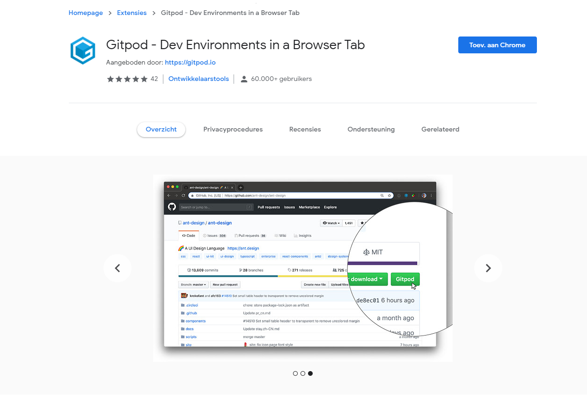

Platform Uno

.NET 5.0 ondersteunt 

* WebAssembly
   * IL interpreter runtime
   * AOT (7 tot 15 keer sneller dan de IL interpreter runtime), 
 * C# 9.0
 * source code generators

Experiment met de .NET 5 WebAssembly ondersteuning voor Uno

Je kan de .NET 5 ondersteuning op twee manieren uitproberen met behulp van Visual Studio 2019 16.8 en hoger:

* Upgrade een Uno Platform applicatie met behulp van de Visual Studio sjablonen

* Maak een bare-bones .NET 5 console applicatie om te draaien in de browser console

  

  

  EEN UNO-PLATFORMAPPLICATIE UPGRADEN NAAR .NET 5 VOOR WEBASSEMBLY

  

  Maak een Uno Cross-Platform toepassing met behulp van de [Visual Studio Uno Platform sjablonen](https://platform.uno/docs/articles/getting-started-tutorial-1.html)
  Klik met de rechtermuisknop op het .Wasm project, bewerk dan het csproj bestand
  Verander netstandard2.0 in net5
  Update de Uno.Wasm.Bootstrap en Uno.Wasm.Bootstrap.DevServer nuget pakketten naar ten minste 2.0.0-dev.69
  Druk op F5 om de applicatie te starten

  Een bare-bones console applicatie

  Maak een .NET 5 console-applicatie
  Vervang de inhoud van het .csproj-bestand door het volgende:

```xml
<Project Sdk="Microsoft.NET.Sdk.Web">
  <PropertyGroup>
    <OutputType>Exe</OutputType>
    <TargetFramework>net5</TargetFramework>
    <MonoRuntimeDebuggerEnabled Condition="'$(Configuration)'=='Debug'">true</MonoRuntimeDebuggerEnabled>
  </PropertyGroup>

  <ItemGroup>
    <PackageReference Include="Uno.Wasm.Bootstrap" Version="2.0.0-dev.69" />
    <PackageReference Include="Uno.Wasm.Bootstrap.DevServer" Version="2.0.0-dev.69" PrivateAssets="all" />
  </ItemGroup>
</Project>
```

Uno Wasm

[Bootstrap](https://github.com/unoplatform/Uno.Wasm.Bootstrap)

[Gitpod](https://gitpod.io/#https://github.com/unoplatform/Uno.Wasm.Bootstrap)




[Uno on Android](https://blogs.windows.com/windowsdeveloper/2021/03/11/build-cross-platform-applications-with-winui-and-uno-platform/)