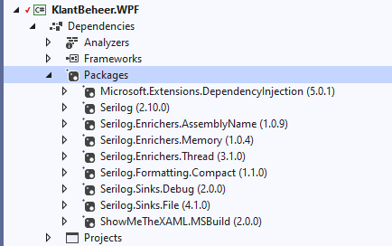

# Debugging met SeriLog

## Installatie als nuget pakket(ten)



## Configuratie in code

```c#
Log.Logger = new LoggerConfiguration().
MinimumLevel.Debug().
Enrich.WithProperty("Application", "Klantenbeheer").
Enrich.WithThreadId().
Enrich.WithMemoryUsage().                
//WriteTo.File(@"logs\Log_SerilogDemoWPF.txt", rollingInterval: RollingInterval.Day).
WriteTo.File(new CompactJsonFormatter(), @"logs\log.json", rollingInterval: RollingInterval.Hour).
WriteTo.Debug().
CreateLogger();
```

* Te doen bij opstart, bijvoorbeeld in App.xaml.cs
* "Object Chaining"

## Output

* Debug console

* Json bestand

* Vele andere mogelijkheden: zie website SeriLog!

  ## Afsluiten

  ```c#
  Log.CloseAndFlush();
  ```

