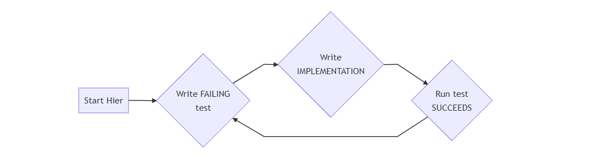

# TEST DRIVEN DEVELOPMENT

>  Wat is de beste manier om het aantal bugs in code te reduceren?

## Test-Driven Development

TDD (Test-Driven Development) is een hulpmiddel bij softwareontwikkeling om minder fouten te maken en sneller fouten te vinden, door éérst een test te schrijven en dan pas de implementatie. Die (unit) test zal dus eerst **falen** (ROOD), want er is nog helemaal geen code, en na de correcte implementatie uiteindelijk **slagen** (GROEN).

[

Testen worden in opgenomen in een build omgeving, waardoor alle testen automatisch worden gecontroleerd bij bijvoorbeeld het compileren, starten, of packagen van de applicatie. Op deze manier krijgt men **onmiddellijk feedback** van modules die door bepaalde wijzigingen niet meer werken zoals beschreven in de test.

### Een TDD Scenario

Stel dat een programma een notie van periodes nodig heeft, waarvan elke periode een start- en einddatum heeft, die al dan niet ingevuld kunnen zijn. Een contract bijvoorbeeld geldt voor een periode van *bepaalde duur*, waarvan beide data ingevuld zijn, of voor gelukkige werknemers voor een periode van *onbepaalde duur*, waarvan de einddatum ontbreekt:

```csharp
public class Contract 
{
    private Periode _periode;
}

public class Periode 
{
    private DateTime _startDatum;
    private DateTime _eindDatum; 
}
```

We wensen aan de `Periode` klasse een methode toe te voegen om te controleren of periodes overlappen, zodat de volgende statement mogelijk is: `periode1.overlaptMet(periode2)`.

#### 1. Schrijf Falende Testen

Voordat de methode wordt opgevuld met een implementatie dienen we na te denken over de mogelijke gevallen van een periode. Wat kan overlappen met wat? Wanneer geeft de methode `true` terug, en wanneer `false`? Wat met lege waardes?

- Het standaard geval: beide periodes hebben start- en einddatum ingevuld, en de periodes overlappen.

```java
        [TestMethod()]
        public void OverlaptMetBeidePeriodesDatumIngevuldOverlaptIsTrue()
        {
            var jandec19 = new Periode(new DateTime(2019, 01, 01),
                    new DateTime(2019, 12, 31));
            var maartnov19 = new Periode(new DateTime(2019, 03, 01),
                    new DateTime(2019, 11, 30));

            Assert.IsTrue(maartnov19.OverlaptMet(jandec19));
        }
```

- Beide periodes hebben start- en einddatum ingevuld, en periodes overlappen niet.

```C#
        [TestMethod()]
        public void OverlaptMetBeidePeriodesDatumIngevuldOverlaptNietIsFalse()
        {
            var jandec19 = new Periode(new DateTime(2019, 01, 01),
                    new DateTime(2019, 12, 31));
            var maartnov20 = new Periode(new DateTime(2020, 03, 01),
                    new DateTime(2020, 11, 30));

            Assert.IsFalse(jandec19.OverlaptMet(maartnov20));
        }
```

- … Er zijn nog tal van mogelijkheden, waarvan voornamelijk de extreme gevallen belangrijk zijn om **de kans op bugs te minimaliseren**. Immers, gebruikers van onze `Periode` klasse kunnen onbewust `null` mee doorgeven, waardoor de methode onverwachte waardes teruggeeft.

De testen compileren niet, omdat de methode `overlaptMet()` nog niet bestaat. Voordat we overschakelen naar het schrijven van de implementatie willen we eerst de testen zien ROOD kleuren, waarbij wel de bestaande code nog compileert:

```c#
public class Periode 
{
        private DateTime _startDatum;
        private DateTime _eindDatum;

        public Periode(DateTime startDatum, DateTime eindDatum)
        {
            _startDatum = startDatum;
            _eindDatum = eindDatum;
        }

        public bool OverlaptMet(Periode anderePeriode) { throw new NotImplementedException();  return false; }
}
```

De aanwezigheid van het skelet van de methode zorgt er voor dat de testen compileren. De inhoud, die een `UnsupportedOperationException` gooit, dient nog aangevuld te worden in stap 2. Op dit punt falen alle testen (met hopelijk als oorzaak de voorgaande exception).

#### 2. Schrijf Implementatie

Pas nadat er minstens 4 verschillende testen werden voorzien (standaard gevallen, edge cases, null cases, …), kan aan met een gerust hart aan de implementatie worden gewerkt:

```C#
        public bool OverlaptMet(Periode anderePeriode)
        {
            return _startDatum > anderePeriode._startDatum &&
                _eindDatum < anderePeriode._eindDatum;
        }
```

#### 3. Voer Testen uit

Deze eerste aanzet verandert de deprimerende rode kleur van minstens één test naar GROEN. Echter, lang niet alle testen zijn in orde. Voer de testen uit na elke wijziging in implementatie totdat alles in orde is. Het is mogelijk om terug naar stap 1 te gaan en extra test gevallen toe te voegen.

#### 4. Pas code aan (en herbegin)

De cyclus is compleet: red, green, refactor, red, green, refactor, …

Wat is **‘refactoring’**?

> Structuur veranderen, zonder de inhoud te wijzigen.

Als de `overlaptMet()` methode veel conditionele checks bevat is de kans groot dat bij elke groene test de inhoud stelselmatig ingewikkelder wordt, door bijvoorbeeld het veelvuldig gebruik van `if` statements. In dat geval is het verbeteren van de code, zonder de functionaliteit te wijzigen, een refactor stap. Na elke refactor stap verifiëer je de wijziging door middel van de testen.

Voel jij je veilig genoeg om grote wijzigingen door te voeren zonder te kunnen vertrouwen op een vangnet van testen? Wij als docenten alvast niet.

## Unit Testing Basics

### Wat is Unit Testing

Unit testen zijn stukjes code die productie code verifiëren op verschillende niveau’s. Het resultaat van een test is GROEN (geslaagd) of ROOD (gefaald met een bepaalde reden). Een collectie van testen geeft ontwikkelaars het zelfvertrouwen om stukken van de applicatie te wijzigen met de zekerheid dat de aanwezige testen rapporteren wat nog werkt, en wat niet. Het uitvoeren van deze testen gebeurt meestal in een IDE.

Elke validatieregel wordt apart opgelijst in één test. Als de `validate()` methode 4 regels test, zijn er minstens 4 testen geimplementeerd. In de praktijk is dat meestal meer omdat **edge cases** - uitzonderingsgevallen zoals `null` checks - ook aanzien worden als een apart testgeval.

#### Eigenschappen van een goede test

Elke unit test is **F.I.R.S.T.**:

1. **Fast**. Elk nieuw stukje functionaliteit vereist nieuwe testen, waarbij de bestaande testen ook worden uitgevoerd. In de praktijk zijn er duizenden testen die per compile worden overlopen. Als elke test één seconde duurt, wordt dit wel erg lang wachten…
2. **Isolated.** Elke test bevat zijn eigen test scenario dat géén invloed heeft op een andere test. Vermijd ten allen tijden het gebruik van het keyword `static`, en kuis tijdelijk aangemaakte data op, om te vermijden dat andere testen worden beïnvloed.
3. **Repeatable**. Elke test dient hetzelfde resultaat te tonen, of die nu éénmalig wordt uitgevoerd, of honderden keren achter elkaar. State kan hier typisch roet in het eten gooien.
4. **Self-Validating**. Geen manuele inspectie is vereist om te controleren wat de status van de test is. Een falende foutboodschap is een duidelijke foutboodschap.
5. **Thorough**. Testen moeten alle scenarios dekken: denk terug aan *edge cases*, randgevallen, het gebruik van `null`, het opvangen van mogelijke exceptions, …

### Het Raamwerk van een test

#### Test Libraries bestaande uit twee componenten

Een test framework bevat twee delen:

##### 1. Het Test Harnas

Een ‘harnas’ is het concept waar alle testen aan worden opgehangen. Het harnas identificeert en verzamelt testen, en het harnas stelt het mogelijk om bepaalde of alle testen uit te voeren. De ingebouwde Test UI in IntelliJ fungeert hier als visueel harnas. Elke test methode, een `public void` methode geannoteerd, wordt herkent als mogelijke test. 

##### 2. Het Assertion Framework

Naast het harnas, die zorgt voor het uitvoeren van testen, hebben we ook een *verificatie framework* nodig, dat fouten genereert wanneer nodig, om te bepalen of een test al dan niet geslaagd is. Dit gebeurt typisch met **assertions**, die vereisten dat een argument een bepaalde waarde heeft. Is dit niet het geval, wordt er een `AssertionError` exception gegooid, die door het harnas herkent wordt, met als resultaat een falende test.

#### Arrange, Act, Assert

De body van een test bestaat typisch uit drie delen:

```C#
public void TestMethod() 
{
    // 1. Arrange 
    var instance = new ClassToTest(arg1, arg2);

    // 2. Act
    var result = instance.callStuff();

    // 3. Assert
    Assert.IsTrue(result);
}
```

1. **Arrange**. Het klaarzetten van data, nodig om te testen, zoals een instantie van een klasse die wordt getest, met nodige parameters/DB waardes/…
2. **Act**. Het uitvoeren van de methode die wordt getest, en opvangen van het resultaat.
3. **Assert**. Het verifiëren van het resultaat van de methode.

### Soorten van Testen

Er zijn drie grote types van testen:

[](./testniveaus.jpg)

*De drie soorten van testen.*


#### 1. Unit Testing (GROEN)

Een unit test test zaken op *individueel niveau*, per klasse dus. De methodes van de `Periode` klasse testen zijn unit testen: er zijn geen andere klasses mee gemoeid. De meeste testen zijn unit testen. Hoe kleiner het blokje op bovenstaande figuur, hoe beter de **F.I.R.S.T. principes** kunnen nageleefd worden. Immers, hoe meer systemen opgezet moeten worden voordat het assertion framework zijn ding kan doen, hoe meer tijd verloren, en hoe meer tijd de test in totaal nodig heeft om zijn resultaat te verwerken.

#### 2. Integration Testing (ORANJE)

Een integratie test test het *integratie* pad tussen twee verschillende klasses. Hier ligt de nadruk op *interactie* in plaats van op individuele functionaliteit, zoals bij de unit test. We willen bijvoorbeeld controleren of een bepaalde service wel iets wegschrijft naar de database, maar het schrijven zelf is op unit niveau bij de database reeds getest. Waar wij nu interesse in hebben, is de interactie tussen service en database, niet de functionaliteit van de database.

Typische eigenschappen van integration testen:

- Test geïntegreerd met externen. (db, webservice, …)
- Test integratie twee verschillende lagen.
- Trager dan unit tests.
- Minder test cases.

##### Test Doubles

Stel dat we een `Service` en een `Repository` klasse hebben gemaakt, waarvan de tweede gegevens wegschrijft naar een database. Als we de eerste klasse willen testen, willen we niet weer een verbinding opstellen, omdat dit te traag is (1), én omdat dit al getest is (2):

```java
public class Repository 
{
    public void Save(Customer c) 
    {
        // insert into ... 
    }
}

public class Service {
    private Repository _repository;

    public void UpdateCustomerWallet(Customer c, double balance) {
        c.setBalance(balance);
        _repository.save(c);
    }
}
```

Hoe testen we de `updateCustomerWallet()` methode, zonder de effectieve implementatie van `Save()` te moeten gebruiken? Door middel van *test doubles*.


[](./testdouble.jpg)I'll Be Back.


Zoals Arnie in zijn films bij gevaarlijke scenes een stuntman lookalike gebruikt, zo gaan wij in onze code een `Repository` lookalike gebruiken, zodat de `Service` dénkt dat hij `Save()` aanroept, terwijl dit in werkelijkheid niet zo is. Daarvoor moet de repository een interface zijn. We passen in principe een design pattern toe, waarbij in de service een repository instantie wordt geïnjecteerd:

```java
public interface Repository 
{
    virtual void Save(Customer c);
}
public class RepositoryDBImpl: Repository 
{
    void override Save(Customer c) {
        // insert into...
    }
}
public class RepositoryForTesting: Repository 
{   
    public override void Save(Customer c) 
    {
        // do nothing!
    }
}

public class Service 
{
    private Repository _repository;
    
    public Service(Repository r) 
    {
        this._repository = r;
    }
}
```

In de test wordt een instantie van `RepositoryForTesting` in service gebruikt in plaats van de effectieve `RepositoryDBImpl`. De test klasse *gedraagt* zich als een `Repository`, omdat deze de betreffende interface implementeert. De `Service` klasse weet niet welke implementatie van de interface binnen komt: daar kan bij het integration testing handig gebruk van worden gemaakt.

#### 3. End-To-End Testing (ROOD)

Een laatste groep van testen genaamd *end-to-end* testen, ofwel **scenario testen**, testen de héle applicatie, van UI tot DB. Voor een webapplicatie betekent dit het simuleren van de acties van de gebruiker, door op knoppen te klikken en te navigeren doorheen de applicatie, waarbij bepaalde verwachtingen worden afgetoetst. Bijvoorbeeld, klik op ‘voeg toe aan winkelmandje’, ga naar ‘winkelmandje’, controleer of het item effectief is toegevoegd.

Typische eigenschappen van end-to-end testen:

- Test hele applicatie!
- Niet alle limieten.
- Traag, moeilijker onderhoudbaar.
- Test integratie van alle lagen.

## Extra leermateriaal

Lees de volgende artikels om een beter inzicht te krijgen in de capaciteiten van de Test-Driven benadering:

- [The Art of Agile Development: Test-Driven Development](https://www.jamesshore.com/Agile-Book/test_driven_development.html)
- [Benefits of TDD: Wikipedia](https://en.wikipedia.org/wiki/Test-driven_development)