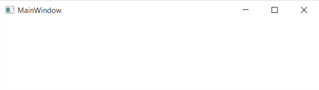
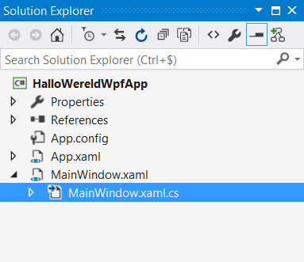
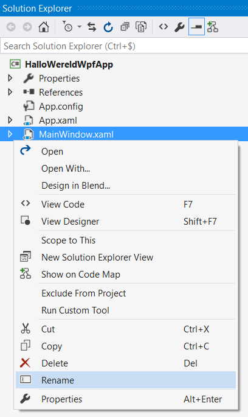
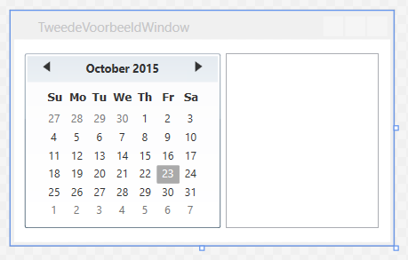

**Inleidend**

Tot nu toe hebben we onze applicaties gecreëerd aan de hand van **Console** interactie. Dit schept slechts zeer beperkte mogelijkheden: je kan niet veel meer doen dan wat tekst op het scherm afdrukken of wat tekst inlezen.

Dit had als voordeel dat we ons konden focussen op de achterliggende logica.

De meeste applicaties waarmee we als eindgebruiker in aanraking komen, hebben een meer *grafische userinterface* (*GUI*), waarbij gebruik wordt gemaakt van allerlei besturingselementen, bijvoorbeeld knoppen, tekstvakken, aankruisvakjes, uitvallijsten, enzovoort. Deze maken het makkelijker de informatie op een visueel aantrekkelijk en interactieve wijze te presenteren.  Ze bieden de eindgebruiker meer mogelijkheden het verdere verloop van het programma te sturen.

In dit hoofdstuk bekijken we het *Windows Presentation Foundation* (*WPF*) framework.   Hiermee kunnen we, op eenvoudige wijze,
grafische applicaties opstellen.

**In Visual Studio een WPF programma opzetten**

Bij het creëren van een nieuwe project in *Visual Studio* kunnen we in het *New Project* venster de *WPF Application* template gebruiken. Ik kies hier voor de naam *HalloWereldWpfApp*.

Het is mogelijk te opteren voor WPF App (.Net Framework) of WPF App (.Net 6) vanuit Visual Studio 2019. De code van onderstaande voorbeelden blijft gelijk.


Kiezen we voor *OK* dan krijgen we in de *form designer* een leeg *window* te zien.  Zo meteen gaan we dat aanvullen.


In de bijhorende *XAML* (*eXtensible Application Markup Language*) valt meteen het \<Window\> element op. XAML is formele *user interface markup* die aangeeft uit welke onderdelen ons venster, en onderliggende besturingselementen, zijn opgebouwd.

XAML is een bepaald *XML* dialect.  In XML (*eXtensible Markup Language*) wordt informatie gestructureerd via elementen die starten meteen *opening tag* en sluiten met een *closing tag*, bijvoorbeeld \<element1\> en \</element1\>. Rond de namen van elementen
staan kleiner en groter dan symbolen.  De naam van het element wordt in de *closing tag* voorafgegaan door een schuine streep.\
Elementen kunnen ook *zelf-sluitend* zijn, bijvoorbeeld \<element2/\>.  Hier wordt de naam van het element gevolgd
door een schuine streep. Informatie kan tussen de openings- en sluitingstag worden geplaatst, of kan voorkomen in attributen,
bijvoorbeeld:

```xml
<elementX attribuutY="info1" attribuutZ="info2">info3</elementX>
```

XAML valt deels te vergelijken met *HTML*, wat vaak gebruikt wordt voor het presenteren van informatie in een webbrowser. Ook in HTML worden de user interface elementen en hun onderlinge relaties in dergelijke markup gedefinieerd.
Er worden daar bijvoorbeeld elementen gebruikt als \<h1\> (*header 1*), \<hr\> (*horizontal rule*), \<p\> (*paragraaf*), \<ol\> (*ordered list*) en \<li\> (*list item*).

```xml
<html>
   <body>
      <h1>Mijn website</h1>
      <hr/>
      <p>Dit is mijn persoonlijke website.  Hier een lijst van mijn hobbies:</p>
      <p>
          <ol>
              <li>Programmeren</li>
              <li>Lezen</li>
              <li>Fietsen</li>
          </ol>
      </p>
   </body>
</html>
```

In een browser zou voorgaande html een presentatie als de volgende kunnen opleveren:


We gaan het echter niet hebben over HTML, of zelfs XML, maar wel over XAML.

Bemerk in onze XAML enkele interessante attributen die aan het \<Window\> element zijn toegevoegd.  Attributen voor eigenschappen als Title, voor de tekst in de titelbar, en voor eigenschappen als Width en Height die de initiële dimensies van ons venster bepalen.

```xml
<Window Title="MainWindow" Height="150" Width="525">
    ...
</Window>
```

We kunnen deze applicatie meteen opstarten.  Net als bij het uitvoeren van console applicaties kiezen we in de *Debug* menu voor *Start Debugging*\...



Het programma beschikt alvast over:

-   een icoon

-   een titelbalk voor de naam van de applicatie

-   een rand die ons toelaat het venster groter of kleiner te maken

-   een *client area*, die momenteel nog leeg is en waar we straks extra componenten aan gaan toevoegen
    
-   systeemknoppen die we kunnen gebruiken om het programma te minimaliseren, maximaliseren of afsluiten.

Deze voorzieningen hebben we niet zelf moeten coderen.  We krijgen van de *WPF Application* template alvast dit *basisvenster* dat reeds over die typische voorzieningen beschikt.

**Hallo wereld**

Momenteel is in de titel van het venster nog de tekst *MainWindow* te zien; laten we deze aanpassen tot *Hallo wereld*.

In de *XAML* wijzigen we daarvoor de waarde van het *Title* attribuut\...


Bemerk dat in de *designer* de weergave van het venster meteen ook naargelang wordt aangepast. Deze designer is een soort *WYSIWYG* weergave, *What You See Is What You Get*.  We krijgen hiermee meteen een beeld hoe het venster er zal uitzien tijdens uitvoer.

**Label,** **TextBox en Button controls**

We gaan het venster uitbreiden met enkele extra besturingselementen, ook wel eens *controls* genoemd.
Om die controls terug te vinden, maken we in *Visual Studio* gebruik van de *Toolbox*.  Doorgaans is die terug te vinden ergens aan de linkerkant.
Zie je dit toolvenster niet staan kies dan in de *View* menu voor *Toolbox*.


We zouden graag een programma implementeren dat er als volgt uitziet\...


De gebruiker kan in het tekstvak een naam invoeren en op de *Groet* knop klikken, waarna het programma rechts van de knop de ingevoerde tekst zal weergeven na het woord *Hallo*.

Het tekstvak kunnen we toevoegen via een TextBox control; voor de knop gebruiken we een Button en de tekst introduceren we met een Label besturingselement.

Versleep een TextBox, Button en Label control van de *ToolBox* naar de designer.


Bemerk dat we via *guiding lines* deze besturingselementen op een bepaalde positie kunnen plaatsen. Ook de knoppen op de *Layout* werkbalk helpen ons met het uitlijnen van deze controls.

In de designer kunnen we de grootte van de verschillende besturingselementen aanpassen door de rand rond deze controls te
verslepen. De designer is vooral bruikbaar om layout aspecten als posities en groottes in te stellen.

Elke wijziging in de designer zal leiden tot een wijziging van de onderliggende, door de designer gegeneerde, markup (*XAML*).

Eigenschappen als Height, Width, Margin, HorizontalAlignment en VerticalAlignment worden automatisch aangepast door het plaatsen, verslepen of resizen van de besturingselementen in de designer.

```xml
    <Grid>
        <TextBox x:Name="" HorizontalAlignment="Left" Height="23" Margin="10,8,0,0"
                 TextWrapping="Wrap" Text="TextBox1" VerticalAlignment="Top" Width="120"/>
        <Button x:Name="" Content="Button1" HorizontalAlignment="Left" Margin="135,10,0,0"
                VerticalAlignment="Top" Width="75"/>
        <Label x:Name="" Content="Label1" HorizontalAlignment="Left" Margin="215,7,0,0"
               VerticalAlignment="Top"/>
    </Grid>
```

Voor de Button, TextBox en Label controls zijn in de XAML onder het \<Grid\> element nodes toegevoegd. Een Grid is één van de
mogelijke *panelen* die je in WPF kan gebruiken -- eigenlijk de meest flexibele.  Een paneel staat je toe meerdere controls te groeperen.
Omdat een Window beperkt is tot één *child control*, zal dit doorgaans een panel control, bijvoorbeeld een Grid, zijn.
Verderop bestuderen we de verschillende soorten panels (StackPanel, DockPanel, Canvas, Grid, \...).

**Opmerkingen**

* x:Name mag ook vervangen worden door Name. x: wijst op de bovenaan gedeclareerde "namespace" die verwijst naar mogelijke attributen voor WPF xaml tags. Name is echter tegenwoordig ook standaard een geldig attribuut.
* Name moet uniek zijn: bovenstaand voorbeeld werkt met andere woorden niet zonder een unieke naam op te geven.

**Eigenschappen wijzigen**

Eigenschappen als Height, Width, Margin, \..., van ons venster en besturingselementen kunnen we aanpassen aan de hand van de *designer*.
De controls hebben echter nog vele andere eigenschappen.  Eigenschappen die we niet via de *designer* kunnen instellen. XAML biedt uitweg, daar is het wel mogelijk deze configuraties aan te brengen. Vaak is het ook zo dat sleutelen aan de layout via de designer nodeloos veel tags introduceert in XAML, tags die de leesbaarheid en onderhoudbaarheid van de XAML code verslechteren. Eenmaal je goed vertrouwd bent met WPF en XAML, zal je constateren dat je steeds vaker met XAML werkt en minder met de designer.

Eerst en vooral gaan we de x:Name eigenschap aanpassen.

Straks gaan we in de achterliggende programmalogica deze besturingselementen aanspreken.  Om die reden moeten ze een naam hebben. Geef de TextBox de naam *NaamTextBox*, de Button *GroetButton* en de Label control *BoodschapLabel*.

Op de Button zou de tekst *Groet* moeten staan, op het Label willen we starten met de tekst *Hallo wereld*.  Pas hiervoor de Content eigenschap aan. De TextBox moet om te beginnen leeg zijn.  Om dat te bereiken maken we de Text property van de TextBox leeg.

```xml
<Window x:Class="HalloWereldWpfApp.MainWindow"
        xmlns="http://schemas.microsoft.com/winfx/2006/xaml/presentation"
        xmlns:x="http://schemas.microsoft.com/winfx/2006/xaml"
        xmlns:d="http://schemas.microsoft.com/expression/blend/2008"
        xmlns:mc="http://schemas.openxmlformats.org/markup-compatibility/2006"
        xmlns:local="clr-namespace:HalloWereldWpfApp"
        mc:Ignorable="d"
        Title="Hallo wereld" Height="150" Width="525"/>

    <Grid>
        <TextBox x:Name="NaamTextBox" HorizontalAlignment="Left" Height="23" Margin="10,8,0,0"
                 TextWrapping="Wrap" Text="" VerticalAlignment="Top" Width="120"/>
        <Button x:Name="GroetButton" Content="Groet" HorizontalAlignment="Left" Margin="135,10,0,0"
                VerticalAlignment="Top" Width="75"/>
        <Label x:Name="BoodschapLabel" Content="Hallo
wereld" HorizontalAlignment="Left" Margin="215,7,0,0"
               VerticalAlignment="Top"/>
    </Grid>
</Window>
```


**Event handlers**

Het verloop bij programma's met grafische besturingselementen wordt, in tegenstelling tot de hiervoor gebruikte console applicaties, anders uitgeschreven.
In console applicaties gaan we op een eerder lineaire wijze coderen hoe het programma de ene na de andere operatie gaat uitvoeren.

Indien we beschikken over controls zullen eerder de gebeurtenissen (*events*) omtrent deze controls het verdere verloop van de applicatie sturen.
Het is bijvoorbeeld *bij het klikken op een knop*, *bij het invoeren van een waarde in een tekstvak*, *bij het selecteren van een menu-optie*, ..., dat de applicatie telkens op een specifieke manier kan reageren.
Je kan stellen dat het verloop van het programma gestuurd wordt op basis van de gebeurtenissen die optreden, men spreekt ook wel over *event driven* applicaties.

In ons *Hallo wereld* programma willen we bij het klikken op de knop de Content eigenschap van de Label control aanpassen. We zouden bij het optreden van de Click event van de Button het volgende willen verwezenlijken:

```c#
BoodschapLabel.Content = "Hallo " + NaamTextBox.Text;
```

Voeg hiervoor in de markup een Click attribuut toe, of met andere woorden een attribuut dat dezelfde naam draagt als de event. Wanneer je in de *XAML* editor de tekst *Click=* invoert, krijgen je van de IDE het voorstel een *eventhandler* te genereren voor deze gebeurtenis:


Drukken we op de *Tab* toets dan wordt de *XAML* aangevuld\...

```xml
<Button x:Name="GroetButton" Content="Groet" HorizontalAlignment="Left" Margin="135,10,0,0"
                VerticalAlignment="Top" Width="75" Click="GroetButton_Click"/>
```

Gaan we, net als wat werd voorgesteld, rechterklikken op de naam van onze eventhandler, namelijk GroetButton_Click, en kiezen we voor *Go To Definition* dan zal *Visual Studio* de definitie naar voor brengen.


Event handlers zijn void methods en deze worden uitgeschreven in het *codebehind* (.cs) document.

```c#
using System.Windows;
namespace HalloWereldWpfApp
{
    /// <summary>Interaction logic for MainWindow.xaml\</summary>
    public partial class MainWindow : Window
    {
        public MainWindow()
        {
            InitializeComponent();
        }

        private void GroetButton_Click(object sender, RoutedEventArgs e)
        {
        }
    }
}
```

De event handler gaan we aanvullen met de hiervoor besproken implementatie die de Content eigenschap van onze Label control aanpast\...

```c#
private void GroetButton_Click(object sender, RoutedEventArgs e)
{
BoodschapLabel.Content = "Hallo " + NaamTextBox.Text;
}
```

Voeren we het programma uit, dan zien we hoe het vooropgestelde hebbenbereikt.


Hier hebben we de event handler laten genereren door in de XAML een Click attribuut toe te voegen. Zo meteen bespreken we nog een andere techniek om in *Visual Studio* event handlers te bekomen.

Event handlers beschikken doorgaans over parameters.  Straks gaan we die inzetten om informatie met betrekking tot die gebeurtenissen op te vragen.

**XAML en code behind**

Een *WPF* venster is een combinatie van een *XAML* (.xaml) bestand, met een \<Window\> rootelement, en een *codebehind* (.cs) bestand. De XAML bestaat uit *markup* die bepaalt welke resources en controls gebruikt worden voor ons venster.  Daarnaast wordt bijgehouden hoe de relaties zijn tussen deze resources en besturingselementen, en hoe hun eigenschappen worden ingesteld.
Het x:class attribuut van het \<Window\> rootelement geeft aan welke klasse, hier HalloWereldWpfApp.MainWindow, verder definieert hoe met deze resources en besturingselementen wordt omgegaan.  Hoe we bijvoorbeeld gebeurtenissen die optreden bij onze controls gaan afhandelen. Dit laatste gebeurt in de codebehind omdat je geen
implementatielogica kan verweven in de XAML.

In de *Solution Explorer* van *Visual Studio* zal je de code behind *MainWindow.xaml.cs* terugvinden als child node van het XAML
document *MainWindow.xaml*.



De informatie in beide documenten worden gecombineerd om at runtime te komen tot het volledig werkzame venster. Het is
de InitializeComponent method, die automatisch voor ons wordt gegenereerd, die de XAML markup gaat ontleden.
Op basis hiervan gaat deze method de nodig objecten (een Window, een Button, een TextBox, \...) creëren, die in samenwerking met de toegevoegde codebehind logica het volledig functionele venster gaan opleveren.

**RadioButton en CheckBox controls**

We laten ons programma ook gebruik maken van RadioButton en CheckBox controls. Deze besturingselementen worden
ingezet wanneer je de gebruiker een keuze wil laten maken. Bij CheckBox controls gaat het om een individuele *aan/uit* keuze.  De
gebruiker vinkt de CheckBox aan of uit naargelang hij de bijhorende optie actief wil maken of niet.
Verschillende RadioButton controls daarentegen zijn aan elkaar gekoppeld.  Als ene wordt geselecteerd, worden de andere gedeselecteerd.

Versleep twee RadioButton controls en één CheckBox control van de *Toolbox* naar de designer.


Neem volgende XAML markup over, of stel zelf manueel één voor één volgende eigenschappen in:

Geef deze besturingselementen de namen *HoofdlettersCheckBox*, *Nederlands*- en *EngelsRadioButton*. Stel respectievelijk hun Content in op *Hoofdletters*, *Nederlands* en *Engels*. Zet meteen in de markup ook de *IsChecked* property van
de NederlandsRadioButton op *True*, om ervoor te zorgen dat bij het opstarten van het programma de optie *Nederlands* meteen is
ingesteld\...

```xml
<RadioButton x:Name="NederlandsRadioButton" Content="Nederlands" HorizontalAlignment="Left"
             Margin="10,36,0,0" VerticalAlignment="Top" IsChecked="True"/>
<RadioButton x:Name="EngelsRadioButton" Content="Engels" HorizontalAlignment="Left"
             Margin="10,56,0,0" VerticalAlignment="Top"/>
<CheckBox x:Name="HoofdlettersCheckBox" Content="Hoofdletters" HorizontalAlignment="Left"
          Margin="10,76,0,0" VerticalAlignment="Top"/>
```

Schakel opnieuw over naar de *codebehind*.  Waarschijnlijk heb je nog een *MainWindow.xaml.cs* tabblad open staan. Wijzig de event handler logica naar het volgende\...

```c#
private void GroetButton_Click(object sender, RoutedEventArgs e)
{
    string begroeting = "Hallo";
    if (EngelsRadioButton.IsChecked == true) begroeting = "Hello";
    string boodschap = begroeting + " " + NaamTextBox.Text;
    if (HoofdlettersCheckBox.IsChecked == true) boodschap =
boodschap.ToUpper();
    BoodschapLabel.Content = boodschap;
}
```

Op basis van de ingevoerde waarde, maar ook de aangevinkte of geselecteerde Radio- of CheckBox controls, zal het programma zijn boodschap samenstellen\...


Het ware niet eenvoudig geweest een vergelijkbare, even gebruiksvriendelijke en visueel aantrekkelijk programma te creëren aan de hand van een console applicatie. Eindgebruikers zijn vertrouwd met deze besturingselementen.  Als ze een TextBox control zien, weten ze dat ze daar iets in kunnen invoeren. Bied je hen RadioButton of CheckBox besturingselementen, dan zijn ze gewend dat deze toelaten bepaalde *instellingen* te activeren. Ze weten bijvoorbeeld ook dat bij het klikken op een Button een bepaalde operatie wordt uitgevoerd.

**Een tweede programma**

De naam van een gegenereerde event handler is by default *NaamVanDeControl_NaamVanDeEvent*, bijvoorbeeld *GroetButton_Click*. Je kan die naam aanpassen, maar let erop dat je dan zowel in de XAML als code behind die wijziging aanbrengt. Het is altijd een goed idee met de *Rename feature* te werken in *Visual Studio* als je een identifier wil veranderen.  *Visual Studio* zal in dat geval elke vermelding van die naam opsporen en aanpassen.
Laten we dit toepassen op de naam van ons eerste Window.  Rechterklik in de codebehind op *MainWindow* en kies voor *Rename*\...


Elk voorkomen van deze naam wordt in een kleur gemarkeerd.  Wijzig de naam in *HalloWereldWindow* en druk op *enter* of klik op de *Apply* knop\...


In de *Solution Explorer* zie je hoe de namen van onze broncode documenten, *MainWindow.xaml* en *MainWindow.xaml.cs*, ongewijzigd zijn.
Ook deze gaan we hernoemen.  Rechterklik op de betreffende lijn en kies voor *Rename*.



Maak hiervan *HalloWereldWindow.xaml* en *HalloWereldWindow.xaml.cs*.  Als je van één document de naam wijzigt, zal de andere automatisch mee veranderen.


**Window toevoegen**

Laten we een tweede venster toevoegen aan ons project.  Kies in de *Project* menu voor *Add Window\...*.


Geef een willekeurige naam op, bijvoorbeeld *TweedeVoorbeeldWindow.xaml* en klik op de *Add* knop.


Je kan in de *Solution Explorer* zien hoe ons project is uitgebreid met een XAML en codebehind document voor het tweede venster.


**Opstartvenster instellen**

Momenteel gaat onze applicatie er nog altijd vanuit dat gestart wordt met *MainWindow.xaml*. Een Window met deze naam bestaat in ons project niet meer, en we willen graag het tweede Window instellen als opstartvenster.

Open het *App.xaml* document door in de *Solution Explorer* te dubbelklikken op deze entry\...


En wijzig de StartupUri waarde in *TweedeVoorbeeldWindow.xaml*.


**ListBox en Calendar controls**

Plaats op onze TweedeVoorbeeldWindow een ListBox en Calendar control.  Je kan hiervoor de *Toolbox* en designer gebruiken, maar je kan ook rechtstreeks in de XAML de nodige wijzigingen aanbrengen.

Neem bijvoorbeeld volgende markup over in het XAML document.

```xml
<Window x:Class="HalloWereldWpfApp.TweedeVoorbeeldWindow"
        xmlns="http://schemas.microsoft.com/winfx/2006/xaml/presentation"
        xmlns:x="http://schemas.microsoft.com/winfx/2006/xaml"
        xmlns:d="http://schemas.microsoft.com/expression/blend/2008"
        xmlns:mc="http://schemas.openxmlformats.org/markup-compatibility/2006"
        xmlns:local="clr-namespace:HalloWereldWpfApp"
        mc:Ignorable="d"
        Title="TweedeVoorbeeldWindow" Height="215" Width="350">
    <Grid>
        <ListBox HorizontalAlignment="Left" Height="160" Margin="194,13,0,0"
                 VerticalAlignment="Top" Width="140"/>
        <Calendar HorizontalAlignment="Left" Margin="10,10,0,0" VerticalAlignment="Top"/>
    </Grid>
</Window>
```

Als je met de *Toolbox* werkt, merk dan op dan de Calendar control in de rubriek *All WPF Controls* is terug te vinden.

We bekomen een Window dat er als volgt uit ziet.



De weergegeven maand en gemarkeerde datum is afhankelijk van de systeemtijd.
Deze keer is het de bedoeling een applicatie te creëren waarin elke datum van een periode wordt toegevoegd aan de ListBox. De periodes zijn door de gebruiker in de Calendar geselecteerd.
We hebben in ons vorig voorbeeld gezien hoe alle eigenschappen in de XAML werden ingesteld, of hoe ook de eventhandler werd genereerd door een attribuut aan de XAML toe te voegen. Deze keer echter gaan we gebruik maken van het *Properties* toolvenster in *Visual Studio* om hetzelfde te bereiken.

Haal het *Properties* toolvenster naar voor en selecteer in de designer of XAML editor de ListBox.

Aan de ListBox geven we de naam *GeselecteerdeDataListBox* door de *Name* eigenschap in te vullen.


Als je het *Properties* toolvenster niet terugvindt, dan kies je onder de *View* menu voor *View Properties*.


Selecteer in de designer of XAML editor de Calendar en pas de *Name* eigenschap aan tot *Calendar1*. We willen de gebruiker de mogelijkheid bieden meerdere periodes te selecteren, hiervoor gaan we de SelectionMode eigenschap aanpassen.  Je kan die eigenschap zelf gaan lokaliseren op het *Properties* toolvenster of je kan ook meteen in het zoekveld de naam van die eigenschap beginnen invoeren. Zou je alvast de tekst *select* intikken, dan wordt je *property overzicht* beperkt tot eigenschappen met die tekst in hun naam.
Kies bij SelectionMode voor *MultipleRange*.  Dit zal ervoor zorgen dat de gebruiker meerdere periodes kan selecteren.


Klik daarna op de knop met het bliksem symbool rechtbovenaan het *Properties* toolvensters.


We krijgen hiermee een overzicht te zien van alle *events* van dit besturingselement, en alle bijhorende koppelingen aan *event handlers*. Aan de hand van de moersleutel knop zou je terug overschakelen naar de eigenschappen.
Scroll naar onder en dubbelklik op het leg vak naast de gebeurtenis SelectedDatesChanged.


Een eventhandler met de naam *Calendar1_SelectedDatesChanged* werd automatisch gegenereerd. *Visual Studio* opent voor ons de codebehind om ons toe te staan een afhandeling voor deze gebeurtenis uit te schrijven.
De SelectedDatesChanged event treedt op telkens nadat de gebruiker andere data of bijkomende data in de Calendar heeft geselecteerd. Hierop kunnen we inhaken en onze logica voorzien\...

```c#
using System;
using System.Windows;
using System.Windows.Controls;
namespace HalloWereldWpfApp
{
    public partial class TweedeVoorbeeldWindow : Window
    {
        public TweedeVoorbeeldWindow()
        {
            InitializeComponent();
        }

        private void Calendar1_SelectedDatesChanged(object sender, SelectionChangedEventArgs e)
        {
            foreach (DateTime item in e.AddedItems)
            {
                GeselecteerdeDataListBox.Items.Add(item);
            }
        }
    }
}
```

Aan onze GeselecteerdeDataListBox voegen we elke nieuw of bijkomend geselecteerde datum van onze Calendar1 toe.

De volledige XAML ziet er ondertussen als volgt uit:

```xml
<Window x:Class="HalloWereldWpfApp.TweedeVoorbeeldWindow"
        xmlns="http://schemas.microsoft.com/winfx/2006/xaml/presentation"
        xmlns:x="http://schemas.microsoft.com/winfx/2006/xaml"
        xmlns:d="http://schemas.microsoft.com/expression/blend/2008"
        xmlns:mc="http://schemas.openxmlformats.org/markup-compatibility/2006"
        xmlns:local="clr-namespace:HalloWereldWpfApp\"
        mc:Ignorable="d"
        Title="TweedeVoorbeeldWindow" Height="215" Width="350">
    <Grid>
        <ListBox x:Name="GeselecteerdeDataListBox" HorizontalAlignment="Left" Height="160" Margin="194,13,0,0"
                 VerticalAlignment="Top" Width="140"/>
        <Calendar x:Name="Calendar1" HorizontalAlignment="Left" Margin="10,10,0,0" VerticalAlignment="Top"
                  SelectionMode="MultipleRange" SelectedDatesChanged="Calendar1_SelectedDatesChanged"/>
    </Grid>
</Window>
```

Een ListBox is een ItemsControl, wat betekent dat het een lijst van objecten van eender welk type kan bijhouden.  Dit kunnen teksten zijn, afbeeldingen, volledige panelen, \..., of DateTime waardes zijn zoals in ons voorbeeld hier.

De event handler methods beschikken doorgaans over parameters.  Parameters die extra informatie kunnen bevatten over de optredende gebeurtenis.
Een SelectedDatesChanged event zal bij het optreden een SelectionChangedEventArgs waarde meegeven.  Deze werd hier opgevangen in onze parameter e.

Dergelijke SelectionChangedEventArgs beschikt over een AddedItems eigenschap die in collectievorm de lijst van toegevoegde geselecteerde data bevat.
Het is deze lijst die we uitlezen, en waarvan we elke waarde aande ListBox toevoegen.
Voeren we het programma uit, dan zal elke datum in het bereik van waarden die je selecteert effectief aan de ListBox worden toegevoegd.


**Een derde programma**

Sommige *eventarg* parameters staan toe het verdere verloop van de gebeurtenis te sturen.  Dit is wat ons derde, en voorlopig laatste WPF voorbeeld illustreert.
Bij het afsluiten van een venster, of met andere woorden bij het optreden van een FormClosing event van een Window, kan je het afsluiten annuleren.

```c#
using System;
using System.Windows;
using System.Windows.Controls;

namespace HalloWereldWpfApp
{
    public partial class DerdeVoorbeeldWindow : Window
    {
        public DerdeVoorbeeldWindow()
        {
            InitializeComponent();
        }
        private bool _inhoudTextBoxChanged;
        
        private void InhoudTextBox_TextChanged(object sender,
TextChangedEventArgs e)
        {
            _inhoudTextBoxChanged = true;
        }
        
        private void Window_Closing(object sender, System.ComponentModel.CancelEventArgs e)
        {
            if (_inhoudTextBoxChanged)
            {
                MessageBoxResult antwoord = MessageBox.Show("Er zijn wijzigingen aangebracht, wil u deze bewaren?", Title, MessageBoxButton.YesNoCancel, MessageBoxImage.Question);
                if (antwoord == MessageBoxResult.Yes)
                {
                    Opslaan();
                }
                else if (antwoord == MessageBoxResult.No)
                {
                    //Niets doen.
                }
                else //if (antwoord == MessageBoxResult.Cancel)
                {
                    //Event annuleren:
                    e.Cancel = true;
                }
            }
        }
        
        private void OpslaanMenuItem_Click(object sender, RoutedEventArgs e)
        {
            Opslaan();
        }
        
        private void Opslaan()
        {
            //Opslaan...
            _inhoudTextBoxChanged = false;
            MessageBox.Show("De wijzigingen zijn bewaard.", Title,
MessageBoxButton.OK, MessageBoxImage.Information);
        }
        
        private void AfsluitenMenuItem_Click(object sender, RoutedEventArgs e)
        {
            //Sluit het venster:
            Close();
        }
    }
}
```

Deze keer handelen we niet alleen events van controls af, maar ook een gebeurtenis van het venster zelf (*Window_Closing*). Neem volgende XAML over als je zelf het voorbeeld wil uittesten.

```xml
<Window x:Class="HalloWereldWpfApp.DerdeVoorbeeldWindow"
        xmlns="http://schemas.microsoft.com/winfx/2006/xaml/presentation"
        xmlns:x="http://schemas.microsoft.com/winfx/2006/xaml"
        xmlns:d="http://schemas.microsoft.com/expression/blend/2008"
        xmlns:mc="http://schemas.openxmlformats.org/markup-compatibility/2006"
        xmlns:local="clr-namespace:HalloWereldWpfApp"
        mc:Ignorable="d"
        Title="Kladblok" Height="150" Width="350" Closing="Window_Closing">
    <DockPanel>
        <Menu DockPanel.Dock="Top">
            <MenuItem Header="_Bestand">
                <MenuItem Header="_Opslaan" x:Name="OpslaanMenuItem" Click="OpslaanMenuItem_Click" />
                <Separator/>
                <MenuItem Header="_Afsluiten" x:Name="AfsluitenMenuItem" Click="AfsluitenMenuItem_Click" />
            </MenuItem>
        </Menu>
        <TextBox AcceptsReturn="True" x:Name="InhoudTextBox" TextChanged="InhoudTextBox_TextChanged" />
    </DockPanel>
</Window>
```

**DockPanel, Menu en MenuItem controls**

Het venster beschikt over een menu.  Een *Bestand* menu met daaronder menu-opties als *Opslaan* en *Afsluiten*.


Menus staan meestal niet zomaar op eender welke plaats op het formulier, ze worden doorgaans tegen de bovenkant van het venster *gedockt*. Dit is eenvoudig te verwezelijken met een DockPanel, deze staat zijn child controls toe aan een kant (bv *Top*) *aan te meren*. Verderop bestuderen we de verschillende soorten panels (StackPanel, DockPanel, Canvas, Grid, \...).

**MessageBox**

Bij het *opslaan* van wijzigingen, bijvoorbeeld bij het klikken op de *Opslaan* menu-optie, wordt met een MessageBox gewerkt.

```c#
        private void OpslaanMenuItem_Click(object sender, RoutedEventArgs e)
        {
            Opslaan();
        }

        private void Opslaan()
        {
            //Opslaan...
            MessageBox.Show("De wijzigingen zijn bewaard.", Title, MessageBoxButton.OK, MessageBoxImage.Information);
        }
```

Het is onze *hulp routine* Opslaan die de MessageBox naar voor brengt, door de Show method aan te roepen.

![[]](./WPFIntro/media/image31.png)

Een MessageBox is een eenvoudig venster, die by default een label en een knop heeft.  Bij het aanroepen van de MessageBox.Show method geef je op zijn minst mee welke tekst in het venster komt.  Bijkomende mag je via een tweede argumentwaarde ook bepalen welke tekst op de titelbar komt, hier dezelfde tekst als de Title van ons Window. Een derde argumentwaarde kan bepalen welke knoppen worden gebruikt, bijvoorbeeld MessageBoxButton.OK als je enkel een *OK* knop wenst. MessageBopxButton.YesNoCancel zou dan zowel *Yes*, *No* als *Cancel* knoppen toevoegen. Met een MessageBoxImage waarde kan je eventueel nog een afbeelding toevoegen.  In ons voorbeeld het typische Question of Information symbool.
Het opslaan zelf, is in dit voorbeeld niet geïmplementeerd. Je kan opvangen welke knop gebruikt werd op een MessageBox om dat venster af te handelen.  De Show() method call levert op zich een MessageBoxResult op.

```c#
        private void Window_Closing(object sender, System.ComponentModel.CancelEventArgs e)
        {
            MessageBoxResult antwoord = MessageBox.Show("Er zijn wijzigingen aangebracht, wil u deze bewaren?", Title, MessageBoxButton.YesNoCancel, MessageBoxImage.Question);
            if (antwoord == MessageBoxResult.Yes) ...
            else if (antwoord == MessageBoxResult.No) ...
            ...
```

Een MessageBoxResult instantie zal een waarde representeren die duidelijk maakt welke knop werd gebruikt. Als we de knoppen *Yes*, *No* en *Cancel* hebben gebruikt, zal het MessageBox resultaat respectievelijk MessageBoxResult.Yes, MessageBoxResult.No of MessageBoxResult.Cancel zijn. Op basis van die waarde gaan we in het voorbeeld beslissen hoe het afsluiten van het venster wordt afgehandeld.

De CancelEventArgs parameter e beschikt over een Cancel eigenschap die we op true instellen indien we het afsluiten willen annuleren. Het komt zelden voor dat je zo ver kan gaan in het afhandelen van een gebeurtenis.  De essentie is dat de, met de event meegegeven, argumentwaardes (*eventargs*) zinvolle informatie kunnen opleveren.  Of in sommige gevallen, zinvolle operaties met betrekking tot het verder afhandelen van die gebeurtenis, toestaan.

Er zal enkel worden gevraagd of we wijzigingen wensten op te slaan, indien de TextBox werd gebruikt. Bij het optreden van de TextChanged event van de TextBox control stellen we een bool variabele in op true.

```xml
<TextBox AcceptsReturn="True" x:Name="InhoudTextBox" TextChanged="InhoudTextBox_TextChanged" /\>
```

```c#
        private bool _inhoudTextBoxChanged;
        private void InhoudTextBox_TextChanged(object sender, TextChangedEventArgs e)
        {
            _inhoudTextBoxChanged = true;
        }
```


Is deze bool vlag actief bij het afsluiten van het formulier, dan wordt een *MessageBox* getoond.

```c#
        private void Window_Closing(object sender, System.ComponentModel.CancelEventArgs e)
        {
            if (_inhoudTextBoxChanged)
            {
                MessageBoxResult antwoord = MessageBox.Show("Er zijn wijzigingen aangebracht, wil u deze bewaren?", Title, MessageBoxButton.YesNoCancel, MessageBoxImage.Question);
            }
        }
```

De bool variabele werd hier op klasseniveau gedeclareerd, dit zorgt ervoor dat de waarde onthouden blijft.  Bij een argument of lokale variabele bijvoorbeeld blijft de waarde slechts in het geheugen zolang de method, waarin deze is gedeclareerd, in uitvoering is. Zie verderop voor meer uitleg over klassevariabelen, of *velden* zoals deze ook wel worden genoemd.

**Peek definition**

Bemerk dat in de XAML editior, bij het rechtsklikken op een eventhandler, wordt aangeboden om te *gluren* naar de method definitie.


Kies je effectief voor *Peek Definition* dan zal in deze XAML view ook de codebehind worden weergeven.  Zonder dat hierbij het codebehind bestand wordt geopend.


Je kan niet enkel de code behind logica bekijken, je kan ook de logica aanvullen of aanpassen.
