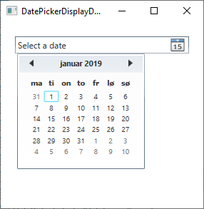
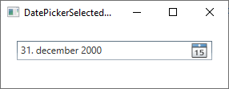

# Controls

## DatePicker

Omgaan met datums kan omslachtig zijn en ingewikkeld worden. Er bestaan veel verschillende manieren om een datum voor te stellen; een TextBox met een string in vrij formaat is geen goed idee. Gelukkig biedt WPF van huize uit mooie oplossingen.

We bestudeerden reeds de Calendar control, welke geweldig is wanneer de belangrijkste taak van je dialoog is dat je een datum wenst te laten selecteren. Vaak heb je echter een datum nodig met daarbij heel wat andere informatie, welke ingegeven moet worden met behulp van andere input controls als TextBox's, ComboBox's enzovoort. In deze gevallen heb je nood aan een invoermogelijkheid voor datums die mooi integreert met de andere controls, namelijk de DatePicker control!

De DatePicker control wordt getoond als een gewone TextBox, maar met een kleine knop erbij die de Calendar view tevoorschijn brengt wanneer er op geklikt wordt. Een voorbeeld:

 


```csharp
<DatePicker></DatePicker>
```

De volledige code:

```csharp
<Window x:Class="WpfTutorialSamples.Misc_controls.DatePickerSample"
    xmlns="http://schemas.microsoft.com/winfx/2006/xaml/presentation"
    xmlns:x="http://schemas.microsoft.com/winfx/2006/xaml"
    xmlns:d="http://schemas.microsoft.com/expression/blend/2008"
    xmlns:mc="http://schemas.openxmlformats.org/markup-compatibility/2006"
    xmlns:local="clr-namespace:WpfTutorialSamples.Misc_controls"
    mc:Ignorable="d"
    Title="DatePickerSample" Height="300" Width="300">
    <StackPanel Margin="20">
    <Label>Name:</Label>
    <TextBox />
    <Label>Birthday:</Label>
    <DatePicker></DatePicker>
    <Label>Gender:</Label>
    <ComboBox>
        <ComboBoxItem>Female</ComboBoxItem>
        <ComboBoxItem>Male</ComboBoxItem>
    </ComboBox>
    <Button Margin="20">Signup</Button>
    </StackPanel>
</Window>
```

 

**DisplayDate en SelectedDate**

Standaard is er geen datum geselecteerd bij de DatePicker control: aan de gebruiker om dit in te stellen. Dit kan heel eenvoudig door gebruik te maken van de SelectedDate property:

```csharp
<DatePicker SelectedDate="2000-12-31"></DatePicker>
```

De DatePicker heeft nu een voorgeselecteerde datum die door de gebruiker gewijzigd kan worden door een andere datum te selecteren of in te geven. De SelectedDate kan ook in code-behind ingesteld worden of gelezen worden; je kan ook gebruik maken van binding.

In sommige gevallen wil je de calendar starten op een specifieke datum zonder een datum te selecteren voor de gebruiker. Hiervoor kunnen we gebruik maken van de DisplayDate property. De standaardwaarde is de huidige datum, maar je kan dit eenvoudig wijzigen:

```csharp
<DatePicker Name="dp1" DisplayDate="2019-01-01" />
```

 

**DatePicker met DisplayDate property**

Wanneer we gebruik maken van de DisplayDate property, start de kalendar op de ingestelde datum en markeert deze, maar een datum wordt niet geselecteerd.

## SelectedDateFormat

Een andere interessante property is SelectedDateFormat. De standaardwaarde is Short, maar je kan dit wijzigen naar Long:

```csharp
<DatePicker SelectedDate="2000-12-31" SelectedDateFormat="Long"></DatePicker>
```

Of je nu het Short of Long formaat gebruikt in beide gevallen wordt het eigenlijk formaat bepaald door de culture van je applicatie.

 

## Blackout dates
Vaak wens je bepaalde data te blokkeren voor selectie. Maak hiervoor gebruik van de BlackoutDates collectie, welke je kan opvullen in XAML of code-behind. Een XAML voorbeeld:

```csharp
<DatePicker Name="dp1">
    <DatePicker.BlackoutDates>
    <CalendarDateRange Start="2019-04-01" End="2019-04-07" />
    <CalendarDateRange Start="2019-04-22" End="2019-04-28" />
    </DatePicker.BlackoutDates>
</DatePicker>
```

Het resultaat zal er als volgt uitzien:

 

**DatePicker control met blacked out dates**

Dit bereiken via code-behind is even eenvoudig en heeft twee voordelen: je kan de range dynamisch opbouwen, bijvoorbeeld op basis van de huidige datum. We kunnen bovendien gebruik maken van de AddDatesInPast() method om dagen uit het verleden buiten scope te laten. Een voorbeeld:

```csharp
dp1.BlackoutDates.AddDatesInPast();
dp1.BlackoutDates.Add(new CalendarDateRange(DateTime.Now, DateTime.Now.AddDays(7)));
```

Met deze code erbij zijn alle data uit het verleden, alsook die na de volgende week, niet beschikbaar.
