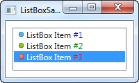
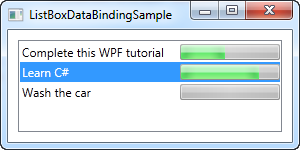
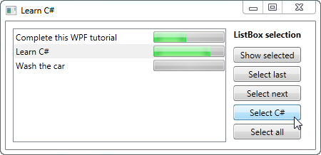
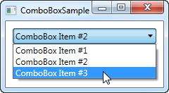
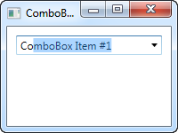
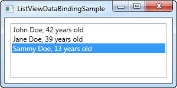
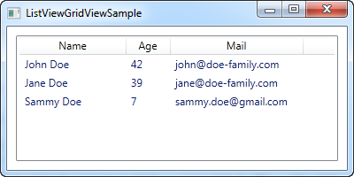
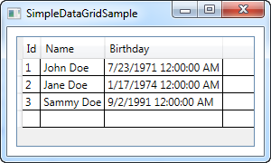
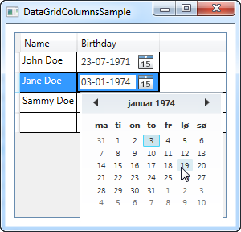

# List Controls

## ListBox

Een voorbeeld van een eenvoudige ListBox:

```csharp
<Window x:Class="WpfTutorialSamples.ListBox_control.ListBoxSample"
        xmlns="http://schemas.microsoft.com/winfx/2006/xaml/presentation"
        xmlns:x="http://schemas.microsoft.com/winfx/2006/xaml"
        Title="ListBoxSample" Height="120" Width="200">
    <Grid Margin="10">
		<ListBox>
			<ListBoxItem>ListBox Item #1</ListBoxItem>
			<ListBoxItem>ListBox Item #2</ListBoxItem>
			<ListBoxItem>ListBox Item #3</ListBoxItem>
		</ListBox>
	</Grid>
</Window>
```

 

**Een eenvoudige ListBox met items in markup**

Eenvoudiger kan niet: we declareren een ListBox control en nemen hierbinnen drie ListBoxItem's op, elk met eigen tekst. ListBoxItem is eigenlijk een ContentControl en dus kunnen we er eender welke eigen inhoud aan geven:

```csharp
<Window x:Class="WpfTutorialSamples.ListBox_control.ListBoxSample"
        xmlns="http://schemas.microsoft.com/winfx/2006/xaml/presentation"
        xmlns:x="http://schemas.microsoft.com/winfx/2006/xaml"
        Title="ListBoxSample" Height="120" Width="200">
	<Grid Margin="10">
		<ListBox>
			<ListBoxItem>
				<StackPanel Orientation="Horizontal">
					<Image Source="/WpfTutorialSamples;component/Images/bullet_blue.png" />
					<TextBlock>ListBox Item #1</TextBlock>
				</StackPanel>
			</ListBoxItem>
			<ListBoxItem>
				<StackPanel Orientation="Horizontal">
					<Image Source="/WpfTutorialSamples;component/Images/bullet_green.png" />
					<TextBlock>ListBox Item #2</TextBlock>
				</StackPanel>
			</ListBoxItem>
			<ListBoxItem>
				<StackPanel Orientation="Horizontal">
					<Image Source="/WpfTutorialSamples;component/Images/bullet_red.png" />
					<TextBlock>ListBox Item #3</TextBlock>
				</StackPanel>
			</ListBoxItem>
		</ListBox>
	</Grid>
</Window>
```

 

**Een ListBox met eigen inhoud**

Voor elke ListBoxItem voegen we nu een StackPanel toe waarin we een Image en TextBlock toevoegen. Dit geeft ons volledige controle over de inhoud en de text rendering, zie screenshot met een verschillende kleur per nummer. Uit het screenshot valt een ander verschil op wanneer we de ItemsControl vergelijken met de ListBox: er wordt standaard een border getoond rond de control.

### ListBox data binding

Manueel items toekennen aan ListBox is goed voor een eerste voorbeeld, maar meestal zal de ListBox opgevuld worden met elementen die resulteren uit data binding. Voor het opvullen van de UI ListBox wordt van elk item de ToString() method gebruikt. Dit is zeker niet altijd wat je wenst: gelukkig kan je een template definieren dat dan gebruikt wordt om het item weer te geven.

Een voorbeeld:

```csharp
<Window x:Class="WpfTutorialSamples.ListBox_control.ListBoxDataBindingSample"
        xmlns="http://schemas.microsoft.com/winfx/2006/xaml/presentation"
        xmlns:x="http://schemas.microsoft.com/winfx/2006/xaml"
        Title="ListBoxDataBindingSample" Height="150" Width="300">
    <Grid Margin="10">
		<ListBox Name="lbTodoList" HorizontalContentAlignment="Stretch">
			<ListBox.ItemTemplate>
				<DataTemplate>
					<Grid Margin="0,2">
						<Grid.ColumnDefinitions>
							<ColumnDefinition Width="*" />
							<ColumnDefinition Width="100" />
						</Grid.ColumnDefinitions>
						<TextBlock Text="{Binding Title}" />
						<ProgressBar Grid.Column="1" Minimum="0" Maximum="100" 
						Value="{Binding Completion}" />
					</Grid>
				</DataTemplate>
			</ListBox.ItemTemplate>
		</ListBox>
	</Grid>
</Window>
```

```csharp
using System;
using System.Windows;
using System.Collections.Generic;

namespace WpfTutorialSamples.ListBox_control
{
	public partial class ListBoxDataBindingSample : Window
	{
		public ListBoxDataBindingSample()
		{
			InitializeComponent();
			List<TodoItem> items = new List<TodoItem>();
			items.Add(new TodoItem() { Title = "Complete this WPF tutorial", Completion = 45 });
			items.Add(new TodoItem() { Title = "Learn C#", Completion = 80 });
			items.Add(new TodoItem() { Title = "Wash the car", Completion = 0 });

			lbTodoList.ItemsSource = items;
		}
	}

	public class TodoItem
	{
		public string Title { get; set; }
		public int Completion { get; set; }
	}
}
```

 

**ListBox control met data binding**

Let op het gebruik van ItemTemplate. We definieren hiermee dat elke item bestaat uit een Grid met twee kolommen, een TextBlock met titel in de eerste kolom en een ProgressBar met een volledige status in de tweede kolom. We gebruiken data binding om de effectieve waarden te tonen. In de code-behind hebben we een eenvoudige TodoItem class gedefinieerd om elk TODO in op te nemen. In de constructor van het venster intialiseren we een lijst, voegen we 3 TODO items toe en kennen we de lijst toe aan de ItemsSource van de ListBox.

Let op de HorizontalContentAlignment property die op Stretch gezet werd voor de ListBox. Standaard is de content alignment voor een ListBox item Left, Dit betekent dat elk item enkel de horizontale ruimte opneemt die het nodig heeft. Het resultaat is niet echt wat we beogen:

 

**Een ListBox control waarvan de HorizontalContentAlignment property ongewijzigd bleef**

Door gebruik te maken van Stretch neemt elk element de volledige beschikbare ruimte op.

#### Selectie bij ListBox

Een groot verschil tussen ItemsControl en ListBox is dat de ListBox de gebruikersselectie afhandelt en toont. We tonen een in dit opzicht ruimer voorbeeld:

```csharp
<Window x:Class="WpfTutorialSamples.ListBox_control.ListBoxSelectionSample"
        xmlns="http://schemas.microsoft.com/winfx/2006/xaml/presentation"
        xmlns:x="http://schemas.microsoft.com/winfx/2006/xaml"
        Title="ListBoxSelectionSample" Height="250" Width="450">
	<DockPanel Margin="10">
		<StackPanel DockPanel.Dock="Right" Margin="10,0">
			<StackPanel.Resources>
				<Style TargetType="Button">
					<Setter Property="Margin" Value="0,0,0,5" />
				</Style>
			</StackPanel.Resources>
			<TextBlock FontWeight="Bold" Margin="0,0,0,10">ListBox selection</TextBlock>
			<Button Name="btnShowSelectedItem" Click="btnShowSelectedItem_Click">Show selected</Button>
			<Button Name="btnSelectLast" Click="btnSelectLast_Click">Select last</Button>
			<Button Name="btnSelectNext" Click="btnSelectNext_Click">Select next</Button>
			<Button Name="btnSelectCSharp" Click="btnSelectCSharp_Click">Select C#</Button>
			<Button Name="btnSelectAll" Click="btnSelectAll_Click">Select all</Button>
		</StackPanel>
		<ListBox Name="lbTodoList" HorizontalContentAlignment="Stretch" SelectionMode="Extended" 
		SelectionChanged="lbTodoList_SelectionChanged">
			<ListBox.ItemTemplate>
				<DataTemplate>
					<Grid Margin="0,2">
						<Grid.ColumnDefinitions>
							<ColumnDefinition Width="*" />
							<ColumnDefinition Width="100" />
						</Grid.ColumnDefinitions>
						<TextBlock Text="{Binding Title}" />
						<ProgressBar Grid.Column="1" Minimum="0" Maximum="100" 
						Value="{Binding Completion}" />
					</Grid>
				</DataTemplate>
			</ListBox.ItemTemplate>
		</ListBox>
	</DockPanel>
</Window>
```

```csharp
using System;
using System.Windows;
using System.Collections.Generic;

namespace WpfTutorialSamples.ListBox_control
{
	public partial class ListBoxSelectionSample : Window
	{
		public ListBoxSelectionSample()
		{
			InitializeComponent();
			List<TodoItem> items = new List<TodoItem>();
			items.Add(new TodoItem() { Title = "Complete this WPF tutorial", Completion = 45 });
			items.Add(new TodoItem() { Title = "Learn C#", Completion = 80 });
			items.Add(new TodoItem() { Title = "Wash the car", Completion = 0 });

			lbTodoList.ItemsSource = items;
		}

		private void lbTodoList_SelectionChanged(object sender, System.Windows.Controls.SelectionChangedEventArgs e)
		{
			if(lbTodoList.SelectedItem != null)
				this.Title = (lbTodoList.SelectedItem as TodoItem).Title;
		}

		private void btnShowSelectedItem_Click(object sender, RoutedEventArgs e)
		{
			foreach(object o in lbTodoList.SelectedItems)
				MessageBox.Show((o as TodoItem).Title);
		}

		private void btnSelectLast_Click(object sender, RoutedEventArgs e)
		{
			lbTodoList.SelectedIndex = lbTodoList.Items.Count - 1;
		}

		private void btnSelectNext_Click(object sender, RoutedEventArgs e)
		{
			int nextIndex = 0;
			if((lbTodoList.SelectedIndex >= 0) && (lbTodoList.SelectedIndex < (lbTodoList.Items.Count - 1)))
				nextIndex = lbTodoList.SelectedIndex + 1;
			lbTodoList.SelectedIndex = nextIndex;
		}

		private void btnSelectCSharp_Click(object sender, RoutedEventArgs e)
		{
			foreach(object o in lbTodoList.Items)
			{
				if((o is TodoItem) && ((o as TodoItem).Title.Contains("C#")))
				{
					lbTodoList.SelectedItem = o;
					break;
				}
			}
		}

		private void btnSelectAll_Click(object sender, RoutedEventArgs e)
		{
			foreach(object o in lbTodoList.Items)
				lbTodoList.SelectedItems.Add(o);
		}


	}

	public class TodoItem
	{
		public string Title { get; set; }
		public int Completion { get; set; }
	}
}
```

 

**Werken met selecties bij de ListBox control**

Zoals je ziet is er een reeks knoppen opgenomen rechts van de ListBox om de selectie op te halen of te manipuleren. De SelectionMode werd ook op Extended gezet zodat meer dan een enkel item geselecteerd kan worden. Dit kan programmatorisch, zoals getoond, of de eindgebruiker kan dit doen door [Ctrl] of [Shift] in te drukken terwijl hij selecteert.

Voor elke knop is er een click handler voorzien in de code-behind. Elke actie spreekt redelijk voor zichzelf. Voor desnoods de code uit op je eigen computer om te zien wat er precies gebeurt.

## ComboBox

De ComboBox control gedraagt zich in de meeste opzichten als de ListBox control, maar neemt minder plaats in: de lijst van items wordt verborgen wanneer deze niet aan de orde is. De ComboBox control wordt veel gebruikt onder Windows. We tonen onmiddellijk een voorbeeld:

```csharp
<Window x:Class="WpfTutorialSamples.ComboBox_control.ComboBoxSample"
        xmlns="http://schemas.microsoft.com/winfx/2006/xaml/presentation"
        xmlns:x="http://schemas.microsoft.com/winfx/2006/xaml"
        Title="ComboBoxSample" Height="150" Width="200">
    <StackPanel Margin="10">
        <ComboBox>
            <ComboBoxItem>ComboBox Item #1</ComboBoxItem>
            <ComboBoxItem IsSelected="True">ComboBox Item #2</ComboBoxItem>
            <ComboBoxItem>ComboBox Item #3</ComboBoxItem>
        </ComboBox>
    </StackPanel>
</Window>
```

  

**Een eenvoudige ComboBox control**

We hebben manueel items toegevoegd en met de IsSelected property een item als standaard geselecteerd.

### Eigen inhoud

Aangezien de ComboBoxItem een ContentControl is, kunnen we om het even wat opnemen als inhoud. Een gesofisticeerder voorbeeld:

```csharp
<Window x:Class="WpfTutorialSamples.ComboBox_control.ComboBoxCustomContentSample"
        xmlns="http://schemas.microsoft.com/winfx/2006/xaml/presentation"
        xmlns:x="http://schemas.microsoft.com/winfx/2006/xaml"
        Title="ComboBoxCustomContentSample" Height="150" Width="200">
    <StackPanel Margin="10">
        <ComboBox>
            <ComboBoxItem>
                <StackPanel Orientation="Horizontal">
                    <Image Source="/WpfTutorialSamples;component/Images/bullet_red.png" />
                    <TextBlock Foreground="Red">Red</TextBlock>
                </StackPanel>
            </ComboBoxItem>
            <ComboBoxItem>
                <StackPanel Orientation="Horizontal">
                    <Image Source="/WpfTutorialSamples;component/Images/bullet_green.png" />
                    <TextBlock Foreground="Green">Green</TextBlock>
                </StackPanel>
            </ComboBoxItem>
            <ComboBoxItem>
                <StackPanel Orientation="Horizontal">
                    <Image Source="/WpfTutorialSamples;component/Images/bullet_blue.png" />
                    <TextBlock Foreground="Blue">Blue</TextBlock>
                </StackPanel>
            </ComboBoxItem>
        </ComboBox>
    </StackPanel>
</Window>
```

 

**Een ComboBox control met eigen inhoud**

Voor elke ComboBoxItem voegen we een StackPanel toe waarin we een Image en TextBlock opnemen. Dit geeft ons volledige controle over de inhoud en text rendering.

### ComboBox data binding

Manueel items definieren voor een CombBox control is makkelijk in XAML, maar doorgaans betrek je deze in de praktijk van een gegevensbron via binding. Wanneer we gebruik maken van WPF data binding en een eigen template, kunnen we makkelijk een lijst van kleuren tonen, inclusief een preview van de kleur:

```csharp
<Window x:Class="WpfTutorialSamples.ComboBox_control.ComboBoxDataBindingSample"
        xmlns="http://schemas.microsoft.com/winfx/2006/xaml/presentation"
        xmlns:x="http://schemas.microsoft.com/winfx/2006/xaml"
        Title="ComboBoxDataBindingSample" Height="200" Width="200">
    <StackPanel Margin="10">
        <ComboBox Name="cmbColors">
            <ComboBox.ItemTemplate>
                <DataTemplate>
                    <StackPanel Orientation="Horizontal">
                        <Rectangle Fill="{Binding Name}" Width="16" Height="16" Margin="0,2,5,2" />
                        <TextBlock Text="{Binding Name}" />
                    </StackPanel>
                </DataTemplate>
            </ComboBox.ItemTemplate>
        </ComboBox>
    </StackPanel>
</Window>
```

```csharp
using System;
using System.Collections.Generic;
using System.Windows;
using System.Windows.Media;

namespace WpfTutorialSamples.ComboBox_control
{
	public partial class ComboBoxDataBindingSample : Window
	{
		public ComboBoxDataBindingSample()
		{
			InitializeComponent();
			cmbColors.ItemsSource = typeof(Colors).GetProperties();
		}
	}
}
```

 

**Een ComboBox control met data binding**

In code-behind bekomen we een lijst van alle kleuren door gebruik te maken van Reflection op de Colors class. We kennen deze lijst toe aan de ItemsSource property van de ComboBox welke vervolgens elke kleur toont door gebruik te maken van de template in het XAML gedeelte.

Elk ItemTemplate instantie bestaat uit een StackPanel met een Rectangle en een TextBlock, beide gebonden aan de kleurwaarde.

### IsEditable

Een van de krachtige aspecten van een ComboBox is dat de gebruiker een waarde uit de lijst kan selecteren of rechtstreeks een eigen waarde kan ingeven. Dit wordt mogelijk gemaakt door de IsEditable property die het gedrag en het uitzicht van de Combox control redelijk ingrijpend wijzigt:

```csharp
<Window x:Class="WpfTutorialSamples.ComboBox_control.ComboBoxEditableSample"
        xmlns="http://schemas.microsoft.com/winfx/2006/xaml/presentation"
        xmlns:x="http://schemas.microsoft.com/winfx/2006/xaml"
        Title="ComboBoxEditableSample" Height="150" Width="200">
    <StackPanel Margin="10">
        <ComboBox IsEditable="True">
            <ComboBoxItem>ComboBox Item #1</ComboBoxItem>
            <ComboBoxItem>ComboBox Item #2</ComboBoxItem>
            <ComboBoxItem>ComboBox Item #3</ComboBoxItem>
        </ComboBox>
    </StackPanel>
</Window>
```

 

**Een editeerbare ComboBox control**

Zoals je kan zien kan je een eigen waarde ingeven die volledig verschilt van alle waarden in de lijst. Een bonus is dat de ComboBox control automatisch helpt selecteren uit de beschikbare lijst van elementen naargelang de gebruiker een selectie intikt en dit mogelijk is. Zie volgend screenshot waarin we starten met het ingeven van "Co":

 

**Een ComboBox control met auto completion**

Normaal is de matching niet case-sensitive, maar je kan dit wijzigen door IsTextSearchCaseSensitive op True te zetten. Indien je verkiest geen gebruik te maken van auto complete gedrag, dan kan je IsTextSearchEnabled op False zetten.

### ComboBox en selectie

Berlangrijk bij het gebruik van een ComboBox control is hoe we de selectie van de gebruiker kunnen achterhalen en controleren. We voegen in volgend voorbeeld het SelectionChanged event toe om te capteren wanneer het geselecteerde item wijzigt (ofwel door code, ofwel door de gebruiker) en hierop te reageren:

```csharp
<Window x:Class="WpfTutorialSamples.ComboBox_control.ComboBoxSelectionSample"
        xmlns="http://schemas.microsoft.com/winfx/2006/xaml/presentation"
        xmlns:x="http://schemas.microsoft.com/winfx/2006/xaml"
        Title="ComboBoxSelectionSample" Height="125" Width="250">
    <StackPanel Margin="10">
        <ComboBox Name="cmbColors" SelectionChanged="cmbColors_SelectionChanged">
            <ComboBox.ItemTemplate>
                <DataTemplate>
                    <StackPanel Orientation="Horizontal">
                        <Rectangle Fill="{Binding Name}" Width="16" Height="16" Margin="0,2,5,2" />
                        <TextBlock Text="{Binding Name}" />
                    </StackPanel>
                </DataTemplate>
            </ComboBox.ItemTemplate>
        </ComboBox>
        <WrapPanel Margin="15" HorizontalAlignment="Center">
            <Button Name="btnPrevious" Click="btnPrevious_Click" Width="55">Previous</Button>
            <Button Name="btnNext" Click="btnNext_Click" Margin="5,0" Width="55">Next</Button>
            <Button Name="btnBlue" Click="btnBlue_Click" Width="55">Blue</Button>
        </WrapPanel>
    </StackPanel>
</Window>
```

```csharp
using System;
using System.Collections.Generic;
using System.Reflection;
using System.Windows;
using System.Windows.Media;

namespace WpfTutorialSamples.ComboBox_control
{
	public partial class ComboBoxSelectionSample : Window
	{
		public ComboBoxSelectionSample()
		{
			InitializeComponent();
			cmbColors.ItemsSource = typeof(Colors).GetProperties();
		}

		private void btnPrevious_Click(object sender, RoutedEventArgs e)
		{
			if(cmbColors.SelectedIndex > 0)
				cmbColors.SelectedIndex = cmbColors.SelectedIndex - 1;
		}

		private void btnNext_Click(object sender, RoutedEventArgs e)
		{
			if(cmbColors.SelectedIndex < cmbColors.Items.Count-1)
				cmbColors.SelectedIndex = cmbColors.SelectedIndex + 1;
		}

		private void btnBlue_Click(object sender, RoutedEventArgs e)
		{
			cmbColors.SelectedItem = typeof(Colors).GetProperty("Blue");
		}

		private void cmbColors_SelectionChanged(object sender, System.Windows.Controls.SelectionChangedEventArgs e)
		{
			Color selectedColor = (Color)(cmbColors.SelectedItem as PropertyInfo).GetValue(null, null);
			this.Background = new SolidColorBrush(selectedColor);
		}
	}
}
```

 

**Een ComboBox met selectieafhandeling**

Wanneer je werkt met een editeerbare ComboBox (IsEditable property op true), dan kan je de Text property raadplegen om de waarde te kennen die de gebruiker selecteerde of specificeerde.

# ListView

 

We binden gegevens aan een ListView in volgend voorbeeld:

```csharp
<Window x:Class="WpfTutorialSamples.ListView_control.ListViewDataBindingSample"
        xmlns="http://schemas.microsoft.com/winfx/2006/xaml/presentation"
        xmlns:x="http://schemas.microsoft.com/winfx/2006/xaml"
        Title="ListViewDataBindingSample" Height="300" Width="300">
    <Grid>
		<ListView Margin="10" Name="lvDataBinding"></ListView>
	</Grid>
</Window>
```

```csharp
using System;
using System.Collections.Generic;
using System.Windows;

namespace WpfTutorialSamples.ListView_control
{
	public partial class ListViewDataBindingSample : Window
	{
		public ListViewDataBindingSample()
		{
			InitializeComponent();
			List<User> items = new List<User>();
			items.Add(new User() { Name = "John Doe", Age = 42 });
			items.Add(new User() { Name = "Jane Doe", Age = 39 });
			items.Add(new User() { Name = "Sammy Doe", Age = 13 });
			lvDataBinding.ItemsSource = items;
		}
	}

	public class User
	{
		public string Name { get; set; }

		public int Age { get; set; }
	}
}
```

 

**Een eenvoudige ListView control met data binding**

Elke gebruiker wordt gerepresenteerd door de typenaam in de ListView. Dit is te verwachten omdat .NET niet weet wat je wil tonen en gewoon standaard .ToString() oproept van elk object en deze string gebruikt. Je kan de ToString() method zelf definieren om dit te verhelpen:

```csharp
public class User
{
	public string Name { get; set; }

	public int Age { get; set; }

	public override string ToString()
	{
		return this.Name + ", " + this.Age + " years old";
	}
}
```

 

**Een eenvoudige ListView control met data binding en gewijzigde ToString() method voorzien op de bron**

Vaak is dit voldoende, maar terugvallen op een eenvoudige string is niet altijd flexibel. Beter is gebruik maken van een template.

## ListView met ItemTemplate

WPF realiseert veel met templating. Een data template toekennen aan ListView is eenvoudig:

```csharp
<Window x:Class="WpfTutorialSamples.ListView_control.ListViewItemTemplateSample"
        xmlns="http://schemas.microsoft.com/winfx/2006/xaml/presentation"
        xmlns:x="http://schemas.microsoft.com/winfx/2006/xaml"
        Title="ListViewItemTemplateSample" Height="150" Width="350">
    <Grid>
		<ListView Margin="10" Name="lvDataBinding">
			<ListView.ItemTemplate>
				<DataTemplate>
					<WrapPanel>
						<TextBlock Text="Name: " />
						<TextBlock Text="{Binding Name}" FontWeight="Bold" />
						<TextBlock Text=", " />
						<TextBlock Text="Age: " />
						<TextBlock Text="{Binding Age}" FontWeight="Bold" />
						<TextBlock Text=" (" />
						<TextBlock Text="{Binding Mail}" TextDecorations="Underline" 
						Foreground="Blue" Cursor="Hand" />
						<TextBlock Text=")" />
					</WrapPanel>
				</DataTemplate>
			</ListView.ItemTemplate>
		</ListView>
	</Grid>
</Window>
```

```csharp
using System;
using System.Collections.Generic;
using System.Windows;

namespace WpfTutorialSamples.ListView_control
{
	public partial class ListViewItemTemplateSample : Window
	{
		public ListViewItemTemplateSample()
		{
			InitializeComponent();
			List<User> items = new List<User>();
			items.Add(new User() { Name = "John Doe", Age = 42, Mail = "john@doe-family.com" });
			items.Add(new User() { Name = "Jane Doe", Age = 39, Mail = "jane@doe-family.com" });
			items.Add(new User() { Name = "Sammy Doe", Age = 13, Mail = "sammy.doe@gmail.com" });
			lvDataBinding.ItemsSource = items;
		}
	}

	public class User
	{
		public string Name { get; set; }

		public int Age { get; set; }

		public string Mail { get; set; }
	}
}
```

 

**Een ListView control met data binding met een ItemTemplate**

Door gebruik te maken van GridView kan je verschillende kolommen organiseren in je ListView. We starten met een eenvoudig voorbeeld:

```csharp
<Window x:Class="WpfTutorialSamples.ListView_control.ListViewGridViewSample"
        xmlns="http://schemas.microsoft.com/winfx/2006/xaml/presentation"
        xmlns:x="http://schemas.microsoft.com/winfx/2006/xaml"
        Title="ListViewGridViewSample" Height="200" Width="400">
    <Grid>
		<ListView Margin="10" Name="lvUsers">
			<ListView.View>
				<GridView>
					<GridViewColumn Header="Name" Width="120" DisplayMemberBinding="{Binding Name}" />
					<GridViewColumn Header="Age" Width="50" DisplayMemberBinding="{Binding Age}" />
					<GridViewColumn Header="Mail" Width="150" DisplayMemberBinding="{Binding Mail}" />
				</GridView>
			</ListView.View>
		</ListView>
	</Grid>
</Window>
```

```csharp
using System;
using System.Collections.Generic;
using System.Windows;

namespace WpfTutorialSamples.ListView_control
{
	public partial class ListViewGridViewSample : Window
	{
		public ListViewGridViewSample()
		{
			InitializeComponent();
			List<User> items = new List<User>();
			items.Add(new User() { Name = "John Doe", Age = 42, Mail = "john@doe-family.com" });
			items.Add(new User() { Name = "Jane Doe", Age = 39, Mail = "jane@doe-family.com" });
			items.Add(new User() { Name = "Sammy Doe", Age = 7, Mail = "sammy.doe@gmail.com" });
			lvUsers.ItemsSource = items;
		}
	}

	public class User
	{
		public string Name { get; set; }

		public int Age { get; set; }

		public string Mail { get; set; }
	}
}
```

 

**ListView met een GridView voor layout**

We maken gebruik van de User class en binden deze aan een ListView. We deden dit vroeger al, maar het resultaat ziet er heel anders uit. Dat is het voordeel van data binding: dezelfde achterliggende gegevens en toch een heel ander uitzicht.

In XAML definieren we een View voor de ListView door gebruik te maken van de ListView.View property. We zetten dit op GridView, voorlopig het enige view type beschikbaar in WPF (je kan echter zelf je eigen view types aanmaken). De GridView zorgt voor het kolomgebaseerde uitzicht.

In de GridView definieren we 3 kolommen, eentje voor elk gegevenseelement dat we willen tonen. De Header property wordt gebruikt om de tekst op te geven die we willen tonen in de kolom en via de DisplayMemberBinding property binden we aan een waarde van onze User class.

### Templated celinhoud

DisplayMemberBinding property gebruiken limiteert ons tot het tonen van eenvoudige strings zonder eigen formattering. De WPF ListView is echter veel flexibeler. We kunnen een CellTemplate opnemen en volledige controle over de inhoud van een cel bereiken.

De GridViewColumn gebruikt DisplayMemberBinding als eerste prioriteit als deze voorzien is. De tweede keuze is de CellTemplate property welke we gebruiken in volgend voorbeeld:

```csharp
<Window x:Class="WpfTutorialSamples.ListView_control.ListViewGridViewCellTemplateSample"
        xmlns="http://schemas.microsoft.com/winfx/2006/xaml/presentation"
        xmlns:x="http://schemas.microsoft.com/winfx/2006/xaml"
        Title="ListViewGridViewCellTemplateSample" Height="200" Width="400">
    <Grid>
		<ListView Margin="10" Name="lvUsers">
			<ListView.View>
				<GridView>
					<GridViewColumn Header="Name" Width="120" DisplayMemberBinding="{Binding Name}" />
					<GridViewColumn Header="Age" Width="50" DisplayMemberBinding="{Binding Age}" />
					<GridViewColumn Header="Mail" Width="150">
						<GridViewColumn.CellTemplate>
							<DataTemplate>
								<TextBlock Text="{Binding Mail}" TextDecorations="Underline" 
								Foreground="Blue" Cursor="Hand" />
							</DataTemplate>
						</GridViewColumn.CellTemplate>
					</GridViewColumn>
				</GridView>
			</ListView.View>
		</ListView>
	</Grid>
</Window>
```

 

**Een ListView met een GridView die gebruik maakt van een eigen CellTemplate voor een van de kolommen**

# DataGrid (!)

De DataGrid control lijkt enorm op een ListView, wanneer we een GridView gebruiken, maar het biedt enorm veel extra functionaliteiten. Bijvoorbeeld, de DataGrid kan automatisch kolommen genereren, afhankelijk van de data die je het geeft. De DataGrid is ook standaard aanpasbaard, dat het toelaat dat de eindgebruikerde de waardes van de onderliggende data bron kan aanpassen.

De meest gebruikt toepassing voor de DataGrid is in combinatie met een database, maar gelijk de meeste WPF controls, werkt het evengoed met een in-memory bron, zoals een lijst van objecten. Sinds dat het eenvoudiger is om te demonstreren zullen we gebruik maken van de laatste in deze tutorial.

## Een eenvoudige DataGrid

Je kan starten met een DataGrid zonder het zetten van eender welke eigenschap, omdat het zoveel ondersteund. In het eerste voorbeeld, zullen dat doen, en dan toewijzen aan een lijst van onze eigen User objecten als de items bron:

```csharp
<Window x:Class="WpfTutorialSamples.DataGrid_control.SimpleDataGridSample"
    xmlns="http://schemas.microsoft.com/winfx/2006/xaml/presentation"
    xmlns:x="http://schemas.microsoft.com/winfx/2006/xaml"
    Title="SimpleDataGridSample" Height="180" Width="300">
    <Grid Margin="10">
        <DataGrid Name="dgSimple"></DataGrid>
    </Grid>
</Window>
```

```csharp
using System;
using System.Collections.Generic;
using System.Windows;

namespace WpfTutorialSamples.DataGrid_control
{
    public partial class SimpleDataGridSample : Window
    {
        public SimpleDataGridSample()
        {
            InitializeComponent();

            List<User> users = new List<User>();
            users.Add(new User() { Id = 1, Name = "John Doe", Birthday = new DateTime(1971, 7, 23) });
            users.Add(new User() { Id = 2, Name = "Jane Doe", Birthday = new DateTime(1974, 1, 17) });
            users.Add(new User() { Id = 3, Name = "Sammy Doe", Birthday = new DateTime(1991, 9, 2) });

            dgSimple.ItemsSource = users;
        }
    }

    public class User
    {
        public int Id { get; set; }

        public string Name { get; set; }

        public DateTime Birthday { get; set; }
    }
}
```

 

**Een eenvoudige DataGrid control**

Dat is alles wat je nodig hebt voor het starten van een DataGrid. De bron had even goed een database tabel of view kunnen zijn of zelfs een XML bestand - de DataGrid is niet kieskeurig waar het de data van krijgt.

Als je klikt in een van de cellen, zul je zien dat je toestemming heb om alle eigenschappen aan te passen. Als een leuke extra bonus, kan je poberen te klikken in een van de kolommen hoofdingen - je zal zien dat de DataGrid sorteren standaard ondersteunt!

De laatste en lege rij laat het toe om data bronnen toe te voegen, eenvoudig door het vullen van de cellen.

In het voorafgaande hebben we gekeken naar hoe eenvoudig het is om een WPF DataGrid werkend te krijgen. Een van de redenen waarom het zo eenvoudig was is het feit dat de DataGrid automatisch de gewenste kolommen genereert, gebaseerd op de data bron die je gebruikt.

Echter, in sommige situaties zal je manueel de getoonde kolommen willen definieren, ofwel omdat je niet alle eigenschappen/kolommen van de data bron wilt of omdat je in controle wilt zijn over welke inline editors gebruikt worden.

## Manueel gedefinieerde kolommen

Laten we een voorbeeld proberen dat enorm lijkt op het voorbeeld uit het vorige hoofdstuk, maar waar we de kolommen manueel defineren voor de meeste controle. Je kan de kolom types selecteren gebaseerdd op de data die je wilt tonen/aanpassen. Tijdens het schrijven zijn de volgende kolom types beschikbaar:

- DataGridTextColumn
- DataGridCheckBoxColumn
- DataGridComboBoxColumn
- DataGridHyperlinkColumn
- DataGridTemplateColumn

Vooral de laatste, de DataGridTemplateColumn, is interessant. Het laat je toe om eender welke soort inhoud te definieren, wat de mogelijkheid opent om gepersonaliseerde controler te gebruiken, ofwel van de WPF bibliotheek of zelfs van je eigen 3e partij controls. Hier is een voorbeeld:

```csharp
<Window x:Class="WpfTutorialSamples.DataGrid_control.DataGridColumnsSample"
        xmlns="http://schemas.microsoft.com/winfx/2006/xaml/presentation"
        xmlns:x="http://schemas.microsoft.com/winfx/2006/xaml"
        Title="DataGridColumnsSample" Height="200" Width="300">
    <Grid Margin="10">
		<DataGrid Name="dgUsers" AutoGenerateColumns="False">
			<DataGrid.Columns>

				<DataGridTextColumn Header="Name" Binding="{Binding Name}" />

				<DataGridTemplateColumn Header="Birthday">
					<DataGridTemplateColumn.CellTemplate>
						<DataTemplate>
							<DatePicker SelectedDate="{Binding Birthday}" BorderThickness="0" />
						</DataTemplate>
					</DataGridTemplateColumn.CellTemplate>
				</DataGridTemplateColumn>

			</DataGrid.Columns>
		</DataGrid>
	</Grid>
</Window>
```

```csharp
using System;
using System.Collections.Generic;
using System.Windows;

namespace WpfTutorialSamples.DataGrid_control
{
	public partial class DataGridColumnsSample : Window
	{
		public DataGridColumnsSample()
		{
			InitializeComponent();

			List<User> users = new List<User>();
			users.Add(new User() { Id = 1, Name = "John Doe", Birthday = new DateTime(1971, 7, 23) });
			users.Add(new User() { Id = 2, Name = "Jane Doe", Birthday = new DateTime(1974, 1, 17) });
			users.Add(new User() { Id = 3, Name = "Sammy Doe", Birthday = new DateTime(1991, 9, 2) });

			dgUsers.ItemsSource = users;
		}
	}

	public class User
	{
		public int Id { get; set; }

		public string Name { get; set; }

		public DateTime Birthday { get; set; }
	}
}
```

 

**Een DataGrid met manuele kolommen**

In de markup, hebben we de AutoGenerateColumns eigenschap toegevoegd aan de DataGrid, die we gelijk gezet hebben aan false, om de controle over de gebruikte kolommen te krijgen. Zoals je kan zien hebben we ook de ID kolom weg gelaten, omdat we beslisten dat deze niet belangrijk is voor dit voorbeeld. Voor de Name eigenschap hebben we gebruik gemaakt van een simpele tekst gebaseerde kolom, het meest interessante deel komt bij het voorbeeld van de verjaardag kolom, waar we gebruik hebben gemaakt van een DataGridTemplateColumn met een DatePicker control binnenin. Dit laat toe dat de eindgebruiker een datum kan kiezen van een kalender, in plaats van het manueel in te geven, zoals je kan zien op de screenshot.

## Samenvatting

Door het uitschakelen van automatisch gegenereerd kolommen bij het gebruik van de AutoGenerateColumns eigenschap krijg je volledige controle over welke kolommen getoond worden en hoe hun data getoond en aangepast moet worden. Zoals je kan zien in het voorbeeld van dit artikel, dit opent enkele interessante mogelijkheden waar je volledig de editor kan aanpassen en hierdoor de eindgebruiker ervaring kan verbeteren.


