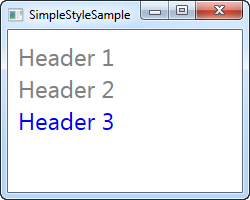
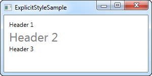

# Styles

Je kan een stijl onmiddellijk en direct definieren bij je control, bijvoorbeeld zo:

```csharp
<Window x:Class="WpfTutorialSamples.Styles.ControlSpecificStyleSample"
        xmlns="http://schemas.microsoft.com/winfx/2006/xaml/presentation"
        xmlns:x="http://schemas.microsoft.com/winfx/2006/xaml"
        Title="ControlSpecificStyleSample" Height="100" Width="300">
    <Grid Margin="10">
        <TextBlock Text="Style test">
            <TextBlock.Style>
                <Style>
                    <Setter Property="TextBlock.FontSize" Value="36" />
                </Style>
            </TextBlock.Style>
        </TextBlock>
    </Grid>
</Window>
```

 

**Voorbeeld van een stijl die enkel voor een enkele control geldt**

Met een stijl kan je meer doen dan enkel properties zetten.

## Local child control style

Door gebruik te maken van de Resources sectie van een control kan je onderliggende controls dirigeren:

```csharp
<Window x:Class="WpfTutorialSamples.Styles.SimpleStyleSample"
        xmlns="http://schemas.microsoft.com/winfx/2006/xaml/presentation"
        xmlns:x="http://schemas.microsoft.com/winfx/2006/xaml"
        Title="SimpleStyleSample" Height="200" Width="250">
    <StackPanel Margin="10">
        <StackPanel.Resources>
            <Style TargetType="TextBlock">
                <Setter Property="Foreground" Value="Gray" />
                <Setter Property="FontSize" Value="24" />
            </Style>
        </StackPanel.Resources>
        <TextBlock>Header 1</TextBlock>
        <TextBlock>Header 2</TextBlock>
        <TextBlock Foreground="Blue">Header 3</TextBlock>
    </StackPanel>
</Window>
```

 

*Een stijl die lokale onderliggende controls beinvloedt**

Op deze manier kan je een hele set van controls, die bijvoorbeeld samen op een dialoogvenster voorkomen, stijlen in plaats van elke control individueel een stijl mee te geven.

## Window-wide styles

Nog hogerop kan je de stijl op het niveau van het venster zelf definieren. Dit kan op dezelfde manier als in het geval van StackPanel hierboven. De stijl geldt dan voor alle controls op het venster (of de UserControl). Hier volgt een aangpast voorbeeld: 

```csharp
<Window x:Class="WpfTutorialSamples.Styles.WindowWideStyleSample"
        xmlns="http://schemas.microsoft.com/winfx/2006/xaml/presentation"
        xmlns:x="http://schemas.microsoft.com/winfx/2006/xaml"
        Title="WindowWideStyleSample" Height="200" Width="300">
    <Window.Resources>
        <Style TargetType="TextBlock">
            <Setter Property="Foreground" Value="Gray" />
            <Setter Property="FontSize" Value="24" />
        </Style>
    </Window.Resources>
    <StackPanel Margin="10">
        <TextBlock>Header 1</TextBlock>
        <TextBlock>Header 2</TextBlock>
        <TextBlock Foreground="Blue">Header 3</TextBlock>
    </StackPanel>
</Window>
```

 

**Een window-wide style**

Zoals je kan zien is het resultaat precies hetzelfde, maar als je bijkomende controls toevoegt aan het venster, is de stijl hierop nog steeds van toepassing. 

## Application-wide styles

Je kan een stijl ook vastleggen op het hoogste niveau, dat van de applicatie zelf. Dit gebeurt in het App.xaml bestand dat Visual Studio normaliter voor je aanmaakte. Een aangepast voorbeeld:

### App.xaml

```csharp
<Application x:Class="WpfTutorialSamples.App"
             xmlns="http://schemas.microsoft.com/winfx/2006/xaml/presentation"
             xmlns:x="http://schemas.microsoft.com/winfx/2006/xaml"
	 StartupUri="Styles/WindowWideStyleSample.xaml">
    <Application.Resources>
        <Style TargetType="TextBlock">
            <Setter Property="Foreground" Value="Gray" />
            <Setter Property="FontSize" Value="24" />
        </Style>
    </Application.Resources>
</Application>
```

### Window

```csharp
<Window x:Class="WpfTutorialSamples.Styles.WindowWideStyleSample"
        xmlns="http://schemas.microsoft.com/winfx/2006/xaml/presentation"
        xmlns:x="http://schemas.microsoft.com/winfx/2006/xaml"
        Title="ApplicationWideStyleSample" Height="200" Width="300">
    <StackPanel Margin="10">
        <TextBlock>Header 1</TextBlock>
        <TextBlock>Header 2</TextBlock>
        <TextBlock Foreground="Blue">Header 3</TextBlock>
    </StackPanel>
</Window>
```

 

**An application-wide style**

### Expliciete stijlen

Je hebt veel controle over hoe en wanneer je een stijl kan opleggen aan je controls, van locaal en individueel tot op applicatieniveau. Tot nu toe was een stijl steeds op alle onderliggende controls van toepassing. Dit hoeft echter niet zo te zijn: door de x:Key property op een stijl te zetten, kan je WPF vertellen dat je een specifieke stijl op een specifieke control wenst toe te passen. Een voorbeeld:

```csharp
<Window x:Class="WpfTutorialSamples.Styles.ExplicitStyleSample"
        xmlns="http://schemas.microsoft.com/winfx/2006/xaml/presentation"
        xmlns:x="http://schemas.microsoft.com/winfx/2006/xaml"
        Title="ExplicitStyleSample" Height="150" Width="300">
    <Window.Resources>
        <Style x:Key="HeaderStyle" TargetType="TextBlock">
            <Setter Property="Foreground" Value="Gray" />
            <Setter Property="FontSize" Value="24" />
        </Style>
    </Window.Resources>
    <StackPanel Margin="10">
        <TextBlock>Header 1</TextBlock>
        <TextBlock Style="{StaticResource HeaderStyle}">Header 2</TextBlock>
        <TextBlock>Header 3</TextBlock>
    </StackPanel>
</Window>
```

 

**Een expliciet gedefinieerde stijl**

Je ziet dat de stijl enkel op het middenste TextBlock wordt toegepast omdat de stijl een x:Key property draagt en bij dat TextBlock expliciet vermeld wordt dat de stijl erop toegepast moet worden.

