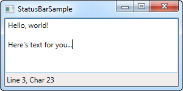

# Menu control

Een van de meest bekende onderdelen van een Windows applicatie is de zogenaamde "menu". Doorgaans wordt maar een enkel hoofdmenu voorzien in een applicatie. 
Een menu is handig omdat deze veel opties kan aanbieden op weinig ruimte.
Items toevoegen aan een WPF Menu is heel eenvoudig: je kan ook  MenuItem elementen voorzien. Elk MenuItem kan subelementen hebben: dit laat toe hierarchische menus op te bouwen.

Een voorbeeld:

```csharp
<Window x:Class="WpfTutorialSamples.Common_interface_controls.MenuSample"
        xmlns="http://schemas.microsoft.com/winfx/2006/xaml/presentation"
        xmlns:x="http://schemas.microsoft.com/winfx/2006/xaml"
        Title="MenuSample" Height="200" Width="200">
    <DockPanel>
        <Menu DockPanel.Dock="Top">
            <MenuItem Header="_File">
                <MenuItem Header="_New" />
                <MenuItem Header="_Open" />
                <MenuItem Header="_Save" />
                <Separator />
                <MenuItem Header="_Exit" />
            </MenuItem>
        </Menu>
        <TextBox AcceptsReturn="True" />
    </DockPanel>
</Window>
```

 

Zoals bij de meeste Windows applicaties staat dit menu bovenaan, maar je kan deze control plaatsen waar je wenst en de grootte ervan aanpassen.

Wanneer je een "underscore" voor het eerste karakter van een label plaatst, dan zal WPF dit karakter interpreteren als een "accelerator key". Dit
betekent dat de gebruiker de Alt toets kan indrukken met het bewuste karakter om meteen de actie gekoppeld aan het menuelement uit te voeren.
Je kan dit ook gebruiken voor een subelement: druk Alt in en daarna de letters doorheen de menus.

Het is mogelijk om een icoontje te voorzien bij een menu-element en een checkbox voor een menu-element kan gebruikt worden om een eigenschap op of af
te zetten:

```csharp
<Window x:Class="WpfTutorialSamples.Common_interface_controls.MenuIconCheckableSample"
        xmlns="http://schemas.microsoft.com/winfx/2006/xaml/presentation"
        xmlns:x="http://schemas.microsoft.com/winfx/2006/xaml"
        Title="MenuIconCheckableSample" Height="150" Width="300">
    <DockPanel>
        <Menu DockPanel.Dock="Top">
            <MenuItem Header="_File">
                <MenuItem Header="_Exit" />
            </MenuItem>
            <MenuItem Header="_Tools">
                <MenuItem Header="_Manage users">
                    <MenuItem.Icon>
                        <Image Source="/WpfTutorialSamples;component/Images/user.png" />
                    </MenuItem.Icon>
                </MenuItem>
                <MenuItem Header="_Show groups" IsCheckable="True" IsChecked="True" />
            </MenuItem>
        </Menu>
        <TextBox AcceptsReturn="True" />
    </DockPanel>
</Window>
```

 

Het is mogelijk om met een eenvoudige Click event te werken, maar beter is het volgende.

```csharp
<Window x:Class="WpfTutorialSamples.Common_interface_controls.MenuWithCommandsSample"
        xmlns="http://schemas.microsoft.com/winfx/2006/xaml/presentation"
        xmlns:x="http://schemas.microsoft.com/winfx/2006/xaml"
        Title="MenuWithCommandsSample" Height="200" Width="300">
    <Window.CommandBindings>
        <CommandBinding Command="New" CanExecute="NewCommand_CanExecute" Executed="NewCommand_Executed" />
    </Window.CommandBindings>
    <DockPanel>
        <Menu DockPanel.Dock="Top">
            <MenuItem Header="_File">
                <MenuItem Command="New" />
                <Separator />
                <MenuItem Header="_Exit" />
            </MenuItem>
            <MenuItem Header="_Edit">
                <MenuItem Command="Cut" />
                <MenuItem Command="Copy" />
                <MenuItem Command="Paste" />
            </MenuItem>
        </Menu>

        <TextBox AcceptsReturn="True" Name="txtEditor" />
    </DockPanel>
</Window>
```

```csharp
using System;
using System.Windows;
using System.Windows.Input;

namespace WpfTutorialSamples.Common_interface_controls
{
	public partial class MenuWithCommandsSample : Window
	{
		public MenuWithCommandsSample()
		{
			InitializeComponent();
		}

		private void NewCommand_CanExecute(object sender, CanExecuteRoutedEventArgs e)
		{
			e.CanExecute = true;
		}

		private void NewCommand_Executed(object sender, ExecutedRoutedEventArgs e)
		{
			txtEditor.Text = "";
		}
	}
}
```
 

Door deze techniek te gebruiken, krijg je heel wat gratis bij: shortcuts, automatische activatie en deactivatie afhankelijk van de actieve control.

# StatusBar 

Een eenvoudige StatusBar

```csharp
<Window x:Class="WpfTutorialSamples.Common_interface_controls.StatusBarSample"
        xmlns="http://schemas.microsoft.com/winfx/2006/xaml/presentation"
        xmlns:x="http://schemas.microsoft.com/winfx/2006/xaml"
        Title="StatusBarSample" Height="150" Width="300">
	<DockPanel>
		<StatusBar DockPanel.Dock="Bottom">
			<StatusBarItem>
				<TextBlock Name="lblCursorPosition" />
			</StatusBarItem>
		</StatusBar>
		<TextBox AcceptsReturn="True" Name="txtEditor" SelectionChanged="txtEditor_SelectionChanged" />
	</DockPanel>
</Window>
```


```csharp
using System;
using System.Windows;

namespace WpfTutorialSamples.Common_interface_controls
{
	public partial class StatusBarSample : Window
	{
		public StatusBarSample()
		{
			InitializeComponent();
		}

		private void txtEditor_SelectionChanged(object sender, RoutedEventArgs e)
		{

			int row = txtEditor.GetLineIndexFromCharacterIndex(txtEditor.CaretIndex);
			int col = txtEditor.CaretIndex - txtEditor.GetCharacterIndexFromLineIndex(row);
			lblCursorPosition.Text = "Line " + (row + 1) + ", Char " + (col + 1);
		}
	}
}
```

 

Een meer geavanceerde StatusBar met ProgressBar

```csharp
<Window x:Class="WpfTutorialSamples.Common_interface_controls.StatusBarAdvancedSample"
        xmlns="http://schemas.microsoft.com/winfx/2006/xaml/presentation"
        xmlns:x="http://schemas.microsoft.com/winfx/2006/xaml"
        Title="StatusBarAdvancedSample" Height="150" Width="400">
    <DockPanel>
        <StatusBar DockPanel.Dock="Bottom">
            <StatusBar.ItemsPanel>
                <ItemsPanelTemplate>
                    <Grid>
                        <Grid.ColumnDefinitions>
                            <ColumnDefinition Width="100" />
                            <ColumnDefinition Width="Auto" />
                            <ColumnDefinition Width="*" />
                            <ColumnDefinition Width="Auto" />
                            <ColumnDefinition Width="100" />
                        </Grid.ColumnDefinitions>
                    </Grid>
                </ItemsPanelTemplate>
            </StatusBar.ItemsPanel>
            <StatusBarItem>
                <TextBlock Name="lblCursorPosition" />
            </StatusBarItem>
            <Separator Grid.Column="1" />
            <StatusBarItem Grid.Column="2">
                <TextBlock Text="c:\path\of\current\file.txt" />
            </StatusBarItem>
            <Separator Grid.Column="3" />
            <StatusBarItem Grid.Column="4">
                <ProgressBar Value="50" Width="90" Height="16" />
            </StatusBarItem>
        </StatusBar>
        <TextBox AcceptsReturn="True" Name="txtEditor" SelectionChanged="txtEditor_SelectionChanged" />
    </DockPanel>
</Window>
```

```csharp
using System;
using System.Windows;

namespace WpfTutorialSamples.Common_interface_controls
{
	public partial class StatusBarAdvancedSample : Window
	{
		public StatusBarAdvancedSample()
		{
			InitializeComponent();
		}

		private void txtEditor_SelectionChanged(object sender, RoutedEventArgs e)
		{
			int row = txtEditor.GetLineIndexFromCharacterIndex(txtEditor.CaretIndex);
			int col = txtEditor.CaretIndex - txtEditor.GetCharacterIndexFromLineIndex(row);
			lblCursorPosition.Text = "Line " + (row + 1) + ", Char " + (col + 1);
		}
	}
}
```

 


