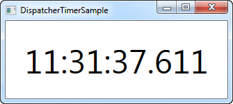

# Timer

In WinForms bestaat er een control Timer die op een gegeven interval afloopt en een actie uitvoert, al dan niet bij herhaling. WPF biedt dit ook aan, niet via een onzichtbare Timer control, maar de zogenaamde DispatcherTimer control. Deze control doet min of meer hetzelfde, maar in plaats van de control op je form te slepen, maak je de control aan in code-behind.

Bij DispatcherTimer class specificeer je een interval en aan het Tick event ken je een actie toe die wordt uitgevoerd wanneer het interval verstreken is. DispatcherTimer start pas als je de Start() method oproept of de IsEnabled property op true zet.

Een eenvoudig voorbeeld om een klok te tonen:

```csharp
<Window x:Class="WpfTutorialSamples.Misc.DispatcherTimerSample"
        xmlns="http://schemas.microsoft.com/winfx/2006/xaml/presentation"
        xmlns:x="http://schemas.microsoft.com/winfx/2006/xaml"
        Title="DispatcherTimerSample" Height="150" Width="250">
    <Grid>
        <Label Name="lblTime" FontSize="48" HorizontalAlignment="Center" VerticalAlignment="Center" />
    </Grid>
</Window>
```

```csharp
using System;
using System.Windows;
using System.Windows.Threading;

namespace WpfTutorialSamples.Misc
{
	public partial class DispatcherTimerSample : Window
	{
		public DispatcherTimerSample()
		{
			InitializeComponent();
			DispatcherTimer timer = new DispatcherTimer();
			timer.Interval = TimeSpan.FromSeconds(1);
			timer.Tick += timer_Tick;
			timer.Start();
		}

		void timer_Tick(object sender, EventArgs e)
		{
			lblTime.Content = DateTime.Now.ToLongTimeString();
		}
	}
}
```
 

**Een klok die DispatcherTimer gebruikt voor updates**

Het XAML gedeelte is heel eenvoudig - enkel een gecentreerd label met een grote font size.

De magie in dit voorbeeld vind je in de code-behind. In de constructor van het venster maken we de instantie van DispatcherTimer aan. We zetten property Interval op 1 seconde, schrijven ons in op het Tick event en starten de timer. In de event handler van het Tick event passen we eenvoudigweg de tekst van het label aan dat de tijd toont. DispatcherTimer "dispatches" het event op de gui thread van WPF, dus locking is niet vereist.

Gebruik de TimeSpan.From* methods, zoals FromSeconds of FromMinutes, of maak een nieuwe instantie aan van TimeSpan die aan je noden tegemoet komt.

Probeer eens de update-frequentie op te hogen tot op de milliseconde:

```csharp
using System;
using System.Windows;
using System.Windows.Threading;

namespace WpfTutorialSamples.Misc
{
	public partial class DispatcherTimerSample : Window
	{
		public DispatcherTimerSample()
		{
			InitializeComponent();
			DispatcherTimer timer = new DispatcherTimer();
			timer.Interval = TimeSpan.FromMilliseconds(1);
			timer.Tick += timer_Tick;
			timer.Start();
		}

		void timer_Tick(object sender, EventArgs e)
		{
			lblTime.Content = DateTime.Now.ToString("HH:mm:ss.fff");
		}
	}
}
```

 

**Een klok die gebruik maakt van DispatcherTimer en elke milliseconde afloopt**

Je kan een paar knoppen toevoegen aan het venster die Stop(), Start() en Restart() oproepen: zo implementeer je een stopwatch.

## Samenvatting

Wanneer je iets repetitief wenst uit te voeren, kan je DispatcherTimer gebruiken. Let wel op dat je niet een complexe taak te snel achter elkaar uitvoert. DispatcherTimer is niet 100% precies in alle gevallen. De operaties worden op de Dispatcher queue geplaatst, dus wanneer je computer zwaar belast is, wordt de uitvoering vertraagd. .NET garandeert wel dat de timer nooit afloopt voor het gewenste moment zich aandient. Het is mogelijk eventueel DispatcherPriority aan te passen om een bepaalde DispatcherTimer voorrang te geven bij uitvoering, maar meestal is het geen goed idee hiermee te knutselen.


