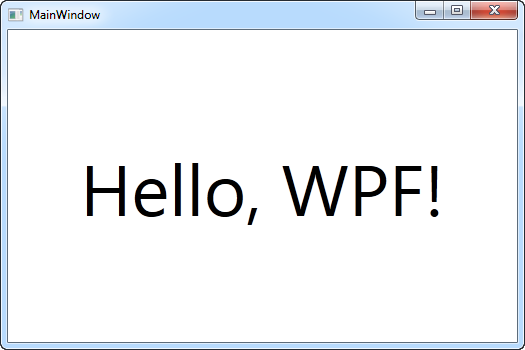

# Wat is WPF?

WPF (een afkorting van Windows Presentation Foundation) is Microsoft's meest recente uitwerking van een GUI-framework, hoofdzakelijk bedoeld voor desktop-applicaties. Het wordt gebruikt binnen het .NET-framework.

Maar wat is een GUI-framework? GUI staat voor Graphical User Interface, en waarschijnlijk kijk je op dit moment naar een GUI. Windows gebruikt een GUI om je toe te laten met je computer te werken, en de browser waarin je dit waarschijnlijk leest maakt het via een GUI mogelijk om op het web te surfen.

Een GUI-framework laat je toe om een applicatie te maken met een brede waaier aan GUI-elementen, zoals labels, textboxes en andere welbekende elementen. Zonder een GUI-framework zou je al deze elementen handmatig op het scherm moeten tekenen, en al de bijbehorende gebruiksscenario's zoals tekst- of muisinput zelf moeten behandelen. Dat is erg veel werk, dus doen de meeste developers beroep op een GUI-framework dat al de basistaken afhandelt en hen toelaat om zich te focussen op het maken van fantastische applicaties.

Er bestaan een heleboel GUI-frameworks, maar voor .NET-developers behoren WinForms en WPF tot de meest interessante opties. WPF is het nieuwst, maar Microsoft onderhoudt WinForms nog steeds en biedt er nog steeds support voor. Zoals je in het volgende hoofdstuk zult zien zijn er heel wat verschillen tussen de twee, maar hun doelstelling is hetzelfde: ze maken het makkelijk om applicaties te ontwikkelen met een uitstekende GUI.

# WPF versus WinForms

In het vorige hoofdstuk hebben we behandeld wat WPF is en hebben we het kort over WinForms gehad. In dit hoofdstuk doen we een poging om de twee te vergelijken, want hoewel ze hetzelfde doel dienen zijn er ook heel wat verschillen. Als je nog nooit met WinForms hebt gewerkt, en zeker als WPF je allereerste GUI-framework is, dan mag je dit hoofdstuk overslaan, maar als je geinteresseerd bent in de verschillen tussen de twee, lees dan vooral verder.

Het belangrijkste verschil tussen WinForms en WPF is het feit dat WinForms slechts uit een laag bestaat bovenop de standaard Windows-controls (bv. een TextBox), terwijl WPF vanuit het niets is opgebouwd en in bijna alle situaties géén gebruik maakt van standaard Windows-controls. Dit lijkt misschien een subtiel verschil, maar niets is minder waar, en dat is iets dat je zeker zult merken als je ooit hebt gewerkt met een framework dat gebaseerd is op Win32/WinAPI.

Een mooi voorbeeld is dat van een knop met een afbeelding en tekst erop. Dit is geen standaard Windows-besturingselement, waardoor WinForms deze mogelijkheid niet aanbiedt. In plaats daarvan moet de afbeelding zelf aangemaakt worden en een eigen knop gebruikt worden die het gebruik van afbeeldingen ondersteunt of moet men zijn toevlucht nemen tot het gebruik van besturingselementen van derden. In WPF kan een knop van alles bevatten, omdat het in essentie slechts een omlijsting is met inhoud en met verschillende verschijningsvormen (bijv. natief, met de muis erboven zweven, ingedrukt). De WPF knop is zonder opmaak, zoals de meeste andere WPF besturingselementen, wat betekent dat het in staat is een reeks andere besturingselementen in zich op te nemen. U wilt een knop met een afbeelding en wat tekst? Plaats gewoon een Afbeeldings- en Tekstblok-besturingselement in de knop en klaar is Kees! Deze flexibiliteit is onmogelijk met de standaard WinForms besturingselementen, waardoor er een grote vraag is ontstaan naar nogal simpele toepassingen van besturingselementen zoals knoppen met afbeeldingen en dergelijke.

Het nadeel van deze flexibiliteit is dat soms meer werk moet worden verricht om iets te realiseren dat eerder gemakkelijk was in WinForms, omdat het juist voor dit ene scenario standaard was ontwikkeld. Ten minste dat is hoe het aanvoelt in het begin, als er templates moeten worden gemaakt voor een ListView met een afbeelding en wat fijn uitgelijnde tekst, iets wat de WinForms ListViewItem kan met slechts één lijntje code.

Dit was maar één verschil, maar terwijl je met WPF werkt, zul je je realiseren dat dit in feite de onderliggende reden is voor veel van de andere verschillen - WPF doet gewoon dingen op zijn eigen manier, in voor- en tegenspoed. Je bent niet langer gedwongen om dingen op Windows-manier te doen, maar om dit soort flexibiliteit te krijgen betaal je met wat meer werk als je echt op zoek bent naar dingen op de Windows-manier.

Het volgende is een volledig subjectieve lijst van de belangrijkste voordelen voor WPF en WinForms. Het zou je een beter idee moeten geven van waar je naartoe gaat.

## WPF voordelen

- Het is nieuwer en daardoor beter afgestemd op de huidige normen
- Microsoft gebruikt WPF voor veel nieuwe applicaties, zoals Visual Studio
- Het is flexibeler, zodat u meer dingen kunt doen zonder nieuwe besturingselementen te hoeven schrijven of kopen
- Als u echter besturingselementen van derden moet gebruiken, zullen de ontwikkelaars van deze besturingselementen waarschijnlijk meer gericht zijn op WPF omdat deze nieuwer zijn
- XAML maakt het eenvoudig om uw GUI te maken en te bewerken en laat het werk opsplitsen tussen een ontwerper (XAML) en een programmeur (C#, VB .NET enz.)
- Databinding, waarmee u een meer schone scheiding van gegevens en lay-out kunt krijgen
- Gebruikt hardware versnelling voor het tekenen van de GUI voor betere prestaties
- Het stelt je in staat om gebruikersinterfaces te maken voor zowel Windows-toepassingen als web toepassingen (Silverlight / XBAP)

## WinForms voordelen

- Het is ouder en daardoor meer beproefd en getest
- Er zijn al veel controles van derden die u gratis kunt kopen of krijgen
- De ontwerper in Visual Studio is nog steeds, vanaf het schrijven, beter voor WinForms dan voor WPF, waar je zelf nog meer van het werk met WPF moet doen

# Hallo WPF!

Het eerste en klassieke voorbeeld in vrijwel elke programmeerhandleiding is "Hallo, wereld!", maar in deze tutorial doen we lekker gek en veranderen dat in "Hallo, WPF!". Het doel is om dit stukje tekst op het scherm te krijgen, om je te laten zien hoe eenvoudig het is om te beginnen.

De rest van deze handleiding neemt aan dat je een IDE geïnstalleerd hebt, bij voorkeur Visual Studio 2019.

In Visual Studio begint u met het selecteren van Nieuw project in het menu File. Aan de linkerkant, moet u een boom van categorieën. Deze tutorial zal zich richten op C# wanneer er code in het spel is, dus je moet dat selecteren uit de lijst met sjablonen, en aangezien we Windows applicaties gaan maken, moet je Windows selecteren uit de boom. Dit geeft u aan de rechterkant een lijst met mogelijke Windowstoepassingstypen, waar u een WPF-toepassing moet selecteren. We noemden ons project "HelloWPF" in het Name tekstveld. Zorg ervoor dat de overige instellingen in het onderste gedeelte van het dialoogvenster in orde zijn en druk dan op de knop Ok.

Je nieuwe project zal een aantal files hebben, maar voor nu focussen we op slechts eentje: MainWindox.xaml. Dit is de primaire applicatie window, de eerste die getoond word wanneer de applicatie gestart wordt, tenzij je dit specifiek verandert. De XAML code die hierin gevonden kan worden (XAML word in een ander hoofdstuk van deze handleiding besproken) zou er ongeveer zo moeten uitzien:

   ```csharp
<Window x:Class="WpfApplication1.MainWindow"
    xmlns="http://schemas.microsoft.com/winfx/2006/xaml/presentation"
    xmlns:x="http://schemas.microsoft.com/winfx/2006/xaml"
    Title="MainWindow" Height="350" Width="525">
    <Grid>

    </Grid>
</Window>
   ```

Dit is de basis XAML die Visual Studio voor ons venster maakt, alle delen ervan worden uitgelegd in de hoofdstukken over XAML en "Het Venster". Je kunt de toepassing nu daadwerkelijk uitvoeren (selecteer select Debug -> Start debugging of druk op F5) om het lege venster te zien waar onze toepassing momenteel uit bestaat, maar nu is het tijd om onze boodschap op het scherm te krijgen.

We doen het door een TextBlock besturingselement toe te voegen aan het Grid panel, met ons eerder genoemde bericht als inhoud:

   ```csharp
<Window x:Class="WpfApplication1.MainWindow"
    xmlns="http://schemas.microsoft.com/winfx/2006/xaml/presentation"
    xmlns:x="http://schemas.microsoft.com/winfx/2006/xaml"
    Title="MainWindow" Height="350" Width="525">
    <Grid>
        <TextBlock HorizontalAlignment="Center" VerticalAlignment="Center" FontSize="72">
            Hello, WPF!
        </TextBlock>
    </Grid>
</Window>
   ```

Probeer de toepassing nu uit te voeren (selecteer Debug -> Start debugging of druk op F5) en bekijk het prachtige resultaat van je harde werk - je eerste WPF-toepassing:



Je zult zien dat we drie verschillende attributen op het TextBlock hebben gebruikt om een aangepaste uitlijning te krijgen (in het midden van het venster), evenals de eigenschap FontSize om een grotere tekst te krijgen.

# Wat is XAML?

XAML, dat staat voor eXtensible Application Markup Language, is Microsoft's variant van XML voor het beschrijven van een GUI. In eerdere GUI frameworks, zoals WinForms, werd een GUI gemaakt in dezelfde taal die je zou gebruiken voor interactie met de GUI, bijvoorbeeld C# of VB.NET en meestal onderhouden door de ontwerper (bijvoorbeeld Visual Studio), maar met XAML gaat Microsoft een andere kant op. Net als bij HTML kunt u uw GUI eenvoudig schrijven en bewerken.

Dit is niet echt een XAML tutorial, maar we zullen kort toelichten wat de functie en het gebruik van XAML is, omdat het zo'n essentieel onderdeel vormt van het WPF. Of je nu een Venster of een Pagina aanmaakt, het bestaat uit een XAML-document en een CodeBehindbestand, die samen het Venster/Pagina maken. Het XAML-bestand beschrijft de interface met al zijn elementen, terwijl de CodeBehind alle gebeurtenissen afhandelt en toegang heeft om te manipuleren met de XAML-besturingen.

# Basis XAML

In het vorige hoofdstuk hebben we besproken wat XAML is en waar je het voor gebruikt, maar hoe maak je een controle in XAML? Zoals u zult zien in het volgende voorbeeld, is het maken van een controle in XAML net zo eenvoudig als het schrijven van zijn naam, omgeven door haakjes. Zo ziet een knop er bijvoorbeeld zo uit:

   ```csharp
<Button>
   ```

XAML-tags moeten worden beëindigd, hetzij door de eindtag te schrijven, hetzij door een schuine streep naar voren te brengen aan het einde van de starttag:

   ```csharp
<Button></Button>
   ```
of
   ```csharp
<Button />
   ```

Veel controles staan u toe om inhoud tussen de begin en eind tags te plaatsen, die dan de inhoud van de controle is. Met de knopbediening kunt u bijvoorbeeld de tekst die erop wordt weergegeven tussen de begin- en eindtags specificeren:

   ```csharp
<Button>A button</Button>
   ```

HTML is niet hoofdlettergevoelig, maar XAML wel, omdat de stuurnaam moet corresponderen met een type in het .NET-kader. Hetzelfde geldt voor attribuutnamen, die overeenkomen met de eigenschappen van de besturing. Hier is een knop waar we een paar eigenschappen definiëren door attributen toe te voegen aan de tag:

   ```csharp
<Button FontWeight="Bold" Content="A button" />
   ```

We stellen de eigenschap FontWeight in, waardoor we vetgedrukte tekst krijgen, en vervolgens de eigenschap Inhoud, wat hetzelfde is als de tekst tussen de begin- en eindtag schrijven. Alle attributen van een bedieningsorgaan kunnen echter ook als volgt worden gedefinieerd, wanneer ze als kindersleutels van het hoofdorgaan worden weergegeven, met gebruikmaking van de notatie "besturingselement - punt":

   ```csharp
<Button>
    <Button.FontWeight>Bold</Button.FontWeight>
    <Button.Content>A button</Button.Content>
</Button>
   ```

Het resultaat is precies hetzelfde als hierboven, dus in dit geval gaat het om syntaxis en niets anders. Veel controles staan echter andere inhoud dan tekst toe, bijvoorbeeld andere controles. Hier is een voorbeeld waar we tekst in verschillende kleuren op dezelfde knop hebben door verschillende TextBlock-knoppen binnenin de knop te gebruiken

   ```csharp
<Button>
    <Button.FontWeight>Bold</Button.FontWeight>
    <Button.Content>
        <WrapPanel>
            <TextBlock Foreground="Blue">Multi</TextBlock>
            <TextBlock Foreground="Red">Color</TextBlock>
            <TextBlock>Button</TextBlock>
        </WrapPanel>
    </Button.Content>
</Button>
   ```

De Content eigenschap staat slechts één kinderelement toe, dus gebruiken we een WrapPanel om de verschillend gekleurde tekstblokken te bevatten. Panelen, zoals de WrapPanel, spelen een belangrijke rol in het WPF en we zullen ze later nog veel meer in detail bespreken - beschouw ze vooralsnog alleen maar als containers voor andere controles.

Met de volgende opmaak kan exact hetzelfde resultaat worden bereikt, wat gewoon een andere manier is om hetzelfde te schrijven:

   ```csharp
<Button FontWeight="Bold">
    <WrapPanel>
        <TextBlock Foreground="Blue">Multi</TextBlock>
        <TextBlock Foreground="Red">Color</TextBlock>
        <TextBlock>Button</TextBlock>
    </WrapPanel>
</Button>
   ```

# Code vs. XAML

Hopelijk laten de bovenstaande voorbeelden zien dat XAML vrij eenvoudig is om te schrijven, maar met veel verschillende manieren om het te doen, en als je denkt dat het bovenstaande voorbeeld veel opmaak is om een knop te krijgen met tekst in verschillende kleuren, probeer het dan te vergelijken met precies hetzelfde doen in C#:

   ```csharp
Button btn = new Button();
btn.FontWeight = FontWeights.Bold;

WrapPanel pnl = new WrapPanel();

TextBlock txt = new TextBlock();
txt.Text = "Multi";
txt.Foreground = Brushes.Blue;
pnl.Children.Add(txt);

txt = new TextBlock();
txt.Text = "Color";
txt.Foreground = Brushes.Red;
pnl.Children.Add(txt);

txt = new TextBlock();
txt.Text = "Button";
pnl.Children.Add(txt);

btn.Content = pnl;
pnlMain.Children.Add(btn);
   ```

Natuurlijk zou het bovenstaande voorbeeld minder expliciet geschreven kunnen worden en meer syntactische suiker kunnen gebruiken, maar het punt staat nog steeds behoorlijk overeind: XAML is (best) vrij kort en beknopt.


