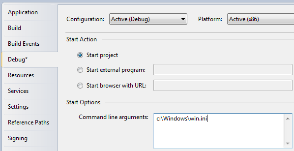

# Een WPF applicatie

## Window klasse

Bij het creëren van een WPF applicatie, is het eerste dat je tegenkomt de Window klasse. Deze klasse is de basis voor een venster [window], en bestaat uit een standaard kader, titelbalk en de knoppen voor minimaliseren, maximaliseren en sluiten. Een WPF venster bestaat uit een XAML (*.xaml) bestand, waar het <Window> element het hoofdelement is, en een code-behind (*.cs) bestand. Als je Visual Studio (Express) gebruikt en een nieuwe WPF applicatie maakt, wordt er een standaard venster gegenereerd. Zo ziet dat er ongeveer uit:

```csharp
<Window x:Class="WpfApplication1.Window1"
    xmlns="http://schemas.microsoft.com/winfx/2006/xaml/presentation"
    xmlns:x="http://schemas.microsoft.com/winfx/2006/xaml"
    Title="Window1" Height="300" Width="300">
    <Grid>

    </Grid>
</Window>
```

Het x:class attribuut definieert de klasse voor het XAML bestand, in dit geval Window1, welke Visual Studio ook voor ons heeft gegenereerd. Dit bestand vind je in de bestandsboom van het project in VS, als een subonderdeel van het XAML bestand. Standaard ziet het er ongeveer zo uit:

```csharp
using System;
using System.Windows;
using System.Windows.Controls;
//…more using statements

namespace WpfApplication1
{
    /// <summary>
    /// Interaction logic for Window1.xaml
    /// </summary>
    public partial class Window1 : Window
    {
        public Window1()
        {
            InitializeComponent();
        }
    }
}
```

Zoals je ziet is de Window1 klasse gedefiniëerd als partial, omdat deze tijdens runtime gecombineerd wordt met het XAML bestand om het volledige venster te vormen. De aanroep van InitializeComponent() is hiervoor verantwoordelijk, en daarom vereist om een volledig werkend venster aan de gang te krijgen.

Als we teruggaan naar het XAML bestand, zie je nog een aantal interessante attributen voor het Window element, zoals Title [Titel], waar de titel van het venster wordt gedefinieerd (te zien in de titelbalk) en de Width [Breedte] en Height [Hoogte] van het venster bij het opstarten. Daarnaast worden er een aantal namespaces gedefinieerd; daar komen we later op terug.

Daarnaast zul je zien dat Visual Studio een Grid-element heeft gegenereerd in het Venster. Het Grid is één van de WPF panel-elementen. Hoewel elk panel- of control-element hier had kunnen staan, een Window mag maar één enkel subelement bevatten. Daarom is een panel-element, welke zelf wel meerdere subelementen mag bevatten, meestal de goede keuze. We laten verderop in deze tutorial zien welke verschillende panel-elementen er nog meer zijn en wat de specifieke toepassingen zijn, aangezien dit belangrijke WPF onderdelen zijn.

### Belangrijke eigenschappen van Window

De WPF Window klasse heeft een heleboel interessante attributen die je kan instellen om het uiterlijk en gedrag van je applicatie window te bepalen. Ziehier een korte lijst van de meest interessante attributen:

**Icon** - Dit attribuut laat je toe om het icoontje (pictogram) van een window te definieren. Dit is meestal zichtbaar in de linker bovenhoek, juist voor de titel van het window.

**ResizeMode** - Deze bepaalt of en hoe de eindgebruiker de grootte van je window kan veranderen. De standaardwaarde is CanResize, deze laat de gebruiker toe om het van grootte te veranderen als eender ander window -- door de maximize/minimize knoppen te gebruiken of door de randen te verplaatsen. NoResize is de meest strikte waarde, waarbij de maximize/minimize knoppen verwijderd zijn en de randen niet verplaatst kunnen worden.

**ShowInTaskbar** - De standaardwaarde is 'true', maar als je 'false' invult zal de window niet zichtbaar zijn in de Windows taskbar. Bruikbaar bij niet-primaire windows of bij applicaties die enkel in de tray zichtbaar zijn.

**SizeToContent** - Beslist of het window zichzelf van grootte verandert zodat de inhoud er net in past. De standaardwaarde is 'Manual', dit wil zeggen dat het window niet vanzelf van grootte verandert. Andere mogelijkheden zijn 'Width', 'Height' en 'WidthAndHeight', waarbij de grootte horizontaal, verticaal of beide wordt/worden aangepast.

**Topmost** - De standaardwaarde is 'false', maar als deze of 'true' wordt gezet zal je Window boven andere windows zichtbaar zijn, tenzij het window geminimaliseerd is. Enkel bruikbaar in speciale gevallen.

**WindowStartupLocation** - Bepaalt de initiele positie van het window. De standaardwaarde is 'Manual', dit betekent dat het window initieel naargelang de 'Top' en 'Left' attributen van je window wordt gepositioneerd. Andere opties zijn 'CenterOwner', waarbij het window in het midden van zijn eigenaar-window wordt gepositioneerd. 'CenterScreen' daarentegen zal het window in het midden van het scherm positioneren.

**WindowState** - Bepaalt de initiele toestand van het window. Het kan 'Normal', 'Maximized' of 'Minimized' zijn. De standaardwaarde is 'Normal', dit moet je gebruiken tenzij je wil dat je window van begin af aan maximaal of minimaal wordt weergegeven.

Er zijn echter een heleboel andere attributen, bekijk ze zelf eens om dan vervolgens door te gaan naar het volgende hoofdstuk.

## App.xaml

App.xaml is het declaratief startpunt van jou applicatie. Visual Studio zal het bestand automatisch voor je aanmaken wanneer je start met een nieuwe WPF applicatie, inclusief het achterliggende code bestand met de naam App.xaml.cs. Deze bestanden werken net zo als voor een venster. De twee bestanden werken als partial klassen samen waardoor je zowel in de opmaak (XAML) als in de achterliggende code aanpassing kunt maken.

App.xaml.cs is een extensie van de Application klasse, de centrale klasse in een WPF Windows applicatie. .NET vindt in deze klasse de startinstructies en zal daarna het gewenste venster of de gewenste pagina van hieruit opstarten. Dit is ook de plaats om de applicatie te abonneren op belangrijke applicatie events, zoals applicatie start, onafgehandelde exceptions, etc. Later hierover meer.

Een van de meest gebruikte functies van het bestand App.xaml is het definiëren van de algemene bronnen die vanuit een hele applicatie kunnen worden gebruikt en geopend, bijvoorbeeld global styles. Dit zal later in detail worden besproken.

###  App.xaml structuur

Wanneer een nieuwe applicatie wordt gemaakt, wordt er automatisch een App.xaml bestand gegenereerd die er ongeveer zo uit ziet:

   ```csharp
<Application x:Class="WpfTutorialSamples.App"
             xmlns="http://schemas.microsoft.com/winfx/2006/xaml/presentation"
             xmlns:x="http://schemas.microsoft.com/winfx/2006/xaml"
             StartupUri="MainWindow.xaml">
    <Application.Resources>

    </Application.Resources>
</Application>
   ```

Het belangrijkste punt om hier op te merken is de eigenschap StartupUri. Dit is de eigenschap die aangeeft welk venster of welke pagina moet worden gestart wanneer de applicatie wordt opgestart. In dit geval wordt MainWindow.xaml gestart, maar als u een ander venster als beginpunt wilt gebruiken, kunt u dit eenvoudig wijzigen.

In sommige situaties wilt u meer controle over hoe en wanneer het eerste venster wordt getoond. In dat geval kunt u de StartupUri eigenschap en zijn waarde verwijderen en vervolgens alles in de achterliggende code implementeren. Dit zal hieronder worden aangetoond.

### App.xaml.cs structuur

Het bijbehorende App.xaml.cs bestand zal er ongeveer zo uit zien bij een nieuw project:

   ```csharp
using System;
using System.Collections.Generic;
using System.Windows;

namespace WpfTutorialSamples
{
	public partial class App : Application
	{

	}
}
   ```

U zult zien hoe deze klasse de Applicatie klasse uitbreidt met functionaliteit, waarmee u op applicatieniveau zaken kunt laten uitvoeren. U kunt zich bijvoorbeeld abonneren op het opstart event, en daarop zelf uw startvenster starten.

Hier een voorbeeld:

   ```csharp
<Application x:Class="WpfTutorialSamples.App"
             xmlns="http://schemas.microsoft.com/winfx/2006/xaml/presentation"
             xmlns:x="http://schemas.microsoft.com/winfx/2006/xaml"
			 Startup="Application_Startup">
    <Application.Resources></Application.Resources>
</Application>
   ```

Merk op hoe de eigenschap StartupUri is vervangen door een abonnement op het Startup event (abonneren op gebeurtenissen via XAML wordt uitgelegd in een ander hoofdstuk). In de achterliggende code kunt u het event als volgt gebruiken:

   ```csharp
using System;
using System.Collections.Generic;
using System.Windows;

namespace WpfTutorialSamples
{
	public partial class App : Application
	{

		private void Application_Startup(object sender, StartupEventArgs e)
		{
			// Create the startup window
			MainWindow wnd = new MainWindow();
			// Do stuff here, e.g. to the window
			wnd.Title = "Something else";
			// Show the window
			wnd.Show();
		}
	}
}
   ```

Het leuke van dit voorbeeld, in vergelijking met het gebruik van de propertie StartupUri, is dat we het opstartvenster kunnen veranderen voordat het wordt weergegeven. In dit voorbeeld veranderen we de titel, wat niet erg nuttig is, maar je kunt je ook abonneren op events of misschien een splash-scherm laten zien. Als je alle controle hebt, zijn er veel mogelijkheden. In de volgende artikelen van deze tutorial zullen we dieper ingaan op een aantal van deze mogelijkheden.

## Werken met command line parameters

Command-line parameters is een techniek waarbij een set parameters wordt gegeven aan een applicatie die je start, om deze te beinvloeden. Een veel voorkomend voorbeeld daarvan is een applicatie die een specifiek bestand opent bij het opstarten, zoals gebeurt bij een editor bijvoorbeeld. Je kan dit zelf proberen met de ingebouwde applicatie 'kladblok' van Windows, door het volgende uit te voeren (kies Uitvoeren... uit het Start menu of typ [Windows-toets+R]) :

notepad.exe c:\Windows\win.ini

Hierbij zal Kladblok openen met de win.ini file reeds geopend (eventueel moet je het pad aanpassen zodat het overeenkomt met jouw Windows installatie). Kladblok kijkt gewoon naar een of meerdere parameters, en gebruikt die dan. Jouw applicatie kan hetzelfde doen!

Command-line parameters (de argumenten die je dus doorgeeft via de opdracht prompt) worden aan jouw WPF applicatie doorgegeven via het 'Startup event'. Je kan je abbonneren op dit event in het App.XAML script. We zullen dit doen in dit voorbeeld. Daarna gebruiken we de waarde die werd doorgegeven via de argumenten van de method. Eerst het App.XAML bestand:

   ```csharp
<Application x:Class="WpfTutorialSamples.App"
             xmlns="http://schemas.microsoft.com/winfx/2006/xaml/presentation"
             xmlns:x="http://schemas.microsoft.com/winfx/2006/xaml"
			 Startup="Application_Startup">
    <Application.Resources></Application.Resources>
</Application>
   ```

Het enige wat je hier doet is je abonneren op het Startup event, waarbij je de waarde van StartupUri aanpast. Het event wordt dan geimplementeerd in App.XAML.cs:

   ```csharp
using System;
using System.Collections.Generic;
using System.Windows;

namespace WpfTutorialSamples
{
	public partial class App : Application
	{

		private void Application_Startup(object sender, StartupEventArgs e)
		{
			MainWindow wnd = new MainWindow();
			if(e.Args.Length == 1)
				MessageBox.Show("Now opening file: \n\n" + e.Args[0]);
			wnd.Show();
		}
	}
}
   ```

We gebruiken daarbij de StartupEventArgs. Het argument wordt doorgegeven naar het Applicatie 'Startup event' met naam e. Dit event heeft het attribuut Args, een array van strings. Command-line parameters worden gescheiden via spaties, tenzij de spatie binnenin een string tussen aanhalingstekens voorkomt.

**De command-line parameter testen**

Wanneer je bovenstaand voorbeeld uitvoert zal er niets gebeuren, omdat er geen argumenten werden meegegeven aan de opdracht prompt. Gelukkig maakt Visual Studio het makkelijk om dit met je applicatie te testen. Selecteer "[Project name] properties" van het Project menu. Klik op de Debug tab, daar kan je command-line argumenten opgeven. Het ziet er ongeveer als volgt uit:



**De project settings voor de opdracht prompt.**

Voer je applicatie uit, je zal zien dat deze reageert op jouw argument.

De mededeling die wordt weergegeven in de messagebox is natuurlijk niet erg nuttig. In plaats daarvan zou je het argument kunnen doorgeven aan de constructor van het main window, of je kan het overeenkomstig bestand openen:

   ```csharp
using System;
using System.Collections.Generic;
using System.Windows;

namespace WpfTutorialSamples
{
	public partial class App : Application
	{

		private void Application_Startup(object sender, StartupEventArgs e)
		{
			MainWindow wnd = new MainWindow();
			// The OpenFile() method is just an example of what you could do with the
			// parameter. The method should be declared on your MainWindow class, where
			// you could use a range of methods to process the passed file path
			if(e.Args.Length == 1)
				wnd.OpenFile(e.Args[0]);
			wnd.Show();
		}
	}
}
   ```

### Mogelijkheden van de command line

In dit voorbeeld testen we of er exact een argument is en indien ja, dan gebruiken we het argument als bestandsnaam. In de praktijk kan je meerdere argumenten interpreteren en deze zelfs voor opties gebruiken, bijvoorbeeld om bepaald gedrag van de applicatie aan of uit te schakelen. Dit kan je doen door de lijst af te gaan met behulp van een lus ('for' loop). Op die manier zou je applicatie de informatie kunnen verzamelen die nodig is om verder te gaan. We gaan hier nu niet verder op in.

