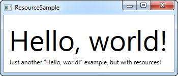
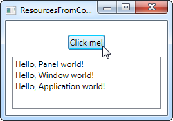

## Resources (!)

WPF introduceert een erg handig concept: de mogelijkheid om data als resource op te slaan, zij het lokaal voor een control, lokaal voor een compleet window of globaal voor de gehele applicatie. Deze data kunnen zo ongeveer alles zijn wat je wilt, van specifieke informatie tot een hiërarchie van WPF controls. Dit maakt het mogelijk alle data in één plaats onder te brengen en vanaf verschillende andere plaatsen te gebruiken, wat zeer nuttig is.

Dit concept wordt vaak gebruikt voor styles en templates, deze worden later in deze tutorial besproken, maar zoals voorgesteld in dit hoofdstuk, kun je het ook voor vele andere dingen gebruiken. Laat me dit met een eenvoudig voorbeeld demonstreren:

   ```csharp
<Window x:Class="WpfTutorialSamples.WPF_Application.ResourceSample"
        xmlns="http://schemas.microsoft.com/winfx/2006/xaml/presentation"
        xmlns:x="http://schemas.microsoft.com/winfx/2006/xaml"
        xmlns:sys="clr-namespace:System;assembly=mscorlib"
        Title="ResourceSample" Height="150" Width="350">
    <Window.Resources>
        <sys:String x:Key="strHelloWorld">Hello, world!</sys:String>
    </Window.Resources>
    <StackPanel Margin="10">
        <TextBlock Text="{StaticResource strHelloWorld}" FontSize="56" />
        <TextBlock>Just another "<TextBlock Text="{StaticResource strHelloWorld}" />" example, but with resources!</TextBlock>
    </StackPanel>
</Window>
   ```



**Een eenvoudig resource voorbeeld**

Aan resources wordt met behulp van het x:Key attribuut een key (sleutel) toegekend, zo wordt het mogelijk om vanaf andere plaatsen in de applicatie de resource via deze key te referenceren, dit in combinatie met de StaticResource markup extensie. In dit voorbeeld slaan we een eenvoudige string op, deze gebruiken we vervolgens in twee verschillende TextBlock controls.

**StaticResource versus DynamicResource**

In de voorbeelden tot nu toe hebben we de StaticResource markup extensie gebruikt om een resource te referenceren. Er bestaat echter nog een alternatief, dit in de vorm van de DynamicResource.

Het grote verschil bestaat daarin dat een static resource maar één keer opgelost wordt, dit op het tijdstip waar de XAML geladen wordt. Wordt de resource daarna veranderd, dan worden deze veranderingen niet gereflecteerd wanneer StaticResource gebruikt werd.

Een DynamicResource wordt daarentegen opgelost wanneer deze ook echt gebruikt wordt, en vervolgens ook telkens wanneer de resource veranderd wordt. Denk hierbij aan een binding met een statische waarde versus een binding met een functie die de waarde bewaakt en deze zendt elke keer dat deze veranderd wordt - het werkt niet exact zo, maar dit geeft je een beter idee wanneer je wat gebruiken moet. Dynamische resources maken het ook mogelijk resources te gebruiken die zelfs tijdens de design fase nog niet bestaan, wanneer ze b.v. in de code behind tijdens het starten van de applicatie toegevoegd worden.

**Meer resource types**

Het delen van een simpele string was eenvoudig, maar je kunt nog veel meer doen. In het volgende voorbeeld zullen we ook een complete array van strings opslaan, samen met een gradient (kleurverloop) brush, deze wordt voor de achtergrond gebruikt. Dit zou je een goed idee moeten geven wat je met resources kan doen:

   ```csharp
<Window x:Class="WpfTutorialSamples.WPF_Application.ExtendedResourceSample"
        xmlns="http://schemas.microsoft.com/winfx/2006/xaml/presentation"
        xmlns:x="http://schemas.microsoft.com/winfx/2006/xaml"
        xmlns:sys="clr-namespace:System;assembly=mscorlib"
        Title="ExtendedResourceSample" Height="160" Width="300"
        Background="{DynamicResource WindowBackgroundBrush}">
    <Window.Resources>
        <sys:String x:Key="ComboBoxTitle">Items:</sys:String>

        <x:Array x:Key="ComboBoxItems" Type="sys:String">
            <sys:String>Item #1</sys:String>
            <sys:String>Item #2</sys:String>
            <sys:String>Item #3</sys:String>
        </x:Array>

        <LinearGradientBrush x:Key="WindowBackgroundBrush">
            <GradientStop Offset="0" Color="Silver"/>
            <GradientStop Offset="1" Color="Gray"/>
        </LinearGradientBrush>
    </Window.Resources>
    <StackPanel Margin="10">
        <Label Content="{StaticResource ComboBoxTitle}" />
        <ComboBox ItemsSource="{StaticResource ComboBoxItems}" />
    </StackPanel>
</Window>
   ```


**Een ingewikkelder voorbeeld met meerdere resource types**

Deze keer hebben we een aantal extra resources toegevoegd, zodat ons Window nu een simpele string, een array van strings en een LinearGradientBrush bevat. De string wordt gebruikt voor het label, de array van strings wordt gebruikt items voor de ComboBox control en de gradient brush wordt gebruikt als achtergrond voor het gehele window. Op deze manier kan, zoals je kunt zien, zo ongeveer alles opgeslagen worden in een resource.

**Lokale en applicatiewijde resources**

Nu hebben we resources opgeslagen op een windows-level, wat inhoudt dat je ze kan benaderen vanaf elke plek in het window.

Als je alleen een resource voor een specifieke control nodig hebt, kan je het meer lokaal maken door het aan deze specifieke control toe te voegen in plaats van aan het window. Het werkt exact op dezelfde manier, het enig verschil is dat je het nu alleen kan benaderen van binnen de scope van de control waar je het aan toegevoegd hebt.

   ```csharp
<StackPanel Margin="10">
    <StackPanel.Resources>
        <sys:String x:Key="ComboBoxTitle">Items:</sys:String>
    </StackPanel.Resources>
    <Label Content="{StaticResource ComboBoxTitle}" />
</StackPanel>
   ```

In dit geval voegen we de resource to aan het StackPanel en maken dan gebruik van zijn child control, het Label. Andere controls binnen het StackPanel hadden ook gebruikt kunnen worden. Ook de children van deze child controls hebben hier toegang toe. controls buiten dit specifieke StackPanel hebben er echter geen toegang toe.

Wanneer je toegang nodig hebt tot de resource vanuit verschillende windows is dat ook mogelijk. Het App.xaml bestand kan resources net als het window en elk soort WPF control bevatten, en wanneer je ze opslaat in App.xaml, zijn ze globaal toegankelijk in alle windows en user control van het project. Het werkt precies hetzelfde als wanneer je ze opslaat en gebruikt vanuit een Window.

   ```csharp
<Application x:Class="WpfTutorialSamples.App"
             xmlns="http://schemas.microsoft.com/winfx/2006/xaml/presentation"
             xmlns:x="http://schemas.microsoft.com/winfx/2006/xaml"
             xmlns:sys="clr-namespace:System;assembly=mscorlib"
             StartupUri="WPF application/ExtendedResourceSample.xaml">
    <Application.Resources>
        <sys:String x:Key="ComboBoxTitle">Items:</sys:String>
    </Application.Resources>
</Application>
   ```

Gebruik ervan is ook hetzelfde - WPF zal automatisch naar boven gaan in de scope, vanaf de local control naar het window en dan naar App.xaml, om de opgegeven resource te vinden:

<Label Content="{StaticResource ComboBoxTitle}" />

**Resources uit de achtergrondcode (code behind)**

Tot nu toe hebben we al onze resources benaderd direct vanuit XAML, gebruik makend van een markup extension. Niettemin kan je natuurlijk ook gebruik maken van je resource vanuit achtergrondcode (Code-behind), wat nuttig kan zijn in verschillende situaties. In het vorige voorbeeld zagen we hoe we resources in verschillende plekken konden opslaan. Dus in dit voorbeeld zullen we drie verschillende resources vanuit Code-behind gebruiken, elk opgeslagen in een andere scope:

App.xaml:

   ```csharp
<Application x:Class="WpfTutorialSamples.App"
             xmlns="http://schemas.microsoft.com/winfx/2006/xaml/presentation"
             xmlns:x="http://schemas.microsoft.com/winfx/2006/xaml"
             xmlns:sys="clr-namespace:System;assembly=mscorlib"
             StartupUri="WPF application/ResourcesFromCodeBehindSample.xaml">
    <Application.Resources>
        <sys:String x:Key="strApp">Hello, Application world!</sys:String>
    </Application.Resources>
</Application>
   ```

Venster:

   ```csharp
<Window x:Class="WpfTutorialSamples.WPF_Application.ResourcesFromCodeBehindSample"
        xmlns="http://schemas.microsoft.com/winfx/2006/xaml/presentation"
        xmlns:x="http://schemas.microsoft.com/winfx/2006/xaml"
        xmlns:sys="clr-namespace:System;assembly=mscorlib"
        Title="ResourcesFromCodeBehindSample" Height="175" Width="250">
    <Window.Resources>
        <sys:String x:Key="strWindow">Hello, Window world!</sys:String>
    </Window.Resources>
    <DockPanel Margin="10" Name="pnlMain">
        <DockPanel.Resources>
            <sys:String x:Key="strPanel">Hello, Panel world!</sys:String>
        </DockPanel.Resources>

        <WrapPanel DockPanel.Dock="Top" HorizontalAlignment="Center" Margin="10">
            <Button Name="btnClickMe" Click="btnClickMe_Click">Click me!</Button>
        </WrapPanel>

        <ListBox Name="lbResult" />
    </DockPanel>
</Window>
   ```

**Achtergrondcode (code behind)**

```csharp
using System;
using System.Windows;

namespace WpfTutorialSamples.WPF_Application
{
	public partial class ResourcesFromCodeBehindSample : Window
	{
		public ResourcesFromCodeBehindSample()
		{
			InitializeComponent();
		}

		private void btnClickMe_Click(object sender, RoutedEventArgs e)
		{
			lbResult.Items.Add(pnlMain.FindResource("strPanel").ToString());
			lbResult.Items.Add(this.FindResource("strWindow").ToString());
			lbResult.Items.Add(Application.Current.FindResource("strApp").ToString());
		}
	}
}
```


**Resources samengesteld in de achtergrondcode (code behind)**

Zoals je kan zien, slaan we drie verschillende "Hello, world!" boodschappen op: Een in App.xaml, een binnen het window en een lokaal voor het main panel. De interface bestaat uit een button en een ListBox.

In code behind, behandelen we het click event van de button, waarin we elk van de tekst string toevoegen aan de ListBox zoals op het screenshot te zien is. We gebruiken de FindResource methode, welke de resource als een object terug zal geven (wanneer gevonden) en dan zetten we het om naar de string met behulp van de ToString() methode.

Zie hoe we de FindResource() methode gebruiken op verschillende scopes - eerst op het panel dan op het window en dan op het huidige Application object. Het is logisch om te zoeken naar de resource waar we weten dat het is, maar zoals al genoemd, als een resource niet gevonden wordt, zal er hoger in de hiërarchie gezocht worden, dus in principe hadden we de FindResource() methode op het panel uit kunnen voeren in alle drie de gevallen, omdat het doorgegaan zou zijn naar het window en later naar het application niveau wanneer het niet gevonden zou zijn.

Hetzelfde geldt niet andersom - het zoeken gebeurt niet naar beneden in de boom, dus je kan niet beginnen te zoeken naar een resource vanaf application niveau wanneer het lokaal voor de control of window gedefinieerd is.


