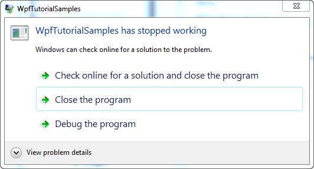

## Exceptions in WPF (!)

Afhandelen van exceptions is niet nieuw voor jou als je thuis bent in C# programmatie of andere .NET talen die kunnen gebruikt worden met WPF: Wanneer je een stuk code schrijft dat een exception kan veroorzaken, moet je dit inpakken ('wrap') in een try-catch blok om deze exception netjes af te handelen. Beschouw bijvoorbeeld dit stuk code:

```csharp
private void Button_Click(object sender, RoutedEventArgs e)
{
	string s = null;
	s.Trim();
}
```

Dit zal duidelijk misgaan aangezien we de Trim() method aanroepen met een argument dat nul is. Als de exception niet wordt afgehandeld zal de applicatie 'crashen' en Windows zal moeten tussenkomen. Dit gedrag is niet erg gebruiksvriendelijk, zoals je kan zien:



Een exception die niet afgehandeld werd, Windows komt tussen.
In dit geval zou de gebruiker de applicatie moeten sluiten, als gevolg van een makkelijk op te lossen fout. Dus als je weet dat er wat kan misgaan moet je een try-catch block gebruiken:

```csharp
private void Button_Click(object sender, RoutedEventArgs e)
{
	string s = null;
	try
	{
		s.Trim();
	}
	catch(Exception ex)
	{
		MessageBox.Show("A handled exception just occurred: " + ex.Message, 
		"Exception Sample", MessageBoxButton.OK, MessageBoxImage.Warning);
	}
}
```

Nochtans kan zelfs de meest simpele code een exception veroorzaken. In plaats van elke lijn code te voorzien van een try-catch blok, kan WPF je alle niet-afgehandelde exceptions globaal laten afvangen. Dit gebeurt door middel van hetDispatcherUnhandledException event in de Applicatie klasse, waar je applicatie zich kan op abonneren. Zodoende zal WPF de geregistreerde method aanroepen wanneer zich een exception voordoet die niet in je code wordt afgehandeld. Ziehier een volledig voorbeeld gebaseerd op voorgaande uitleg:

```csharp
<Window x:Class="WpfTutorialSamples.WPF_Application.ExceptionHandlingSample"
        xmlns="http://schemas.microsoft.com/winfx/2006/xaml/presentation"
        xmlns:x="http://schemas.microsoft.com/winfx/2006/xaml"
        Title="ExceptionHandlingSample" Height="200" Width="200">
    <Grid>
        <Button HorizontalAlignment="Center" VerticalAlignment="Center" 
		Click="Button_Click">
            Do something bad!
        </Button>
    </Grid>
</Window>
```

```csharp
using System;
using System.Windows;

namespace WpfTutorialSamples.WPF_Application
{
	public partial class ExceptionHandlingSample : Window
	{
		public ExceptionHandlingSample()
		{
			InitializeComponent();
		}

		private void Button_Click(object sender, RoutedEventArgs e)
		{
			string s = null;
			try
			{
				s.Trim();
			}
			catch(Exception ex)
			{
				MessageBox.Show("A handled exception just occurred: " + ex.Message, 
				"Exception Sample", MessageBoxButton.OK, MessageBoxImage.Warning);
			}
			s.Trim();
		}
	}
}
```

Noteer dat de Trim() method een tweede keer werd aangeroepen buiten het try-catch blok, zodat de eerste aanroep netjes afgehandeld werd maar de tweede niet. Voor de tweede aanroep is het volgende App.XAML script nodig:

```csharp
<Application x:Class="WpfTutorialSamples.App"
             xmlns="http://schemas.microsoft.com/winfx/2006/xaml/presentation"
             xmlns:x="http://schemas.microsoft.com/winfx/2006/xaml"
             DispatcherUnhandledException="Application_DispatcherUnhandledException"
             StartupUri="WPF Application/ExceptionHandlingSample.xaml">
    <Application.Resources>
    </Application.Resources>
</Application>
```

```csharp
using System;
using System.Windows;

namespace WpfTutorialSamples
{
	public partial class App : Application
	{
		private void Application_DispatcherUnhandledException(object sender, 
		System.Windows.Threading.DispatcherUnhandledExceptionEventArgs e)
		{
			MessageBox.Show("An unhandled exception just occurred: " 
			+ e.Exception.Message, "Exception Sample", MessageBoxButton.OK, MessageBoxImage.Warning);
			e.Handled = true;
		}
	}
}
```


**Een lokaal afgehandelde exception**


**Een globaal afgehandelde exception**

De exception wordt afgehandeld zoals de lokale exception, maar dan met een afwijkende tekst en symbool in de message box. Noteer ook dat het e.Handled attribuut op true wordt gezet. Dit geeft WPF de informatie dat de exception-afhandeling gebeurd is en er verder niets meer dient te gebeuren.

### Samenvatting

Afhandelen van exceptions maakt een belangrijk deel uit van applicaties en gelukkig maken WPF en .NET het heel gemakkelijk om exceptions zowel lokaal als globaal af te handelen. Je moet exceptions lokaal afhandelen wanneer nuttig en je hoort de globale afhandeling enkel te gebruiken als een vangnet, gezien lokale afhandeling toelaat om het probleem op een meer aangepaste manier aan te pakken.


