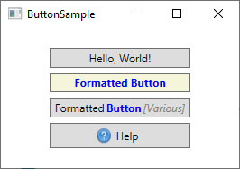

# WPF Controls

## TextBlock

TextBlock is geen control, omdat het niet erft van de Control klasse, maar het wordt gebruikt zoals elke ander control in het WPF framework. Daarom beschouwen we het als een control om het eenvoudig te houden.

De TextBlock control is één van de meest fundamentele controls in WPF en is erg nuttig. Hij stelt je in staat tekst op het scherm te plaatsen, ongeveer zoals een Label control doet, maar op een eenvoudigere manier, die minder resources nodig heeft. Gebruikelijk is om een Label toe te passen voor korte éénregelige tekst (die bijvoorbeeld wel een Image mag bevatten), terwijl het TextBlock ook goed werkt voor meerdere regels tekst, maar een TextBlock kan alleen tekst bevatten. Zowel het Label als het TextBlock bieden hun eigen unieke voordelen, dus wat je gebruikt hangt erg af van de situatie.

We hebben een TextBlock control al gebruikt in het "Hallo, WPF" artikel, maar voor dit moment, laten we kijken naar het TextBlock in de eenvoudigste vorm:

```csharp
<Window x:Class="WpfTutorialSamples.Basic_controls.TextBlockSample"
        xmlns="http://schemas.microsoft.com/winfx/2006/xaml/presentation"
        xmlns:x="http://schemas.microsoft.com/winfx/2006/xaml"
        Title="TextBlockSample" Height="100" Width="200">
    <Grid>
		<TextBlock>This is a TextBlock</TextBlock>
    </Grid>
</Window>
```

![wpf (media/vs-2019/WPF/textblock_simple.png)

**Een eenvoudige TextBlock control**

Dit is zo eenvoudig als het er uitziet en als je de vorige hoofdstukken van deze tutorial hebt gelezen, is er niets nieuws. De tekst in het TextBlock is eenvoudig een verkorting van de Text eigenschap (of property) van het TextBlock.

Voor het volgende voorbeeld, laten we een langere tekst proberen om te laten zien hoe het TextBlock daarmee om gaat. We voegden een beetje marge toe om het er beter uit te laten zien.

```csharp
<Window x:Class="WpfTutorialSamples.Basic_controls.TextBlockSample"
        xmlns="http://schemas.microsoft.com/winfx/2006/xaml/presentation"
        xmlns:x="http://schemas.microsoft.com/winfx/2006/xaml"
        Title="TextBlockSample" Height="100" Width="200">
    <Grid>
		<TextBlock Margin="10">This is a TextBlock control and it comes with a very long text</TextBlock>
    </Grid>
</Window>
```


**Een eenvoudige TextBlock control met tekst die te lang is om te passen.**

### Omgaan met lange teksten

Zoals spoedig uit de screenshot zal blijken, is het TextBlock perfect in staat om met lange teksen van meerdere regels om te gaan, maar het doet niets vanzelf. In dit geval is de tekst te lang om in het venster te worden weergegeven, dus WPF geeft zoveel mogelijk tekst weer en stopt dan.

Gelukkig zijn er meerdere methoden om hiermee om te gaan. We tonen deze.

```csharp
<Window x:Class="WpfTutorialSamples.Basic_controls.TextBlockSample"
        xmlns="http://schemas.microsoft.com/winfx/2006/xaml/presentation"
        xmlns:x="http://schemas.microsoft.com/winfx/2006/xaml"
        Title="TextBlockSample" Height="200" Width="250">
    <StackPanel>
		<TextBlock Margin="10" Foreground="Red">
			This is a TextBlock control<LineBreak />
			with multiple lines of text.
		</TextBlock>
		<TextBlock Margin="10" TextTrimming="CharacterEllipsis" Foreground="Green">
			This is a TextBlock control with text that may not be rendered completely, 
			which will be indicated with an ellipsis.
		</TextBlock>
		<TextBlock Margin="10" TextWrapping="Wrap" Foreground="Blue">
			This is a TextBlock control with automatically wrapped text, using the TextWrapping property.
		</TextBlock>
	</StackPanel>
</Window>
```


**Een TextBlock control die verschillende methoden toont om met lange teksten om te gaan**

We hebben dus drie TextBlock controls, elk met een verschillende kleur (gebruikmakend van de Foreground eigenschap) om het overzichtelijk te maken. Elk voorbeeld behandelt de te lange tekst inhoud op een andere manier:

Het rode TextBlock gebruikt een LineBreak tag om handmatig de regel af te breken op de gewenste plaats. Dit geeft absolute controle over waar de tekst overgaat naar een nieuwe regel, maar het is in veel omstandigheden niet erg flexibel. Als de gebruiker het venster groter maakt, zal de tekst nog op dezelfde plaats een regelovergang hebben, zelfs als er nu genoeg ruimte is, zodat de hele tekst op één regel past.

Het groene TextBlock gebruikt de TextTrimming eigenschap met de waarde CharacterEllipsisom het TextBlock een ellipsis (...) te laten tonen als niet alle tekst in de control past. Dit is ene gangbare werkwijze om te laten zien dat er meer tekst is, maar niet genoeg ruimte om deze te laten zien. Dit is prima wanneer je tekst hebt die misschien te lang is, maar als je absoluut niet meer dan één regel wilt gebruiken. Als alternatief voor CharacterEllipsis kun je ook WordEllipsis gebruiken, die de tekst afbreekt aan het eind van het laatste hele woord dat getoond kan worden, in plaats van het laatste character, waarmee wordt voorkomen dat slechts ene deel van het woord wordt weergegeven.

Het blauwe TextBlock gebruikt de TextWrapping eigenschap met de waarde Wrap, die ervoor zorgt dat het TextBlock op de volgende regel verder gaat als de tekst niet meer op de regel past. In tegenstelling tot het eerste TextBlock, waar we handmatig de regelovergang bepalen, gebeurt dit volledig automatisch en nog beter: Het wordt automatisch aangepast zodra het TextBlock meer of minder ruimte beschikbaar heeft. Probeer om het venster in het voorbeeld breder of smaller te maken en je ziet hoe de regelovergang wordt aangepast aan de situatie.

Dit was alles over eenvoudige teksten in het TextBlock. In het volgende hoofdstuk, kijken we naar sommige meer geavanceerde mogelijkheden van het TextBlock, waarmee we tekst met verschillende stijlen binnen het TextBlock kunnen maken en veel meer.

Gelukkig ondersteunt de TextBlock control tekstopmaak in de tekstregel. Kleine control-achtige constructies, die erven van de Inline klasse, wat betekent dat ze in de regel weergegeven kunnen worden als onderdeel van een langere tekst. Op het moment van schrijven zijn de ondersteunde controls het AnchoredBlock, Bold, Hyperlink, InlineUIContainer, Italic, LineBreak, Run, Span en Underline. In de volgende voorbeelden zullen we de meeste toelichten.

### Bold, Italic en Underline

Dit zijn waarschijnlijk de eenvoudigste types van inline elementen. De namen geven aan wat ze betekenen: Bold= vet, Italic=cursief en Underline=onderstreept. Maar we geven een kort voorbeeld dat laat zien wat ze doen:

```csharp
<Window x:Class="WpfTutorialSamples.Basic_controls.TextBlockInlineSample"
        xmlns="http://schemas.microsoft.com/winfx/2006/xaml/presentation"
        xmlns:x="http://schemas.microsoft.com/winfx/2006/xaml"
        Title="TextBlockInlineSample" Height="100" Width="300">
    <Grid>
		<TextBlock Margin="10" TextWrapping="Wrap">
			TextBlock with <Bold>bold</Bold>, <Italic>italic</Italic> and <Underline>underlined</Underline> text.
		</TextBlock>
    </Grid>
</Window>
```


**Een TextBlock control met in de tekstregel vette (Bold), cursieve (Italic) en onderstreepte (Underline) delen.**

Ongeveer zoals met HTML, omring je de tekst met de Bold tag om vette tekst te krijgen enzovoort. Dit maakt het erg makkelijk om opgemaakte tekst in je applicaties te maken en tonen.

Alle drie tags zijn afgeleid van het Span element, die een specifieke eigenschap van het Span element instellen om het gewenste effect te krijgen. Bijvoorbeeld, de Bold tag definieert de FontWeight eigenschap van het onderliggende Span element, de Italic tag definieert de FontStyle enzovoort.

### LineBreak

Deze plaatst een regeleinde in de tekst. Zie het voorgaande hoofdstuk voor een voorbeeld waar we het LineBreak element gebruiken.

### Hyperlink

Het Hyperlink element maakt het mogelijk een koppeling in je tekst te maken. Hij wordt opgemaakt met een stijl die past bij het huidige Windows thema, wat meestal een soort onderstreepte blauwe tekst met een rood muis-over effect en een hand als muis cursor. Je kunt de NavigateUri eigenschap gebruiken om de URL te definiëren waar je naartoe wil navigeren. Hier is een voorbeeld:

```csharp
<Window x:Class="WpfTutorialSamples.Basic_controls.TextBlockHyperlinkSample"
        xmlns="http://schemas.microsoft.com/winfx/2006/xaml/presentation"
        xmlns:x="http://schemas.microsoft.com/winfx/2006/xaml"
        Title="TextBlockHyperlinkSample" Height="100" Width="300">
	<Grid>
		<TextBlock Margin="10" TextWrapping="Wrap">
			This text has a <Hyperlink RequestNavigate="Hyperlink_RequestNavigate" 
			NavigateUri="https://www.google.com">link</Hyperlink> in it.
		</TextBlock>
	</Grid>
</Window>
```


**Een TextBlock met een Hyperlink om ene aanklikbaar element te maken**

De Hyperlink wordt ook gebruikt binnen de WPF Page, waar hij kan worden gebruikt voor de navigatie tussen pagina's. In dat geval hoef je niet expliciet de RequestNavigate gebeurtenis af te handelen, zoals we in het voorbeeld doen. Om een externe URL vanuit een reguliere WPF toepassing te starten, hebben wat hulp nodig van deze gebeurtenis en de Process klasse. We nemen een abonnement op de RequestNavigate gebeurtenis. Dit stelt ons in staat om de gekoppelde URL via de default browser te openen met een eenvoudige event handler, zoals die in het code behind bestand:

```csharp
private void Hyperlink_RequestNavigate(object sender, System.Windows.Navigation.RequestNavigateEventArgs e)
{
	System.Diagnostics.Process.Start(e.Uri.AbsoluteUri);
}
```

### Run

Het Run element maakt het mogelijk om een tekst op te maken met alle eigenschappen van het Span element, maar terwijl het Span element andere inline elementen mag bevatten, kan het Run element alleen platte tekst bevatten. Dit maakt het Span element meer flexibel en daarom meestal de logische keuze.

### Span

Het Span element heeft standaard geen specifieke opmaak, maar maakt het mogelijk om vrijwel elke specifieke opmaak te definiëren, zoals van een lettertype grootte, stijl en gewicht, achtergrond- en voorgrondkleur enzovoort. Het mooie van het Span element is dat het andere inline elementen kan bevatten, zodat je makkelijk geavanceerde combinaties van tekst en stijl kunt maken. In het volgende voorbeeld gebruikten we veel Span elementen om je sommige van de vele mogelijkheden van inline Span elementen te laten zien:

```csharp
<Window x:Class="WpfTutorialSamples.Basic_controls.TextBlockSpanSample"
        xmlns="http://schemas.microsoft.com/winfx/2006/xaml/presentation"
        xmlns:x="http://schemas.microsoft.com/winfx/2006/xaml"
        Title="TextBlockSpanSample" Height="100" Width="300">
    <Grid>
		<TextBlock Margin="10" TextWrapping="Wrap">
			This <Span FontWeight="Bold">is</Span> a
			<Span Background="Silver" Foreground="Maroon">TextBlock</Span>
			with <Span TextDecorations="Underline">several</Span>
			<Span FontStyle="Italic">Span</Span> elements,
			<Span Foreground="Blue">
				using a <Bold>variety</Bold> of <Italic>styles</Italic>
			</Span>.
		</TextBlock>
	</Grid>
</Window>
```


**Een TextBlock met SPAN elementen in diverse stijlen voor maatwerk opmaak.**

Zoals je kan zien, als geen van de andere elementen in jouw situatie toepasbaar is, of als je blanco wil starten om je tekst op te maken, is het Span element een goede keuze.

### Tekst formatteren vanuit C# code behind

Zoals je ziet, is opmaken van tekst met XAML erg makkelijk, maar in sommige gevallen heb je misschien de voorkeur om het met C# code behind te doen. Dit gaat wat moeizamer, maar hier is een voorbeeld dat laat zien hoe je dit kunt doen:

```csharp
<Window x:Class="WpfTutorialSamples.Basic_controls.TextBlockCodeBehindSample"
        xmlns="http://schemas.microsoft.com/winfx/2006/xaml/presentation"
        xmlns:x="http://schemas.microsoft.com/winfx/2006/xaml"
        Title="TextBlockCodeBehindSample" Height="100" Width="300">
    <Grid></Grid>
</Window>
```

```csharp
using System;
using System.Windows;
using System.Windows.Controls;
using System.Windows.Documents;
using System.Windows.Media;

namespace WpfTutorialSamples.Basic_controls
{
	public partial class TextBlockCodeBehindSample : Window
	{
		public TextBlockCodeBehindSample()
		{
			InitializeComponent();
			TextBlock tb = new TextBlock();
			tb.TextWrapping = TextWrapping.Wrap;
			tb.Margin = new Thickness(10);
			tb.Inlines.Add("An example on ");
			tb.Inlines.Add(new Run("the TextBlock control ") { FontWeight = FontWeights.Bold });
			tb.Inlines.Add("using ");
			tb.Inlines.Add(new Run("inline ") { FontStyle = FontStyles.Italic });
			tb.Inlines.Add(new Run("text formatting ") { Foreground = Brushes.Blue });
			tb.Inlines.Add("from ");
			tb.Inlines.Add(new Run("Code-Behind") { TextDecorations = TextDecorations.Underline });
			tb.Inlines.Add(".");
			this.Content = tb;
		}
	}
}
```


## Label Control

In zijn meest eenvoudige vorm lijkt de Label Control erg veel op het TextBlock. Je zal snel zien dat de label control de Content eigenschap heeft in plaats van de Text eigenschap. De reden hiervan is dat de Label control elke soort control kan bevatten als inhoud, in plaats van alleen tekst. Deze inhoud kan ook een tekstregel zijn, zoals je ziet in dit eenvoudige voorbeeld:

```csharp
<Window x:Class="WpfTutorialSamples.Basic_controls.LabelControlSample"
        xmlns="http://schemas.microsoft.com/winfx/2006/xaml/presentation"
        xmlns:x="http://schemas.microsoft.com/winfx/2006/xaml"
        Title="LabelControlSample" Height="100" Width="200">
    <Grid>
		<Label Content="This is a Label control." />
	</Grid>
</Window>
```

 

**Een eenvoudige Label control**

Iets anders dat je misschien opmerkt is dat de Label control standaard een beetje padding heeft, zodat de tekst op enkele pixels afstand van de linker bovenhoek wordt weergegeven. Bij de TextBlock Control is dat niet zo en moet je padding met de hand specificeren.

In een eenvoudig geval zoals dit, zal het Label intern een TextBlock aanmaken om je tekst te tonen.

### De Label Control versus de TextBlock Control

Waarom zou je dan een Label gebruiken? Nu, er zijn enkele belangrijke verschillen tussen Label en TextBlock. Het TextBlock staat alleen toe ene tekst op te maken, terwijl een Label het mogelijk maakt om:

- Randen te specificeren
- Andere controls te tonen, zoals een afbeelding
- Template inhoud te tonen via de TemplatedContent eigenschap
- Toetsenbord combinaties gebruiken om focus op gerelateerde controls te zetten

Het laatste punt is één van de hoofdredenen om een label in plaats van een TextBlock te gebruiken. Als je alleen eenvoudige tekst wil weergeven, kan je beter een TextBlock gebruiken, omdat het lichter is en in de meeste gevallen beter presteert dan het Label.

### Label en Toetsenbord combinaties

In Windows en andere operating systems is het gebruikelijk dat je controls in een een dialoog kunt gebruiken door de [alt] toets in te drukken samen met een teken dat overeen komt met de control die je wil gebruiken. Het teken dat je moet indrukken wordt geaccentueerd als je de [alt] indrukt. TextBlock controls ondersteunen deze functie niet, maar het Label wel. Daarom is de Label Control een goede keus voor control labels. Laten we dit bekijken in een voorbeeld:

```csharp
<Window x:Class="WpfTutorialSamples.Basic_controls.LabelControlSample"
        xmlns="http://schemas.microsoft.com/winfx/2006/xaml/presentation"
        xmlns:x="http://schemas.microsoft.com/winfx/2006/xaml"
        Title="LabelControlSample" Height="180" Width="250">
	<StackPanel Margin="10">
		<Label Content="_Name:" Target="{Binding ElementName=txtName}" />
		<TextBox Name="txtName" />
		<Label Content="_Mail:" Target="{Binding ElementName=txtMail}" />
		<TextBox Name="txtMail" />
	</StackPanel>
</Window>
```

 

**Label control met sneltoetsen**

De schermafdruk toont ons voorbeeld dialoog zoals die er uit ziet als de Alt toets is ingedrukt. Probeer deze uit te voeren, door de Alt toets in te drukken en dan N of M in te drukken. Je ziet dat de focus verschuift tussen de twee TextBox controls.

Dus, er zijn enkele nieuwe technieken te zien; Ten eerste definiëren we een toetsenbord combinatie door een underscore (_) voor het teken te plaatsen. Dat hoeft niet het eerste teken te zijn, het kan voor elk teken staan. De normale werkwijze is om het eerste teken te gebruiken, dat niet eerder is gebruikt als toetsenbordcombinatie voor een andere control.

We gebruiken de Target eigenschap om het label te koppelen aan de gewenste control. We gebruiken hiervoor de standaard WPF binding voor met de ElementName eigenschap, welke we later in deze tutorial beschrijven. De binding is gebaseerd op de Name eigenschap van de control, dus als je deze verandert, moet je er aan denken ook de binding aan te passen.

### Controls als inhoud van een Label gebruiken

Zoals eerder genoemd, de label Control kan andere controls bevatten als inhoud, waarbij je de andere voordelen behoudt. Laten we een voorbeeld proberen, waarbij we een afbeelding en een tekst hebben binnen een Label en nog steeds de toetsenbordcombinatie voor elk Label behouden:

```csharp
<Window x:Class="WpfTutorialSamples.Basic_controls.LabelControlAdvancedSample"
        xmlns="http://schemas.microsoft.com/winfx/2006/xaml/presentation"
        xmlns:x="http://schemas.microsoft.com/winfx/2006/xaml"
        Title="LabelControlAdvancedSample" Height="180" Width="250">
	<StackPanel Margin="10">
		<Label Target="{Binding ElementName=txtName}">
			<StackPanel Orientation="Horizontal">
				<Image Source="http://cdn1.iconfinder.com/data/icons/fatcow/16/bullet_green.png" />
				<AccessText Text="_Name:" />
			</StackPanel>
		</Label>
		<TextBox Name="txtName" />
		<Label Target="{Binding ElementName=txtMail}">
			<StackPanel Orientation="Horizontal">
				<Image Source="http://cdn1.iconfinder.com/data/icons/fatcow/16/bullet_blue.png" />
				<AccessText Text="_Mail:" />
			</StackPanel>
		</Label>
		<TextBox Name="txtMail" />
	</StackPanel>
</Window>
```
 

**Label control met sneltoetsen en onderliggende controls met afbeelding**

Dit is een uitgebreidere versie van het vorige voorbeeld- in plaats van een eenvoudige tekst, bevat ons Label nu zowel een afbeelding als een tekst (binnen de AccessText control, welke het mogelijk maakt een toetsenbordcombinatie voor het label te gebruiken. Beide controls staan binnen een horizontaal StackPanel, omdat de Label control, net als andere ContentControls, slechts één kind control kan bevatten.

De Image Control gebruikt een afbeelding op internet- dit is ALLEEN bedoeld als voorbeeld. Voor echte toepassingen is dit GEEN goed idee.

### Samenvatting

In de meeste gevallen doet de Label Control precies wat de naam aangeeft: Het is een tekst label voor een andere control. Dat is de belangrijkste toepassing. Voor de meeste andere gevallen, kun je waarschijnlijk beter een TextBlock Control gebruiken, of één van de andere containers die WPF biedt.

## TextBox control

De TextBox control is de meest gangbare tekst invoer control in WPF en maakt het de eindgebruiker mogelijk platte tekst in te voeren voor een enkele regel, dialoog invoer of voor meerdere regels zoals in een tekstverwerker.

### Eén regel TextBox

De TextBox control is zo algemeen, dat het niet nodig is om eigenschappen (properties) te gebruiken, om een bewerkbaar tekst invoerveld te maken. Hier is een basis voorbeeld:

```csharp
<Window x:Class="WpfTutorialSamples.Basic_controls.TextBoxSample"
        xmlns="http://schemas.microsoft.com/winfx/2006/xaml/presentation"
        xmlns:x="http://schemas.microsoft.com/winfx/2006/xaml"
        Title="TextBoxSample" Height="80" Width="250">
    <StackPanel Margin="10">
		<TextBox />
	</StackPanel>
</Window>
```

 

**Een eenvoudige TextBox control**

Dat is alles wat je nodig hebt om een tekst veld te maken. I heb tekst toegevoegd na het voorbeeld te hebben uitgevoerd, maar dat kun je ook doen via de opmaak, door ene een vooraf ingestelde waarde toe te voegen met de Text eigenschap:

```csharp
<TextBox Text="Hello, world!" />
```

Probeer met de rechtermuisknop in het voorbeeld te klikken. Je krijgt dan ene menu met opties te zien, waarmee je de Windows kopiëren/plakken (Ctrl+C en Ctrl+V) functie kunt gebruiken. De toetsenbordcombinaties voor ongedaan maken en opnieuw doen (Ctrl+Z en Ctrl+Y) werken ook, en al deze functies krijg je gratis!

### TextBox met meerdere regels

Als je bovenstaand voorbeeld uitvoert, zul je merken dat de TextBox control standaard één regel ondersteunt. Er gebeurt niets als je de "Enter"toets indrukt en als je meer tekst invoert dan op een regel past, bladert de control. Gelukkig is het eenvoudig de TextBox control aan te passen voor gebruik met meerdere regels:

```csharp
<Window x:Class="WpfTutorialSamples.Basic_controls.TextBoxSample"
        xmlns="http://schemas.microsoft.com/winfx/2006/xaml/presentation"
        xmlns:x="http://schemas.microsoft.com/winfx/2006/xaml"
        Title="TextBoxSample" Height="160" Width="280">
    <Grid Margin="10">
		<TextBox AcceptsReturn="True" TextWrapping="Wrap" />
	</Grid>
</Window>
```

 

**Een TextBox control met meerdere regels tekst**

Twee eigenschappen voegden we toe: AcceptReturn zorgt ervoor dat je met de "Enter" toets regelovergangen kunt toevoegen en TextWrapping laat de tekst overlopen naar de volgende regel als het einde van de regel wordt bereikt.

### Spellingcontrole en de TextBox

Als bonus heeft de TextBox automatische spellingcontrole voor Engels en enkele andere talen (op het moment van schrijven voor Engels, Frans, Duits en Spaans).

Het werkt ongeveer zoals in Microsoft Word, waar spelfouten worden onderstreept en je met de rechter muisknop kunt klikken voor alternatieven. Spellingcontrole aanzetten is eenvoudig:

```csharp
<Window x:Class="WpfTutorialSamples.Basic_controls.TextBoxSample"
        xmlns="http://schemas.microsoft.com/winfx/2006/xaml/presentation"
        xmlns:x="http://schemas.microsoft.com/winfx/2006/xaml"
        Title="TextBoxSample" Height="160" Width="280">
    <Grid Margin="10">
		<TextBox AcceptsReturn="True" TextWrapping="Wrap" SpellCheck.IsEnabled="True" Language="en-US" />
	</Grid>
</Window>
```

 

**Een TextBox control met spellincontrole aangezet**

We gebruikten in het voorgaande een meerregelige TextBox en voegden twee eigenschappen toe: de gekoppelde eigenschap van de SpellCheck klasse genaamd IsEnabled, welke spellingcontrole aan zet voor de ouder control en de Language eigenschap, waarmee de controletaal wordt ingesteld.

### Werken met TextBox selecties

Net als elke andere bewerkbare control in Windows, staat de TextBox control het toe tekst te selecteren, bijvoorbeeld om een heel woord te wissen of een deel van de tekst naar het knipselbord te kopiëren. De WPF TextBox heeft diverse eigenschappen om met geselecteerde tekst te werken. Elk van deze eigenschappen kun je lezen of bewerken. In het volgende voorbeeld zullen we deze eigenschappen uitlezen:

```csharp
<Window x:Class="WpfTutorialSamples.Basic_controls.TextBoxSelectionSample"
        xmlns="http://schemas.microsoft.com/winfx/2006/xaml/presentation"
        xmlns:x="http://schemas.microsoft.com/winfx/2006/xaml"
        Title="TextBoxSelectionSample" Height="150" Width="300">
	<DockPanel Margin="10">
		<TextBox SelectionChanged="TextBox_SelectionChanged" DockPanel.Dock="Top" />
		<TextBox Name="txtStatus" AcceptsReturn="True" TextWrapping="Wrap" 
		 IsReadOnly="True" />

	</DockPanel>
</Window>
```

Het voorbeeld bevat twee TextBox controls: Eén om te bewerken en één om de huidige selectie status weer te geven. Hiervoor zetten we de IsReadOnly eigenschap op "true", om te voorkomen dat de status TextBox bewerkt kan worden. We abonneren op de SelectionChanged gebeurtenis, welke we in de achtergrondcode afhandelen:

```csharp
using System;
using System.Text;
using System.Windows;
using System.Windows.Controls;

namespace WpfTutorialSamples.Basic_controls
{
	public partial class TextBoxSelectionSample : Window
	{
		public TextBoxSelectionSample()
		{
			InitializeComponent();
		}

		private void TextBox_SelectionChanged(object sender, RoutedEventArgs e)
		{
			TextBox textBox = sender as TextBox;
			txtStatus.Text = "Selection starts at character #" 
			  + textBox.SelectionStart + Environment.NewLine;
			txtStatus.Text += "Selection is " + textBox.SelectionLength 
			  + " character(s) long" + Environment.NewLine;
			txtStatus.Text += "Selected text: '" + textBox.SelectedText + "'";
		}
	}
}
```

 

**Een TextBox control met selectie status**

We gebruiken drie interessante eigenschappen om dit te bereiken:

- **SelectionStart**, welke ons de huidige cursor positie geeft of, wanneer een selectie actief is: Waar deze begint.

- **SelectionLength**, welke ons de lengte van de huidige selectie geeft, anders geeft het 0 terug.

- **SelectedText**, welke de geselecteerde tekst geeft als er een selectie actief is, anders wordt een lege string teruggegeven.

### Een selectie wijzigen

Al deze eigenschappen zijn leesbaar en schrijfbaar, hetgeen betekent dat je ze ook kunt wijzigen. Bijvoorbeeld, je kunt SelectionStart en SelectionLength instellen om een deel van de tekst te selecteren, of je kunt SelectedText gebruiken om tekst in te voegen. Onthoudt dat de TextBox focus moet hebben om dit te laten werken, bijvoorbeeld door eerst de Focus() methode aan te roepen.

## Button control

Geen GUI framework zou compleet zijn zonder Button control, dus vanzelfsprekend heeft WPF en ook één en net als de de andere framework controls, is hij erg flexibel en stelt je in staat bijna alles te bereiken. Maar laten we beginnen met enkele eenvoudige voorbeelden.

### Een eenvoudige Button

Net als veel andere WPF controls, kan een Button worden getoond door de Button tag aan je venster toe te voegen. Als je tekst tussen de beide tags plaatst (of bij andere controls), zal die zich gedragen als de content (inhoud) van de Button.

```csharp
<Button>Hello, world!</Button>
```

 

**Eenvoudige knop**

Eenvoudig? Natuurlijk doet de Button nog niets, maar als je er naar wijst, zie je dat er een mooi "hover" effect standaard bij zit. Maar, laten we de Button iets laten doen door te abonneren op de Click gebeurtenis (meer informatie vind je in het artikel over abonneren op gebeurtenissen in XAML.

```csharp
<Button Click="HelloWorldButton_Click">Hello, World!</Button>
```

In de achtergrondcode (code behind) heb je bijpassende code nodig om de gebeurtenis af te handelen:

```csharp
private void HelloWorldButton_Click(object sender, RoutedEventArgs e)
{
    MessageBox.Show("Hello, world!");
}
```

Je hebt nu een elementaire knop en als je er op klikt, wordt een bericht getoond!

### Opgemaakte content

Intern, wordt eenvoudige tekst in de Content eigenschap van de Button omgezet naar een TextBlock control, hetgeen betekent dat je de aspecten van tekstopmaak van de TextBlock control kunt gebruiken. je zult diverse eigenschappen aantreffen voor de Button control, zoals (maar niet beperkt tot) Foreground, Background, FontWeight enzovoort. Met andere woorden, het is erg makkelijk de opmaak van de tekst binnen een Button control aan te passen:

```csharp
<Button Background="Beige" Foreground="Blue" FontWeight="Bold">Formatted Button</Button>
```

 

**Knop met opgemaakte tekst**

Door deze eigenschappen direct op de Button in te stellen, ben je natuurlijk beperkt tot het opmaken van alle tekstinhoud, maar als dat niet goed genoeg is, lees verder voor meer geavanceerde opmaak.

### Knoppen met geavanceerde opmaak

We hebben er al meerdere keren over gesproken, maar één van de gave dingen in WPF is de mogelijkheid om eenvoudige tekst in een control te vervangen door andere WPF controls. Dit betekent ook dat je de knop niet hoeft te beperken tot een eenvoudige tekst, die helemaal identiek is opgemaakt - je kunt verschillende text controls toevoegen met verschillende opmaak. De WPF Button ondersteunt één directe ingevoegde cotrol, maar je kut daarvoor ene Panel gebruiken, waarbinnen je dan net zoveel controls kunt plaatsen als je nodig hebt. Je kunt dit gebruiken om knoppen met verschillende soorten opmaak te maken.

```csharp
<Button>
    <StackPanel Orientation="Horizontal">
    <TextBlock>Formatted </TextBlock>
    <TextBlock Foreground="Blue" FontWeight="Bold" Margin="2,0">Button</TextBlock>
    <TextBlock Foreground="Gray" FontStyle="Italic">[Various]</TextBlock>
    </StackPanel>
</Button>
```

 

**Knop met verschillende soorten opmaak**

Natuurlijk ben je niet beperkt tot tekst- je kunt alles wat je maar wil in je knoppen plaatsen, hetgeen leidt tot een onderwerp waar veel mensen om vragen. Knoppen met plaatjes!

### Knoppen met afbeeldingen (ImageButton)

In veel UI frameworks, zul je een normale Button aantreffen en dan één of meer varianten, die extra eigenschappen bieden. Eén van de meest gebruikte varianten is de ImageButton, welke, zoals de naam zegt, een Button is die het mogelijk maakt een afbeelding voor de tekst te plaatsen. Maar in WPF is een afzonderlijke control niet nodig om dit te doen: zoals we net hebben gezien, kunnen we controls binnen een Button opnemen, dus je kunt op deze wijze makkelijk een afbeelding toevoegen:

```csharp
<Button Padding="5">  
    <StackPanel Orientation="Horizontal">  
    <Image Source="/WpfTutorialSamples;component/Images/help.png" />  
    <TextBlock Margin="5,0">Help</TextBlock>  
    </StackPanel>  
</Button>
```

 

**ImageButton in WPF**

Het is echt zo eenvoudig een ImageButton te maken in WPF en vanzelfsprekend ben je vrij om dingen te verplaatsen, bijvoorbeeld als je de afbeelding achter de tekst wil plaatsen in plaats van ervoor, enz.

### Button Padding

Het is je misschien opgevallen dat knoppen in hte WPF framework geen standaard binnenruimte (padding) hebben. Dit betekent dat de tekst heel dicht tegen de randen staat, wat een er vreemd uit ziet, omdat de knoppen die je elders aantreft (web, andere toepassingen) tenminste enige ruimte om de tekst hebben. Geen zorgen, want de Button heeft de Padding eigenschap.

```csharp
<Button Padding="5,2">Hello, World!</Button>
```

Dit voegt 5 pixels ruimte toe aan de zijkanten en 2 pixels boven en onder. Maar om Padding toe te voegen aan alle knoppen is wat vermoeiend, dus hier ene tip: Je kunt padding globaal toepassen, over de hele applicatie of alleen een specifiek venster, door een stijl (Style) te gebruiken (later meer over stijlen). Hier is een voorbeeld waarbij we dit toepassen op een venster, met de Window.Resources eigenschap.

```csharp
<Window.Resources>
    <Style TargetType="{x:Type Button}">
    <Setter Property="Padding" Value="5,2"/>
    </Style>
</Window.Resources>
```

Deze Padding wordt op alle knoppen toegepast, maar je kunt dit nog aanpassen door de Padding eigenschap specifiek voor een Button in te stellen. Hier zie je hoe alle knoppen in het voorbeeld er uit zien met de gemeenschappelijke Padding:

 

**Meerdere knoppen met gemeenschappelijke Padding**

### Samenvatting

Zoals je in dit artikel kunt zien, is het gebruik van knoppen in WPF erg eenvoudig en kun je deze control bijna eindeloos aanpassen.

## Checkbox control

Een CheckBox controle laat de gebruiker toe een optie op of af te zetten: doorgaans is een CheckBox gekoppeld aan de status van een boolean in de code behind. We starten meteen met een voorbeeld:

```csharp 
<Window x:Class="WpfTutorialSamples.Basic_controls.CheckBoxSample"
        xmlns="http://schemas.microsoft.com/winfx/2006/xaml/presentation"
        xmlns:x="http://schemas.microsoft.com/winfx/2006/xaml"
        Title="CheckBoxSample" Height="140" Width="250">
    <StackPanel Margin="10">
		<Label FontWeight="Bold">Application Options</Label>
		<CheckBox>Enable feature ABC</CheckBox>
		<CheckBox IsChecked="True">Enable feature XYZ</CheckBox>
		<CheckBox>Enable feature WWW</CheckBox>
	</StackPanel>
</Window>
```

 

**Een eenvoudige CheckBox control**

Zoals je kan zien is CheckBox heel eenvoudig in gebruik. Bij de tweede CheckBox gebruiken we de IsChecked property om de checkbox standaard actief (geselecteerd) te maken: andere eigenschappen zijn niet nodig om van deze control gebruik te maken. De IsChecked property kan ook gebruikt worden in code behind om uit te maken of een optie geselecteerd is of niet.

### Eigen inhoud
De CheckBox control erft over van de ContentControl class. Dit betekent dat je eigen inhoud kan tonen naast de checkbox. Wanneer je een stukje tekst opgeeft, zoals we deden in het voorbeeld hierboven, dan zal WPF deze tekst plaatsen in een TextBlock control en dit tonen, om het je makkelijker te maken. In feite kan je elk type control gebruiken zoals we in volgend voorbeeld zien:

```csharp
<Window x:Class="WpfTutorialSamples.Basic_controls.CheckBoxSample"
        xmlns="http://schemas.microsoft.com/winfx/2006/xaml/presentation"
        xmlns:x="http://schemas.microsoft.com/winfx/2006/xaml"
        Title="CheckBoxSample" Height="140" Width="250">
    <StackPanel Margin="10">
		<Label FontWeight="Bold">Application Options</Label>
		<CheckBox>
			<TextBlock>
				Enable feature <Run Foreground="Green" FontWeight="Bold">ABC</Run>
			</TextBlock>
		</CheckBox>
		<CheckBox IsChecked="True">
			<WrapPanel>
				<TextBlock>
					Enable feature <Run FontWeight="Bold">XYZ</Run>
				</TextBlock>
				<Image Source="/WpfTutorialSamples;component/Images/question.png" 
				Width="16" Height="16" Margin="5,0" />
			</WrapPanel>
		</CheckBox>
		<CheckBox>
			<TextBlock>
				Enable feature <Run Foreground="Blue" TextDecorations="Underline" 
				FontWeight="Bold">WWW</Run>
			</TextBlock>
		</CheckBox>
	</StackPanel>
</Window>
```

 

**CheckBox control met eigen inhoud**

Zoals je kan zien in de markup van het voorbeeld kan je zowat doen wat je wil met de inhoud. Bij de drie checkboxes doen we telkens iets anders met de tekst en bij de middelste gebruikten we zelf een Image control. Op welk gedeelte je ook klikt van de inhoud, de CheckBox verandert van status (van op naar af of omgekeerd). 

### De IsThreeState property

We haalden reeds aan dat de CheckBox doorgaans overeenkomt met een booleaanse waarde. Dit betekent dat de CheckBox enkel twee waarden kan hebben: true of false (op of af). Een booleaanse waarde kan echter ook nullable zijn in bepaalde omstandigheden. Op een dergelijk geval is er een derde optie mogelijk: true, false of null. De CheckBox control kan dit aan: door de IsThreeState property op true te zetten, krijgt de CheckBox een derde status, de zogenaamde "indeterminate state" ("onbepaalde status").

Dit wordt vaak gebruikt om een "Enable All" CheckBox te realiseren. Een dergelijke CheckBox controleert een verzameling onderliggende checkboxes en toont hun gezamenlijke status. Het volgende voorbeeld beschrijft hoe je een lijst van opties kan tonen die op- of afgezet kunnen worden, aangevuld met een gemeenschappelijke CheckBox "Enable All" bovenaan:

```csharp
<Window x:Class="WpfTutorialSamples.Basic_controls.CheckBoxThreeStateSample"
        xmlns="http://schemas.microsoft.com/winfx/2006/xaml/presentation"
        xmlns:x="http://schemas.microsoft.com/winfx/2006/xaml"
        Title="CheckBoxThreeStateSample" Height="170" Width="300">
	<StackPanel Margin="10">
		<Label FontWeight="Bold">Application Options</Label>
		<StackPanel Margin="10,5">
			<CheckBox IsThreeState="True" Name="cbAllFeatures" 
			Checked="cbAllFeatures_CheckedChanged" 
			Unchecked="cbAllFeatures_CheckedChanged">Enable all</CheckBox>
			<StackPanel Margin="20,5">
				<CheckBox Name="cbFeatureAbc" Checked="cbFeature_CheckedChanged" 
				Unchecked="cbFeature_CheckedChanged">Enable feature ABC</CheckBox>
				<CheckBox Name="cbFeatureXyz" IsChecked="True" 
				Checked="cbFeature_CheckedChanged" 
				Unchecked="cbFeature_CheckedChanged">Enable feature XYZ</CheckBox>
				<CheckBox Name="cbFeatureWww" Checked="cbFeature_CheckedChanged" 
				Unchecked="cbFeature_CheckedChanged">Enable feature WWW</CheckBox>
			</StackPanel>
		</StackPanel>
	</StackPanel>
</Window>
```

```csharp
using System;
using System.Windows;

namespace WpfTutorialSamples.Basic_controls
{
	public partial class CheckBoxThreeStateSample : Window
	{
		public CheckBoxThreeStateSample()
		{
			InitializeComponent();
		}


		private void cbAllFeatures_CheckedChanged(object sender, RoutedEventArgs e)
		{
			bool newVal = (cbAllFeatures.IsChecked == true);
			cbFeatureAbc.IsChecked = newVal;
			cbFeatureXyz.IsChecked = newVal;
			cbFeatureWww.IsChecked = newVal;
		}

		private void cbFeature_CheckedChanged(object sender, RoutedEventArgs e)
		{
			cbAllFeatures.IsChecked = null;
			if((cbFeatureAbc.IsChecked == true) && (cbFeatureXyz.IsChecked == true) 
			&& (cbFeatureWww.IsChecked == true))
				cbAllFeatures.IsChecked = true;
			if((cbFeatureAbc.IsChecked == false) && (cbFeatureXyz.IsChecked == false) 
			&& (cbFeatureWww.IsChecked == false))
				cbAllFeatures.IsChecked = false;
		}

	}
}
```


## RadioButton control

Met de RadioButton control (keuzerondje) geef je de gebruiker een lijst van mogelijkheden, er kan slechts één mogelijkheid per keer worden gekozen. Hetzelfde effect kan je bekomen door gebruik te maken van de ComboBox - control (keuzelijst). De keuzerondjes geven de gebruiker echter een duidelijker overzicht van de keuzes.

```csharp
<Window x:Class="WpfTutorialSamples.Basic_controls.RadioButtonSample"
        xmlns="http://schemas.microsoft.com/winfx/2006/xaml/presentation"
        xmlns:x="http://schemas.microsoft.com/winfx/2006/xaml"
        Title="RadioButtonSample" Height="150" Width="250">
	<StackPanel Margin="10">
		<Label FontWeight="Bold">Are you ready?</Label>
		<RadioButton>Yes</RadioButton>
		<RadioButton>No</RadioButton>
		<RadioButton IsChecked="True">Maybe</RadioButton>
	</StackPanel>
</Window>
```

  

**A simple RadioButton control**

We voegen een label toe met een vraag en 3 keuzerondjes met een mogelijk antwoord. De standaardkeuze geven we aan door de IsChecked eigenschap toe te kennen aan het laatste keuzerondje. De gebruiker kan deze keuze eenvoudig wijzigen door op een ander keuzerondje te klikken. De IsChecked eigenschap is ook de eigenschap die je gebruikt in de Code-behind om te kijken of het keuzerondje aangevinkt is of niet.

### RadioButton groups

Wanneer je het bovenstaande voorbeeld uittest, dan merk je dat je slechts één keuzerondje kan aanvinken per keer. Wens je echter meerdere groepen met keuzerondjes te gebruiken in je project, met elk hun eigen individuele keuzes? Gebruik dan de GroupName eigenschap, deze eigenschap laat je toe aan te geven welke keuzerondjes bij elkaar horen.

```csharp
<Window x:Class="WpfTutorialSamples.Basic_controls.RadioButtonSample"
        xmlns="http://schemas.microsoft.com/winfx/2006/xaml/presentation"
        xmlns:x="http://schemas.microsoft.com/winfx/2006/xaml"
        Title="RadioButtonSample" Height="230" Width="250">
	<StackPanel Margin="10">
		<Label FontWeight="Bold">Are you ready?</Label>
		<RadioButton GroupName="ready">Yes</RadioButton>
		<RadioButton GroupName="ready">No</RadioButton>
		<RadioButton GroupName="ready" IsChecked="True">Maybe</RadioButton>

		<Label FontWeight="Bold">Male or female?</Label>
		<RadioButton GroupName="sex">Male</RadioButton>
		<RadioButton GroupName="sex">Female</RadioButton>
		<RadioButton GroupName="sex" IsChecked="True">Not sure</RadioButton>
	</StackPanel>
</Window>
```

 

**Two groups of radio buttons using the GroupName property**

Doordat we de GroupName eigenschap hebben gebruikt op de keuzerondjes, kunnen we nu in elke groep een selectie maken. Zonder deze eigenschap konden we slechts 1 keuze maken uit de 6 keuzerondjes.

### Custom content

Het keuzerondje erft van de ContentControl klasse, wat betekent dat het aangepaste inhoud kan weergeven. Wanneer je een stukje tekst aangeeft, zoals in het voorbeeld hierboven, dan zal WPF het in een TextBlock plaatsen en het tonen op het scherm, dit is echter een kortere weg om het voor jouw gemakkelijker te maken. Je kan elk type control gebruiken, zoals we zien in het volgende voorbeeld:

```csharp
<Window x:Class="WpfTutorialSamples.Basic_controls.RadioButtonCustomContentSample"
        xmlns="http://schemas.microsoft.com/winfx/2006/xaml/presentation"
        xmlns:x="http://schemas.microsoft.com/winfx/2006/xaml"
        Title="RadioButtonCustomContentSample" Height="150" Width="250">
	<StackPanel Margin="10">
		<Label FontWeight="Bold">Are you ready?</Label>
		<RadioButton>
			<WrapPanel>
				<Image Source="/WpfTutorialSamples;component/Images/accept.png" 
				Width="16" Height="16" Margin="0,0,5,0" />
				<TextBlock Text="Yes" Foreground="Green" />
			</WrapPanel>
		</RadioButton>
		<RadioButton Margin="0,5">
			<WrapPanel>
				<Image Source="/WpfTutorialSamples;component/Images/cancel.png" 
				Width="16" Height="16" Margin="0,0,5,0" />
				<TextBlock Text="No" Foreground="Red" />
			</WrapPanel>
		</RadioButton>
		<RadioButton IsChecked="True">
			<WrapPanel>
				<Image Source="/WpfTutorialSamples;component/Images/question.png" 
				Width="16" Height="16" Margin="0,0,5,0" />
				<TextBlock Text="Maybe" Foreground="Gray" />
			</WrapPanel>
		</RadioButton>
	</StackPanel>
</Window>
```

 

**Radio buttons met eigen inhoud**

Opmaak gewijs is dit voorbeeld een beetje zwaar, maar het concept is zeer simpel. Voor elke keuze gebruiken we een WrapPanel met een afbeelding en een stukje tekst erin. Doordat we gebruik maken van een TextBlock krijgen we ook de mogelijkheid om de tekst op te maken zoals we willen. In dit voorbeeld werd de tekstkleur gewijzigd om gelijk te zijn met de keuze. Een Image Control(lees hier later meer over) wordt gebruikt om een afbeelding weer te geven per keuze.

Merk op dat je om het even waar kan klikken op het keuzerondje, zelfs op de afbeelding of op de tekst. Dit komt omdat we de afbeelding en de tekst aangegeven hebben als inhoud van het keuzerondje. Hadden we de afbeelding en de tekst op een ander paneel geplaatst, dan moest de gebruiker effectief op het keuzerondje klikken, wat minder praktisch is.

# Control concepts

## Control tooltips

Tooltips of hints - verschillende namen, maar het concept blijft steeds hetzelfde: de mogelijkheid om bijkomende informatie over een specifieke control te krijgen door er met de muispijl over te bewegen. WPF onderesteunt dit via de ToolTip property op de FrameworkElement class, waarvan haast alle WPF controls overerven.

Het specificeren van een tooltip voor een control is dan ook heel eenvoudig, zoals je in dit eerste voorbeeld ziet:

```csharp
<Window x:Class="WpfTutorialSamples.Control_concepts.ToolTipsSimpleSample"
        xmlns="http://schemas.microsoft.com/winfx/2006/xaml/presentation"
        xmlns:x="http://schemas.microsoft.com/winfx/2006/xaml"
        Title="ToolTipsSimpleSample" Height="150" Width="400">
    <Grid VerticalAlignment="Center" HorizontalAlignment="Center">

        <Button ToolTip="Click here and something will happen!">Click here!</Button>

    </Grid>
</Window>
```


**Eenvoudig voorbeeld van een ToolTip**

Zoals je kan zien in de screenshot resulteert dit in een zwevend venster met de opgegeven string wanneer de muispijl over de knop beweegt. Dit is wat de meeste UI frameworks bieden: een tekst en niets meer. WPF is echter in staat om eender welke control als tooltip te presenteren: dit biedt veel knappe mogelijkheden. Bestudeer volgend voorbeeld en vergelijk het met ons eerste:

```csharp
<Window x:Class="WpfTutorialSamples.Control_concepts.ToolTipsAdvancedSample"
        xmlns="http://schemas.microsoft.com/winfx/2006/xaml/presentation"
        xmlns:x="http://schemas.microsoft.com/winfx/2006/xaml"
        Title="ToolTipsAdvancedSample" Height="200" Width="400" UseLayoutRounding="True">
    <DockPanel>
        <ToolBar DockPanel.Dock="Top">
            <Button ToolTip="Create a new file">
                <Button.Content>
                    <Image Source="/WpfTutorialSamples;component/Images/page_white.png" Width="16" Height="16" />
                </Button.Content>
            </Button>
            <Button>
                <Button.Content>
                    <Image Source="/WpfTutorialSamples;component/Images/folder.png" Width="16" Height="16" />
                </Button.Content>
                <Button.ToolTip>
                    <StackPanel>
                        <TextBlock FontWeight="Bold" FontSize="14" Margin="0,0,0,5">Open file</TextBlock>
                        <TextBlock>
                        Search your computer or local network
                        <LineBreak />
                        for a file and open it for editing.
                        </TextBlock>
                        <Border BorderBrush="Silver" BorderThickness="0,1,0,0" Margin="0,8" />
                        <WrapPanel>
                            <Image Source="/WpfTutorialSamples;component/Images/help.png" Margin="0,0,5,0" />
                            <TextBlock FontStyle="Italic">Press F1 for more help</TextBlock>
                        </WrapPanel>
                    </StackPanel>
                </Button.ToolTip>
            </Button>
        </ToolBar>

        <TextBox>
            Editor area...
        </TextBox>
    </DockPanel>
</Window>
```

 

**Voorbeeld van een meer complexe tooltip**

Dit voorbeeld gebruikt een eenvoudige string tooltip voor de eerste knop en een veel complexere tooltip voor de tweede, zoals je ziet. In het ingewikkelde voorbeeld gebruiken we een panel als root control en binnen dit panel kunnen we vervolgens zoveel andere controls plaatsen als we willen. Het resultaat is vrij indrukwekkend: een hoofding, een beschrijvende tekst en een hint, waarbij je F1 kan drukken voor meer hulp, inclusief een hulpicoon.

## WPF text rendering

Zoals eerder vermeld in deze handleiding doet WPF veel meer uit zichzelf in vergelijking met andere UI-frameworks zoals WinForms die de Windows API gebruikt voor heel veel dingen. Dit is ook heel duidelijk als het gaat om het weergeven van tekst. WinForms gebruikt de GDI API van Windows terwijl WPF zijn eigen implementatie heeft voor het weergeven van tekst. WPF doet dit om animaties en het apparaatonafhankelijke karakter van WPF beter te ondersteunen.

Helaas leidde dit ertoe dat tekst een beetje wazig werd, dit is vooral zichtbaar bij kleine lettergroottes. Dit werd voor een tijd aanzien als een groot probleem voor WPF-programmeurs. Maar gelukkig heeft Microsoft veel verbeteringen in de WPF tekstweergave engine aangebracht in .NET Framework versie 4.0. Dit betekent dat als u deze versie of hoger gebruikt de tekst zo goed als pixel perfect zou moeten weergegeven worden.

### Tekstweergave beheren

Vanaf .NET framework 4.0 besloot Microsoft de programmeur meer controle over text rendering te gunnen door de class TextOptions te introduceren: deze class heeft de properties TextFormattingMode en TextRenderingMode. Met behulp hiervan kan je beslissen hoe tekst geformateerd en gerenderd moet worden op het niveau van een specifieke control. We tonen dit best met een voorbeeld.

### TextFormattingMode

Met de TextFormattingMode eigenschap bepaalt u welk algoritme moet worden gebruikt bij het opmaken van de tekst. U kunt kiezen tussen Ideal (de standaardwaarde) en Display. Normaal gesproken wilt u deze eigenschap niet veranderen omdat de ideale instelling voor de meeste situaties het beste is. Maar in gevallen waarin u zeer kleine tekst moet weergeven kan de weergave-instelling soms een beter resultaat opleveren. Hier is een voorbeeld waar u het verschil kunt zien (hoewel het erg subtiel is):

```csharp
<Window x:Class="WpfTutorialSamples.Control_concepts.TextFormattingModeSample"
        xmlns="http://schemas.microsoft.com/winfx/2006/xaml/presentation"
        xmlns:x="http://schemas.microsoft.com/winfx/2006/xaml"
        Title="TextFormattingModeSample" Height="200" Width="400">
    <StackPanel Margin="10">
        <Label TextOptions.TextFormattingMode="Ideal" FontSize="9">TextFormattingMode.Ideal, small text</Label>
        <Label TextOptions.TextFormattingMode="Display" FontSize="9">TextFormattingMode.Display, small text</Label>
        <Label TextOptions.TextFormattingMode="Ideal" FontSize="20">TextFormattingMode.Ideal, large text</Label>
        <Label TextOptions.TextFormattingMode="Display" FontSize="20">TextFormattingMode.Display, large text</Label>
    </StackPanel>
</Window>
```
 

**Gebruik maken van de TextFormattingMode property**

### TextRenderingMode

De TextRenderingMode eigenschap geeft u de controle over welk anti-aliasing algoritme er wordt gebruikt bij het weergeven van tekst. Het heeft het grootste effect in combinatie met de Display instelling voor de eigenschap TextFormattingMode. Dit gebruiken we in volgend voorbeeld om de verschillen aan te tonen:

```csharp
<Window x:Class="WpfTutorialSamples.Control_concepts.TextRenderingModeSample"
        xmlns="http://schemas.microsoft.com/winfx/2006/xaml/presentation"
        xmlns:x="http://schemas.microsoft.com/winfx/2006/xaml"
        Title="TextRenderingModeSample" Height="300" Width="400">
    <StackPanel Margin="10" TextOptions.TextFormattingMode="Display">
        <Label TextOptions.TextRenderingMode="Auto" FontSize="9">TextRenderingMode.Auto, small text</Label>
        <Label TextOptions.TextRenderingMode="Aliased" FontSize="9">TextRenderingMode.Aliased, small text</Label>
        <Label TextOptions.TextRenderingMode="ClearType" FontSize="9">TextRenderingMode.ClearType, small text</Label>
        <Label TextOptions.TextRenderingMode="Grayscale" FontSize="9">TextRenderingMode.Grayscale, small text</Label>
        <Label TextOptions.TextRenderingMode="Auto" FontSize="18">TextRenderingMode.Auto, large text</Label>
        <Label TextOptions.TextRenderingMode="Aliased" FontSize="18">TextRenderingMode.Aliased, large text</Label>
        <Label TextOptions.TextRenderingMode="ClearType" FontSize="18">TextRenderingMode.ClearType, large text</Label>
        <Label TextOptions.TextRenderingMode="Grayscale" FontSize="18">TextRenderingMode.Grayscale, large text</Label>
    </StackPanel>
</Window>
```

 

**De TextRenderingMode property**

Zoals je kan zien verschilt de resulterende tekst nogal van uiterlijk. En nogmaals wijzigt u dit best pas in speciale omstandigheden.


