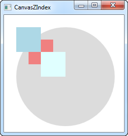
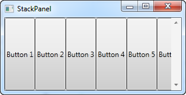
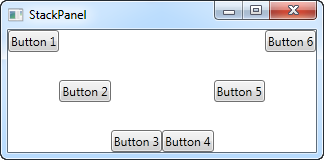
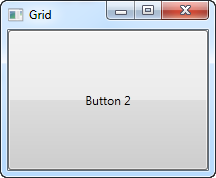
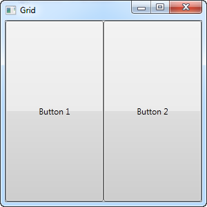
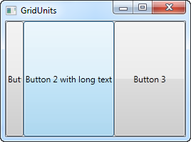
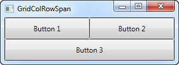
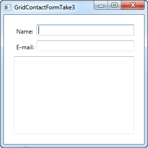

# Layout management (!)

## Inleiding tot WPF Panel

Panel behoort tot de belangrijkste controls van WPF. Een Panel gedraagt zich als een container voor andere controls en regelt de layout van je vensters. Aangezien een venster slechts een enkel (1) onderliggende control kan bevatten, wordt een panel vaak gebruikt op de beschikbare ruimte op te delen in gebieden, waarbij elk gebied een control of een ander panel kan bevatten (een panel is namelijk ook een control).

Panels bestaan er in verschillende soorten met elk hun eigen specifiek layout-gedrag. Het juiste panel kiezen is met andere woorden essentieel wanneer je een bepaald gedrag en een bepaalde layout wenst te realiseren. Vooral wanneer je WPF begint te gebruiken, kan dit wat moeilijker zijn. We bespreken hieronder de verschillende panels en geven je een paar tips mee in welke gevallen je ze best gebruikt.

- **Canvas**: een eenvoudig panel dat sterk doet denken aan hoe WinForms de problematiek benadert. Canvas laat toe specifieke coordinaten toe te kennen aan de onderliggende controls, zodat je alles volledig onder controle hebt. Dit is echter niet bijzonder flexibel, aangezien je de onderliggende controls zelf correct manueel moet (ver-)plaatsen en alligneren wanneer de hogerliggende control van omvang wijzigt. Gebruik Canvas met andere woorden alleen als je volledige controle wenst over de plaatsing van alle onderliggende controls.

- **WrapPanel**: WrapPanel plaatst onderliggende controls naast elkaar, horizontaal (standaard) of verticaal, tot er geen plaats meer is; vervolgens plaatst het de overblijvende onderliggende controls op de volgende lijn. Gebruik WrapPanel wanneer je je controls horizontaal of verticaal wenst op te lijsten tot er geen plaats meer is en je wenst dat de overblijvende controls automatisch opnieuw in een rij/kolom geplaatst worden.

- **StackPanel**: StackPanel wordt redelijk veel gebruikt en gedraagt zich tot op zekere hoogte als WrapPanel, maar in plaats van overblijvende controls op een nieuwe rij of kolom te plaatsen, groeit StackPanel automatisch mee.

- **DockPanel**: DockPanel laat toe onderliggende controls bovenaan, onderaan, links of rechts te "docken". Standaard wordt de laatste control gebruikt om de overblijvende plaats volledig op te vullen indien geen specifieke dockingpositie opgegeven is. Je kan hetzelfde bereiken met Grid, maar in eenvoudigere situaties is DockPanel eenvoudiger te gebruiken.

- **Grid**: Grid is misschien het meest complexe panel type, maar tegelijk ook het meest gebruikte. Een Grid kan meerdere rijen en kolommen bevatten. Je definieert een hoogte voor elke rij en een breedte voor elke kolom. De hoogte/breedte kan opgegeven worden in een absoluut aantal pixels, een percentage van de beschikbare ruimte of als "auto" waarbij de rij of kolom zich aanpast aan de hoogste/breedste onderliggende control. Gebruik Grid wanneer de andere panel types niet toelaten om de layout en het gedrag te implementeren dat je wenst te realiseren, bijvoorbeeld wanneer je behoefte hebt aan meerdere kolommen. Grid is ook interessant wanneer je meerdere types panel wenst te combineren.

- **UniformGrid**: UniformGrid gedraagt zich als Grid, met een belangrijk verschil: alle rijen en kolommen zullen dezelfde omvang hebben. Gebruik UniformGrid wanneer je Grid-gedrag wenst zonder dat je er nood aan hebt om de rijen en kolommen een specifiek andere omvang in hoogte of breedte mee te geven.

We laten hier enkel de belangrijkste layout middelen aan bod komen: Canvas, StackPanel, Grid. WrapPanel werkt vrij analoog aan StackPanel en UniformGrid vrij analoog aan Grid. Voor alle geldt dat je de details kan opzoeken.

## Canvas

Canvas is hoogstwaarschijnlijk het eenvoudigste type Panel: het doet niet echt iets standaard. Je kan er enkel controls in plaatsen en zelf positioneren met behulp van expliciete coordinaten. Canvas doet echter niets voor jou wanneer je je venster groter of kleiner maakt.

We starten met een heel eenvoudig voorbeeld dat vooral wil laten zien hoe weinig Canvas standaard voor je doet:

```csharp
<Window x:Class="WpfTutorialSamples.Panels.Canvas"
        xmlns="http://schemas.microsoft.com/winfx/2006/xaml/presentation"
        xmlns:x="http://schemas.microsoft.com/winfx/2006/xaml"
        Title="Canvas" Height="200" Width="200">
	<Canvas>
		<Button>Button 1</Button>
		<Button>Button 2</Button>
	</Canvas>
</Window>
```

**Een eenvoudig Canvas**

Zoals je ziet, we hebben twee knoppen en beide staan op exact dezelfde plaats, dus enkel de laatste knop is zichtbaar. Canvas doet absoluut niets: je moet zelf coordinaten geven aan de onderliggende controls! Dit kan je doen door met Canvas properties Left, Right, Top and Bottom. Deze laten je toe de positie te specificeren relatief ten opzichte van de vier hoeken van Canvas. Standaard zijn deze properties alle gezet op NaN (Not a Number), zodat Canvas de onderliggende controls plaatst in de bovenlinkerhoek. Je kan dit eenvoudig veranderen:

```csharp
<Window x:Class="WpfTutorialSamples.Panels.Canvas"
        xmlns="http://schemas.microsoft.com/winfx/2006/xaml/presentation"
        xmlns:x="http://schemas.microsoft.com/winfx/2006/xaml"
        Title="Canvas" Height="200" Width="200">
	<Canvas>
		<Button Canvas.Left="10">Top left</Button>
		<Button Canvas.Right="10">Top right</Button>
		<Button Canvas.Left="10" Canvas.Bottom="10">Bottom left</Button>
		<Button Canvas.Right="10" Canvas.Bottom="10">Bottom right</Button>
	</Canvas>
</Window>
```
 

**Een eenvoudig Canvas met de onderliggende controls expliciet geplaatst**

Merk op dat we enkel de property of properties specificeren die we werkelijk nodig hebben.

In normale gevallen zal je een Top OF Bottom waarde en/of een Left OF Right waarde specificeren.

Zoals we reeds aanhaalden, biedt Canvas je volledige controle over positionering. Het maakt hierbij niet uit of er genoeg plaats voor je onderliggende controls is of niet - desnoods overlappen deze elkaar. Dit maakt Canvas een slechte keuze voor het maken van een dialoogvenster, maar, zoals de naam Canvas laat vermoeden, dit is wel perfect wanneer je wenst te tekenen (Painting). WPF heeft een heleboel controls die je op een Canvas kan plaatsen om mooie illustraties te maken.

 


### Z-Index

In het volgende voorbeeld gebruiken we een aantal vormgerelateerde controls van WPF om een belangrijk aspect van onder andere Canvas te tonen: de zogenaamde Z-Index. Indien twee of meer controls op een Canvas elkaar overlappen, dan wordt degene met de laatste markup bovenaan getoond (neemt voorrang). Door property ZIndex van de Panel class te specificeren, kan dit eenvoudig gewijzigd worden.

Om te beginnen een voorbeeld zonder ZIndex property:

```csharp
<Window x:Class="WpfTutorialSamples.Panels.CanvasZIndex"
        xmlns="http://schemas.microsoft.com/winfx/2006/xaml/presentation"
        xmlns:x="http://schemas.microsoft.com/winfx/2006/xaml"
        Title="CanvasZIndex" Height="275" Width="260">
    <Canvas>
        <Ellipse Fill="Gainsboro" Canvas.Left="25" Canvas.Top="25" Width="200" Height="200" />
        <Rectangle Fill="LightBlue" Canvas.Left="25" Canvas.Top="25" Width="50" Height="50" />
        <Rectangle Fill="LightCoral" Canvas.Left="50" Canvas.Top="50" Width="50" Height="50" />
        <Rectangle Fill="LightCyan" Canvas.Left="75" Canvas.Top="75" Width="50" Height="50" />
    </Canvas>
</Window>
```

 

**Een Canvas met overlappende controls zonder ZIndex property**

Merk op dat de rechthoeken, die na de cirkel gedefinieerd zijn, de cirkel overlappen. We veranderen dit nu:

```csharp
<Window x:Class="WpfTutorialSamples.Panels.CanvasZIndex"
        xmlns="http://schemas.microsoft.com/winfx/2006/xaml/presentation"
        xmlns:x="http://schemas.microsoft.com/winfx/2006/xaml"
        Title="CanvasZIndex" Height="275" Width="260">
    <Canvas>
        <Ellipse Panel.ZIndex="2" Fill="Gainsboro" Canvas.Left="25" Canvas.Top="25" Width="200" Height="200" />
        <Rectangle Panel.ZIndex="3" Fill="LightBlue" Canvas.Left="25" Canvas.Top="25" Width="50" Height="50" />
        <Rectangle Panel.ZIndex="2" Fill="LightCoral" Canvas.Left="50" Canvas.Top="50" Width="50" Height="50" />
        <Rectangle Panel.ZIndex="4" Fill="LightCyan" Canvas.Left="75" Canvas.Top="75" Width="50" Height="50" />
    </Canvas>
</Window>
```

 

**Een Canvas met ovelrappende elementen, maar met ZIndex property**

De standaardwaarde voor ZIndex is 0, maar we kunnen een specifieke ZIndex waarde toekennen aan elke vorm. een element met hogere z-index waarde overlapt een element met een lagere waarde. Indien twee z-index waarden gelijk zijn, "wint" het laatst gedefinieerde element. Zoals je ziet, verandert de ZIndex property het uitzicht:

## StackPanel

StackPanel gelijkt sterk op WrapPanel met belangrijk verschil: StackPanel "wrapt" de inhoud niet. Integendeel, StackPanel spreidt uit in een bepaalde richting. We starten met een eenvoudig voorbeeld:

```csharp
<Window x:Class="WpfTutorialSamples.Panels.StackPanel"
        xmlns="http://schemas.microsoft.com/winfx/2006/xaml/presentation"
        xmlns:x="http://schemas.microsoft.com/winfx/2006/xaml"
        Title="StackPanel" Height="160" Width="300">
	<StackPanel>
		<Button>Button 1</Button>
		<Button>Button 2</Button>
		<Button>Button 3</Button>
		<Button>Button 4</Button>
		<Button>Button 5</Button>
		<Button>Button 6</Button>
	</StackPanel>
</Window>
```


**Een eenvoudige StackPanel in Vertical mode**

Het eerste dat opvalt, is dat StackPanel geen rekening houdt met het al dan niet beschikbaar zijn van voldoende ruimte voor de inhoud. Uit zichzelf voegt StackPanel geen scroll-mogelijkheid toe (je kan echter wel zelf een ScrollViewer control introduceren).

Je merkt misschien ook op dat de standaardmode van StackPanel "Vertical" is in tegenstelling tot WrapPanel, waarbij de standaardorientatie "Horizontal" is. Je kan dit echter voor beide controls eenvoudig wijzigen door property Orientation te specificeren:

```csharp
<StackPanel Orientation="Horizontal">
```

 

**Een eenvoudige StackPanel in Horizontal mode**

Een StackPanel verbreedt de onderliggende control automatisch. Met orientatie "Vertical" worden alle onderliggende controls horizontaal uitgebreid en bij orientatie "Horizontal" gebeurt dit verticaal. StackPanel doet dit door properties HorizontalAlignment en VertialAlignment op "Stretch" te zetten, maar je kan dit wijzigen indien je dat wenst. Een voorbeeld: 

```csharp
<Window x:Class="WpfTutorialSamples.Panels.StackPanel"
        xmlns="http://schemas.microsoft.com/winfx/2006/xaml/presentation"
        xmlns:x="http://schemas.microsoft.com/winfx/2006/xaml"
        Title="StackPanel" Height="160" Width="300">
	<StackPanel Orientation="Horizontal">
		<Button VerticalAlignment="Top">Button 1</Button>
		<Button VerticalAlignment="Center">Button 2</Button>
		<Button VerticalAlignment="Bottom">Button 3</Button>
		<Button VerticalAlignment="Bottom">Button 4</Button>
		<Button VerticalAlignment="Center">Button 5</Button>
		<Button VerticalAlignment="Top">Button 6</Button>
	</StackPanel>
</Window>
```

 

**Een StackPanel in Vertical mode met de controls verschillend gelijnd**

We gebruiken Top, Center en Bottom om de knoppen in een mooi patroon te plaatsen. Hetzelfde kan uiteraard toegepast worden op een StackPanel dat verticaal georienteerd is (gebruik in dit gevalHorizontalAlignment):

```csharp
<Window x:Class="WpfTutorialSamples.Panels.StackPanel"
        xmlns="http://schemas.microsoft.com/winfx/2006/xaml/presentation"
        xmlns:x="http://schemas.microsoft.com/winfx/2006/xaml"
        Title="StackPanel" Height="160" Width="300">
	<StackPanel Orientation="Vertical">
		<Button HorizontalAlignment="Left">Button 1</Button>
		<Button HorizontalAlignment="Center">Button 2</Button>
		<Button HorizontalAlignment="Right">Button 3</Button>
		<Button HorizontalAlignment="Right">Button 4</Button>
		<Button HorizontalAlignment="Center">Button 5</Button>
		<Button HorizontalAlignment="Left">Button 6</Button>
	</StackPanel>
</Window>
```
 

**Een StackPanel in Horizontal mode met de controls verschillend gelijnd**

Zoals je kan zien, zijn de controls nog steeds georganiseerd van boven naar beneden, maar in plaats van alle dezelfde breedte te hebben, zijn de controls links, rechts of centraal geplaatst.

## Grid

### Inleiding

De Grid is waarschijnlijk een van het meest complexe type panelen. Een Grid can bestaan uit verschillende rijen en kolommen. Je defineert een hoogte voor elke rij en een breedte voor elke kolom, in ofwel een absolute waarde van pixels, of in een percentage van de beschikbare ruimte of als auto, waar de rij of kolom zich automatish zal aanpassen in grote afhankelijk van de inhoud. Gebruik de Grid wanneer de andere panelen hun functie niet goed uitvoeren, e.g. wanneer je meerdere kolommen nodig heb en vaak in combinatie met andere panelen.

In de meest basis vorm, zal de Grid alle controls nemen die je erin stopt, rek het om zo veel mogelijk beschikbare ruimte te gebruiken en plaats het bovenop elkaar.

```csharp
<Window x:Class="WpfTutorialSamples.Panels.Grid"
        xmlns="http://schemas.microsoft.com/winfx/2006/xaml/presentation"
        xmlns:x="http://schemas.microsoft.com/winfx/2006/xaml"
        Title="Grid" Height="300" Width="300">
    <Grid>
		<Button>Button 1</Button>
		<Button>Button 2</Button>
	</Grid>
</Window>
```

 

**A simple Grid**

Zoals je kan zien, de laatste control krijgt de voorste positie, dat hier betekent dat je zelfs de eerste knop niet kan zien. Niet erg handig voor de meeste situaties, dus gaan we proberen de ruimte in stukken op te delen, waar de Grid zo goed in is. We doen dat door het gebruik van ColumnDefinitions en RowDefinitions. In het eerste voorbeeld houden we het bij kolommen.

```csharp
<Window x:Class="WpfTutorialSamples.Panels.Grid"
        xmlns="http://schemas.microsoft.com/winfx/2006/xaml/presentation"
        xmlns:x="http://schemas.microsoft.com/winfx/2006/xaml"
        Title="Grid" Height="300" Width="300">
    <Grid>
		<Grid.ColumnDefinitions>
			<ColumnDefinition Width="*" />
			<ColumnDefinition Width="*" />
		</Grid.ColumnDefinitions>
		<Button>Button 1</Button>
		<Button Grid.Column="1">Button 2</Button>
	</Grid>
</Window>
```

 

**Een Grid verdeeld in twee kolommen**

In dit voorbeeld, hebben we simpel de beschikbare ruimte verdeeld in twee kolommen, waardoor ze de ruimte evenveel zullen delen, met het gebruik van een "star width" (dit zal later uitgelegd worden). Op de tweede knop, gebruik ik een zogenoemde Attached eigenschap om de knop te plaatsen in de tweede kolom (0 is de eerste kolom, 1 is de tweede enzovoort). We gebruikten deze eigenschap ook bij de eerste knop, maar dat wordt automatisch toegewezen aan de eerste kolom en de eerste rij, wat precies is wat we hier willen.

Zoals jullie kunnen zien nemen de controls alle beschikbare ruimte in, dat is het standaard gedrag wanneer de Grid zijn child control rangschikt. Het doet dit aan de hand van de HorizontalAlignment en VerticalAlignment op zijn child controls om te rekken.
In sommige situaties wil je misschien dat ze enkel de ruimte innemen die ze nodig hebben en/of beheren hoe ze geplaatst zijn in de Grid. De eenvoudigste manier om dit te doen is door de HorizontalAlignment en VerticalAlignment rechtstreeks op de controls te zetten die je wilt manipuleren. Here's is een aangepaste versie van het bovenstaande voorbeeld:

```csharp
<Window x:Class="WpfTutorialSamples.Panels.Grid"
        xmlns="http://schemas.microsoft.com/winfx/2006/xaml/presentation"
        xmlns:x="http://schemas.microsoft.com/winfx/2006/xaml"
        Title="Grid" Height="300" Width="300">
    <Grid>
		<Grid.ColumnDefinitions>
			<ColumnDefinition Width="*" />
			<ColumnDefinition Width="*" />
		</Grid.ColumnDefinitions>		
		<Button VerticalAlignment="Top" HorizontalAlignment="Center">Button 1</Button>
		<Button Grid.Column="1" VerticalAlignment="Center" HorizontalAlignment="Right">Button 2</Button>
	</Grid>
</Window>
```

 

**een Grid verdeeld in twee kolommen met specifieke alignment**

Zoals je kan zien van de resulterende screenshot is de eerste knop nu helemaal boven en centraal geplaatst. De tweede knop is nu in het midden geplaatst en recht uitgelijnd.

### Rijen en kolommen

We tonen enkele geavanceerde layouts op basis van Grid waaruit de kracht van deze layout duidelijker blijkt. Laat ons eerst meer kolommen en rijen introduceren om een echt tabulair resultaat op te bouwen:

```csharp
<Window x:Class="WpfTutorialSamples.Panels.TabularGrid"
        xmlns="http://schemas.microsoft.com/winfx/2006/xaml/presentation"
        xmlns:x="http://schemas.microsoft.com/winfx/2006/xaml"
        Title="TabularGrid" Height="300" Width="300">
    <Grid>
		<Grid.ColumnDefinitions>
			<ColumnDefinition Width="2*" />
			<ColumnDefinition Width="1*" />
			<ColumnDefinition Width="1*" />
		</Grid.ColumnDefinitions>
		<Grid.RowDefinitions>
			<RowDefinition Height="2*" />
			<RowDefinition Height="1*" />
			<RowDefinition Height="1*" />
		</Grid.RowDefinitions>
		<Button>Button 1</Button>
		<Button Grid.Column="1">Button 2</Button>
		<Button Grid.Column="2">Button 3</Button>
		<Button Grid.Row="1">Button 4</Button>
		<Button Grid.Column="1" Grid.Row="1">Button 5</Button>
		<Button Grid.Column="2" Grid.Row="1">Button 6</Button>
		<Button Grid.Row="2">Button 7</Button>
		<Button Grid.Column="1" Grid.Row="2">Button 8</Button>
		<Button Grid.Column="2" Grid.Row="2">Button 9</Button>
	</Grid>
</Window>
```

 

**Een grid met verschillende kolommen en rijen (tabel)**

We zien in totaal 9 knoppen, verdeeld over 3 rijen en 3 kolommen. We gebruiken opnieuw een zogenaamde "ster-gebaseerde" breedte, maar kennen ook een nummer toe. 2* betekent dat voor de breedte twee keer de breedte van 1* gebruikt wordt (of gewoon ster zonder 1, want dat is hetzelfde als 1*).

Merk ook op dat we de properties Grid.Row en Grid.Column gebruiken om de knoppen toe te wijzen aan cellen. Deze properties moeten niet gespecificeerd worden voor de eerste rij en de eerste kolom, wel voor alle andere.

### Units
Tot nu toe gebruikten we "ster"- breedte/hoogte, wat betekent dat de rij of kolom een bepaald percentage van de gecombineerde ruimte opneemt. Je kan echter ook nog absolute eenheden opgeven of "Auto". Laat ons een Grid aanmaken waarin we deze mogelijkheden mengen:

```csharp
<Window x:Class="WpfTutorialSamples.Panels.GridUnits"
        xmlns="http://schemas.microsoft.com/winfx/2006/xaml/presentation"
        xmlns:x="http://schemas.microsoft.com/winfx/2006/xaml"
        Title="GridUnits" Height="200" Width="400">
	<Grid>
		<Grid.ColumnDefinitions>
			<ColumnDefinition Width="1*" />
			<ColumnDefinition Width="Auto" />
			<ColumnDefinition Width="100" />
		</Grid.ColumnDefinitions>
		<Button>Button 1</Button>
		<Button Grid.Column="1">Button 2 with long text</Button>
		<Button Grid.Column="2">Button 3</Button>
	</Grid>
</Window>
```

 

**Een Grid waarbij de kolommen varieren in breedte**

In dit voorbeeld heeft de eerste knop een "ster"-breedte, de tweede een "Auto"-breedte en de laatste een statische breedte van 100 pixels.

Het resultaat zie je in het screenshot: de tweede knop neemt exact de ruimte in die er nodig is, de derde neemt precies 100 pixels en de eerste neemt al de rest. 

Indien een of meer kolommen (of rijen) een variabele (ster-)breedte hebben, verdelen deze onderling de breedte/hoogte die nog niet gebruikt werd door kolommen (of rijen) met een absolute waarde of "Auto". Dit wordt veel duidelijker wanneer we het venster van omvang vergroten of verkleinen:

 


De variabele kolommen (of rijen) groeien of krimpen, de andere blijven even groot.

## Spanning

Standaard Grid gedrag houdt in dat een control slechts een enkele cel in beslag neemt, maar je kan specificeren dat een control meer kolommen of rijen mag betrekken. Dit is mogelijk met "Attached" properties ColumnSpan en RowSpan.

Een eenvoudig voorbeeld waarbij we ColumnSpan gebruiken:

```csharp
<Window x:Class="WpfTutorialSamples.Panels.GridColRowSpan"
        xmlns="http://schemas.microsoft.com/winfx/2006/xaml/presentation"
        xmlns:x="http://schemas.microsoft.com/winfx/2006/xaml"
        Title="GridColRowSpan" Height="110" Width="300">
	<Grid>
		<Grid.ColumnDefinitions>			
			<ColumnDefinition Width="1*" />
			<ColumnDefinition Width="1*" />
		</Grid.ColumnDefinitions>
		<Grid.RowDefinitions>
			<RowDefinition Height="*" />
			<RowDefinition Height="*" />
		</Grid.RowDefinitions>
		<Button>Button 1</Button>
		<Button Grid.Column="1">Button 2</Button>
		<Button Grid.Row="1" Grid.ColumnSpan="2">Button 3</Button>
	</Grid>
</Window>
```

 

**Een Grid met column spanning toegepast op een van de controls**

We definieren twee kolommen en twee rijen die de beschikbare ruimte evenwichtig verdelen onder elkaar. De derde knop neemt twee kolommen in beslag. We zouden ook een combinatie van panels gebruikt kunnen hebben om dit effect te bereiken, maar in meer ingewikkelde gevallen is ColumnSpan echt wel nuttig. We tonen een beter voorbeeld:

```csharp
<Window x:Class="WpfTutorialSamples.Panels.GridColRowSpanAdvanced"
        xmlns="http://schemas.microsoft.com/winfx/2006/xaml/presentation"
        xmlns:x="http://schemas.microsoft.com/winfx/2006/xaml"
        Title="GridColRowSpanAdvanced" Height="300" Width="300">
    <Grid>
		<Grid.ColumnDefinitions>
			<ColumnDefinition Width="*" />
			<ColumnDefinition Width="*" />
			<ColumnDefinition Width="*" />
		</Grid.ColumnDefinitions>
		<Grid.RowDefinitions>
			<RowDefinition Height="*" />
			<RowDefinition Height="*" />
			<RowDefinition Height="*" />
		</Grid.RowDefinitions>
		<Button Grid.ColumnSpan="2">Button 1</Button>
		<Button Grid.Column="3">Button 2</Button>
		<Button Grid.Row="1">Button 3</Button>
		<Button Grid.Column="1" Grid.Row="1" Grid.RowSpan="2" Grid.ColumnSpan="2">Button 4</Button>
		<Button Grid.Column="0" Grid.Row="2">Button 5</Button>
	</Grid>
</Window>
```

 

**Een Grid met kolom- en rij-"spanning" toegepast op meer controls**

Zoals je ziet kunnen we een control zowel meer kolommen als meer rijen laten bezetten.

### Grid voorbeeld: contactformulier
We passen wat we leerden, toe op een concreter voorbeeld: een contactformulier. Wat we hier doen, zal je vaak kunnen toepassen op de dialogen die je maakt.

We starten eenvoudig en tonen een basisversie van het contactformulier. Dit formulier gebruikt 3 rijen, 2 met "Auto"-hoogte en de laatste met "ster"-hoogte, zodat deze de rest van de ruimte inneemt:

```csharp
<Window x:Class="WpfTutorialSamples.Panels.GridContactForm"
        xmlns="http://schemas.microsoft.com/winfx/2006/xaml/presentation"
        xmlns:x="http://schemas.microsoft.com/winfx/2006/xaml"
        Title="GridContactForm" Height="300" Width="300">
    <Grid>
		<Grid.RowDefinitions>
			<RowDefinition Height="Auto" />
			<RowDefinition Height="Auto" />
			<RowDefinition Height="*" />
		</Grid.RowDefinitions>		
		<TextBox>Name</TextBox>
		<TextBox Grid.Row="1">E-mail</TextBox>
		<TextBox Grid.Row="2" AcceptsReturn="True">Comment</TextBox>		
	</Grid>
</Window>
```

 

**Een contactformulier, versie 1**

Zoals je kan zien, neemt de laatste TextBox de rest van de ruimte in, terwijl de eerste twee enkel de ruimte innemen die ze nodig hebben. Probeer het venster van grootte te wijzigen en je zal zien dat de TextBox "commentaar" meegroeit.

In volgend eenvoudig voorbeeld zijn er geen labels voorzien om de betekenis van de velden uit te leggen. De verklarende tekst is in de plaats daarvan opgenomen in de velden zelf (normaal doet men dit niet onder Windows). Laat ons het uitzicht en de bruikbaarheid wat verbeteren:

```csharp
<Window x:Class="WpfTutorialSamples.Panels.GridContactFormTake2"
        xmlns="http://schemas.microsoft.com/winfx/2006/xaml/presentation"
        xmlns:x="http://schemas.microsoft.com/winfx/2006/xaml"
        Title="GridContactFormTake2" Height="300" Width="300">
	<Grid Margin="10">
		<Grid.ColumnDefinitions>
			<ColumnDefinition Width="Auto" />
			<ColumnDefinition Width="*" />
		</Grid.ColumnDefinitions>
		<Grid.RowDefinitions>
			<RowDefinition Height="Auto" />
			<RowDefinition Height="Auto" />
			<RowDefinition Height="*" />
		</Grid.RowDefinitions>
		<Label>Name: </Label>
		<TextBox Grid.Column="1" Margin="0,0,0,10" />
		<Label Grid.Row="1">E-mail: </Label>
		<TextBox Grid.Row="1" Grid.Column="1" Margin="0,0,0,10" />
		<Label Grid.Row="2">Comment: </Label>
		<TextBox Grid.Row="2" Grid.Column="1" AcceptsReturn="True" />
	</Grid>
</Window>
```

 

**Contactformulier, versie 2**

Misschien is het commentaarveld redelijk vanzelfsprekend? In dat geval kan je de label weglaten en ColumnSpan gebruiken om meer plaats op te nemen voor de TextBox:

```csharp
<TextBox Grid.ColumnSpan="2" Grid.Row="2" AcceptsReturn="True" />
```

 

**Contactformulier, versie 3**

Zoals je kon zien is Grid een zeer krachtig layout-middel.

