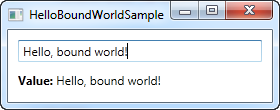
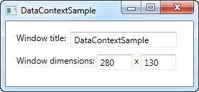

# UserControl

# Data binding (!)

## Inleiding

Data binding is een algemene techniek die twee gegevensvoorstellingen aan elkaar koppelt en de gegevens gesynchroniseerd houdt. Bij WPF heeft Microsoft een zeer belangrijke plaats ingeruimd voor data binding: het is een concept dat je zeker onder de knie moet hebben. Naarmate je er gebruik van leert maken, zal je de mogelijkheden en het gemak ervan leren apprecieren en zien dat coderen er eenvoudiger door wordt. 

Data binding is in WPF de belangrijkste manier om gegevens van code naar je gebruikersinterface te brengen/aan je gebruikersinterface te koppelen. Het is wel degelijk nog mogelijk om een control manueel in code-behind van gegevens te voorzien, maar dit is niet aangeraden, complexer, moeilijker te onderhouden en niet "mooi".

## Hello bound world!

We starten met een heel eenvoudig voorbeeld van data binding:

```csharp
<Window x:Class="WpfTutorialSamples.DataBinding.HelloBoundWorldSample"
        xmlns="http://schemas.microsoft.com/winfx/2006/xaml/presentation"
        xmlns:x="http://schemas.microsoft.com/winfx/2006/xaml"
        Title="HelloBoundWorldSample" Height="110" Width="280">
    <StackPanel Margin="10">
		<TextBox Name="txtValue" />
		<WrapPanel Margin="0,10">
			<TextBlock Text="Value: " FontWeight="Bold" />
			<TextBlock Text="{Binding Path=Text, ElementName=txtValue}" />
		</WrapPanel>
	</StackPanel>
</Window>
```

 

**Een eenvoudig voorbeeld van data binding tussen controls**

Dit eenvoudige voorbeeld toont hoe we de waarde van TextBlock koppelen aan de Text property van TextBox. Zoals je kan zien in het screenshot wordt TectBlock automatisch aangepast wanneer je tekst ingeeft op de TextBox. Zonder binding zou dit vereisen dat we naar een event luisteren op de TextBox en vervolgens de TextBlock aanpassen telkens wanneer een verandering toekomt - code die nu vervangen wordt door een elegante binding.

### Binding syntax

Alle magie grijpt plaats tussen de accolades (deze representeren wat we in XAML noemen een "Markup Extension"). Voor data binding gebruiken we de Binding extensie die ons toelaat om de binding relatie van de Text property te beschrijven. In de meest eenvoudige vorm ziet een binding er als volgt uit:
```csharp
{Binding}
```

Deze binding geeft heel eenvoudigweg de huidige "data context" terug (zie verder). Dit kan op zich nuttig zijn, maar meestal zullen we een property "binden" aan een andere property. Een dergelijke binding ziet er als volgt uit:

```csharp
{Binding Path=NameOfProperty}
```

Path geeft aan welke property je wenst te binden, maar aangezien "Path=" standaard is, mag je het ook weglaten:

```csharp
{Binding NameOfProperty}
```

Je zal veel voorbeelden zien waarbij "Path=" weggelaten wordt en veel gevallen waarbij dit wel vermeld wordt. De keuze is aan jou. Een binding heeft naast Path vele andere properties, zoals bijvoorbeeld ElementName. Dit laat ons toe direct te binden aan een ander UI element als bron. Elke property van de binding die we specificeren, wordt gescheiden door een komma:

```csharp
{Binding Path=Text, ElementName=txtValue}
```

## DataContext

De DataContext property is de standaardbron van je bindings, tenzij je expliciet een andere bron opgeeft, zoals we bijvoorbeeld deden met de ElementName property. De property DataContext is gedefinieerd op class FrameworkElement waarvan de meeste controls, inclusief WPF Window, overerven. Eenvoudig gesteld laat DataContext je toe een basis voor je bindings te specificeren.
Er is geen standaardbron voor de DataContext property (DataContext is dus null om te beginnen), maar daar DataContext overgeerft wordt doorheen de hierarchie van controls, kan je de DataContext van het Window zetten en deze DataContext vervolgens gebruiken in alle ondereliggende controls. We illustreren dit met een voorbeeld:

```csharp
<Window x:Class="WpfTutorialSamples.DataBinding.DataContextSample"
        xmlns="http://schemas.microsoft.com/winfx/2006/xaml/presentation"
        xmlns:x="http://schemas.microsoft.com/winfx/2006/xaml"
        Title="DataContextSample" Height="130" Width="280">
	<StackPanel Margin="15">
		<WrapPanel>
			<TextBlock Text="Window title:  " />
			<TextBox Text="{Binding Title, UpdateSourceTrigger=PropertyChanged}" Width="150" />
		</WrapPanel>
		<WrapPanel Margin="0,10,0,0">
			<TextBlock Text="Window dimensions: " />
			<TextBox Text="{Binding Width}" Width="50" />
			<TextBlock Text=" x " />
			<TextBox Text="{Binding Height}" Width="50" />
		</WrapPanel>
	</StackPanel>
</Window>
```

```csharp
using System;
using System.Windows;

namespace WpfTutorialSamples.DataBinding
{
	public partial class DataContextSample : Window
	{
		public DataContextSample()
		{
			InitializeComponent();
			this.DataContext = this;
		}
	}
}
```

 

**Verschillende data bindings in de DataContext**

De code-behind van dit voorbeeld heeft slechts een (1) interessante lijn code: na de standaard oproep InitalizeComponent() kennen we "this" toe aan de  DataContext: zo vertellen we Window dat we willen dat het zichzelf als de data context gebruikt.

In de XAML gebruiken we dit om uiteenlopende Window properties zoals Title, Width en Height te binden aan een concrete waarde. Aangezien Window een DataContext heeft die doorgegeven wordt aan alle child controls, moeten we niet bij elke onderliggende control een brond voor de binding opgeven.

Probeer het voorbeeld uit te voeren en verander het venster van omvang - je zal zien dat de veranderingen in omvang onmiddellijk effect hebben op de textboxes. Je kan een andere naam voor de titel opgeven in de eerste textbox, maar je zal zien dat de verandering pas doorgegeven wordt wanneer je de focus verlegt naar een andere control. Hoe dit komt en wat je eraan kan doen, zien we later.

### Samenvatting

De DataContext property laat toe om slechts eenmaal hogerop in de hierarchie van controls de binding context te bepalen: dit is heel handig en bespaart veel codeerwerk en lijnen code. Je kan echter makkelijk de keten doorbreken en zelf op een lager niveau een andere DataContext opgeven.

## Reageren op wijzigingen

Tot nu toe maakten we doorgaans bindings aan tussen UI elementen en bestaande classes, maar in echte applicaties wens je te binden aan je eigen gegevensobjecten. Dit is even eenvoudig, maar je zal snel constateren dat veranderingen aan je gegevens niet automatisch een effect hebben op de UI elementen. Dit vraagt een beetje extra werk dat WPF echter gelukkig redelijk eenvoudig maakt.

### Reageren op wijzingen in de gegevensbron

Er zijn twee situaties waarin je met wijzigingen wenst om te gaan: je brongegevens wijzigen en de UI moet zich aanpassen en omgekeerd, er is een wijziging op UI niveau (bijvoorbeeld de gebruiker geeft een tekst in) en je wenst je bron aangepast te zien. Je kan dit op verschillende manieren realiseren in WPF, maar de twee meest eenvoudige constructies zijn de ObservableCollection en de INotifyPropertyChanged interface.

Het volgende voorbeeld toont aan waarom we deze nodig hebben:

```csharp
<Window x:Class="WpfTutorialSamples.DataBinding.ChangeNotificationSample"
        xmlns="http://schemas.microsoft.com/winfx/2006/xaml/presentation"
        xmlns:x="http://schemas.microsoft.com/winfx/2006/xaml"
        Title="ChangeNotificationSample" Height="150" Width="300">
	<DockPanel Margin="10">
		<StackPanel DockPanel.Dock="Right" Margin="10,0,0,0">
			<Button Name="btnAddUser" Click="btnAddUser_Click">Add user</Button>
			<Button Name="btnChangeUser" Click="btnChangeUser_Click" Margin="0,5">Change user</Button>
			<Button Name="btnDeleteUser" Click="btnDeleteUser_Click">Delete user</Button>
		</StackPanel>
		<ListBox Name="lbUsers" DisplayMemberPath="Name"></ListBox>
	</DockPanel>
</Window>
```

```csharp
using System;
using System.Collections.Generic;
using System.Windows;

namespace WpfTutorialSamples.DataBinding
{
	public partial class ChangeNotificationSample : Window
	{
		private List<User> users = new List<User>();

		public ChangeNotificationSample()
		{
			InitializeComponent();

			users.Add(new User() { Name = "John Doe" });
			users.Add(new User() { Name = "Jane Doe" });

			lbUsers.ItemsSource = users;
		}

		private void btnAddUser_Click(object sender, RoutedEventArgs e)
		{
			users.Add(new User() { Name = "New user" });
		}

		private void btnChangeUser_Click(object sender, RoutedEventArgs e)
		{
			if(lbUsers.SelectedItem != null)
				(lbUsers.SelectedItem as User).Name = "Random Name";
		}

		private void btnDeleteUser_Click(object sender, RoutedEventArgs e)
		{
			if(lbUsers.SelectedItem != null)
				users.Remove(lbUsers.SelectedItem as User);
		}
	}

	public class User
	{
		public string Name { get; set; }
	}
}
```

 

**Geen notificaties van wijzigingen**

Voer dit voorbeeld uit en constateer dat, zelfs al voeg je een element toe aan de lijst of verander je de naam van een gebruiker, er niets verandert aan de UI. Het voorbeeld is redelijk eenvoudig met een User class die de naam van de gebruiker bijhoudt en een ListBox die gebruikers toont samen met enkele knoppen om de lijst en de inhoud van de lijst te manipuleren. De ItemsSource van de lijst is een lijst van een paar gebruikers die we aanmaken in de constructor van het venster. Het probleem is dat geen enkele knop lijkt te werken. Laat ons proberen dit aan te passen in twee eenvoudige stappen.

#### Reflecteer veranderingen in de bronlijst

De eerste stap is maken dat de UI reageert op veranderingen aan de bronlijst (ItemsSource), wat zou moeten gebeuren wanneer we een gebruiker toevoegen of verwijderen. Wat we nodig hebben is een lijst die de UI verwittigt van wijzigingen aan de inhoud. Gelukkig voorziet WPF hierin: een dergelijke lijst noemt ObservableCollection en je kan deze gebruiken als een gewone List<T> met slechts een paar wijzigingen.

In het voorbeeld hieronder vervangen we List<User> door ObservableCollection<User> - meer moet je niet doen: de Add en Delete knop werken plots, maar de "Change name" knop nog niet omdat de verandering plaatsgrijpt op het niveau van het gebonden object en niet op het niveau van de lijst.

#### Reflecteer veranderingen in gegevensobjecten

De tweede stap is onze eigen class User aanpassen zodat deze de INotifyPropertyChanged interface implementeert. Door dit te doen zijn onze User objects in staat om de UI te verwittigen van aanpassingen. Dit is wat omslachtiger dan het inzetten van ObservableCollection<T>, maar nog steeds redelijk eenvoudig wanneer je beseft dat je zo automatisch over updates beschikt.

Het volledig aangepaste voorbeeld:

```csharp
<Window x:Class="WpfTutorialSamples.DataBinding.ChangeNotificationSample"
        xmlns="http://schemas.microsoft.com/winfx/2006/xaml/presentation"
        xmlns:x="http://schemas.microsoft.com/winfx/2006/xaml"
        Title="ChangeNotificationSample" Height="135" Width="300">
	<DockPanel Margin="10">
		<StackPanel DockPanel.Dock="Right" Margin="10,0,0,0">
			<Button Name="btnAddUser" Click="btnAddUser_Click">Add user</Button>
			<Button Name="btnChangeUser" Click="btnChangeUser_Click" Margin="0,5">Change user</Button>
			<Button Name="btnDeleteUser" Click="btnDeleteUser_Click">Delete user</Button>
		</StackPanel>
		<ListBox Name="lbUsers" DisplayMemberPath="Name"></ListBox>
	</DockPanel>
</Window>
```

```csharp
using System;
using System.Collections.Generic;
using System.Windows;
using System.ComponentModel;
using System.Collections.ObjectModel;

namespace WpfTutorialSamples.DataBinding
{
	public partial class ChangeNotificationSample : Window
	{
		private ObservableCollection<User> users = new ObservableCollection<User>();

		public ChangeNotificationSample()
		{
			InitializeComponent();

			users.Add(new User() { Name = "John Doe" });
			users.Add(new User() { Name = "Jane Doe" });

			lbUsers.ItemsSource = users;
		}

		private void btnAddUser_Click(object sender, RoutedEventArgs e)
		{
			users.Add(new User() { Name = "New user" });
		}

		private void btnChangeUser_Click(object sender, RoutedEventArgs e)
		{
			if(lbUsers.SelectedItem != null)
				(lbUsers.SelectedItem as User).Name = "Random Name";
		}

		private void btnDeleteUser_Click(object sender, RoutedEventArgs e)
		{
			if(lbUsers.SelectedItem != null)
				users.Remove(lbUsers.SelectedItem as User);
		}
	}

	public class User : INotifyPropertyChanged
	{
		private string name;
		public string Name {
			get { return this.name; }
			set
			{
				if(this.name != value)
				{
					this.name = value;
					this.NotifyPropertyChanged("Name");
				}
			}
		}

		public event PropertyChangedEventHandler PropertyChanged;

		public void NotifyPropertyChanged(string propName)
		{
			if(this.PropertyChanged != null)
				this.PropertyChanged(this, new PropertyChangedEventArgs(propName));
		}
	}
}
```

 

**Notificaties opvangen**

### INotifyPropertyChanged: Alternatieve notaties

Met een lambda kunnen we dit eenvoudiger maken.

