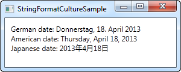

## IValueConverter
Tot nu toe gebruikten we eenvoudige data bindings waarbij de twee betrokken properties (UI en achterliggend gegevenstype) van hetzelfde type waren. In de praktijk komt het echter voor dat je gegevens die van het ene type zijn, moet voorstellen op de UI in een andere vorm van een ander type (of omgekeerd).

### Wanneer een "value converter" gebruiken
Value converters worden vaak gebruikt bij data bindings. Voorbeelden:

- Je hebt een CheckBox die een boolean verwacht maar je hangt af van een string "yes" of "no"
- Je hebt een bestandsgrootte in bytes maar wenst het resultaat op het scherm te tonen in megabytes
- Je wenst een bepaald beeld te tonen afhankelijk van een waarde
- ...

In dergelijke gevallen kan je een value converter gebruiken. Dit is een kleine class die de IValueConverter interface implementeert en ageert als een tussenpartij die de waarde tussen bron en doel aanpast/vertaalt, desnoods in de twee richtingen.

### Een eenvoudige value converter
Een WPF value converter implementeert de interface IValueConverter of in sommige gevallen waar complexere constructies nodig zijn, de IMultiValueConverter interface. Beide interfaces vragen enkel dat je twee methods voorziet: Convert() en ConvertBack(). om de waarde te converteren tussen bron en bestemming en omgekeerd.

Laat ons een eenvoudige converter implementeren die een string als invoer neemt en een boolean teruggeeft en omgekeerd. We geven meer uitleg na de code:
```csharp
<Window x:Class="WpfTutorialSamples.DataBinding.ConverterSample"
    xmlns="http://schemas.microsoft.com/winfx/2006/xaml/presentation"
    xmlns:x="http://schemas.microsoft.com/winfx/2006/xaml"
	xmlns:local="clr-namespace:WpfTutorialSamples.DataBinding"
    Title="ConverterSample" Height="140" Width="250">
  <Window.Resources>
    <local:YesNoToBooleanConverter x:Key="YesNoToBooleanConverter" />
  </Window.Resources>
  <StackPanel Margin="10">
    <TextBox Name="txtValue" />
    <WrapPanel Margin="0,10">
       <TextBlock 
	    Text="Current value is: " />
       <TextBlock 
	    Text="{Binding ElementName=txtValue, Path=Text, Converter={StaticResource YesNoToBooleanConverter}}"/>
	</WrapPanel>
	<CheckBox 
	  IsChecked="{Binding ElementName=txtValue, Path=Text, Converter={StaticResource YesNoToBooleanConverter}}" 
	  Content="Yes" />
  </StackPanel>
</Window>
```

```csharp
using System;
using System.Windows;
using System.Windows.Data;

namespace WpfTutorialSamples.DataBinding
{
	public partial class ConverterSample : Window
	{
		public ConverterSample()
		{
			InitializeComponent();
		}
	}

	public class YesNoToBooleanConverter : IValueConverter
	{
		public object Convert(object value, Type targetType, object parameter, 
		System.Globalization.CultureInfo culture)
		{
			switch(value.ToString().ToLower())
			{
				case "yes":
				case "oui":
					return true;
				case "no":
				case "non":
					return false;
			}
			return false;
		}

		public object ConvertBack(object value, Type targetType, object parameter, 
		System.Globalization.CultureInfo culture)
		{
			if(value is bool)
			{
				if((bool)value == true)
					return "yes";
				else
					return "no";
			}
			return "no";
		}
	}
}
```


**Een IValueConverter**

#### Code-behind

We starten vanuit de code zelf. We implementeerden in de code-behind een YesNoToBooleanConverter. De Convert() method neemt aan dat er een string toekomt als invoer (de value parameter) en converteert deze naar een boolean true of false met een fallback waarde van false. We voegden bovendien de mogelijkheid toe om te converteren op basis van de franse taal.
De ConvertBack() method doet precies het omgekeerde: deze neemt aan dat er een boolean waarde als invoer meegegeven wordt en vertaalt naar de strings "yes" of "no" (fallback "no").
Je kan je afvragen welke parameters de twee methods nog meekrijgen, maar we hebben deze niet nodig in het voorliggende voorbeeld: we zullen deze elders toelichten.

#### XAML

In het XAML gedeelte declareren we een instantie van onze converter als een resource voor het venster. We binden de waarde van de TextBox aan het TextBlock en gebruiken de Converter property en onze eigen converter om de waarden heen en weer te vertalen.
Wanneer je dit voorbeeld uitvoert, zal je de waarde op twee plaatsen kunnen veranderen: ofwel schrijf je "yes" in de TextBox (of een andere waarde indien je false wenst te bekomen) of door de CheckBox aan te vinken. Wat je ook doet, de verandering wordt gereflecteerd in de andere control.

### Ingebouwde converters

WPF biedt reeds een 20-tal converters aan, zodat je ze niet meer zelf moet construeren, zie volgende link voor een overzicht: http://stackoverflow.com/questions/505397/built-in-wpf-ivalueconverters

## StringFormat property

Een value converter kan handig zijn, maar in bepaalde eenvoudige gevallen wensen we gewoon een waarde op een andere manier voor te stellen op UI-niveau en kunnen we gebruik maken van de StringFormat property (bijvoobeeld wanneer de waarde niet terug moet van UI naar je eigen code). Voordelen zijn dat we, ondanks verlies van flexibiliteit, geen nieuwe class moeten implementeren en dat de code leesbaarder is.

De StringFormat property doet precies wat de naam beschrijft: de output string wordt geformateerd, eenvoudigweg door de String.Format method op te roepen op de achtergrond. Een voorbeeld:

```csharp
<Window x:Class="WpfTutorialSamples.DataBinding.StringFormatSample"
        xmlns="http://schemas.microsoft.com/winfx/2006/xaml/presentation"
        xmlns:x="http://schemas.microsoft.com/winfx/2006/xaml"
		xmlns:system="clr-namespace:System;assembly=mscorlib"
        Title="StringFormatSample" Height="150" Width="250"
		Name="wnd">
	<StackPanel Margin="10">
		<TextBlock Text="{Binding ElementName=wnd, Path=ActualWidth, StringFormat=Window width: {0:#,#.0}}" />
		<TextBlock Text="{Binding ElementName=wnd, Path=ActualHeight, StringFormat=Window height: {0:C}}" />
		<TextBlock Text="{Binding Source={x:Static system:DateTime.Now}, StringFormat=Date: {0:dddd, MMMM dd}}" />
		<TextBlock Text="{Binding Source={x:Static system:DateTime.Now}, StringFormat=Time: {0:HH:mm}}" />
	</StackPanel>
</Window>
```

 

**De StringFormat property controleert de presentatie**

De eerste TextBlock's krijgen hun waarden door te binden aan het hogerliggende Window en hiervan breedte en hoogte te gebruiken. Met behulp van de StringFormat property worden de waarden geformateerd. Voor de breedte gebruiken we een geformateerde string en voor de hoogte het currency formaat. De waarde wordt bepaald door het double type en bijgevolg kunnen we dezelfde formaatspecificaties gebruiken als we zouden doen bij double.ToString(). Hier vind je een lijst: http://msdn.microsoft.com/en-us/library/dwhawy9k.aspx.

Merk ook op dat we een eigen tekst kunnen opnemen bij StringFormat - je kan met andere woorden eigen tekst introduceren voor of na de waarde die je toont via binding. We omgeven de eigenlijke waarde waaraan we binden, met accolades, met hierbij twee waarden: een referentie naar de waarde die we wensen te formateren en de format string, gescheiden door een dubbelpunt.
In het geval van de laatste twee waarden binden we aan de huidige datum (DateTime.Now) en stellen deze eerst voor als datum in een specifiek formaat en vervolgens als een tijd (uren en minuten) . Je kan meer lezen over het formateren van DateTime door deze link te volgen: http://msdn.microsoft.com/en-us/library/az4se3k1.aspx.

### Formatting zonder extra text

Let erop dat wanneer je format string geen eigen tekst bevat, je een bijkomende set accolades moet gebruiken, zoniet is WPF verward. Een voorbeeld:

```csharp
<Window x:Class="WpfTutorialSamples.DataBinding.StringFormatSample"
        xmlns="http://schemas.microsoft.com/winfx/2006/xaml/presentation"
        xmlns:x="http://schemas.microsoft.com/winfx/2006/xaml"
		xmlns:system="clr-namespace:System;assembly=mscorlib"
        Title="StringFormatSample" Height="150" Width="250"
		Name="wnd">
	<WrapPanel Margin="10">
		<TextBlock Text="Width: " />
		<TextBlock Text="{Binding ElementName=wnd, Path=ActualWidth, StringFormat={}{0:#,#.0}}" />
	</WrapPanel>
</Window>
```

### Een specifieke Culture gebruiken

Indien je een specifieke culture wenst te gebruiken, dan kan dat. De binding zal de taal gebruiken die ingesteld is voor het hogere niveau, maar je kan op elk moment een eigen culture instellen door gebruik te maken van de ConverterCulture property. Een voorbeeld:

```csharp
<Window x:Class="WpfTutorialSamples.DataBinding.StringFormatCultureSample"
  xmlns="http://schemas.microsoft.com/winfx/2006/xaml/presentation"
  xmlns:x="http://schemas.microsoft.com/winfx/2006/xaml"
  xmlns:system="clr-namespace:System;assembly=mscorlib"
  Title="StringFormatCultureSample" Height="120" Width="300">
  <StackPanel Margin="10">
    <TextBlock 
	Text="{Binding Source={x:Static system:DateTime.Now}, ConverterCulture='de-DE', StringFormat=German date: {0:D}}" />
    <TextBlock 
	Text="{Binding Source={x:Static system:DateTime.Now}, ConverterCulture='en-US', StringFormat=American date: {0:D}}" />
    <TextBlock 
	Text="{Binding Source={x:Static system:DateTime.Now}, ConverterCulture='ja-JP', StringFormat=Japanese date: {0:D}}" />
  </StackPanel>
</Window>
```

 

**Data binding met de StringFormat property en een specifieke ConverterCulture**

We combineren StringFormat met de D specifier (Long date pattern) en de ConverterCulture property.