# Wat is WPF?

WPF (een afkorting van Windows Presentation Foundation) is Microsoft's meest recente uitwerking van een GUI-framework, hoofdzakelijk bedoeld voor desktop-applicaties. Het wordt gebruikt binnen het .NET-framework.

Maar wat is een GUI-framework? GUI staat voor Graphical User Interface, en waarschijnlijk kijk je op dit moment naar een GUI. Windows gebruikt een GUI om je toe te laten met je computer te werken, en de browser waarin je dit waarschijnlijk leest maakt het via een GUI mogelijk om op het web te surfen.

Een GUI-framework laat je toe om een applicatie te maken met een brede waaier aan GUI-elementen, zoals labels, textboxes en andere welbekende elementen. Zonder een GUI-framework zou je al deze elementen handmatig op het scherm moeten tekenen, en al de bijbehorende gebruiksscenario's zoals tekst- of muisinput zelf moeten behandelen. Dat is erg veel werk, dus doen de meeste developers beroep op een GUI-framework dat al de basistaken afhandelt en hen toelaat om zich te focussen op het maken van fantastische applicaties.

Er bestaan een heleboel GUI-frameworks, maar voor .NET-developers behoren WinForms en WPF tot de meest interessante opties. WPF is het nieuwst, maar Microsoft onderhoudt WinForms nog steeds en biedt er nog steeds support voor. Zoals je in het volgende hoofdstuk zult zien zijn er heel wat verschillen tussen de twee, maar hun doelstelling is hetzelfde: ze maken het makkelijk om applicaties te ontwikkelen met een uitstekende GUI.

# WPF versus WinForms

In het vorige hoofdstuk hebben we behandeld wat WPF is en hebben we het kort over WinForms gehad. In dit hoofdstuk doen we een poging om de twee te vergelijken, want hoewel ze hetzelfde doel dienen zijn er ook heel wat verschillen. Als je nog nooit met WinForms hebt gewerkt, en zeker als WPF je allereerste GUI-framework is, dan mag je dit hoofdstuk overslaan, maar als je geinteresseerd bent in de verschillen tussen de twee, lees dan vooral verder.

Het belangrijkste verschil tussen WinForms en WPF is het feit dat WinForms slechts uit een laag bestaat bovenop de standaard Windows-controls (bv. een TextBox), terwijl WPF vanuit het niets is opgebouwd en in bijna alle situaties géén gebruik maakt van standaard Windows-controls. Dit lijkt misschien een subtiel verschil, maar niets is minder waar, en dat is iets dat je zeker zult merken als je ooit hebt gewerkt met een framework dat gebaseerd is op Win32/WinAPI.

Een mooi voorbeeld is dat van een knop met een afbeelding en tekst erop. Dit is geen standaard Windows-besturingselement, waardoor WinForms deze mogelijkheid niet aanbiedt. In plaats daarvan moet de afbeelding zelf aangemaakt worden en een eigen knop gebruikt worden die het gebruik van afbeeldingen ondersteunt of moet men zijn toevlucht nemen tot het gebruik van besturingselementen van derden. In WPF kan een knop van alles bevatten, omdat het in essentie slechts een omlijsting is met inhoud en met verschillende verschijningsvormen (bijv. natief, met de muis erboven zweven, ingedrukt). De WPF knop is zonder opmaak, zoals de meeste andere WPF besturingselementen, wat betekent dat het in staat is een reeks andere besturingselementen in zich op te nemen. U wilt een knop met een afbeelding en wat tekst? Plaats gewoon een Afbeeldings- en Tekstblok-besturingselement in de knop en klaar is Kees! Deze flexibiliteit is onmogelijk met de standaard WinForms besturingselementen, waardoor er een grote vraag is ontstaan naar nogal simpele toepassingen van besturingselementen zoals knoppen met afbeeldingen en dergelijke.

Het nadeel van deze flexibiliteit is dat soms meer werk moet worden verricht om iets te realiseren dat eerder gemakkelijk was in WinForms, omdat het juist voor dit ene scenario standaard was ontwikkeld. Ten minste dat is hoe het aanvoelt in het begin, als er templates moeten worden gemaakt voor een ListView met een afbeelding en wat fijn uitgelijnde tekst, iets wat de WinForms ListViewItem kan met slechts één lijntje code.

Dit was maar één verschil, maar terwijl je met WPF werkt, zul je je realiseren dat dit in feite de onderliggende reden is voor veel van de andere verschillen - WPF doet gewoon dingen op zijn eigen manier, in voor- en tegenspoed. Je bent niet langer gedwongen om dingen op Windows-manier te doen, maar om dit soort flexibiliteit te krijgen betaal je met wat meer werk als je echt op zoek bent naar dingen op de Windows-manier.

Het volgende is een volledig subjectieve lijst van de belangrijkste voordelen voor WPF en WinForms. Het zou je een beter idee moeten geven van waar je naartoe gaat.

## WPF voordelen

- Het is nieuwer en daardoor beter afgestemd op de huidige normen
- Microsoft gebruikt WPF voor veel nieuwe applicaties, zoals Visual Studio
- Het is flexibeler, zodat u meer dingen kunt doen zonder nieuwe besturingselementen te hoeven schrijven of kopen
- Als u echter besturingselementen van derden moet gebruiken, zullen de ontwikkelaars van deze besturingselementen waarschijnlijk meer gericht zijn op WPF omdat deze nieuwer zijn
- XAML maakt het eenvoudig om uw GUI te maken en te bewerken en laat het werk opsplitsen tussen een ontwerper (XAML) en een programmeur (C#, VB .NET enz.)
- Databinding, waarmee u een meer schone scheiding van gegevens en lay-out kunt krijgen
- Gebruikt hardware versnelling voor het tekenen van de GUI voor betere prestaties
- Het stelt je in staat om gebruikersinterfaces te maken voor zowel Windows-toepassingen als web toepassingen (Silverlight / XBAP)

## WinForms voordelen

- Het is ouder en daardoor meer beproefd en getest
- Er zijn al veel controles van derden die u gratis kunt kopen of krijgen
- De ontwerper in Visual Studio is nog steeds, vanaf het schrijven, beter voor WinForms dan voor WPF, waar je zelf nog meer van het werk met WPF moet doen

# Hallo WPF!

Het eerste en klassieke voorbeeld in vrijwel elke programmeerhandleiding is "Hallo, wereld!", maar in deze tutorial doen we lekker gek en veranderen dat in "Hallo, WPF!". Het doel is om dit stukje tekst op het scherm te krijgen, om je te laten zien hoe eenvoudig het is om te beginnen.

De rest van deze handleiding neemt aan dat je een IDE geïnstalleerd hebt, bij voorkeur Visual Studio 2019.

In Visual Studio begint u met het selecteren van Nieuw project in het menu File. Aan de linkerkant, moet u een boom van categorieën. Deze tutorial zal zich richten op C# wanneer er code in het spel is, dus je moet dat selecteren uit de lijst met sjablonen, en aangezien we Windows applicaties gaan maken, moet je Windows selecteren uit de boom. Dit geeft u aan de rechterkant een lijst met mogelijke Windowstoepassingstypen, waar u een WPF-toepassing moet selecteren. We noemden ons project "HelloWPF" in het Name tekstveld. Zorg ervoor dat de overige instellingen in het onderste gedeelte van het dialoogvenster in orde zijn en druk dan op de knop Ok.

Je nieuwe project zal een aantal files hebben, maar voor nu focussen we op slechts eentje: MainWindox.xaml. Dit is de primaire applicatie window, de eerste die getoond word wanneer de applicatie gestart wordt, tenzij je dit specifiek verandert. De XAML code die hierin gevonden kan worden (XAML word in een ander hoofdstuk van deze handleiding besproken) zou er ongeveer zo moeten uitzien:

   ```csharp
<Window x:Class="WpfApplication1.MainWindow"
    xmlns="http://schemas.microsoft.com/winfx/2006/xaml/presentation"
    xmlns:x="http://schemas.microsoft.com/winfx/2006/xaml"
    Title="MainWindow" Height="350" Width="525">
    <Grid>

    </Grid>
</Window>
   ```

Dit is de basis XAML die Visual Studio voor ons venster maakt, alle delen ervan worden uitgelegd in de hoofdstukken over XAML en "Het Venster". Je kunt de toepassing nu daadwerkelijk uitvoeren (selecteer select Debug -> Start debugging of druk op F5) om het lege venster te zien waar onze toepassing momenteel uit bestaat, maar nu is het tijd om onze boodschap op het scherm te krijgen.

We doen het door een TextBlock besturingselement toe te voegen aan het Grid panel, met ons eerder genoemde bericht als inhoud:

   ```csharp
<Window x:Class="WpfApplication1.MainWindow"
    xmlns="http://schemas.microsoft.com/winfx/2006/xaml/presentation"
    xmlns:x="http://schemas.microsoft.com/winfx/2006/xaml"
    Title="MainWindow" Height="350" Width="525">
    <Grid>
        <TextBlock HorizontalAlignment="Center" VerticalAlignment="Center" FontSize="72">
            Hello, WPF!
        </TextBlock>
    </Grid>
</Window>
   ```

Probeer de toepassing nu uit te voeren (selecteer Debug -> Start debugging of druk op F5) en bekijk het prachtige resultaat van je harde werk - je eerste WPF-toepassing:


Je zult zien dat we drie verschillende attributen op het TextBlock hebben gebruikt om een aangepaste uitlijning te krijgen (in het midden van het venster), evenals de eigenschap FontSize om een grotere tekst te krijgen.

# Wat is XAML?

XAML, dat staat voor eXtensible Application Markup Language, is Microsoft's variant van XML voor het beschrijven van een GUI. In eerdere GUI frameworks, zoals WinForms, werd een GUI gemaakt in dezelfde taal die je zou gebruiken voor interactie met de GUI, bijvoorbeeld C# of VB.NET en meestal onderhouden door de ontwerper (bijvoorbeeld Visual Studio), maar met XAML gaat Microsoft een andere kant op. Net als bij HTML kunt u uw GUI eenvoudig schrijven en bewerken.

Dit is niet echt een XAML tutorial, maar we zullen kort toelichten wat de functie en het gebruik van XAML is, omdat het zo'n essentieel onderdeel vormt van het WPF. Of je nu een Venster of een Pagina aanmaakt, het bestaat uit een XAML-document en een CodeBehindbestand, die samen het Venster/Pagina maken. Het XAML-bestand beschrijft de interface met al zijn elementen, terwijl de CodeBehind alle gebeurtenissen afhandelt en toegang heeft om te manipuleren met de XAML-besturingen.

# Basis XAML

In het vorige hoofdstuk hebben we besproken wat XAML is en waar je het voor gebruikt, maar hoe maak je een controle in XAML? Zoals u zult zien in het volgende voorbeeld, is het maken van een controle in XAML net zo eenvoudig als het schrijven van zijn naam, omgeven door haakjes. Zo ziet een knop er bijvoorbeeld zo uit:

   ```csharp
<Button>
   ```

XAML-tags moeten worden beëindigd, hetzij door de eindtag te schrijven, hetzij door een schuine streep naar voren te brengen aan het einde van de starttag:

   ```csharp
<Button></Button>
   ```
of
   ```csharp
<Button />
   ```

Veel controles staan u toe om inhoud tussen de begin en eind tags te plaatsen, die dan de inhoud van de controle is. Met de knopbediening kunt u bijvoorbeeld de tekst die erop wordt weergegeven tussen de begin- en eindtags specificeren:

   ```csharp
<Button>A button</Button>
   ```

HTML is niet hoofdlettergevoelig, maar XAML wel, omdat de stuurnaam moet corresponderen met een type in het .NET-kader. Hetzelfde geldt voor attribuutnamen, die overeenkomen met de eigenschappen van de besturing. Hier is een knop waar we een paar eigenschappen definiëren door attributen toe te voegen aan de tag:

   ```csharp
<Button FontWeight="Bold" Content="A button" />
   ```

We stellen de eigenschap FontWeight in, waardoor we vetgedrukte tekst krijgen, en vervolgens de eigenschap Inhoud, wat hetzelfde is als de tekst tussen de begin- en eindtag schrijven. Alle attributen van een bedieningsorgaan kunnen echter ook als volgt worden gedefinieerd, wanneer ze als kindersleutels van het hoofdorgaan worden weergegeven, met gebruikmaking van de notatie "besturingselement - punt":

   ```csharp
<Button>
    <Button.FontWeight>Bold</Button.FontWeight>
    <Button.Content>A button</Button.Content>
</Button>
   ```

Het resultaat is precies hetzelfde als hierboven, dus in dit geval gaat het om syntaxis en niets anders. Veel controles staan echter andere inhoud dan tekst toe, bijvoorbeeld andere controles. Hier is een voorbeeld waar we tekst in verschillende kleuren op dezelfde knop hebben door verschillende TextBlock-knoppen binnenin de knop te gebruiken

   ```csharp
<Button>
    <Button.FontWeight>Bold</Button.FontWeight>
    <Button.Content>
        <WrapPanel>
            <TextBlock Foreground="Blue">Multi</TextBlock>
            <TextBlock Foreground="Red">Color</TextBlock>
            <TextBlock>Button</TextBlock>
        </WrapPanel>
    </Button.Content>
</Button>
   ```

De Content eigenschap staat slechts één kinderelement toe, dus gebruiken we een WrapPanel om de verschillend gekleurde tekstblokken te bevatten. Panelen, zoals de WrapPanel, spelen een belangrijke rol in het WPF en we zullen ze later nog veel meer in detail bespreken - beschouw ze vooralsnog alleen maar als containers voor andere controles.

Met de volgende opmaak kan exact hetzelfde resultaat worden bereikt, wat gewoon een andere manier is om hetzelfde te schrijven:

   ```csharp
<Button FontWeight="Bold">
    <WrapPanel>
        <TextBlock Foreground="Blue">Multi</TextBlock>
        <TextBlock Foreground="Red">Color</TextBlock>
        <TextBlock>Button</TextBlock>
    </WrapPanel>
</Button>
   ```

# Code vs. XAML

Hopelijk laten de bovenstaande voorbeelden zien dat XAML vrij eenvoudig is om te schrijven, maar met veel verschillende manieren om het te doen, en als je denkt dat het bovenstaande voorbeeld veel opmaak is om een knop te krijgen met tekst in verschillende kleuren, probeer het dan te vergelijken met precies hetzelfde doen in C#:

   ```csharp
Button btn = new Button();
btn.FontWeight = FontWeights.Bold;

WrapPanel pnl = new WrapPanel();

TextBlock txt = new TextBlock();
txt.Text = "Multi";
txt.Foreground = Brushes.Blue;
pnl.Children.Add(txt);

txt = new TextBlock();
txt.Text = "Color";
txt.Foreground = Brushes.Red;
pnl.Children.Add(txt);

txt = new TextBlock();
txt.Text = "Button";
pnl.Children.Add(txt);

btn.Content = pnl;
pnlMain.Children.Add(btn);
   ```

Natuurlijk zou het bovenstaande voorbeeld minder expliciet geschreven kunnen worden en meer syntactische suiker kunnen gebruiken, maar het punt staat nog steeds behoorlijk overeind: XAML is (best) vrij kort en beknopt.

# Events in XAML (!)

De meeste Moderne UI frameworks zijn 'event driven' en dus ook WPF. Alle controls, inclusief  Window, die ook de Control class overerft, stelt een aantal events bloot waarop jij je kan abonneren. Je kan dit doen opdat je applicatie genotificeerd zou worden wanneer het event plaats grijpt zodat jij erop kan reageren.

Er zijn veel verschillende type events, maar sommige van de meest gebruikte reageren op gebruikersinteractie met jou applicatie door middel van muis en keyboard. De meeste controls bevatten events zoals KeyDown, KeyUp, MouseDown, MouseEnter, MouseLeave, MouseUp en andere.

Nu zien we hoe je een control event in XAML kan koppelen aan de code in je 'code-behind' bestand. Bestudeer het volgende voorbeeld:

```csharp
<Window x:Class="WpfTutorialSamples.XAML.EventsSample"
        xmlns="http://schemas.microsoft.com/winfx/2006/xaml/presentation"
        xmlns:x="http://schemas.microsoft.com/winfx/2006/xaml"
        Title="EventsSample" Height="300" Width="300">
	<Grid Name="pnlMainGrid" MouseUp="pnlMainGrid_MouseUp" Background="LightBlue">
    </Grid>
</Window>
```

Zoals je ziet, hebben we ons geabonneerd op het MouseUp event van het Grid met de naam van een methode. Deze methode moet worden gedefinieerd in code-behind, met behulp van de juiste event-signatuur. In dit geval zou het er zo moeten uitzien:

```csharp
private void pnlMainGrid_MouseUp(object sender, MouseButtonEventArgs e)
{
	MessageBox.Show("You clicked me at " + e.GetPosition(this).ToString());
}
```

De MouseUp event gebruikt een delegate genaamd MouseButtonEventHandler, waarop jij je kan abonneren. Het heeft twee parameters, een 'sender' (de control die het event aanroept) en een MouseButtonEventArgs object dat bruikbare informatie bevat; we gebruiken het in het voorbeeld om de positie van de muiscursor te krijgen en weer te geven.

Verschillende events kunnen hetzelfde delegate type gebruiken. Het MouseUp en MouseDown event gebruiken allebei de MouseButtonEventHandler delegate, terwijl MouseMove event de MouseEventHandler delegate gebruikt. Tijdens het definiëren van je event handler methode moet je weten welke delegate het gebruikt en als je dat niet weet, dan kan je dat opzoeken in de documentatie.

Gelukkig kan Visual Studio ons helpen bij het genereren van een correcte event handler voor een event. De makkelijkste manier om dit toe doen, is door simpelweg de eventnaam in XAML te schrijven en de IntelliSense van VS de rest voor je te laten doen:


**Hulp van Visual Studio om een nieuwe event handler te maken**

Als je <New Event Handler> selecteert zal Visual Studio een overeenkomstige event handler genereren in je 'code-behind' bestand. Deze zal <control name>_<event name> genoemd worden, pnlMainGrid_MouseDown in ons geval. Klik met de rechtermuistoets op de event naam en selecteer Navigate to Event Handler en VS zal je er meteen naartoe brengen.

## Abonneren op een event vanuit 'Code-behind'

De meest gangbare manier om je op events te abonneren werd hierboven uitgelegd, maar vaak zal je het abonneren eerder direct vanuit 'code-behind' doen. Dit doe je met behulp van de += C# syntax, waarmee je een event handler direct aan het object toekent. Hier volgt een voorbeeld:

```csharp
using System;
using System.Windows;
using System.Windows.Input;


namespace WpfTutorialSamples.XAML
{
	public partial class EventsSample : Window
	{
		public EventsSample()
		{
			InitializeComponent();
			pnlMainGrid.MouseUp += new MouseButtonEventHandler(pnlMainGrid_MouseUp);
		}

		private void pnlMainGrid_MouseUp(object sender, MouseButtonEventArgs e)
		{
			MessageBox.Show("You clicked me at " + e.GetPosition(this).ToString());
		}

	}
}
```

Weerom moet je weten welke delegate er moet gebruikt worden en weerom kan Visual Studio je daarbij helpen. Als je schrijft:

pnlMainGrid.MouseDown +=

zal Visual Studio je deze hulp bieden:


**Visual Studio die je een nieuwe event handler helpt maken vanuit 'Code-behind'**

Druk simpelweg twee keer op de [Tab] toets om Visual Studio de juiste event handler te laten genereren. Deze komt juist onder de huidige method, klaar om in te vullen. Als je je op die manier op events abonneert, hoef je dit niet in XAML te doen.

# Een WPF applicatie

## Window klasse

Bij het creëren van een WPF applicatie, is het eerste dat je tegenkomt de Window klasse. Deze klasse is de basis voor een venster [window], en bestaat uit een standaard kader, titelbalk en de knoppen voor minimaliseren, maximaliseren en sluiten. Een WPF venster bestaat uit een XAML (*.xaml) bestand, waar het <Window> element het hoofdelement is, en een code-behind (*.cs) bestand. Als je Visual Studio (Express) gebruikt en een nieuwe WPF applicatie maakt, wordt er een standaard venster gegenereerd. Zo ziet dat er ongeveer uit:

```csharp
<Window x:Class="WpfApplication1.Window1"
    xmlns="http://schemas.microsoft.com/winfx/2006/xaml/presentation"
    xmlns:x="http://schemas.microsoft.com/winfx/2006/xaml"
    Title="Window1" Height="300" Width="300">
    <Grid>

    </Grid>
</Window>
```

Het x:class attribuut definieert de klasse voor het XAML bestand, in dit geval Window1, welke Visual Studio ook voor ons heeft gegenereerd. Dit bestand vind je in de bestandsboom van het project in VS, als een subonderdeel van het XAML bestand. Standaard ziet het er ongeveer zo uit:

```csharp
using System;
using System.Windows;
using System.Windows.Controls;
//…more using statements

namespace WpfApplication1
{
    /// <summary>
    /// Interaction logic for Window1.xaml
    /// </summary>
    public partial class Window1 : Window
    {
        public Window1()
        {
            InitializeComponent();
        }
    }
}
```

Zoals je ziet is de Window1 klasse gedefiniëerd als partial, omdat deze tijdens runtime gecombineerd wordt met het XAML bestand om het volledige venster te vormen. De aanroep van InitializeComponent() is hiervoor verantwoordelijk, en daarom vereist om een volledig werkend venster aan de gang te krijgen.

Als we teruggaan naar het XAML bestand, zie je nog een aantal interessante attributen voor het Window element, zoals Title [Titel], waar de titel van het venster wordt gedefinieerd (te zien in de titelbalk) en de Width [Breedte] en Height [Hoogte] van het venster bij het opstarten. Daarnaast worden er een aantal namespaces gedefinieerd; daar komen we later op terug.

Daarnaast zul je zien dat Visual Studio een Grid-element heeft gegenereerd in het Venster. Het Grid is één van de WPF panel-elementen. Hoewel elk panel- of control-element hier had kunnen staan, een Window mag maar één enkel subelement bevatten. Daarom is een panel-element, welke zelf wel meerdere subelementen mag bevatten, meestal de goede keuze. We laten verderop in deze tutorial zien welke verschillende panel-elementen er nog meer zijn en wat de specifieke toepassingen zijn, aangezien dit belangrijke WPF onderdelen zijn.

### Belangrijke eigenschappen van Window

De WPF Window klasse heeft een heleboel interessante attributen die je kan instellen om het uiterlijk en gedrag van je applicatie window te bepalen. Ziehier een korte lijst van de meest interessante attributen:

**Icon** - Dit attribuut laat je toe om het icoontje (pictogram) van een window te definieren. Dit is meestal zichtbaar in de linker bovenhoek, juist voor de titel van het window.

**ResizeMode** - Deze bepaalt of en hoe de eindgebruiker de grootte van je window kan veranderen. De standaardwaarde is CanResize, deze laat de gebruiker toe om het van grootte te veranderen als eender ander window -- door de maximize/minimize knoppen te gebruiken of door de randen te verplaatsen. NoResize is de meest strikte waarde, waarbij de maximize/minimize knoppen verwijderd zijn en de randen niet verplaatst kunnen worden.

**ShowInTaskbar** - De standaardwaarde is 'true', maar als je 'false' invult zal de window niet zichtbaar zijn in de Windows taskbar. Bruikbaar bij niet-primaire windows of bij applicaties die enkel in de tray zichtbaar zijn.

**SizeToContent** - Beslist of het window zichzelf van grootte verandert zodat de inhoud er net in past. De standaardwaarde is 'Manual', dit wil zeggen dat het window niet vanzelf van grootte verandert. Andere mogelijkheden zijn 'Width', 'Height' en 'WidthAndHeight', waarbij de grootte horizontaal, verticaal of beide wordt/worden aangepast.

**Topmost** - De standaardwaarde is 'false', maar als deze of 'true' wordt gezet zal je Window boven andere windows zichtbaar zijn, tenzij het window geminimaliseerd is. Enkel bruikbaar in speciale gevallen.

**WindowStartupLocation** - Bepaalt de initiele positie van het window. De standaardwaarde is 'Manual', dit betekent dat het window initieel naargelang de 'Top' en 'Left' attributen van je window wordt gepositioneerd. Andere opties zijn 'CenterOwner', waarbij het window in het midden van zijn eigenaar-window wordt gepositioneerd. 'CenterScreen' daarentegen zal het window in het midden van het scherm positioneren.

**WindowState** - Bepaalt de initiele toestand van het window. Het kan 'Normal', 'Maximized' of 'Minimized' zijn. De standaardwaarde is 'Normal', dit moet je gebruiken tenzij je wil dat je window van begin af aan maximaal of minimaal wordt weergegeven.

Er zijn echter een heleboel andere attributen, bekijk ze zelf eens om dan vervolgens door te gaan naar het volgende hoofdstuk.

## App.xaml

App.xaml is het declaratief startpunt van jou applicatie. Visual Studio zal het bestand automatisch voor je aanmaken wanneer je start met een nieuwe WPF applicatie, inclusief het achterliggende code bestand met de naam App.xaml.cs. Deze bestanden werken net zo als voor een venster. De twee bestanden werken als partial klassen samen waardoor je zowel in de opmaak (XAML) als in de achterliggende code aanpassing kunt maken.

App.xaml.cs is een extensie van de Application klasse, de centrale klasse in een WPF Windows applicatie. .NET vindt in deze klasse de startinstructies en zal daarna het gewenste venster of de gewenste pagina van hieruit opstarten. Dit is ook de plaats om de applicatie te abonneren op belangrijke applicatie events, zoals applicatie start, onafgehandelde exceptions, etc. Later hierover meer.

Een van de meest gebruikte functies van het bestand App.xaml is het definiëren van de algemene bronnen die vanuit een hele applicatie kunnen worden gebruikt en geopend, bijvoorbeeld global styles. Dit zal later in detail worden besproken.

###  App.xaml structuur

Wanneer een nieuwe applicatie wordt gemaakt, wordt er automatisch een App.xaml bestand gegenereerd die er ongeveer zo uit ziet:

   ```csharp
<Application x:Class="WpfTutorialSamples.App"
             xmlns="http://schemas.microsoft.com/winfx/2006/xaml/presentation"
             xmlns:x="http://schemas.microsoft.com/winfx/2006/xaml"
             StartupUri="MainWindow.xaml">
    <Application.Resources>

    </Application.Resources>
</Application>
   ```

Het belangrijkste punt om hier op te merken is de eigenschap StartupUri. Dit is de eigenschap die aangeeft welk venster of welke pagina moet worden gestart wanneer de applicatie wordt opgestart. In dit geval wordt MainWindow.xaml gestart, maar als u een ander venster als beginpunt wilt gebruiken, kunt u dit eenvoudig wijzigen.

In sommige situaties wilt u meer controle over hoe en wanneer het eerste venster wordt getoond. In dat geval kunt u de StartupUri eigenschap en zijn waarde verwijderen en vervolgens alles in de achterliggende code implementeren. Dit zal hieronder worden aangetoond.

### App.xaml.cs structuur

Het bijbehorende App.xaml.cs bestand zal er ongeveer zo uit zien bij een nieuw project:

   ```csharp
using System;
using System.Collections.Generic;
using System.Windows;

namespace WpfTutorialSamples
{
	public partial class App : Application
	{

	}
}
   ```

U zult zien hoe deze klasse de Applicatie klasse uitbreidt met functionaliteit, waarmee u op applicatieniveau zaken kunt laten uitvoeren. U kunt zich bijvoorbeeld abonneren op het opstart event, en daarop zelf uw startvenster starten.

Hier een voorbeeld:

   ```csharp
<Application x:Class="WpfTutorialSamples.App"
             xmlns="http://schemas.microsoft.com/winfx/2006/xaml/presentation"
             xmlns:x="http://schemas.microsoft.com/winfx/2006/xaml"
			 Startup="Application_Startup">
    <Application.Resources></Application.Resources>
</Application>
   ```

Merk op hoe de eigenschap StartupUri is vervangen door een abonnement op het Startup event (abonneren op gebeurtenissen via XAML wordt uitgelegd in een ander hoofdstuk). In de achterliggende code kunt u het event als volgt gebruiken:

   ```csharp
using System;
using System.Collections.Generic;
using System.Windows;

namespace WpfTutorialSamples
{
	public partial class App : Application
	{

		private void Application_Startup(object sender, StartupEventArgs e)
		{
			// Create the startup window
			MainWindow wnd = new MainWindow();
			// Do stuff here, e.g. to the window
			wnd.Title = "Something else";
			// Show the window
			wnd.Show();
		}
	}
}
   ```

Het leuke van dit voorbeeld, in vergelijking met het gebruik van de propertie StartupUri, is dat we het opstartvenster kunnen veranderen voordat het wordt weergegeven. In dit voorbeeld veranderen we de titel, wat niet erg nuttig is, maar je kunt je ook abonneren op events of misschien een splash-scherm laten zien. Als je alle controle hebt, zijn er veel mogelijkheden. In de volgende artikelen van deze tutorial zullen we dieper ingaan op een aantal van deze mogelijkheden.

## Werken met command line parameters

Command-line parameters is een techniek waarbij een set parameters wordt gegeven aan een applicatie die je start, om deze te beinvloeden. Een veel voorkomend voorbeeld daarvan is een applicatie die een specifiek bestand opent bij het opstarten, zoals gebeurt bij een editor bijvoorbeeld. Je kan dit zelf proberen met de ingebouwde applicatie 'kladblok' van Windows, door het volgende uit te voeren (kies Uitvoeren... uit het Start menu of typ [Windows-toets+R]) :

notepad.exe c:\Windows\win.ini

Hierbij zal Kladblok openen met de win.ini file reeds geopend (eventueel moet je het pad aanpassen zodat het overeenkomt met jouw Windows installatie). Kladblok kijkt gewoon naar een of meerdere parameters, en gebruikt die dan. Jouw applicatie kan hetzelfde doen!

Command-line parameters (de argumenten die je dus doorgeeft via de opdracht prompt) worden aan jouw WPF applicatie doorgegeven via het 'Startup event'. Je kan je abbonneren op dit event in het App.XAML script. We zullen dit doen in dit voorbeeld. Daarna gebruiken we de waarde die werd doorgegeven via de argumenten van de method. Eerst het App.XAML bestand:

   ```csharp
<Application x:Class="WpfTutorialSamples.App"
             xmlns="http://schemas.microsoft.com/winfx/2006/xaml/presentation"
             xmlns:x="http://schemas.microsoft.com/winfx/2006/xaml"
			 Startup="Application_Startup">
    <Application.Resources></Application.Resources>
</Application>
   ```

Het enige wat je hier doet is je abonneren op het Startup event, waarbij je de waarde van StartupUri aanpast. Het event wordt dan geimplementeerd in App.XAML.cs:

   ```csharp
using System;
using System.Collections.Generic;
using System.Windows;

namespace WpfTutorialSamples
{
	public partial class App : Application
	{

		private void Application_Startup(object sender, StartupEventArgs e)
		{
			MainWindow wnd = new MainWindow();
			if(e.Args.Length == 1)
				MessageBox.Show("Now opening file: \n\n" + e.Args[0]);
			wnd.Show();
		}
	}
}
   ```

We gebruiken daarbij de StartupEventArgs. Het argument wordt doorgegeven naar het Applicatie 'Startup event' met naam e. Dit event heeft het attribuut Args, een array van strings. Command-line parameters worden gescheiden via spaties, tenzij de spatie binnenin een string tussen aanhalingstekens voorkomt.

**De command-line parameter testen**

Wanneer je bovenstaand voorbeeld uitvoert zal er niets gebeuren, omdat er geen argumenten werden meegegeven aan de opdracht prompt. Gelukkig maakt Visual Studio het makkelijk om dit met je applicatie te testen. Selecteer "[Project name] properties" van het Project menu. Klik op de Debug tab, daar kan je command-line argumenten opgeven. Het ziet er ongeveer als volgt uit:


**De project settings voor de opdracht prompt.**

Voer je applicatie uit, je zal zien dat deze reageert op jouw argument.

De mededeling die wordt weergegeven in de messagebox is natuurlijk niet erg nuttig. In plaats daarvan zou je het argument kunnen doorgeven aan de constructor van het main window, of je kan het overeenkomstig bestand openen:

   ```csharp
using System;
using System.Collections.Generic;
using System.Windows;

namespace WpfTutorialSamples
{
	public partial class App : Application
	{

		private void Application_Startup(object sender, StartupEventArgs e)
		{
			MainWindow wnd = new MainWindow();
			// The OpenFile() method is just an example of what you could do with the
			// parameter. The method should be declared on your MainWindow class, where
			// you could use a range of methods to process the passed file path
			if(e.Args.Length == 1)
				wnd.OpenFile(e.Args[0]);
			wnd.Show();
		}
	}
}
   ```

### Mogelijkheden van de command line

In dit voorbeeld testen we of er exact een argument is en indien ja, dan gebruiken we het argument als bestandsnaam. In de praktijk kan je meerdere argumenten interpreteren en deze zelfs voor opties gebruiken, bijvoorbeeld om bepaald gedrag van de applicatie aan of uit te schakelen. Dit kan je doen door de lijst af te gaan met behulp van een lus ('for' loop). Op die manier zou je applicatie de informatie kunnen verzamelen die nodig is om verder te gaan. We gaan hier nu niet verder op in.

## Resources (!)

WPF introduceert een erg handig concept: de mogelijkheid om data als resource op te slaan, zij het lokaal voor een control, lokaal voor een compleet window of globaal voor de gehele applicatie. Deze data kunnen zo ongeveer alles zijn wat je wilt, van specifieke informatie tot een hiërarchie van WPF controls. Dit maakt het mogelijk alle data in één plaats onder te brengen en vanaf verschillende andere plaatsen te gebruiken, wat zeer nuttig is.

Dit concept wordt vaak gebruikt voor styles en templates, deze worden later in deze tutorial besproken, maar zoals voorgesteld in dit hoofdstuk, kun je het ook voor vele andere dingen gebruiken. Laat me dit met een eenvoudig voorbeeld demonstreren:

   ```csharp
<Window x:Class="WpfTutorialSamples.WPF_Application.ResourceSample"
        xmlns="http://schemas.microsoft.com/winfx/2006/xaml/presentation"
        xmlns:x="http://schemas.microsoft.com/winfx/2006/xaml"
        xmlns:sys="clr-namespace:System;assembly=mscorlib"
        Title="ResourceSample" Height="150" Width="350">
    <Window.Resources>
        <sys:String x:Key="strHelloWorld">Hello, world!</sys:String>
    </Window.Resources>
    <StackPanel Margin="10">
        <TextBlock Text="{StaticResource strHelloWorld}" FontSize="56" />
        <TextBlock>Just another "<TextBlock Text="{StaticResource strHelloWorld}" />" example, but with resources!</TextBlock>
    </StackPanel>
</Window>
   ```


**Een eenvoudig resource voorbeeld**

Aan resources wordt met behulp van het x:Key attribuut een key (sleutel) toegekend, zo wordt het mogelijk om vanaf andere plaatsen in de applicatie de resource via deze key te referenceren, dit in combinatie met de StaticResource markup extensie. In dit voorbeeld slaan we een eenvoudige string op, deze gebruiken we vervolgens in twee verschillende TextBlock controls.

**StaticResource versus DynamicResource**

In de voorbeelden tot nu toe hebben we de StaticResource markup extensie gebruikt om een resource te referenceren. Er bestaat echter nog een alternatief, dit in de vorm van de DynamicResource.

Het grote verschil bestaat daarin dat een static resource maar één keer opgelost wordt, dit op het tijdstip waar de XAML geladen wordt. Wordt de resource daarna veranderd, dan worden deze veranderingen niet gereflecteerd wanneer StaticResource gebruikt werd.

Een DynamicResource wordt daarentegen opgelost wanneer deze ook echt gebruikt wordt, en vervolgens ook telkens wanneer de resource veranderd wordt. Denk hierbij aan een binding met een statische waarde versus een binding met een functie die de waarde bewaakt en deze zendt elke keer dat deze veranderd wordt - het werkt niet exact zo, maar dit geeft je een beter idee wanneer je wat gebruiken moet. Dynamische resources maken het ook mogelijk resources te gebruiken die zelfs tijdens de design fase nog niet bestaan, wanneer ze b.v. in de code behind tijdens het starten van de applicatie toegevoegd worden.

**Meer resource types**

Het delen van een simpele string was eenvoudig, maar je kunt nog veel meer doen. In het volgende voorbeeld zullen we ook een complete array van strings opslaan, samen met een gradient (kleurverloop) brush, deze wordt voor de achtergrond gebruikt. Dit zou je een goed idee moeten geven wat je met resources kan doen:

   ```csharp
<Window x:Class="WpfTutorialSamples.WPF_Application.ExtendedResourceSample"
        xmlns="http://schemas.microsoft.com/winfx/2006/xaml/presentation"
        xmlns:x="http://schemas.microsoft.com/winfx/2006/xaml"
        xmlns:sys="clr-namespace:System;assembly=mscorlib"
        Title="ExtendedResourceSample" Height="160" Width="300"
        Background="{DynamicResource WindowBackgroundBrush}">
    <Window.Resources>
        <sys:String x:Key="ComboBoxTitle">Items:</sys:String>

        <x:Array x:Key="ComboBoxItems" Type="sys:String">
            <sys:String>Item #1</sys:String>
            <sys:String>Item #2</sys:String>
            <sys:String>Item #3</sys:String>
        </x:Array>

        <LinearGradientBrush x:Key="WindowBackgroundBrush">
            <GradientStop Offset="0" Color="Silver"/>
            <GradientStop Offset="1" Color="Gray"/>
        </LinearGradientBrush>
    </Window.Resources>
    <StackPanel Margin="10">
        <Label Content="{StaticResource ComboBoxTitle}" />
        <ComboBox ItemsSource="{StaticResource ComboBoxItems}" />
    </StackPanel>
</Window>
   ```


**Een ingewikkelder voorbeeld met meerdere resource types**

Deze keer hebben we een aantal extra resources toegevoegd, zodat ons Window nu een simpele string, een array van strings en een LinearGradientBrush bevat. De string wordt gebruikt voor het label, de array van strings wordt gebruikt items voor de ComboBox control en de gradient brush wordt gebruikt als achtergrond voor het gehele window. Op deze manier kan, zoals je kunt zien, zo ongeveer alles opgeslagen worden in een resource.

**Lokale en applicatiewijde resources**

Nu hebben we resources opgeslagen op een windows-level, wat inhoudt dat je ze kan benaderen vanaf elke plek in het window.

Als je alleen een resource voor een specifieke control nodig hebt, kan je het meer lokaal maken door het aan deze specifieke control toe te voegen in plaats van aan het window. Het werkt exact op dezelfde manier, het enig verschil is dat je het nu alleen kan benaderen van binnen de scope van de control waar je het aan toegevoegd hebt.

   ```csharp
<StackPanel Margin="10">
    <StackPanel.Resources>
        <sys:String x:Key="ComboBoxTitle">Items:</sys:String>
    </StackPanel.Resources>
    <Label Content="{StaticResource ComboBoxTitle}" />
</StackPanel>
   ```

In dit geval voegen we de resource to aan het StackPanel en maken dan gebruik van zijn child control, het Label. Andere controls binnen het StackPanel hadden ook gebruikt kunnen worden. Ook de children van deze child controls hebben hier toegang toe. controls buiten dit specifieke StackPanel hebben er echter geen toegang toe.

Wanneer je toegang nodig hebt tot de resource vanuit verschillende windows is dat ook mogelijk. Het App.xaml bestand kan resources net als het window en elk soort WPF control bevatten, en wanneer je ze opslaat in App.xaml, zijn ze globaal toegankelijk in alle windows en user control van het project. Het werkt precies hetzelfde als wanneer je ze opslaat en gebruikt vanuit een Window.

   ```csharp
<Application x:Class="WpfTutorialSamples.App"
             xmlns="http://schemas.microsoft.com/winfx/2006/xaml/presentation"
             xmlns:x="http://schemas.microsoft.com/winfx/2006/xaml"
             xmlns:sys="clr-namespace:System;assembly=mscorlib"
             StartupUri="WPF application/ExtendedResourceSample.xaml">
    <Application.Resources>
        <sys:String x:Key="ComboBoxTitle">Items:</sys:String>
    </Application.Resources>
</Application>
   ```

Gebruik ervan is ook hetzelfde - WPF zal automatisch naar boven gaan in de scope, vanaf de local control naar het window en dan naar App.xaml, om de opgegeven resource te vinden:

<Label Content="{StaticResource ComboBoxTitle}" />

**Resources uit de achtergrondcode (code behind)**

Tot nu toe hebben we al onze resources benaderd direct vanuit XAML, gebruik makend van een markup extension. Niettemin kan je natuurlijk ook gebruik maken van je resource vanuit achtergrondcode (Code-behind), wat nuttig kan zijn in verschillende situaties. In het vorige voorbeeld zagen we hoe we resources in verschillende plekken konden opslaan. Dus in dit voorbeeld zullen we drie verschillende resources vanuit Code-behind gebruiken, elk opgeslagen in een andere scope:

App.xaml:

   ```csharp
<Application x:Class="WpfTutorialSamples.App"
             xmlns="http://schemas.microsoft.com/winfx/2006/xaml/presentation"
             xmlns:x="http://schemas.microsoft.com/winfx/2006/xaml"
             xmlns:sys="clr-namespace:System;assembly=mscorlib"
             StartupUri="WPF application/ResourcesFromCodeBehindSample.xaml">
    <Application.Resources>
        <sys:String x:Key="strApp">Hello, Application world!</sys:String>
    </Application.Resources>
</Application>
   ```

Venster:

   ```csharp
<Window x:Class="WpfTutorialSamples.WPF_Application.ResourcesFromCodeBehindSample"
        xmlns="http://schemas.microsoft.com/winfx/2006/xaml/presentation"
        xmlns:x="http://schemas.microsoft.com/winfx/2006/xaml"
        xmlns:sys="clr-namespace:System;assembly=mscorlib"
        Title="ResourcesFromCodeBehindSample" Height="175" Width="250">
    <Window.Resources>
        <sys:String x:Key="strWindow">Hello, Window world!</sys:String>
    </Window.Resources>
    <DockPanel Margin="10" Name="pnlMain">
        <DockPanel.Resources>
            <sys:String x:Key="strPanel">Hello, Panel world!</sys:String>
        </DockPanel.Resources>

        <WrapPanel DockPanel.Dock="Top" HorizontalAlignment="Center" Margin="10">
            <Button Name="btnClickMe" Click="btnClickMe_Click">Click me!</Button>
        </WrapPanel>

        <ListBox Name="lbResult" />
    </DockPanel>
</Window>
   ```

**Achtergrondcode (code behind)**

```csharp
using System;
using System.Windows;

namespace WpfTutorialSamples.WPF_Application
{
	public partial class ResourcesFromCodeBehindSample : Window
	{
		public ResourcesFromCodeBehindSample()
		{
			InitializeComponent();
		}

		private void btnClickMe_Click(object sender, RoutedEventArgs e)
		{
			lbResult.Items.Add(pnlMain.FindResource("strPanel").ToString());
			lbResult.Items.Add(this.FindResource("strWindow").ToString());
			lbResult.Items.Add(Application.Current.FindResource("strApp").ToString());
		}
	}
}
```


**Resources samengesteld in de achtergrondcode (code behind)**

Zoals je kan zien, slaan we drie verschillende "Hello, world!" boodschappen op: Een in App.xaml, een binnen het window en een lokaal voor het main panel. De interface bestaat uit een button en een ListBox.

In code behind, behandelen we het click event van de button, waarin we elk van de tekst string toevoegen aan de ListBox zoals op het screenshot te zien is. We gebruiken de FindResource methode, welke de resource als een object terug zal geven (wanneer gevonden) en dan zetten we het om naar de string met behulp van de ToString() methode.

Zie hoe we de FindResource() methode gebruiken op verschillende scopes - eerst op het panel dan op het window en dan op het huidige Application object. Het is logisch om te zoeken naar de resource waar we weten dat het is, maar zoals al genoemd, als een resource niet gevonden wordt, zal er hoger in de hiërarchie gezocht worden, dus in principe hadden we de FindResource() methode op het panel uit kunnen voeren in alle drie de gevallen, omdat het doorgegaan zou zijn naar het window en later naar het application niveau wanneer het niet gevonden zou zijn.

Hetzelfde geldt niet andersom - het zoeken gebeurt niet naar beneden in de boom, dus je kan niet beginnen te zoeken naar een resource vanaf application niveau wanneer het lokaal voor de control of window gedefinieerd is.

## Exceptions in WPF (!)

Afhandelen van exceptions is niet nieuw voor jou als je thuis bent in C# programmatie of andere .NET talen die kunnen gebruikt worden met WPF: Wanneer je een stuk code schrijft dat een exception kan veroorzaken, moet je dit inpakken ('wrap') in een try-catch blok om deze exception netjes af te handelen. Beschouw bijvoorbeeld dit stuk code:

```csharp
private void Button_Click(object sender, RoutedEventArgs e)
{
	string s = null;
	s.Trim();
}
```

Dit zal duidelijk misgaan aangezien we de Trim() method aanroepen met een argument dat nul is. Als de exception niet wordt afgehandeld zal de applicatie 'crashen' en Windows zal moeten tussenkomen. Dit gedrag is niet erg gebruiksvriendelijk, zoals je kan zien:


Een exception die niet afgehandeld werd, Windows komt tussen.
In dit geval zou de gebruiker de applicatie moeten sluiten, als gevolg van een makkelijk op te lossen fout. Dus als je weet dat er wat kan misgaan moet je een try-catch block gebruiken:

```csharp
private void Button_Click(object sender, RoutedEventArgs e)
{
	string s = null;
	try
	{
		s.Trim();
	}
	catch(Exception ex)
	{
		MessageBox.Show("A handled exception just occurred: " + ex.Message, 
		"Exception Sample", MessageBoxButton.OK, MessageBoxImage.Warning);
	}
}
```

Nochtans kan zelfs de meest simpele code een exception veroorzaken. In plaats van elke lijn code te voorzien van een try-catch blok, kan WPF je alle niet-afgehandelde exceptions globaal laten afvangen. Dit gebeurt door middel van hetDispatcherUnhandledException event in de Applicatie klasse, waar je applicatie zich kan op abonneren. Zodoende zal WPF de geregistreerde method aanroepen wanneer zich een exception voordoet die niet in je code wordt afgehandeld. Ziehier een volledig voorbeeld gebaseerd op voorgaande uitleg:

```csharp
<Window x:Class="WpfTutorialSamples.WPF_Application.ExceptionHandlingSample"
        xmlns="http://schemas.microsoft.com/winfx/2006/xaml/presentation"
        xmlns:x="http://schemas.microsoft.com/winfx/2006/xaml"
        Title="ExceptionHandlingSample" Height="200" Width="200">
    <Grid>
        <Button HorizontalAlignment="Center" VerticalAlignment="Center" 
		Click="Button_Click">
            Do something bad!
        </Button>
    </Grid>
</Window>
```

```csharp
using System;
using System.Windows;

namespace WpfTutorialSamples.WPF_Application
{
	public partial class ExceptionHandlingSample : Window
	{
		public ExceptionHandlingSample()
		{
			InitializeComponent();
		}

		private void Button_Click(object sender, RoutedEventArgs e)
		{
			string s = null;
			try
			{
				s.Trim();
			}
			catch(Exception ex)
			{
				MessageBox.Show("A handled exception just occurred: " + ex.Message, 
				"Exception Sample", MessageBoxButton.OK, MessageBoxImage.Warning);
			}
			s.Trim();
		}
	}
}
```

Noteer dat de Trim() method een tweede keer werd aangeroepen buiten het try-catch blok, zodat de eerste aanroep netjes afgehandeld werd maar de tweede niet. Voor de tweede aanroep is het volgende App.XAML script nodig:

```csharp
<Application x:Class="WpfTutorialSamples.App"
             xmlns="http://schemas.microsoft.com/winfx/2006/xaml/presentation"
             xmlns:x="http://schemas.microsoft.com/winfx/2006/xaml"
             DispatcherUnhandledException="Application_DispatcherUnhandledException"
             StartupUri="WPF Application/ExceptionHandlingSample.xaml">
    <Application.Resources>
    </Application.Resources>
</Application>
```

```csharp
using System;
using System.Windows;

namespace WpfTutorialSamples
{
	public partial class App : Application
	{
		private void Application_DispatcherUnhandledException(object sender, 
		System.Windows.Threading.DispatcherUnhandledExceptionEventArgs e)
		{
			MessageBox.Show("An unhandled exception just occurred: " 
			+ e.Exception.Message, "Exception Sample", MessageBoxButton.OK, MessageBoxImage.Warning);
			e.Handled = true;
		}
	}
}
```


**Een lokaal afgehandelde exception**


**Een globaal afgehandelde exception**

De exception wordt afgehandeld zoals de lokale exception, maar dan met een afwijkende tekst en symbool in de message box. Noteer ook dat het e.Handled attribuut op true wordt gezet. Dit geeft WPF de informatie dat de exception-afhandeling gebeurd is en er verder niets meer dient te gebeuren.

### Samenvatting

Afhandelen van exceptions maakt een belangrijk deel uit van applicaties en gelukkig maken WPF en .NET het heel gemakkelijk om exceptions zowel lokaal als globaal af te handelen. Je moet exceptions lokaal afhandelen wanneer nuttig en je hoort de globale afhandeling enkel te gebruiken als een vangnet, gezien lokale afhandeling toelaat om het probleem op een meer aangepaste manier aan te pakken.

# WPF Controls

## TextBlock

TextBlock is geen control, omdat het niet erft van de Control klasse, maar het wordt gebruikt zoals elke ander control in het WPF framework. Daarom beschouwen we het als een control om het eenvoudig te houden.

De TextBlock control is één van de meest fundamentele controls in WPF en is erg nuttig. Hij stelt je in staat tekst op het scherm te plaatsen, ongeveer zoals een Label control doet, maar op een eenvoudigere manier, die minder resources nodig heeft. Gebruikelijk is om een Label toe te passen voor korte éénregelige tekst (die bijvoorbeeld wel een Image mag bevatten), terwijl het TextBlock ook goed werkt voor meerdere regels tekst, maar een TextBlock kan alleen tekst bevatten. Zowel het Label als het TextBlock bieden hun eigen unieke voordelen, dus wat je gebruikt hangt erg af van de situatie.

We hebben een TextBlock control al gebruikt in het "Hallo, WPF" artikel, maar voor dit moment, laten we kijken naar het TextBlock in de eenvoudigste vorm:

```csharp
<Window x:Class="WpfTutorialSamples.Basic_controls.TextBlockSample"
        xmlns="http://schemas.microsoft.com/winfx/2006/xaml/presentation"
        xmlns:x="http://schemas.microsoft.com/winfx/2006/xaml"
        Title="TextBlockSample" Height="100" Width="200">
    <Grid>
		<TextBlock>This is a TextBlock</TextBlock>
    </Grid>
</Window>
```

![wpf (media/vs-2019/WPF/textblock_simple.png)

**Een eenvoudige TextBlock control**

Dit is zo eenvoudig als het er uitziet en als je de vorige hoofdstukken van deze tutorial hebt gelezen, is er niets nieuws. De tekst in het TextBlock is eenvoudig een verkorting van de Text eigenschap (of property) van het TextBlock.

Voor het volgende voorbeeld, laten we een langere tekst proberen om te laten zien hoe het TextBlock daarmee om gaat. We voegden een beetje marge toe om het er beter uit te laten zien.

```csharp
<Window x:Class="WpfTutorialSamples.Basic_controls.TextBlockSample"
        xmlns="http://schemas.microsoft.com/winfx/2006/xaml/presentation"
        xmlns:x="http://schemas.microsoft.com/winfx/2006/xaml"
        Title="TextBlockSample" Height="100" Width="200">
    <Grid>
		<TextBlock Margin="10">This is a TextBlock control and it comes with a very long text</TextBlock>
    </Grid>
</Window>
```


**Een eenvoudige TextBlock control met tekst die te lang is om te passen.**

### Omgaan met lange teksten

Zoals spoedig uit de screenshot zal blijken, is het TextBlock perfect in staat om met lange teksen van meerdere regels om te gaan, maar het doet niets vanzelf. In dit geval is de tekst te lang om in het venster te worden weergegeven, dus WPF geeft zoveel mogelijk tekst weer en stopt dan.

Gelukkig zijn er meerdere methoden om hiermee om te gaan. We tonen deze.

```csharp
<Window x:Class="WpfTutorialSamples.Basic_controls.TextBlockSample"
        xmlns="http://schemas.microsoft.com/winfx/2006/xaml/presentation"
        xmlns:x="http://schemas.microsoft.com/winfx/2006/xaml"
        Title="TextBlockSample" Height="200" Width="250">
    <StackPanel>
		<TextBlock Margin="10" Foreground="Red">
			This is a TextBlock control<LineBreak />
			with multiple lines of text.
		</TextBlock>
		<TextBlock Margin="10" TextTrimming="CharacterEllipsis" Foreground="Green">
			This is a TextBlock control with text that may not be rendered completely, 
			which will be indicated with an ellipsis.
		</TextBlock>
		<TextBlock Margin="10" TextWrapping="Wrap" Foreground="Blue">
			This is a TextBlock control with automatically wrapped text, using the TextWrapping property.
		</TextBlock>
	</StackPanel>
</Window>
```

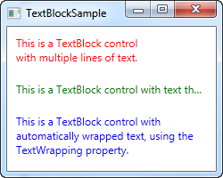

**Een TextBlock control die verschillende methoden toont om met lange teksten om te gaan**

We hebben dus drie TextBlock controls, elk met een verschillende kleur (gebruikmakend van de Foreground eigenschap) om het overzichtelijk te maken. Elk voorbeeld behandelt de te lange tekst inhoud op een andere manier:

Het rode TextBlock gebruikt een LineBreak tag om handmatig de regel af te breken op de gewenste plaats. Dit geeft absolute controle over waar de tekst overgaat naar een nieuwe regel, maar het is in veel omstandigheden niet erg flexibel. Als de gebruiker het venster groter maakt, zal de tekst nog op dezelfde plaats een regelovergang hebben, zelfs als er nu genoeg ruimte is, zodat de hele tekst op één regel past.

Het groene TextBlock gebruikt de TextTrimming eigenschap met de waarde CharacterEllipsisom het TextBlock een ellipsis (...) te laten tonen als niet alle tekst in de control past. Dit is ene gangbare werkwijze om te laten zien dat er meer tekst is, maar niet genoeg ruimte om deze te laten zien. Dit is prima wanneer je tekst hebt die misschien te lang is, maar als je absoluut niet meer dan één regel wilt gebruiken. Als alternatief voor CharacterEllipsis kun je ook WordEllipsis gebruiken, die de tekst afbreekt aan het eind van het laatste hele woord dat getoond kan worden, in plaats van het laatste character, waarmee wordt voorkomen dat slechts ene deel van het woord wordt weergegeven.

Het blauwe TextBlock gebruikt de TextWrapping eigenschap met de waarde Wrap, die ervoor zorgt dat het TextBlock op de volgende regel verder gaat als de tekst niet meer op de regel past. In tegenstelling tot het eerste TextBlock, waar we handmatig de regelovergang bepalen, gebeurt dit volledig automatisch en nog beter: Het wordt automatisch aangepast zodra het TextBlock meer of minder ruimte beschikbaar heeft. Probeer om het venster in het voorbeeld breder of smaller te maken en je ziet hoe de regelovergang wordt aangepast aan de situatie.

Dit was alles over eenvoudige teksten in het TextBlock. In het volgende hoofdstuk, kijken we naar sommige meer geavanceerde mogelijkheden van het TextBlock, waarmee we tekst met verschillende stijlen binnen het TextBlock kunnen maken en veel meer.

Gelukkig ondersteunt de TextBlock control tekstopmaak in de tekstregel. Kleine control-achtige constructies, die erven van de Inline klasse, wat betekent dat ze in de regel weergegeven kunnen worden als onderdeel van een langere tekst. Op het moment van schrijven zijn de ondersteunde controls het AnchoredBlock, Bold, Hyperlink, InlineUIContainer, Italic, LineBreak, Run, Span en Underline. In de volgende voorbeelden zullen we de meeste toelichten.

### Bold, Italic en Underline

Dit zijn waarschijnlijk de eenvoudigste types van inline elementen. De namen geven aan wat ze betekenen: Bold= vet, Italic=cursief en Underline=onderstreept. Maar we geven een kort voorbeeld dat laat zien wat ze doen:

```csharp
<Window x:Class="WpfTutorialSamples.Basic_controls.TextBlockInlineSample"
        xmlns="http://schemas.microsoft.com/winfx/2006/xaml/presentation"
        xmlns:x="http://schemas.microsoft.com/winfx/2006/xaml"
        Title="TextBlockInlineSample" Height="100" Width="300">
    <Grid>
		<TextBlock Margin="10" TextWrapping="Wrap">
			TextBlock with <Bold>bold</Bold>, <Italic>italic</Italic> and <Underline>underlined</Underline> text.
		</TextBlock>
    </Grid>
</Window>
```


**Een TextBlock control met in de tekstregel vette (Bold), cursieve (Italic) en onderstreepte (Underline) delen.**

Ongeveer zoals met HTML, omring je de tekst met de Bold tag om vette tekst te krijgen enzovoort. Dit maakt het erg makkelijk om opgemaakte tekst in je applicaties te maken en tonen.

Alle drie tags zijn afgeleid van het Span element, die een specifieke eigenschap van het Span element instellen om het gewenste effect te krijgen. Bijvoorbeeld, de Bold tag definieert de FontWeight eigenschap van het onderliggende Span element, de Italic tag definieert de FontStyle enzovoort.

### LineBreak

Deze plaatst een regeleinde in de tekst. Zie het voorgaande hoofdstuk voor een voorbeeld waar we het LineBreak element gebruiken.

### Hyperlink

Het Hyperlink element maakt het mogelijk een koppeling in je tekst te maken. Hij wordt opgemaakt met een stijl die past bij het huidige Windows thema, wat meestal een soort onderstreepte blauwe tekst met een rood muis-over effect en een hand als muis cursor. Je kunt de NavigateUri eigenschap gebruiken om de URL te definiëren waar je naartoe wil navigeren. Hier is een voorbeeld:

```csharp
<Window x:Class="WpfTutorialSamples.Basic_controls.TextBlockHyperlinkSample"
        xmlns="http://schemas.microsoft.com/winfx/2006/xaml/presentation"
        xmlns:x="http://schemas.microsoft.com/winfx/2006/xaml"
        Title="TextBlockHyperlinkSample" Height="100" Width="300">
	<Grid>
		<TextBlock Margin="10" TextWrapping="Wrap">
			This text has a <Hyperlink RequestNavigate="Hyperlink_RequestNavigate" 
			NavigateUri="https://www.google.com">link</Hyperlink> in it.
		</TextBlock>
	</Grid>
</Window>
```


**Een TextBlock met een Hyperlink om ene aanklikbaar element te maken**

De Hyperlink wordt ook gebruikt binnen de WPF Page, waar hij kan worden gebruikt voor de navigatie tussen pagina's. In dat geval hoef je niet expliciet de RequestNavigate gebeurtenis af te handelen, zoals we in het voorbeeld doen. Om een externe URL vanuit een reguliere WPF toepassing te starten, hebben wat hulp nodig van deze gebeurtenis en de Process klasse. We nemen een abonnement op de RequestNavigate gebeurtenis. Dit stelt ons in staat om de gekoppelde URL via de default browser te openen met een eenvoudige event handler, zoals die in het code behind bestand:

```csharp
private void Hyperlink_RequestNavigate(object sender, System.Windows.Navigation.RequestNavigateEventArgs e)
{
	System.Diagnostics.Process.Start(e.Uri.AbsoluteUri);
}
```

### Run

Het Run element maakt het mogelijk om een tekst op te maken met alle eigenschappen van het Span element, maar terwijl het Span element andere inline elementen mag bevatten, kan het Run element alleen platte tekst bevatten. Dit maakt het Span element meer flexibel en daarom meestal de logische keuze.

### Span

Het Span element heeft standaard geen specifieke opmaak, maar maakt het mogelijk om vrijwel elke specifieke opmaak te definiëren, zoals van een lettertype grootte, stijl en gewicht, achtergrond- en voorgrondkleur enzovoort. Het mooie van het Span element is dat het andere inline elementen kan bevatten, zodat je makkelijk geavanceerde combinaties van tekst en stijl kunt maken. In het volgende voorbeeld gebruikten we veel Span elementen om je sommige van de vele mogelijkheden van inline Span elementen te laten zien:

```csharp
<Window x:Class="WpfTutorialSamples.Basic_controls.TextBlockSpanSample"
        xmlns="http://schemas.microsoft.com/winfx/2006/xaml/presentation"
        xmlns:x="http://schemas.microsoft.com/winfx/2006/xaml"
        Title="TextBlockSpanSample" Height="100" Width="300">
    <Grid>
		<TextBlock Margin="10" TextWrapping="Wrap">
			This <Span FontWeight="Bold">is</Span> a
			<Span Background="Silver" Foreground="Maroon">TextBlock</Span>
			with <Span TextDecorations="Underline">several</Span>
			<Span FontStyle="Italic">Span</Span> elements,
			<Span Foreground="Blue">
				using a <Bold>variety</Bold> of <Italic>styles</Italic>
			</Span>.
		</TextBlock>
	</Grid>
</Window>
```

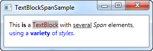

**Een TextBlock met SPAN elementen in diverse stijlen voor maatwerk opmaak.**

Zoals je kan zien, als geen van de andere elementen in jouw situatie toepasbaar is, of als je blanco wil starten om je tekst op te maken, is het Span element een goede keuze.

### Tekst formatteren vanuit C# code behind

Zoals je ziet, is opmaken van tekst met XAML erg makkelijk, maar in sommige gevallen heb je misschien de voorkeur om het met C# code behind te doen. Dit gaat wat moeizamer, maar hier is een voorbeeld dat laat zien hoe je dit kunt doen:

```csharp
<Window x:Class="WpfTutorialSamples.Basic_controls.TextBlockCodeBehindSample"
        xmlns="http://schemas.microsoft.com/winfx/2006/xaml/presentation"
        xmlns:x="http://schemas.microsoft.com/winfx/2006/xaml"
        Title="TextBlockCodeBehindSample" Height="100" Width="300">
    <Grid></Grid>
</Window>
```

```csharp
using System;
using System.Windows;
using System.Windows.Controls;
using System.Windows.Documents;
using System.Windows.Media;

namespace WpfTutorialSamples.Basic_controls
{
	public partial class TextBlockCodeBehindSample : Window
	{
		public TextBlockCodeBehindSample()
		{
			InitializeComponent();
			TextBlock tb = new TextBlock();
			tb.TextWrapping = TextWrapping.Wrap;
			tb.Margin = new Thickness(10);
			tb.Inlines.Add("An example on ");
			tb.Inlines.Add(new Run("the TextBlock control ") { FontWeight = FontWeights.Bold });
			tb.Inlines.Add("using ");
			tb.Inlines.Add(new Run("inline ") { FontStyle = FontStyles.Italic });
			tb.Inlines.Add(new Run("text formatting ") { Foreground = Brushes.Blue });
			tb.Inlines.Add("from ");
			tb.Inlines.Add(new Run("Code-Behind") { TextDecorations = TextDecorations.Underline });
			tb.Inlines.Add(".");
			this.Content = tb;
		}
	}
}
```

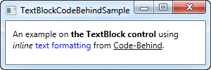

## Label Control

In zijn meest eenvoudige vorm lijkt de Label Control erg veel op het TextBlock. Je zal snel zien dat de label control de Content eigenschap heeft in plaats van de Text eigenschap. De reden hiervan is dat de Label control elke soort control kan bevatten als inhoud, in plaats van alleen tekst. Deze inhoud kan ook een tekstregel zijn, zoals je ziet in dit eenvoudige voorbeeld:

```csharp
<Window x:Class="WpfTutorialSamples.Basic_controls.LabelControlSample"
        xmlns="http://schemas.microsoft.com/winfx/2006/xaml/presentation"
        xmlns:x="http://schemas.microsoft.com/winfx/2006/xaml"
        Title="LabelControlSample" Height="100" Width="200">
    <Grid>
		<Label Content="This is a Label control." />
	</Grid>
</Window>
```

 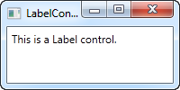

**Een eenvoudige Label control**

Iets anders dat je misschien opmerkt is dat de Label control standaard een beetje padding heeft, zodat de tekst op enkele pixels afstand van de linker bovenhoek wordt weergegeven. Bij de TextBlock Control is dat niet zo en moet je padding met de hand specificeren.

In een eenvoudig geval zoals dit, zal het Label intern een TextBlock aanmaken om je tekst te tonen.

### De Label Control versus de TextBlock Control

Waarom zou je dan een Label gebruiken? Nu, er zijn enkele belangrijke verschillen tussen Label en TextBlock. Het TextBlock staat alleen toe ene tekst op te maken, terwijl een Label het mogelijk maakt om:

- Randen te specificeren
- Andere controls te tonen, zoals een afbeelding
- Template inhoud te tonen via de TemplatedContent eigenschap
- Toetsenbord combinaties gebruiken om focus op gerelateerde controls te zetten

Het laatste punt is één van de hoofdredenen om een label in plaats van een TextBlock te gebruiken. Als je alleen eenvoudige tekst wil weergeven, kan je beter een TextBlock gebruiken, omdat het lichter is en in de meeste gevallen beter presteert dan het Label.

### Label en Toetsenbord combinaties

In Windows en andere operating systems is het gebruikelijk dat je controls in een een dialoog kunt gebruiken door de [alt] toets in te drukken samen met een teken dat overeen komt met de control die je wil gebruiken. Het teken dat je moet indrukken wordt geaccentueerd als je de [alt] indrukt. TextBlock controls ondersteunen deze functie niet, maar het Label wel. Daarom is de Label Control een goede keus voor control labels. Laten we dit bekijken in een voorbeeld:

```csharp
<Window x:Class="WpfTutorialSamples.Basic_controls.LabelControlSample"
        xmlns="http://schemas.microsoft.com/winfx/2006/xaml/presentation"
        xmlns:x="http://schemas.microsoft.com/winfx/2006/xaml"
        Title="LabelControlSample" Height="180" Width="250">
	<StackPanel Margin="10">
		<Label Content="_Name:" Target="{Binding ElementName=txtName}" />
		<TextBox Name="txtName" />
		<Label Content="_Mail:" Target="{Binding ElementName=txtMail}" />
		<TextBox Name="txtMail" />
	</StackPanel>
</Window>
```

 

**Label control met sneltoetsen**

De schermafdruk toont ons voorbeeld dialoog zoals die er uit ziet als de Alt toets is ingedrukt. Probeer deze uit te voeren, door de Alt toets in te drukken en dan N of M in te drukken. Je ziet dat de focus verschuift tussen de twee TextBox controls.

Dus, er zijn enkele nieuwe technieken te zien; Ten eerste definiëren we een toetsenbord combinatie door een underscore (_) voor het teken te plaatsen. Dat hoeft niet het eerste teken te zijn, het kan voor elk teken staan. De normale werkwijze is om het eerste teken te gebruiken, dat niet eerder is gebruikt als toetsenbordcombinatie voor een andere control.

We gebruiken de Target eigenschap om het label te koppelen aan de gewenste control. We gebruiken hiervoor de standaard WPF binding voor met de ElementName eigenschap, welke we later in deze tutorial beschrijven. De binding is gebaseerd op de Name eigenschap van de control, dus als je deze verandert, moet je er aan denken ook de binding aan te passen.

### Controls als inhoud van een Label gebruiken

Zoals eerder genoemd, de label Control kan andere controls bevatten als inhoud, waarbij je de andere voordelen behoudt. Laten we een voorbeeld proberen, waarbij we een afbeelding en een tekst hebben binnen een Label en nog steeds de toetsenbordcombinatie voor elk Label behouden:

```csharp
<Window x:Class="WpfTutorialSamples.Basic_controls.LabelControlAdvancedSample"
        xmlns="http://schemas.microsoft.com/winfx/2006/xaml/presentation"
        xmlns:x="http://schemas.microsoft.com/winfx/2006/xaml"
        Title="LabelControlAdvancedSample" Height="180" Width="250">
	<StackPanel Margin="10">
		<Label Target="{Binding ElementName=txtName}">
			<StackPanel Orientation="Horizontal">
				<Image Source="http://cdn1.iconfinder.com/data/icons/fatcow/16/bullet_green.png" />
				<AccessText Text="_Name:" />
			</StackPanel>
		</Label>
		<TextBox Name="txtName" />
		<Label Target="{Binding ElementName=txtMail}">
			<StackPanel Orientation="Horizontal">
				<Image Source="http://cdn1.iconfinder.com/data/icons/fatcow/16/bullet_blue.png" />
				<AccessText Text="_Mail:" />
			</StackPanel>
		</Label>
		<TextBox Name="txtMail" />
	</StackPanel>
</Window>
```
 

**Label control met sneltoetsen en onderliggende controls met afbeelding**

Dit is een uitgebreidere versie van het vorige voorbeeld- in plaats van een eenvoudige tekst, bevat ons Label nu zowel een afbeelding als een tekst (binnen de AccessText control, welke het mogelijk maakt een toetsenbordcombinatie voor het label te gebruiken. Beide controls staan binnen een horizontaal StackPanel, omdat de Label control, net als andere ContentControls, slechts één kind control kan bevatten.

De Image Control gebruikt een afbeelding op internet- dit is ALLEEN bedoeld als voorbeeld. Voor echte toepassingen is dit GEEN goed idee.

### Samenvatting

In de meeste gevallen doet de Label Control precies wat de naam aangeeft: Het is een tekst label voor een andere control. Dat is de belangrijkste toepassing. Voor de meeste andere gevallen, kun je waarschijnlijk beter een TextBlock Control gebruiken, of één van de andere containers die WPF biedt.

## TextBox control

De TextBox control is de meest gangbare tekst invoer control in WPF en maakt het de eindgebruiker mogelijk platte tekst in te voeren voor een enkele regel, dialoog invoer of voor meerdere regels zoals in een tekstverwerker.

### Eén regel TextBox

De TextBox control is zo algemeen, dat het niet nodig is om eigenschappen (properties) te gebruiken, om een bewerkbaar tekst invoerveld te maken. Hier is een basis voorbeeld:

```csharp
<Window x:Class="WpfTutorialSamples.Basic_controls.TextBoxSample"
        xmlns="http://schemas.microsoft.com/winfx/2006/xaml/presentation"
        xmlns:x="http://schemas.microsoft.com/winfx/2006/xaml"
        Title="TextBoxSample" Height="80" Width="250">
    <StackPanel Margin="10">
		<TextBox />
	</StackPanel>
</Window>
```

 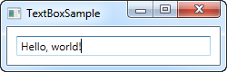

**Een eenvoudige TextBox control**

Dat is alles wat je nodig hebt om een tekst veld te maken. I heb tekst toegevoegd na het voorbeeld te hebben uitgevoerd, maar dat kun je ook doen via de opmaak, door ene een vooraf ingestelde waarde toe te voegen met de Text eigenschap:

```csharp
<TextBox Text="Hello, world!" />
```

Probeer met de rechtermuisknop in het voorbeeld te klikken. Je krijgt dan ene menu met opties te zien, waarmee je de Windows kopiëren/plakken (Ctrl+C en Ctrl+V) functie kunt gebruiken. De toetsenbordcombinaties voor ongedaan maken en opnieuw doen (Ctrl+Z en Ctrl+Y) werken ook, en al deze functies krijg je gratis!

### TextBox met meerdere regels

Als je bovenstaand voorbeeld uitvoert, zul je merken dat de TextBox control standaard één regel ondersteunt. Er gebeurt niets als je de "Enter"toets indrukt en als je meer tekst invoert dan op een regel past, bladert de control. Gelukkig is het eenvoudig de TextBox control aan te passen voor gebruik met meerdere regels:

```csharp
<Window x:Class="WpfTutorialSamples.Basic_controls.TextBoxSample"
        xmlns="http://schemas.microsoft.com/winfx/2006/xaml/presentation"
        xmlns:x="http://schemas.microsoft.com/winfx/2006/xaml"
        Title="TextBoxSample" Height="160" Width="280">
    <Grid Margin="10">
		<TextBox AcceptsReturn="True" TextWrapping="Wrap" />
	</Grid>
</Window>
```

 

**Een TextBox control met meerdere regels tekst**

Twee eigenschappen voegden we toe: AcceptReturn zorgt ervoor dat je met de "Enter" toets regelovergangen kunt toevoegen en TextWrapping laat de tekst overlopen naar de volgende regel als het einde van de regel wordt bereikt.

### Spellingcontrole en de TextBox

Als bonus heeft de TextBox automatische spellingcontrole voor Engels en enkele andere talen (op het moment van schrijven voor Engels, Frans, Duits en Spaans).

Het werkt ongeveer zoals in Microsoft Word, waar spelfouten worden onderstreept en je met de rechter muisknop kunt klikken voor alternatieven. Spellingcontrole aanzetten is eenvoudig:

```csharp
<Window x:Class="WpfTutorialSamples.Basic_controls.TextBoxSample"
        xmlns="http://schemas.microsoft.com/winfx/2006/xaml/presentation"
        xmlns:x="http://schemas.microsoft.com/winfx/2006/xaml"
        Title="TextBoxSample" Height="160" Width="280">
    <Grid Margin="10">
		<TextBox AcceptsReturn="True" TextWrapping="Wrap" SpellCheck.IsEnabled="True" Language="en-US" />
	</Grid>
</Window>
```

 

**Een TextBox control met spellincontrole aangezet**

We gebruikten in het voorgaande een meerregelige TextBox en voegden twee eigenschappen toe: de gekoppelde eigenschap van de SpellCheck klasse genaamd IsEnabled, welke spellingcontrole aan zet voor de ouder control en de Language eigenschap, waarmee de controletaal wordt ingesteld.

### Werken met TextBox selecties

Net als elke andere bewerkbare control in Windows, staat de TextBox control het toe tekst te selecteren, bijvoorbeeld om een heel woord te wissen of een deel van de tekst naar het knipselbord te kopiëren. De WPF TextBox heeft diverse eigenschappen om met geselecteerde tekst te werken. Elk van deze eigenschappen kun je lezen of bewerken. In het volgende voorbeeld zullen we deze eigenschappen uitlezen:

```csharp
<Window x:Class="WpfTutorialSamples.Basic_controls.TextBoxSelectionSample"
        xmlns="http://schemas.microsoft.com/winfx/2006/xaml/presentation"
        xmlns:x="http://schemas.microsoft.com/winfx/2006/xaml"
        Title="TextBoxSelectionSample" Height="150" Width="300">
	<DockPanel Margin="10">
		<TextBox SelectionChanged="TextBox_SelectionChanged" DockPanel.Dock="Top" />
		<TextBox Name="txtStatus" AcceptsReturn="True" TextWrapping="Wrap" 
		 IsReadOnly="True" />

	</DockPanel>
</Window>
```

Het voorbeeld bevat twee TextBox controls: Eén om te bewerken en één om de huidige selectie status weer te geven. Hiervoor zetten we de IsReadOnly eigenschap op "true", om te voorkomen dat de status TextBox bewerkt kan worden. We abonneren op de SelectionChanged gebeurtenis, welke we in de achtergrondcode afhandelen:

```csharp
using System;
using System.Text;
using System.Windows;
using System.Windows.Controls;

namespace WpfTutorialSamples.Basic_controls
{
	public partial class TextBoxSelectionSample : Window
	{
		public TextBoxSelectionSample()
		{
			InitializeComponent();
		}

		private void TextBox_SelectionChanged(object sender, RoutedEventArgs e)
		{
			TextBox textBox = sender as TextBox;
			txtStatus.Text = "Selection starts at character #" 
			  + textBox.SelectionStart + Environment.NewLine;
			txtStatus.Text += "Selection is " + textBox.SelectionLength 
			  + " character(s) long" + Environment.NewLine;
			txtStatus.Text += "Selected text: '" + textBox.SelectedText + "'";
		}
	}
}
```

 

**Een TextBox control met selectie status**

We gebruiken drie interessante eigenschappen om dit te bereiken:

- **SelectionStart**, welke ons de huidige cursor positie geeft of, wanneer een selectie actief is: Waar deze begint.

- **SelectionLength**, welke ons de lengte van de huidige selectie geeft, anders geeft het 0 terug.

- **SelectedText**, welke de geselecteerde tekst geeft als er een selectie actief is, anders wordt een lege string teruggegeven.

### Een selectie wijzigen

Al deze eigenschappen zijn leesbaar en schrijfbaar, hetgeen betekent dat je ze ook kunt wijzigen. Bijvoorbeeld, je kunt SelectionStart en SelectionLength instellen om een deel van de tekst te selecteren, of je kunt SelectedText gebruiken om tekst in te voegen. Onthoudt dat de TextBox focus moet hebben om dit te laten werken, bijvoorbeeld door eerst de Focus() methode aan te roepen.

## Button control

Geen GUI framework zou compleet zijn zonder Button control, dus vanzelfsprekend heeft WPF en ook één en net als de de andere framework controls, is hij erg flexibel en stelt je in staat bijna alles te bereiken. Maar laten we beginnen met enkele eenvoudige voorbeelden.

### Een eenvoudige Button

Net als veel andere WPF controls, kan een Button worden getoond door de Button tag aan je venster toe te voegen. Als je tekst tussen de beide tags plaatst (of bij andere controls), zal die zich gedragen als de content (inhoud) van de Button.

```csharp
<Button>Hello, world!</Button>
```

 

**Eenvoudige knop**

Eenvoudig? Natuurlijk doet de Button nog niets, maar als je er naar wijst, zie je dat er een mooi "hover" effect standaard bij zit. Maar, laten we de Button iets laten doen door te abonneren op de Click gebeurtenis (meer informatie vind je in het artikel over abonneren op gebeurtenissen in XAML.

```csharp
<Button Click="HelloWorldButton_Click">Hello, World!</Button>
```

In de achtergrondcode (code behind) heb je bijpassende code nodig om de gebeurtenis af te handelen:

```csharp
private void HelloWorldButton_Click(object sender, RoutedEventArgs e)
{
    MessageBox.Show("Hello, world!");
}
```

Je hebt nu een elementaire knop en als je er op klikt, wordt een bericht getoond!

### Opgemaakte content

Intern, wordt eenvoudige tekst in de Content eigenschap van de Button omgezet naar een TextBlock control, hetgeen betekent dat je de aspecten van tekstopmaak van de TextBlock control kunt gebruiken. je zult diverse eigenschappen aantreffen voor de Button control, zoals (maar niet beperkt tot) Foreground, Background, FontWeight enzovoort. Met andere woorden, het is erg makkelijk de opmaak van de tekst binnen een Button control aan te passen:

```csharp
<Button Background="Beige" Foreground="Blue" FontWeight="Bold">Formatted Button</Button>
```

 

**Knop met opgemaakte tekst**

Door deze eigenschappen direct op de Button in te stellen, ben je natuurlijk beperkt tot het opmaken van alle tekstinhoud, maar als dat niet goed genoeg is, lees verder voor meer geavanceerde opmaak.

### Knoppen met geavanceerde opmaak

We hebben er al meerdere keren over gesproken, maar één van de gave dingen in WPF is de mogelijkheid om eenvoudige tekst in een control te vervangen door andere WPF controls. Dit betekent ook dat je de knop niet hoeft te beperken tot een eenvoudige tekst, die helemaal identiek is opgemaakt - je kunt verschillende text controls toevoegen met verschillende opmaak. De WPF Button ondersteunt één directe ingevoegde cotrol, maar je kut daarvoor ene Panel gebruiken, waarbinnen je dan net zoveel controls kunt plaatsen als je nodig hebt. Je kunt dit gebruiken om knoppen met verschillende soorten opmaak te maken.

```csharp
<Button>
    <StackPanel Orientation="Horizontal">
    <TextBlock>Formatted </TextBlock>
    <TextBlock Foreground="Blue" FontWeight="Bold" Margin="2,0">Button</TextBlock>
    <TextBlock Foreground="Gray" FontStyle="Italic">[Various]</TextBlock>
    </StackPanel>
</Button>
```

 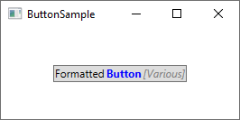

**Knop met verschillende soorten opmaak**

Natuurlijk ben je niet beperkt tot tekst- je kunt alles wat je maar wil in je knoppen plaatsen, hetgeen leidt tot een onderwerp waar veel mensen om vragen. Knoppen met plaatjes!

### Knoppen met afbeeldingen (ImageButton)

In veel UI frameworks, zul je een normale Button aantreffen en dan één of meer varianten, die extra eigenschappen bieden. Eén van de meest gebruikte varianten is de ImageButton, welke, zoals de naam zegt, een Button is die het mogelijk maakt een afbeelding voor de tekst te plaatsen. Maar in WPF is een afzonderlijke control niet nodig om dit te doen: zoals we net hebben gezien, kunnen we controls binnen een Button opnemen, dus je kunt op deze wijze makkelijk een afbeelding toevoegen:

```csharp
<Button Padding="5">  
    <StackPanel Orientation="Horizontal">  
    <Image Source="/WpfTutorialSamples;component/Images/help.png" />  
    <TextBlock Margin="5,0">Help</TextBlock>  
    </StackPanel>  
</Button>
```

 

**ImageButton in WPF**

Het is echt zo eenvoudig een ImageButton te maken in WPF en vanzelfsprekend ben je vrij om dingen te verplaatsen, bijvoorbeeld als je de afbeelding achter de tekst wil plaatsen in plaats van ervoor, enz.

### Button Padding

Het is je misschien opgevallen dat knoppen in hte WPF framework geen standaard binnenruimte (padding) hebben. Dit betekent dat de tekst heel dicht tegen de randen staat, wat een er vreemd uit ziet, omdat de knoppen die je elders aantreft (web, andere toepassingen) tenminste enige ruimte om de tekst hebben. Geen zorgen, want de Button heeft de Padding eigenschap.

```csharp
<Button Padding="5,2">Hello, World!</Button>
```

Dit voegt 5 pixels ruimte toe aan de zijkanten en 2 pixels boven en onder. Maar om Padding toe te voegen aan alle knoppen is wat vermoeiend, dus hier ene tip: Je kunt padding globaal toepassen, over de hele applicatie of alleen een specifiek venster, door een stijl (Style) te gebruiken (later meer over stijlen). Hier is een voorbeeld waarbij we dit toepassen op een venster, met de Window.Resources eigenschap.

```csharp
<Window.Resources>
    <Style TargetType="{x:Type Button}">
    <Setter Property="Padding" Value="5,2"/>
    </Style>
</Window.Resources>
```

Deze Padding wordt op alle knoppen toegepast, maar je kunt dit nog aanpassen door de Padding eigenschap specifiek voor een Button in te stellen. Hier zie je hoe alle knoppen in het voorbeeld er uit zien met de gemeenschappelijke Padding:

 

**Meerdere knoppen met gemeenschappelijke Padding**

### Samenvatting

Zoals je in dit artikel kunt zien, is het gebruik van knoppen in WPF erg eenvoudig en kun je deze control bijna eindeloos aanpassen.

## Checkbox control

Een CheckBox controle laat de gebruiker toe een optie op of af te zetten: doorgaans is een CheckBox gekoppeld aan de status van een boolean in de code behind. We starten meteen met een voorbeeld:

```csharp 
<Window x:Class="WpfTutorialSamples.Basic_controls.CheckBoxSample"
        xmlns="http://schemas.microsoft.com/winfx/2006/xaml/presentation"
        xmlns:x="http://schemas.microsoft.com/winfx/2006/xaml"
        Title="CheckBoxSample" Height="140" Width="250">
    <StackPanel Margin="10">
		<Label FontWeight="Bold">Application Options</Label>
		<CheckBox>Enable feature ABC</CheckBox>
		<CheckBox IsChecked="True">Enable feature XYZ</CheckBox>
		<CheckBox>Enable feature WWW</CheckBox>
	</StackPanel>
</Window>
```

 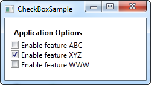

**Een eenvoudige CheckBox control**

Zoals je kan zien is CheckBox heel eenvoudig in gebruik. Bij de tweede CheckBox gebruiken we de IsChecked property om de checkbox standaard actief (geselecteerd) te maken: andere eigenschappen zijn niet nodig om van deze control gebruik te maken. De IsChecked property kan ook gebruikt worden in code behind om uit te maken of een optie geselecteerd is of niet.

### Eigen inhoud
De CheckBox control erft over van de ContentControl class. Dit betekent dat je eigen inhoud kan tonen naast de checkbox. Wanneer je een stukje tekst opgeeft, zoals we deden in het voorbeeld hierboven, dan zal WPF deze tekst plaatsen in een TextBlock control en dit tonen, om het je makkelijker te maken. In feite kan je elk type control gebruiken zoals we in volgend voorbeeld zien:

```csharp
<Window x:Class="WpfTutorialSamples.Basic_controls.CheckBoxSample"
        xmlns="http://schemas.microsoft.com/winfx/2006/xaml/presentation"
        xmlns:x="http://schemas.microsoft.com/winfx/2006/xaml"
        Title="CheckBoxSample" Height="140" Width="250">
    <StackPanel Margin="10">
		<Label FontWeight="Bold">Application Options</Label>
		<CheckBox>
			<TextBlock>
				Enable feature <Run Foreground="Green" FontWeight="Bold">ABC</Run>
			</TextBlock>
		</CheckBox>
		<CheckBox IsChecked="True">
			<WrapPanel>
				<TextBlock>
					Enable feature <Run FontWeight="Bold">XYZ</Run>
				</TextBlock>
				<Image Source="/WpfTutorialSamples;component/Images/question.png" 
				Width="16" Height="16" Margin="5,0" />
			</WrapPanel>
		</CheckBox>
		<CheckBox>
			<TextBlock>
				Enable feature <Run Foreground="Blue" TextDecorations="Underline" 
				FontWeight="Bold">WWW</Run>
			</TextBlock>
		</CheckBox>
	</StackPanel>
</Window>
```

 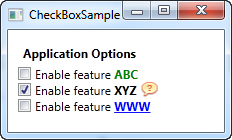

**CheckBox control met eigen inhoud**

Zoals je kan zien in de markup van het voorbeeld kan je zowat doen wat je wil met de inhoud. Bij de drie checkboxes doen we telkens iets anders met de tekst en bij de middelste gebruikten we zelf een Image control. Op welk gedeelte je ook klikt van de inhoud, de CheckBox verandert van status (van op naar af of omgekeerd). 

### De IsThreeState property

We haalden reeds aan dat de CheckBox doorgaans overeenkomt met een booleaanse waarde. Dit betekent dat de CheckBox enkel twee waarden kan hebben: true of false (op of af). Een booleaanse waarde kan echter ook nullable zijn in bepaalde omstandigheden. Op een dergelijk geval is er een derde optie mogelijk: true, false of null. De CheckBox control kan dit aan: door de IsThreeState property op true te zetten, krijgt de CheckBox een derde status, de zogenaamde "indeterminate state" ("onbepaalde status").

Dit wordt vaak gebruikt om een "Enable All" CheckBox te realiseren. Een dergelijke CheckBox controleert een verzameling onderliggende checkboxes en toont hun gezamenlijke status. Het volgende voorbeeld beschrijft hoe je een lijst van opties kan tonen die op- of afgezet kunnen worden, aangevuld met een gemeenschappelijke CheckBox "Enable All" bovenaan:

```csharp
<Window x:Class="WpfTutorialSamples.Basic_controls.CheckBoxThreeStateSample"
        xmlns="http://schemas.microsoft.com/winfx/2006/xaml/presentation"
        xmlns:x="http://schemas.microsoft.com/winfx/2006/xaml"
        Title="CheckBoxThreeStateSample" Height="170" Width="300">
	<StackPanel Margin="10">
		<Label FontWeight="Bold">Application Options</Label>
		<StackPanel Margin="10,5">
			<CheckBox IsThreeState="True" Name="cbAllFeatures" 
			Checked="cbAllFeatures_CheckedChanged" 
			Unchecked="cbAllFeatures_CheckedChanged">Enable all</CheckBox>
			<StackPanel Margin="20,5">
				<CheckBox Name="cbFeatureAbc" Checked="cbFeature_CheckedChanged" 
				Unchecked="cbFeature_CheckedChanged">Enable feature ABC</CheckBox>
				<CheckBox Name="cbFeatureXyz" IsChecked="True" 
				Checked="cbFeature_CheckedChanged" 
				Unchecked="cbFeature_CheckedChanged">Enable feature XYZ</CheckBox>
				<CheckBox Name="cbFeatureWww" Checked="cbFeature_CheckedChanged" 
				Unchecked="cbFeature_CheckedChanged">Enable feature WWW</CheckBox>
			</StackPanel>
		</StackPanel>
	</StackPanel>
</Window>
```

```csharp
using System;
using System.Windows;

namespace WpfTutorialSamples.Basic_controls
{
	public partial class CheckBoxThreeStateSample : Window
	{
		public CheckBoxThreeStateSample()
		{
			InitializeComponent();
		}


		private void cbAllFeatures_CheckedChanged(object sender, RoutedEventArgs e)
		{
			bool newVal = (cbAllFeatures.IsChecked == true);
			cbFeatureAbc.IsChecked = newVal;
			cbFeatureXyz.IsChecked = newVal;
			cbFeatureWww.IsChecked = newVal;
		}

		private void cbFeature_CheckedChanged(object sender, RoutedEventArgs e)
		{
			cbAllFeatures.IsChecked = null;
			if((cbFeatureAbc.IsChecked == true) && (cbFeatureXyz.IsChecked == true) 
			&& (cbFeatureWww.IsChecked == true))
				cbAllFeatures.IsChecked = true;
			if((cbFeatureAbc.IsChecked == false) && (cbFeatureXyz.IsChecked == false) 
			&& (cbFeatureWww.IsChecked == false))
				cbAllFeatures.IsChecked = false;
		}

	}
}
```

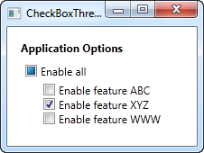


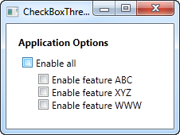

## RadioButton control

Met de RadioButton control (keuzerondje) geef je de gebruiker een lijst van mogelijkheden, er kan slechts één mogelijkheid per keer worden gekozen. Hetzelfde effect kan je bekomen door gebruik te maken van de ComboBox - control (keuzelijst). De keuzerondjes geven de gebruiker echter een duidelijker overzicht van de keuzes.

```csharp
<Window x:Class="WpfTutorialSamples.Basic_controls.RadioButtonSample"
        xmlns="http://schemas.microsoft.com/winfx/2006/xaml/presentation"
        xmlns:x="http://schemas.microsoft.com/winfx/2006/xaml"
        Title="RadioButtonSample" Height="150" Width="250">
	<StackPanel Margin="10">
		<Label FontWeight="Bold">Are you ready?</Label>
		<RadioButton>Yes</RadioButton>
		<RadioButton>No</RadioButton>
		<RadioButton IsChecked="True">Maybe</RadioButton>
	</StackPanel>
</Window>
```

  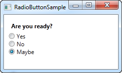

**A simple RadioButton control**

We voegen een label toe met een vraag en 3 keuzerondjes met een mogelijk antwoord. De standaardkeuze geven we aan door de IsChecked eigenschap toe te kennen aan het laatste keuzerondje. De gebruiker kan deze keuze eenvoudig wijzigen door op een ander keuzerondje te klikken. De IsChecked eigenschap is ook de eigenschap die je gebruikt in de Code-behind om te kijken of het keuzerondje aangevinkt is of niet.

### RadioButton groups

Wanneer je het bovenstaande voorbeeld uittest, dan merk je dat je slechts één keuzerondje kan aanvinken per keer. Wens je echter meerdere groepen met keuzerondjes te gebruiken in je project, met elk hun eigen individuele keuzes? Gebruik dan de GroupName eigenschap, deze eigenschap laat je toe aan te geven welke keuzerondjes bij elkaar horen.

```csharp
<Window x:Class="WpfTutorialSamples.Basic_controls.RadioButtonSample"
        xmlns="http://schemas.microsoft.com/winfx/2006/xaml/presentation"
        xmlns:x="http://schemas.microsoft.com/winfx/2006/xaml"
        Title="RadioButtonSample" Height="230" Width="250">
	<StackPanel Margin="10">
		<Label FontWeight="Bold">Are you ready?</Label>
		<RadioButton GroupName="ready">Yes</RadioButton>
		<RadioButton GroupName="ready">No</RadioButton>
		<RadioButton GroupName="ready" IsChecked="True">Maybe</RadioButton>

		<Label FontWeight="Bold">Male or female?</Label>
		<RadioButton GroupName="sex">Male</RadioButton>
		<RadioButton GroupName="sex">Female</RadioButton>
		<RadioButton GroupName="sex" IsChecked="True">Not sure</RadioButton>
	</StackPanel>
</Window>
```

 

**Two groups of radio buttons using the GroupName property**

Doordat we de GroupName eigenschap hebben gebruikt op de keuzerondjes, kunnen we nu in elke groep een selectie maken. Zonder deze eigenschap konden we slechts 1 keuze maken uit de 6 keuzerondjes.

### Custom content

Het keuzerondje erft van de ContentControl klasse, wat betekent dat het aangepaste inhoud kan weergeven. Wanneer je een stukje tekst aangeeft, zoals in het voorbeeld hierboven, dan zal WPF het in een TextBlock plaatsen en het tonen op het scherm, dit is echter een kortere weg om het voor jouw gemakkelijker te maken. Je kan elk type control gebruiken, zoals we zien in het volgende voorbeeld:

```csharp
<Window x:Class="WpfTutorialSamples.Basic_controls.RadioButtonCustomContentSample"
        xmlns="http://schemas.microsoft.com/winfx/2006/xaml/presentation"
        xmlns:x="http://schemas.microsoft.com/winfx/2006/xaml"
        Title="RadioButtonCustomContentSample" Height="150" Width="250">
	<StackPanel Margin="10">
		<Label FontWeight="Bold">Are you ready?</Label>
		<RadioButton>
			<WrapPanel>
				<Image Source="/WpfTutorialSamples;component/Images/accept.png" 
				Width="16" Height="16" Margin="0,0,5,0" />
				<TextBlock Text="Yes" Foreground="Green" />
			</WrapPanel>
		</RadioButton>
		<RadioButton Margin="0,5">
			<WrapPanel>
				<Image Source="/WpfTutorialSamples;component/Images/cancel.png" 
				Width="16" Height="16" Margin="0,0,5,0" />
				<TextBlock Text="No" Foreground="Red" />
			</WrapPanel>
		</RadioButton>
		<RadioButton IsChecked="True">
			<WrapPanel>
				<Image Source="/WpfTutorialSamples;component/Images/question.png" 
				Width="16" Height="16" Margin="0,0,5,0" />
				<TextBlock Text="Maybe" Foreground="Gray" />
			</WrapPanel>
		</RadioButton>
	</StackPanel>
</Window>
```

 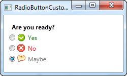

**Radio buttons met eigen inhoud**

Opmaak gewijs is dit voorbeeld een beetje zwaar, maar het concept is zeer simpel. Voor elke keuze gebruiken we een WrapPanel met een afbeelding en een stukje tekst erin. Doordat we gebruik maken van een TextBlock krijgen we ook de mogelijkheid om de tekst op te maken zoals we willen. In dit voorbeeld werd de tekstkleur gewijzigd om gelijk te zijn met de keuze. Een Image Control(lees hier later meer over) wordt gebruikt om een afbeelding weer te geven per keuze.

Merk op dat je om het even waar kan klikken op het keuzerondje, zelfs op de afbeelding of op de tekst. Dit komt omdat we de afbeelding en de tekst aangegeven hebben als inhoud van het keuzerondje. Hadden we de afbeelding en de tekst op een ander paneel geplaatst, dan moest de gebruiker effectief op het keuzerondje klikken, wat minder praktisch is.

# Control concepts

## Control tooltips

Tooltips of hints - verschillende namen, maar het concept blijft steeds hetzelfde: de mogelijkheid om bijkomende informatie over een specifieke control te krijgen door er met de muispijl over te bewegen. WPF onderesteunt dit via de ToolTip property op de FrameworkElement class, waarvan haast alle WPF controls overerven.

Het specificeren van een tooltip voor een control is dan ook heel eenvoudig, zoals je in dit eerste voorbeeld ziet:

```csharp
<Window x:Class="WpfTutorialSamples.Control_concepts.ToolTipsSimpleSample"
        xmlns="http://schemas.microsoft.com/winfx/2006/xaml/presentation"
        xmlns:x="http://schemas.microsoft.com/winfx/2006/xaml"
        Title="ToolTipsSimpleSample" Height="150" Width="400">
    <Grid VerticalAlignment="Center" HorizontalAlignment="Center">

        <Button ToolTip="Click here and something will happen!">Click here!</Button>

    </Grid>
</Window>
```


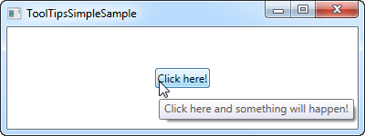

**Eenvoudig voorbeeld van een ToolTip**

Zoals je kan zien in de screenshot resulteert dit in een zwevend venster met de opgegeven string wanneer de muispijl over de knop beweegt. Dit is wat de meeste UI frameworks bieden: een tekst en niets meer. WPF is echter in staat om eender welke control als tooltip te presenteren: dit biedt veel knappe mogelijkheden. Bestudeer volgend voorbeeld en vergelijk het met ons eerste:

```csharp
<Window x:Class="WpfTutorialSamples.Control_concepts.ToolTipsAdvancedSample"
        xmlns="http://schemas.microsoft.com/winfx/2006/xaml/presentation"
        xmlns:x="http://schemas.microsoft.com/winfx/2006/xaml"
        Title="ToolTipsAdvancedSample" Height="200" Width="400" UseLayoutRounding="True">
    <DockPanel>
        <ToolBar DockPanel.Dock="Top">
            <Button ToolTip="Create a new file">
                <Button.Content>
                    <Image Source="/WpfTutorialSamples;component/Images/page_white.png" Width="16" Height="16" />
                </Button.Content>
            </Button>
            <Button>
                <Button.Content>
                    <Image Source="/WpfTutorialSamples;component/Images/folder.png" Width="16" Height="16" />
                </Button.Content>
                <Button.ToolTip>
                    <StackPanel>
                        <TextBlock FontWeight="Bold" FontSize="14" Margin="0,0,0,5">Open file</TextBlock>
                        <TextBlock>
                        Search your computer or local network
                        <LineBreak />
                        for a file and open it for editing.
                        </TextBlock>
                        <Border BorderBrush="Silver" BorderThickness="0,1,0,0" Margin="0,8" />
                        <WrapPanel>
                            <Image Source="/WpfTutorialSamples;component/Images/help.png" Margin="0,0,5,0" />
                            <TextBlock FontStyle="Italic">Press F1 for more help</TextBlock>
                        </WrapPanel>
                    </StackPanel>
                </Button.ToolTip>
            </Button>
        </ToolBar>

        <TextBox>
            Editor area...
        </TextBox>
    </DockPanel>
</Window>
```

 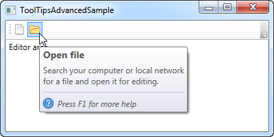

**Voorbeeld van een meer complexe tooltip**

Dit voorbeeld gebruikt een eenvoudige string tooltip voor de eerste knop en een veel complexere tooltip voor de tweede, zoals je ziet. In het ingewikkelde voorbeeld gebruiken we een panel als root control en binnen dit panel kunnen we vervolgens zoveel andere controls plaatsen als we willen. Het resultaat is vrij indrukwekkend: een hoofding, een beschrijvende tekst en een hint, waarbij je F1 kan drukken voor meer hulp, inclusief een hulpicoon.

## WPF text rendering

Zoals eerder vermeld in deze handleiding doet WPF veel meer uit zichzelf in vergelijking met andere UI-frameworks zoals WinForms die de Windows API gebruikt voor heel veel dingen. Dit is ook heel duidelijk als het gaat om het weergeven van tekst. WinForms gebruikt de GDI API van Windows terwijl WPF zijn eigen implementatie heeft voor het weergeven van tekst. WPF doet dit om animaties en het apparaatonafhankelijke karakter van WPF beter te ondersteunen.

Helaas leidde dit ertoe dat tekst een beetje wazig werd, dit is vooral zichtbaar bij kleine lettergroottes. Dit werd voor een tijd aanzien als een groot probleem voor WPF-programmeurs. Maar gelukkig heeft Microsoft veel verbeteringen in de WPF tekstweergave engine aangebracht in .NET Framework versie 4.0. Dit betekent dat als u deze versie of hoger gebruikt de tekst zo goed als pixel perfect zou moeten weergegeven worden.

### Tekstweergave beheren

Vanaf .NET framework 4.0 besloot Microsoft de programmeur meer controle over text rendering te gunnen door de class TextOptions te introduceren: deze class heeft de properties TextFormattingMode en TextRenderingMode. Met behulp hiervan kan je beslissen hoe tekst geformateerd en gerenderd moet worden op het niveau van een specifieke control. We tonen dit best met een voorbeeld.

### TextFormattingMode

Met de TextFormattingMode eigenschap bepaalt u welk algoritme moet worden gebruikt bij het opmaken van de tekst. U kunt kiezen tussen Ideal (de standaardwaarde) en Display. Normaal gesproken wilt u deze eigenschap niet veranderen omdat de ideale instelling voor de meeste situaties het beste is. Maar in gevallen waarin u zeer kleine tekst moet weergeven kan de weergave-instelling soms een beter resultaat opleveren. Hier is een voorbeeld waar u het verschil kunt zien (hoewel het erg subtiel is):

```csharp
<Window x:Class="WpfTutorialSamples.Control_concepts.TextFormattingModeSample"
        xmlns="http://schemas.microsoft.com/winfx/2006/xaml/presentation"
        xmlns:x="http://schemas.microsoft.com/winfx/2006/xaml"
        Title="TextFormattingModeSample" Height="200" Width="400">
    <StackPanel Margin="10">
        <Label TextOptions.TextFormattingMode="Ideal" FontSize="9">TextFormattingMode.Ideal, small text</Label>
        <Label TextOptions.TextFormattingMode="Display" FontSize="9">TextFormattingMode.Display, small text</Label>
        <Label TextOptions.TextFormattingMode="Ideal" FontSize="20">TextFormattingMode.Ideal, large text</Label>
        <Label TextOptions.TextFormattingMode="Display" FontSize="20">TextFormattingMode.Display, large text</Label>
    </StackPanel>
</Window>
```
 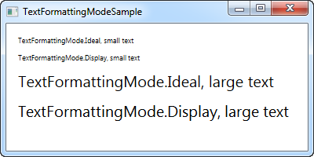

**Gebruik maken van de TextFormattingMode property**

### TextRenderingMode

De TextRenderingMode eigenschap geeft u de controle over welk anti-aliasing algoritme er wordt gebruikt bij het weergeven van tekst. Het heeft het grootste effect in combinatie met de Display instelling voor de eigenschap TextFormattingMode. Dit gebruiken we in volgend voorbeeld om de verschillen aan te tonen:

```csharp
<Window x:Class="WpfTutorialSamples.Control_concepts.TextRenderingModeSample"
        xmlns="http://schemas.microsoft.com/winfx/2006/xaml/presentation"
        xmlns:x="http://schemas.microsoft.com/winfx/2006/xaml"
        Title="TextRenderingModeSample" Height="300" Width="400">
    <StackPanel Margin="10" TextOptions.TextFormattingMode="Display">
        <Label TextOptions.TextRenderingMode="Auto" FontSize="9">TextRenderingMode.Auto, small text</Label>
        <Label TextOptions.TextRenderingMode="Aliased" FontSize="9">TextRenderingMode.Aliased, small text</Label>
        <Label TextOptions.TextRenderingMode="ClearType" FontSize="9">TextRenderingMode.ClearType, small text</Label>
        <Label TextOptions.TextRenderingMode="Grayscale" FontSize="9">TextRenderingMode.Grayscale, small text</Label>
        <Label TextOptions.TextRenderingMode="Auto" FontSize="18">TextRenderingMode.Auto, large text</Label>
        <Label TextOptions.TextRenderingMode="Aliased" FontSize="18">TextRenderingMode.Aliased, large text</Label>
        <Label TextOptions.TextRenderingMode="ClearType" FontSize="18">TextRenderingMode.ClearType, large text</Label>
        <Label TextOptions.TextRenderingMode="Grayscale" FontSize="18">TextRenderingMode.Grayscale, large text</Label>
    </StackPanel>
</Window>
```

 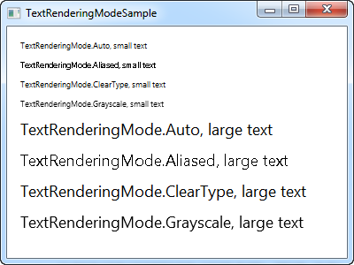

**De TextRenderingMode property**

Zoals je kan zien verschilt de resulterende tekst nogal van uiterlijk. En nogmaals wijzigt u dit best pas in speciale omstandigheden.

# Layout management (!)

## Inleiding tot WPF Panel

Panel behoort tot de belangrijkste controls van WPF. Een Panel gedraagt zich als een container voor andere controls en regelt de layout van je vensters. Aangezien een venster slechts een enkel (1) onderliggende control kan bevatten, wordt een panel vaak gebruikt op de beschikbare ruimte op te delen in gebieden, waarbij elk gebied een control of een ander panel kan bevatten (een panel is namelijk ook een control).

Panels bestaan er in verschillende soorten met elk hun eigen specifiek layout-gedrag. Het juiste panel kiezen is met andere woorden essentieel wanneer je een bepaald gedrag en een bepaalde layout wenst te realiseren. Vooral wanneer je WPF begint te gebruiken, kan dit wat moeilijker zijn. We bespreken hieronder de verschillende panels en geven je een paar tips mee in welke gevallen je ze best gebruikt.

- **Canvas**: een eenvoudig panel dat sterk doet denken aan hoe WinForms de problematiek benadert. Canvas laat toe specifieke coordinaten toe te kennen aan de onderliggende controls, zodat je alles volledig onder controle hebt. Dit is echter niet bijzonder flexibel, aangezien je de onderliggende controls zelf correct manueel moet (ver-)plaatsen en alligneren wanneer de hogerliggende control van omvang wijzigt. Gebruik Canvas met andere woorden alleen als je volledige controle wenst over de plaatsing van alle onderliggende controls.

- **WrapPanel**: WrapPanel plaatst onderliggende controls naast elkaar, horizontaal (standaard) of verticaal, tot er geen plaats meer is; vervolgens plaatst het de overblijvende onderliggende controls op de volgende lijn. Gebruik WrapPanel wanneer je je controls horizontaal of verticaal wenst op te lijsten tot er geen plaats meer is en je wenst dat de overblijvende controls automatisch opnieuw in een rij/kolom geplaatst worden.

- **StackPanel**: StackPanel wordt redelijk veel gebruikt en gedraagt zich tot op zekere hoogte als WrapPanel, maar in plaats van overblijvende controls op een nieuwe rij of kolom te plaatsen, groeit StackPanel automatisch mee.

- **DockPanel**: DockPanel laat toe onderliggende controls bovenaan, onderaan, links of rechts te "docken". Standaard wordt de laatste control gebruikt om de overblijvende plaats volledig op te vullen indien geen specifieke dockingpositie opgegeven is. Je kan hetzelfde bereiken met Grid, maar in eenvoudigere situaties is DockPanel eenvoudiger te gebruiken.

- **Grid**: Grid is misschien het meest complexe panel type, maar tegelijk ook het meest gebruikte. Een Grid kan meerdere rijen en kolommen bevatten. Je definieert een hoogte voor elke rij en een breedte voor elke kolom. De hoogte/breedte kan opgegeven worden in een absoluut aantal pixels, een percentage van de beschikbare ruimte of als "auto" waarbij de rij of kolom zich aanpast aan de hoogste/breedste onderliggende control. Gebruik Grid wanneer de andere panel types niet toelaten om de layout en het gedrag te implementeren dat je wenst te realiseren, bijvoorbeeld wanneer je behoefte hebt aan meerdere kolommen. Grid is ook interessant wanneer je meerdere types panel wenst te combineren.

- **UniformGrid**: UniformGrid gedraagt zich als Grid, met een belangrijk verschil: alle rijen en kolommen zullen dezelfde omvang hebben. Gebruik UniformGrid wanneer je Grid-gedrag wenst zonder dat je er nood aan hebt om de rijen en kolommen een specifiek andere omvang in hoogte of breedte mee te geven.

We laten hier enkel de belangrijkste layout middelen aan bod komen: Canvas, StackPanel, Grid. WrapPanel werkt vrij analoog aan StackPanel en UniformGrid vrij analoog aan Grid. Voor alle geldt dat je de details kan opzoeken.

## Canvas

Canvas is hoogstwaarschijnlijk het eenvoudigste type Panel: het doet niet echt iets standaard. Je kan er enkel controls in plaatsen en zelf positioneren met behulp van expliciete coordinaten. Canvas doet echter niets voor jou wanneer je je venster groter of kleiner maakt.

We starten met een heel eenvoudig voorbeeld dat vooral wil laten zien hoe weinig Canvas standaard voor je doet:

```csharp
<Window x:Class="WpfTutorialSamples.Panels.Canvas"
        xmlns="http://schemas.microsoft.com/winfx/2006/xaml/presentation"
        xmlns:x="http://schemas.microsoft.com/winfx/2006/xaml"
        Title="Canvas" Height="200" Width="200">
	<Canvas>
		<Button>Button 1</Button>
		<Button>Button 2</Button>
	</Canvas>
</Window>
```

**Een eenvoudig Canvas**

Zoals je ziet, we hebben twee knoppen en beide staan op exact dezelfde plaats, dus enkel de laatste knop is zichtbaar. Canvas doet absoluut niets: je moet zelf coordinaten geven aan de onderliggende controls! Dit kan je doen door met Canvas properties Left, Right, Top and Bottom. Deze laten je toe de positie te specificeren relatief ten opzichte van de vier hoeken van Canvas. Standaard zijn deze properties alle gezet op NaN (Not a Number), zodat Canvas de onderliggende controls plaatst in de bovenlinkerhoek. Je kan dit eenvoudig veranderen:

```csharp
<Window x:Class="WpfTutorialSamples.Panels.Canvas"
        xmlns="http://schemas.microsoft.com/winfx/2006/xaml/presentation"
        xmlns:x="http://schemas.microsoft.com/winfx/2006/xaml"
        Title="Canvas" Height="200" Width="200">
	<Canvas>
		<Button Canvas.Left="10">Top left</Button>
		<Button Canvas.Right="10">Top right</Button>
		<Button Canvas.Left="10" Canvas.Bottom="10">Bottom left</Button>
		<Button Canvas.Right="10" Canvas.Bottom="10">Bottom right</Button>
	</Canvas>
</Window>
```
 

**Een eenvoudig Canvas met de onderliggende controls expliciet geplaatst**

Merk op dat we enkel de property of properties specificeren die we werkelijk nodig hebben.

In normale gevallen zal je een Top OF Bottom waarde en/of een Left OF Right waarde specificeren.

Zoals we reeds aanhaalden, biedt Canvas je volledige controle over positionering. Het maakt hierbij niet uit of er genoeg plaats voor je onderliggende controls is of niet - desnoods overlappen deze elkaar. Dit maakt Canvas een slechte keuze voor het maken van een dialoogvenster, maar, zoals de naam Canvas laat vermoeden, dit is wel perfect wanneer je wenst te tekenen (Painting). WPF heeft een heleboel controls die je op een Canvas kan plaatsen om mooie illustraties te maken.

 


### Z-Index

In het volgende voorbeeld gebruiken we een aantal vormgerelateerde controls van WPF om een belangrijk aspect van onder andere Canvas te tonen: de zogenaamde Z-Index. Indien twee of meer controls op een Canvas elkaar overlappen, dan wordt degene met de laatste markup bovenaan getoond (neemt voorrang). Door property ZIndex van de Panel class te specificeren, kan dit eenvoudig gewijzigd worden.

Om te beginnen een voorbeeld zonder ZIndex property:

```csharp
<Window x:Class="WpfTutorialSamples.Panels.CanvasZIndex"
        xmlns="http://schemas.microsoft.com/winfx/2006/xaml/presentation"
        xmlns:x="http://schemas.microsoft.com/winfx/2006/xaml"
        Title="CanvasZIndex" Height="275" Width="260">
    <Canvas>
        <Ellipse Fill="Gainsboro" Canvas.Left="25" Canvas.Top="25" Width="200" Height="200" />
        <Rectangle Fill="LightBlue" Canvas.Left="25" Canvas.Top="25" Width="50" Height="50" />
        <Rectangle Fill="LightCoral" Canvas.Left="50" Canvas.Top="50" Width="50" Height="50" />
        <Rectangle Fill="LightCyan" Canvas.Left="75" Canvas.Top="75" Width="50" Height="50" />
    </Canvas>
</Window>
```

 

**Een Canvas met overlappende controls zonder ZIndex property**

Merk op dat de rechthoeken, die na de cirkel gedefinieerd zijn, de cirkel overlappen. We veranderen dit nu:

```csharp
<Window x:Class="WpfTutorialSamples.Panels.CanvasZIndex"
        xmlns="http://schemas.microsoft.com/winfx/2006/xaml/presentation"
        xmlns:x="http://schemas.microsoft.com/winfx/2006/xaml"
        Title="CanvasZIndex" Height="275" Width="260">
    <Canvas>
        <Ellipse Panel.ZIndex="2" Fill="Gainsboro" Canvas.Left="25" Canvas.Top="25" Width="200" Height="200" />
        <Rectangle Panel.ZIndex="3" Fill="LightBlue" Canvas.Left="25" Canvas.Top="25" Width="50" Height="50" />
        <Rectangle Panel.ZIndex="2" Fill="LightCoral" Canvas.Left="50" Canvas.Top="50" Width="50" Height="50" />
        <Rectangle Panel.ZIndex="4" Fill="LightCyan" Canvas.Left="75" Canvas.Top="75" Width="50" Height="50" />
    </Canvas>
</Window>
```

 

**Een Canvas met ovelrappende elementen, maar met ZIndex property**

De standaardwaarde voor ZIndex is 0, maar we kunnen een specifieke ZIndex waarde toekennen aan elke vorm. een element met hogere z-index waarde overlapt een element met een lagere waarde. Indien twee z-index waarden gelijk zijn, "wint" het laatst gedefinieerde element. Zoals je ziet, verandert de ZIndex property het uitzicht:

## StackPanel

StackPanel gelijkt sterk op WrapPanel met belangrijk verschil: StackPanel "wrapt" de inhoud niet. Integendeel, StackPanel spreidt uit in een bepaalde richting. We starten met een eenvoudig voorbeeld:

```csharp
<Window x:Class="WpfTutorialSamples.Panels.StackPanel"
        xmlns="http://schemas.microsoft.com/winfx/2006/xaml/presentation"
        xmlns:x="http://schemas.microsoft.com/winfx/2006/xaml"
        Title="StackPanel" Height="160" Width="300">
	<StackPanel>
		<Button>Button 1</Button>
		<Button>Button 2</Button>
		<Button>Button 3</Button>
		<Button>Button 4</Button>
		<Button>Button 5</Button>
		<Button>Button 6</Button>
	</StackPanel>
</Window>
```


**Een eenvoudige StackPanel in Vertical mode**

Het eerste dat opvalt, is dat StackPanel geen rekening houdt met het al dan niet beschikbaar zijn van voldoende ruimte voor de inhoud. Uit zichzelf voegt StackPanel geen scroll-mogelijkheid toe (je kan echter wel zelf een ScrollViewer control introduceren).

Je merkt misschien ook op dat de standaardmode van StackPanel "Vertical" is in tegenstelling tot WrapPanel, waarbij de standaardorientatie "Horizontal" is. Je kan dit echter voor beide controls eenvoudig wijzigen door property Orientation te specificeren:

```csharp
<StackPanel Orientation="Horizontal">
```

 

**Een eenvoudige StackPanel in Horizontal mode**

Een StackPanel verbreedt de onderliggende control automatisch. Met orientatie "Vertical" worden alle onderliggende controls horizontaal uitgebreid en bij orientatie "Horizontal" gebeurt dit verticaal. StackPanel doet dit door properties HorizontalAlignment en VertialAlignment op "Stretch" te zetten, maar je kan dit wijzigen indien je dat wenst. Een voorbeeld: 

```csharp
<Window x:Class="WpfTutorialSamples.Panels.StackPanel"
        xmlns="http://schemas.microsoft.com/winfx/2006/xaml/presentation"
        xmlns:x="http://schemas.microsoft.com/winfx/2006/xaml"
        Title="StackPanel" Height="160" Width="300">
	<StackPanel Orientation="Horizontal">
		<Button VerticalAlignment="Top">Button 1</Button>
		<Button VerticalAlignment="Center">Button 2</Button>
		<Button VerticalAlignment="Bottom">Button 3</Button>
		<Button VerticalAlignment="Bottom">Button 4</Button>
		<Button VerticalAlignment="Center">Button 5</Button>
		<Button VerticalAlignment="Top">Button 6</Button>
	</StackPanel>
</Window>
```

 

**Een StackPanel in Vertical mode met de controls verschillend gelijnd**

We gebruiken Top, Center en Bottom om de knoppen in een mooi patroon te plaatsen. Hetzelfde kan uiteraard toegepast worden op een StackPanel dat verticaal georienteerd is (gebruik in dit gevalHorizontalAlignment):

```csharp
<Window x:Class="WpfTutorialSamples.Panels.StackPanel"
        xmlns="http://schemas.microsoft.com/winfx/2006/xaml/presentation"
        xmlns:x="http://schemas.microsoft.com/winfx/2006/xaml"
        Title="StackPanel" Height="160" Width="300">
	<StackPanel Orientation="Vertical">
		<Button HorizontalAlignment="Left">Button 1</Button>
		<Button HorizontalAlignment="Center">Button 2</Button>
		<Button HorizontalAlignment="Right">Button 3</Button>
		<Button HorizontalAlignment="Right">Button 4</Button>
		<Button HorizontalAlignment="Center">Button 5</Button>
		<Button HorizontalAlignment="Left">Button 6</Button>
	</StackPanel>
</Window>
```
 

**Een StackPanel in Horizontal mode met de controls verschillend gelijnd**

Zoals je kan zien, zijn de controls nog steeds georganiseerd van boven naar beneden, maar in plaats van alle dezelfde breedte te hebben, zijn de controls links, rechts of centraal geplaatst.

## Grid

### Inleiding

De Grid is waarschijnlijk een van het meest complexe type panelen. Een Grid can bestaan uit verschillende rijen en kolommen. Je defineert een hoogte voor elke rij en een breedte voor elke kolom, in ofwel een absolute waarde van pixels, of in een percentage van de beschikbare ruimte of als auto, waar de rij of kolom zich automatish zal aanpassen in grote afhankelijk van de inhoud. Gebruik de Grid wanneer de andere panelen hun functie niet goed uitvoeren, e.g. wanneer je meerdere kolommen nodig heb en vaak in combinatie met andere panelen.

In de meest basis vorm, zal de Grid alle controls nemen die je erin stopt, rek het om zo veel mogelijk beschikbare ruimte te gebruiken en plaats het bovenop elkaar.

```csharp
<Window x:Class="WpfTutorialSamples.Panels.Grid"
        xmlns="http://schemas.microsoft.com/winfx/2006/xaml/presentation"
        xmlns:x="http://schemas.microsoft.com/winfx/2006/xaml"
        Title="Grid" Height="300" Width="300">
    <Grid>
		<Button>Button 1</Button>
		<Button>Button 2</Button>
	</Grid>
</Window>
```

 

**A simple Grid**

Zoals je kan zien, de laatste control krijgt de voorste positie, dat hier betekent dat je zelfs de eerste knop niet kan zien. Niet erg handig voor de meeste situaties, dus gaan we proberen de ruimte in stukken op te delen, waar de Grid zo goed in is. We doen dat door het gebruik van ColumnDefinitions en RowDefinitions. In het eerste voorbeeld houden we het bij kolommen.

```csharp
<Window x:Class="WpfTutorialSamples.Panels.Grid"
        xmlns="http://schemas.microsoft.com/winfx/2006/xaml/presentation"
        xmlns:x="http://schemas.microsoft.com/winfx/2006/xaml"
        Title="Grid" Height="300" Width="300">
    <Grid>
		<Grid.ColumnDefinitions>
			<ColumnDefinition Width="*" />
			<ColumnDefinition Width="*" />
		</Grid.ColumnDefinitions>
		<Button>Button 1</Button>
		<Button Grid.Column="1">Button 2</Button>
	</Grid>
</Window>
```

 

**Een Grid verdeeld in twee kolommen**

In dit voorbeeld, hebben we simpel de beschikbare ruimte verdeeld in twee kolommen, waardoor ze de ruimte evenveel zullen delen, met het gebruik van een "star width" (dit zal later uitgelegd worden). Op de tweede knop, gebruik ik een zogenoemde Attached eigenschap om de knop te plaatsen in de tweede kolom (0 is de eerste kolom, 1 is de tweede enzovoort). We gebruikten deze eigenschap ook bij de eerste knop, maar dat wordt automatisch toegewezen aan de eerste kolom en de eerste rij, wat precies is wat we hier willen.

Zoals jullie kunnen zien nemen de controls alle beschikbare ruimte in, dat is het standaard gedrag wanneer de Grid zijn child control rangschikt. Het doet dit aan de hand van de HorizontalAlignment en VerticalAlignment op zijn child controls om te rekken.
In sommige situaties wil je misschien dat ze enkel de ruimte innemen die ze nodig hebben en/of beheren hoe ze geplaatst zijn in de Grid. De eenvoudigste manier om dit te doen is door de HorizontalAlignment en VerticalAlignment rechtstreeks op de controls te zetten die je wilt manipuleren. Here's is een aangepaste versie van het bovenstaande voorbeeld:

```csharp
<Window x:Class="WpfTutorialSamples.Panels.Grid"
        xmlns="http://schemas.microsoft.com/winfx/2006/xaml/presentation"
        xmlns:x="http://schemas.microsoft.com/winfx/2006/xaml"
        Title="Grid" Height="300" Width="300">
    <Grid>
		<Grid.ColumnDefinitions>
			<ColumnDefinition Width="*" />
			<ColumnDefinition Width="*" />
		</Grid.ColumnDefinitions>		
		<Button VerticalAlignment="Top" HorizontalAlignment="Center">Button 1</Button>
		<Button Grid.Column="1" VerticalAlignment="Center" HorizontalAlignment="Right">Button 2</Button>
	</Grid>
</Window>
```

 

**een Grid verdeeld in twee kolommen met specifieke alignment**

Zoals je kan zien van de resulterende screenshot is de eerste knop nu helemaal boven en centraal geplaatst. De tweede knop is nu in het midden geplaatst en recht uitgelijnd.

### Rijen en kolommen

We tonen enkele geavanceerde layouts op basis van Grid waaruit de kracht van deze layout duidelijker blijkt. Laat ons eerst meer kolommen en rijen introduceren om een echt tabulair resultaat op te bouwen:

```csharp
<Window x:Class="WpfTutorialSamples.Panels.TabularGrid"
        xmlns="http://schemas.microsoft.com/winfx/2006/xaml/presentation"
        xmlns:x="http://schemas.microsoft.com/winfx/2006/xaml"
        Title="TabularGrid" Height="300" Width="300">
    <Grid>
		<Grid.ColumnDefinitions>
			<ColumnDefinition Width="2*" />
			<ColumnDefinition Width="1*" />
			<ColumnDefinition Width="1*" />
		</Grid.ColumnDefinitions>
		<Grid.RowDefinitions>
			<RowDefinition Height="2*" />
			<RowDefinition Height="1*" />
			<RowDefinition Height="1*" />
		</Grid.RowDefinitions>
		<Button>Button 1</Button>
		<Button Grid.Column="1">Button 2</Button>
		<Button Grid.Column="2">Button 3</Button>
		<Button Grid.Row="1">Button 4</Button>
		<Button Grid.Column="1" Grid.Row="1">Button 5</Button>
		<Button Grid.Column="2" Grid.Row="1">Button 6</Button>
		<Button Grid.Row="2">Button 7</Button>
		<Button Grid.Column="1" Grid.Row="2">Button 8</Button>
		<Button Grid.Column="2" Grid.Row="2">Button 9</Button>
	</Grid>
</Window>
```

 

**Een grid met verschillende kolommen en rijen (tabel)**

We zien in totaal 9 knoppen, verdeeld over 3 rijen en 3 kolommen. We gebruiken opnieuw een zogenaamde "ster-gebaseerde" breedte, maar kennen ook een nummer toe. 2* betekent dat voor de breedte twee keer de breedte van 1* gebruikt wordt (of gewoon ster zonder 1, want dat is hetzelfde als 1*).

Merk ook op dat we de properties Grid.Row en Grid.Column gebruiken om de knoppen toe te wijzen aan cellen. Deze properties moeten niet gespecificeerd worden voor de eerste rij en de eerste kolom, wel voor alle andere.

### Units
Tot nu toe gebruikten we "ster"- breedte/hoogte, wat betekent dat de rij of kolom een bepaald percentage van de gecombineerde ruimte opneemt. Je kan echter ook nog absolute eenheden opgeven of "Auto". Laat ons een Grid aanmaken waarin we deze mogelijkheden mengen:

```csharp
<Window x:Class="WpfTutorialSamples.Panels.GridUnits"
        xmlns="http://schemas.microsoft.com/winfx/2006/xaml/presentation"
        xmlns:x="http://schemas.microsoft.com/winfx/2006/xaml"
        Title="GridUnits" Height="200" Width="400">
	<Grid>
		<Grid.ColumnDefinitions>
			<ColumnDefinition Width="1*" />
			<ColumnDefinition Width="Auto" />
			<ColumnDefinition Width="100" />
		</Grid.ColumnDefinitions>
		<Button>Button 1</Button>
		<Button Grid.Column="1">Button 2 with long text</Button>
		<Button Grid.Column="2">Button 3</Button>
	</Grid>
</Window>
```

 

**Een Grid waarbij de kolommen varieren in breedte**

In dit voorbeeld heeft de eerste knop een "ster"-breedte, de tweede een "Auto"-breedte en de laatste een statische breedte van 100 pixels.

Het resultaat zie je in het screenshot: de tweede knop neemt exact de ruimte in die er nodig is, de derde neemt precies 100 pixels en de eerste neemt al de rest. 

Indien een of meer kolommen (of rijen) een variabele (ster-)breedte hebben, verdelen deze onderling de breedte/hoogte die nog niet gebruikt werd door kolommen (of rijen) met een absolute waarde of "Auto". Dit wordt veel duidelijker wanneer we het venster van omvang vergroten of verkleinen:

 


De variabele kolommen (of rijen) groeien of krimpen, de andere blijven even groot.

## Spanning

Standaard Grid gedrag houdt in dat een control slechts een enkele cel in beslag neemt, maar je kan specificeren dat een control meer kolommen of rijen mag betrekken. Dit is mogelijk met "Attached" properties ColumnSpan en RowSpan.

Een eenvoudig voorbeeld waarbij we ColumnSpan gebruiken:

```csharp
<Window x:Class="WpfTutorialSamples.Panels.GridColRowSpan"
        xmlns="http://schemas.microsoft.com/winfx/2006/xaml/presentation"
        xmlns:x="http://schemas.microsoft.com/winfx/2006/xaml"
        Title="GridColRowSpan" Height="110" Width="300">
	<Grid>
		<Grid.ColumnDefinitions>			
			<ColumnDefinition Width="1*" />
			<ColumnDefinition Width="1*" />
		</Grid.ColumnDefinitions>
		<Grid.RowDefinitions>
			<RowDefinition Height="*" />
			<RowDefinition Height="*" />
		</Grid.RowDefinitions>
		<Button>Button 1</Button>
		<Button Grid.Column="1">Button 2</Button>
		<Button Grid.Row="1" Grid.ColumnSpan="2">Button 3</Button>
	</Grid>
</Window>
```

 

**Een Grid met column spanning toegepast op een van de controls**

We definieren twee kolommen en twee rijen die de beschikbare ruimte evenwichtig verdelen onder elkaar. De derde knop neemt twee kolommen in beslag. We zouden ook een combinatie van panels gebruikt kunnen hebben om dit effect te bereiken, maar in meer ingewikkelde gevallen is ColumnSpan echt wel nuttig. We tonen een beter voorbeeld:

```csharp
<Window x:Class="WpfTutorialSamples.Panels.GridColRowSpanAdvanced"
        xmlns="http://schemas.microsoft.com/winfx/2006/xaml/presentation"
        xmlns:x="http://schemas.microsoft.com/winfx/2006/xaml"
        Title="GridColRowSpanAdvanced" Height="300" Width="300">
    <Grid>
		<Grid.ColumnDefinitions>
			<ColumnDefinition Width="*" />
			<ColumnDefinition Width="*" />
			<ColumnDefinition Width="*" />
		</Grid.ColumnDefinitions>
		<Grid.RowDefinitions>
			<RowDefinition Height="*" />
			<RowDefinition Height="*" />
			<RowDefinition Height="*" />
		</Grid.RowDefinitions>
		<Button Grid.ColumnSpan="2">Button 1</Button>
		<Button Grid.Column="3">Button 2</Button>
		<Button Grid.Row="1">Button 3</Button>
		<Button Grid.Column="1" Grid.Row="1" Grid.RowSpan="2" Grid.ColumnSpan="2">Button 4</Button>
		<Button Grid.Column="0" Grid.Row="2">Button 5</Button>
	</Grid>
</Window>
```

 

**Een Grid met kolom- en rij-"spanning" toegepast op meer controls**

Zoals je ziet kunnen we een control zowel meer kolommen als meer rijen laten bezetten.

### Grid voorbeeld: contactformulier
We passen wat we leerden, toe op een concreter voorbeeld: een contactformulier. Wat we hier doen, zal je vaak kunnen toepassen op de dialogen die je maakt.

We starten eenvoudig en tonen een basisversie van het contactformulier. Dit formulier gebruikt 3 rijen, 2 met "Auto"-hoogte en de laatste met "ster"-hoogte, zodat deze de rest van de ruimte inneemt:

```csharp
<Window x:Class="WpfTutorialSamples.Panels.GridContactForm"
        xmlns="http://schemas.microsoft.com/winfx/2006/xaml/presentation"
        xmlns:x="http://schemas.microsoft.com/winfx/2006/xaml"
        Title="GridContactForm" Height="300" Width="300">
    <Grid>
		<Grid.RowDefinitions>
			<RowDefinition Height="Auto" />
			<RowDefinition Height="Auto" />
			<RowDefinition Height="*" />
		</Grid.RowDefinitions>		
		<TextBox>Name</TextBox>
		<TextBox Grid.Row="1">E-mail</TextBox>
		<TextBox Grid.Row="2" AcceptsReturn="True">Comment</TextBox>		
	</Grid>
</Window>
```

 

**Een contactformulier, versie 1**

Zoals je kan zien, neemt de laatste TextBox de rest van de ruimte in, terwijl de eerste twee enkel de ruimte innemen die ze nodig hebben. Probeer het venster van grootte te wijzigen en je zal zien dat de TextBox "commentaar" meegroeit.

In volgend eenvoudig voorbeeld zijn er geen labels voorzien om de betekenis van de velden uit te leggen. De verklarende tekst is in de plaats daarvan opgenomen in de velden zelf (normaal doet men dit niet onder Windows). Laat ons het uitzicht en de bruikbaarheid wat verbeteren:

```csharp
<Window x:Class="WpfTutorialSamples.Panels.GridContactFormTake2"
        xmlns="http://schemas.microsoft.com/winfx/2006/xaml/presentation"
        xmlns:x="http://schemas.microsoft.com/winfx/2006/xaml"
        Title="GridContactFormTake2" Height="300" Width="300">
	<Grid Margin="10">
		<Grid.ColumnDefinitions>
			<ColumnDefinition Width="Auto" />
			<ColumnDefinition Width="*" />
		</Grid.ColumnDefinitions>
		<Grid.RowDefinitions>
			<RowDefinition Height="Auto" />
			<RowDefinition Height="Auto" />
			<RowDefinition Height="*" />
		</Grid.RowDefinitions>
		<Label>Name: </Label>
		<TextBox Grid.Column="1" Margin="0,0,0,10" />
		<Label Grid.Row="1">E-mail: </Label>
		<TextBox Grid.Row="1" Grid.Column="1" Margin="0,0,0,10" />
		<Label Grid.Row="2">Comment: </Label>
		<TextBox Grid.Row="2" Grid.Column="1" AcceptsReturn="True" />
	</Grid>
</Window>
```

 

**Contactformulier, versie 2**

Misschien is het commentaarveld redelijk vanzelfsprekend? In dat geval kan je de label weglaten en ColumnSpan gebruiken om meer plaats op te nemen voor de TextBox:

```csharp
<TextBox Grid.ColumnSpan="2" Grid.Row="2" AcceptsReturn="True" />
```

 

**Contactformulier, versie 3**

Zoals je kon zien is Grid een zeer krachtig layout-middel.

# UserControl

# Data binding (!)

## Inleiding

Data binding is een algemene techniek die twee gegevensvoorstellingen aan elkaar koppelt en de gegevens gesynchroniseerd houdt. Bij WPF heeft Microsoft een zeer belangrijke plaats ingeruimd voor data binding: het is een concept dat je zeker onder de knie moet hebben. Naarmate je er gebruik van leert maken, zal je de mogelijkheden en het gemak ervan leren apprecieren en zien dat coderen er eenvoudiger door wordt. 

Data binding is in WPF de belangrijkste manier om gegevens van code naar je gebruikersinterface te brengen/aan je gebruikersinterface te koppelen. Het is wel degelijk nog mogelijk om een control manueel in code-behind van gegevens te voorzien, maar dit is niet aangeraden, complexer, moeilijker te onderhouden en niet "mooi".

## Hello bound world!

We starten met een heel eenvoudig voorbeeld van data binding:

```csharp
<Window x:Class="WpfTutorialSamples.DataBinding.HelloBoundWorldSample"
        xmlns="http://schemas.microsoft.com/winfx/2006/xaml/presentation"
        xmlns:x="http://schemas.microsoft.com/winfx/2006/xaml"
        Title="HelloBoundWorldSample" Height="110" Width="280">
    <StackPanel Margin="10">
		<TextBox Name="txtValue" />
		<WrapPanel Margin="0,10">
			<TextBlock Text="Value: " FontWeight="Bold" />
			<TextBlock Text="{Binding Path=Text, ElementName=txtValue}" />
		</WrapPanel>
	</StackPanel>
</Window>
```

 

**Een eenvoudig voorbeeld van data binding tussen controls**

Dit eenvoudige voorbeeld toont hoe we de waarde van TextBlock koppelen aan de Text property van TextBox. Zoals je kan zien in het screenshot wordt TectBlock automatisch aangepast wanneer je tekst ingeeft op de TextBox. Zonder binding zou dit vereisen dat we naar een event luisteren op de TextBox en vervolgens de TextBlock aanpassen telkens wanneer een verandering toekomt - code die nu vervangen wordt door een elegante binding.

### Binding syntax

Alle magie grijpt plaats tussen de accolades (deze representeren wat we in XAML noemen een "Markup Extension"). Voor data binding gebruiken we de Binding extensie die ons toelaat om de binding relatie van de Text property te beschrijven. In de meest eenvoudige vorm ziet een binding er als volgt uit:
```csharp
{Binding}
```

Deze binding geeft heel eenvoudigweg de huidige "data context" terug (zie verder). Dit kan op zich nuttig zijn, maar meestal zullen we een property "binden" aan een andere property. Een dergelijke binding ziet er als volgt uit:

```csharp
{Binding Path=NameOfProperty}
```

Path geeft aan welke property je wenst te binden, maar aangezien "Path=" standaard is, mag je het ook weglaten:

```csharp
{Binding NameOfProperty}
```

Je zal veel voorbeelden zien waarbij "Path=" weggelaten wordt en veel gevallen waarbij dit wel vermeld wordt. De keuze is aan jou. Een binding heeft naast Path vele andere properties, zoals bijvoorbeeld ElementName. Dit laat ons toe direct te binden aan een ander UI element als bron. Elke property van de binding die we specificeren, wordt gescheiden door een komma:

```csharp
{Binding Path=Text, ElementName=txtValue}
```

## DataContext

De DataContext property is de standaardbron van je bindings, tenzij je expliciet een andere bron opgeeft, zoals we bijvoorbeeld deden met de ElementName property. De property DataContext is gedefinieerd op class FrameworkElement waarvan de meeste controls, inclusief WPF Window, overerven. Eenvoudig gesteld laat DataContext je toe een basis voor je bindings te specificeren.
Er is geen standaardbron voor de DataContext property (DataContext is dus null om te beginnen), maar daar DataContext overgeerft wordt doorheen de hierarchie van controls, kan je de DataContext van het Window zetten en deze DataContext vervolgens gebruiken in alle ondereliggende controls. We illustreren dit met een voorbeeld:

```csharp
<Window x:Class="WpfTutorialSamples.DataBinding.DataContextSample"
        xmlns="http://schemas.microsoft.com/winfx/2006/xaml/presentation"
        xmlns:x="http://schemas.microsoft.com/winfx/2006/xaml"
        Title="DataContextSample" Height="130" Width="280">
	<StackPanel Margin="15">
		<WrapPanel>
			<TextBlock Text="Window title:  " />
			<TextBox Text="{Binding Title, UpdateSourceTrigger=PropertyChanged}" Width="150" />
		</WrapPanel>
		<WrapPanel Margin="0,10,0,0">
			<TextBlock Text="Window dimensions: " />
			<TextBox Text="{Binding Width}" Width="50" />
			<TextBlock Text=" x " />
			<TextBox Text="{Binding Height}" Width="50" />
		</WrapPanel>
	</StackPanel>
</Window>
```

```csharp
using System;
using System.Windows;

namespace WpfTutorialSamples.DataBinding
{
	public partial class DataContextSample : Window
	{
		public DataContextSample()
		{
			InitializeComponent();
			this.DataContext = this;
		}
	}
}
```

 

**Verschillende data bindings in de DataContext**

De code-behind van dit voorbeeld heeft slechts een (1) interessante lijn code: na de standaard oproep InitalizeComponent() kennen we "this" toe aan de  DataContext: zo vertellen we Window dat we willen dat het zichzelf als de data context gebruikt.

In de XAML gebruiken we dit om uiteenlopende Window properties zoals Title, Width en Height te binden aan een concrete waarde. Aangezien Window een DataContext heeft die doorgegeven wordt aan alle child controls, moeten we niet bij elke onderliggende control een brond voor de binding opgeven.

Probeer het voorbeeld uit te voeren en verander het venster van omvang - je zal zien dat de veranderingen in omvang onmiddellijk effect hebben op de textboxes. Je kan een andere naam voor de titel opgeven in de eerste textbox, maar je zal zien dat de verandering pas doorgegeven wordt wanneer je de focus verlegt naar een andere control. Hoe dit komt en wat je eraan kan doen, zien we later.

### Samenvatting

De DataContext property laat toe om slechts eenmaal hogerop in de hierarchie van controls de binding context te bepalen: dit is heel handig en bespaart veel codeerwerk en lijnen code. Je kan echter makkelijk de keten doorbreken en zelf op een lager niveau een andere DataContext opgeven.

## Reageren op wijzigingen

Tot nu toe maakten we doorgaans bindings aan tussen UI elementen en bestaande classes, maar in echte applicaties wens je te binden aan je eigen gegevensobjecten. Dit is even eenvoudig, maar je zal snel constateren dat veranderingen aan je gegevens niet automatisch een effect hebben op de UI elementen. Dit vraagt een beetje extra werk dat WPF echter gelukkig redelijk eenvoudig maakt.

### Reageren op wijzingen in de gegevensbron

Er zijn twee situaties waarin je met wijzigingen wenst om te gaan: je brongegevens wijzigen en de UI moet zich aanpassen en omgekeerd, er is een wijziging op UI niveau (bijvoorbeeld de gebruiker geeft een tekst in) en je wenst je bron aangepast te zien. Je kan dit op verschillende manieren realiseren in WPF, maar de twee meest eenvoudige constructies zijn de ObservableCollection en de INotifyPropertyChanged interface.

Het volgende voorbeeld toont aan waarom we deze nodig hebben:

```csharp
<Window x:Class="WpfTutorialSamples.DataBinding.ChangeNotificationSample"
        xmlns="http://schemas.microsoft.com/winfx/2006/xaml/presentation"
        xmlns:x="http://schemas.microsoft.com/winfx/2006/xaml"
        Title="ChangeNotificationSample" Height="150" Width="300">
	<DockPanel Margin="10">
		<StackPanel DockPanel.Dock="Right" Margin="10,0,0,0">
			<Button Name="btnAddUser" Click="btnAddUser_Click">Add user</Button>
			<Button Name="btnChangeUser" Click="btnChangeUser_Click" Margin="0,5">Change user</Button>
			<Button Name="btnDeleteUser" Click="btnDeleteUser_Click">Delete user</Button>
		</StackPanel>
		<ListBox Name="lbUsers" DisplayMemberPath="Name"></ListBox>
	</DockPanel>
</Window>
```

```csharp
using System;
using System.Collections.Generic;
using System.Windows;

namespace WpfTutorialSamples.DataBinding
{
	public partial class ChangeNotificationSample : Window
	{
		private List<User> users = new List<User>();

		public ChangeNotificationSample()
		{
			InitializeComponent();

			users.Add(new User() { Name = "John Doe" });
			users.Add(new User() { Name = "Jane Doe" });

			lbUsers.ItemsSource = users;
		}

		private void btnAddUser_Click(object sender, RoutedEventArgs e)
		{
			users.Add(new User() { Name = "New user" });
		}

		private void btnChangeUser_Click(object sender, RoutedEventArgs e)
		{
			if(lbUsers.SelectedItem != null)
				(lbUsers.SelectedItem as User).Name = "Random Name";
		}

		private void btnDeleteUser_Click(object sender, RoutedEventArgs e)
		{
			if(lbUsers.SelectedItem != null)
				users.Remove(lbUsers.SelectedItem as User);
		}
	}

	public class User
	{
		public string Name { get; set; }
	}
}
```

 

**Geen notificaties van wijzigingen**

Voer dit voorbeeld uit en constateer dat, zelfs al voeg je een element toe aan de lijst of verander je de naam van een gebruiker, er niets verandert aan de UI. Het voorbeeld is redelijk eenvoudig met een User class die de naam van de gebruiker bijhoudt en een ListBox die gebruikers toont samen met enkele knoppen om de lijst en de inhoud van de lijst te manipuleren. De ItemsSource van de lijst is een lijst van een paar gebruikers die we aanmaken in de constructor van het venster. Het probleem is dat geen enkele knop lijkt te werken. Laat ons proberen dit aan te passen in twee eenvoudige stappen.

#### Reflecteer veranderingen in de bronlijst

De eerste stap is maken dat de UI reageert op veranderingen aan de bronlijst (ItemsSource), wat zou moeten gebeuren wanneer we een gebruiker toevoegen of verwijderen. Wat we nodig hebben is een lijst die de UI verwittigt van wijzigingen aan de inhoud. Gelukkig voorziet WPF hierin: een dergelijke lijst noemt ObservableCollection en je kan deze gebruiken als een gewone List<T> met slechts een paar wijzigingen.

In het voorbeeld hieronder vervangen we List<User> door ObservableCollection<User> - meer moet je niet doen: de Add en Delete knop werken plots, maar de "Change name" knop nog niet omdat de verandering plaatsgrijpt op het niveau van het gebonden object en niet op het niveau van de lijst.

#### Reflecteer veranderingen in gegevensobjecten

De tweede stap is onze eigen class User aanpassen zodat deze de INotifyPropertyChanged interface implementeert. Door dit te doen zijn onze User objects in staat om de UI te verwittigen van aanpassingen. Dit is wat omslachtiger dan het inzetten van ObservableCollection<T>, maar nog steeds redelijk eenvoudig wanneer je beseft dat je zo automatisch over updates beschikt.

Het volledig aangepaste voorbeeld:

```csharp
<Window x:Class="WpfTutorialSamples.DataBinding.ChangeNotificationSample"
        xmlns="http://schemas.microsoft.com/winfx/2006/xaml/presentation"
        xmlns:x="http://schemas.microsoft.com/winfx/2006/xaml"
        Title="ChangeNotificationSample" Height="135" Width="300">
	<DockPanel Margin="10">
		<StackPanel DockPanel.Dock="Right" Margin="10,0,0,0">
			<Button Name="btnAddUser" Click="btnAddUser_Click">Add user</Button>
			<Button Name="btnChangeUser" Click="btnChangeUser_Click" Margin="0,5">Change user</Button>
			<Button Name="btnDeleteUser" Click="btnDeleteUser_Click">Delete user</Button>
		</StackPanel>
		<ListBox Name="lbUsers" DisplayMemberPath="Name"></ListBox>
	</DockPanel>
</Window>
```

```csharp
using System;
using System.Collections.Generic;
using System.Windows;
using System.ComponentModel;
using System.Collections.ObjectModel;

namespace WpfTutorialSamples.DataBinding
{
	public partial class ChangeNotificationSample : Window
	{
		private ObservableCollection<User> users = new ObservableCollection<User>();

		public ChangeNotificationSample()
		{
			InitializeComponent();

			users.Add(new User() { Name = "John Doe" });
			users.Add(new User() { Name = "Jane Doe" });

			lbUsers.ItemsSource = users;
		}

		private void btnAddUser_Click(object sender, RoutedEventArgs e)
		{
			users.Add(new User() { Name = "New user" });
		}

		private void btnChangeUser_Click(object sender, RoutedEventArgs e)
		{
			if(lbUsers.SelectedItem != null)
				(lbUsers.SelectedItem as User).Name = "Random Name";
		}

		private void btnDeleteUser_Click(object sender, RoutedEventArgs e)
		{
			if(lbUsers.SelectedItem != null)
				users.Remove(lbUsers.SelectedItem as User);
		}
	}

	public class User : INotifyPropertyChanged
	{
		private string name;
		public string Name {
			get { return this.name; }
			set
			{
				if(this.name != value)
				{
					this.name = value;
					this.NotifyPropertyChanged("Name");
				}
			}
		}

		public event PropertyChangedEventHandler PropertyChanged;

		public void NotifyPropertyChanged(string propName)
		{
			if(this.PropertyChanged != null)
				this.PropertyChanged(this, new PropertyChangedEventArgs(propName));
		}
	}
}
```

 

**Notificaties opvangen**

### INotifyPropertyChanged: Alternatieve notaties

Met een lambda kunnen we dit eenvoudiger maken.

## IValueConverter
Tot nu toe gebruikten we eenvoudige data bindings waarbij de twee betrokken properties (UI en achterliggend gegevenstype) van hetzelfde type waren. In de praktijk komt het echter voor dat je gegevens die van het ene type zijn, moet voorstellen op de UI in een andere vorm van een ander type (of omgekeerd).

### Wanneer een "value converter" gebruiken
Value converters worden vaak gebruikt bij data bindings. Voorbeelden:

- Je hebt een CheckBox die een boolean verwacht maar je hangt af van een string "yes" of "no"
- Je hebt een bestandsgrootte in bytes maar wenst het resultaat op het scherm te tonen in megabytes
- Je wenst een bepaald beeld te tonen afhankelijk van een waarde
- ...

In dergelijke gevallen kan je een value converter gebruiken. Dit is een kleine class die de IValueConverter interface implementeert en ageert als een tussenpartij die de waarde tussen bron en doel aanpast/vertaalt, desnoods in de twee richtingen.

### Een eenvoudige value converter
Een WPF value converter implementeert de interface IValueConverter of in sommige gevallen waar complexere constructies nodig zijn, de IMultiValueConverter interface. Beide interfaces vragen enkel dat je twee methods voorziet: Convert() en ConvertBack(). om de waarde te converteren tussen bron en bestemming en omgekeerd.

Laat ons een eenvoudige converter implementeren die een string als invoer neemt en een boolean teruggeeft en omgekeerd. We geven meer uitleg na de code:
```csharp
<Window x:Class="WpfTutorialSamples.DataBinding.ConverterSample"
    xmlns="http://schemas.microsoft.com/winfx/2006/xaml/presentation"
    xmlns:x="http://schemas.microsoft.com/winfx/2006/xaml"
	xmlns:local="clr-namespace:WpfTutorialSamples.DataBinding"
    Title="ConverterSample" Height="140" Width="250">
  <Window.Resources>
    <local:YesNoToBooleanConverter x:Key="YesNoToBooleanConverter" />
  </Window.Resources>
  <StackPanel Margin="10">
    <TextBox Name="txtValue" />
    <WrapPanel Margin="0,10">
       <TextBlock 
	    Text="Current value is: " />
       <TextBlock 
	    Text="{Binding ElementName=txtValue, Path=Text, Converter={StaticResource YesNoToBooleanConverter}}"/>
	</WrapPanel>
	<CheckBox 
	  IsChecked="{Binding ElementName=txtValue, Path=Text, Converter={StaticResource YesNoToBooleanConverter}}" 
	  Content="Yes" />
  </StackPanel>
</Window>
```

```csharp
using System;
using System.Windows;
using System.Windows.Data;

namespace WpfTutorialSamples.DataBinding
{
	public partial class ConverterSample : Window
	{
		public ConverterSample()
		{
			InitializeComponent();
		}
	}

	public class YesNoToBooleanConverter : IValueConverter
	{
		public object Convert(object value, Type targetType, object parameter, 
		System.Globalization.CultureInfo culture)
		{
			switch(value.ToString().ToLower())
			{
				case "yes":
				case "oui":
					return true;
				case "no":
				case "non":
					return false;
			}
			return false;
		}

		public object ConvertBack(object value, Type targetType, object parameter, 
		System.Globalization.CultureInfo culture)
		{
			if(value is bool)
			{
				if((bool)value == true)
					return "yes";
				else
					return "no";
			}
			return "no";
		}
	}
}
```


**Een IValueConverter**

#### Code-behind

We starten vanuit de code zelf. We implementeerden in de code-behind een YesNoToBooleanConverter. De Convert() method neemt aan dat er een string toekomt als invoer (de value parameter) en converteert deze naar een boolean true of false met een fallback waarde van false. We voegden bovendien de mogelijkheid toe om te converteren op basis van de franse taal.
De ConvertBack() method doet precies het omgekeerde: deze neemt aan dat er een boolean waarde als invoer meegegeven wordt en vertaalt naar de strings "yes" of "no" (fallback "no").
Je kan je afvragen welke parameters de twee methods nog meekrijgen, maar we hebben deze niet nodig in het voorliggende voorbeeld: we zullen deze elders toelichten.

#### XAML

In het XAML gedeelte declareren we een instantie van onze converter als een resource voor het venster. We binden de waarde van de TextBox aan het TextBlock en gebruiken de Converter property en onze eigen converter om de waarden heen en weer te vertalen.
Wanneer je dit voorbeeld uitvoert, zal je de waarde op twee plaatsen kunnen veranderen: ofwel schrijf je "yes" in de TextBox (of een andere waarde indien je false wenst te bekomen) of door de CheckBox aan te vinken. Wat je ook doet, de verandering wordt gereflecteerd in de andere control.

### Ingebouwde converters

WPF biedt reeds een 20-tal converters aan, zodat je ze niet meer zelf moet construeren, zie volgende link voor een overzicht: http://stackoverflow.com/questions/505397/built-in-wpf-ivalueconverters

## StringFormat property

Een value converter kan handig zijn, maar in bepaalde eenvoudige gevallen wensen we gewoon een waarde op een andere manier voor te stellen op UI-niveau en kunnen we gebruik maken van de StringFormat property (bijvoobeeld wanneer de waarde niet terug moet van UI naar je eigen code). Voordelen zijn dat we, ondanks verlies van flexibiliteit, geen nieuwe class moeten implementeren en dat de code leesbaarder is.

De StringFormat property doet precies wat de naam beschrijft: de output string wordt geformateerd, eenvoudigweg door de String.Format method op te roepen op de achtergrond. Een voorbeeld:

```csharp
<Window x:Class="WpfTutorialSamples.DataBinding.StringFormatSample"
        xmlns="http://schemas.microsoft.com/winfx/2006/xaml/presentation"
        xmlns:x="http://schemas.microsoft.com/winfx/2006/xaml"
		xmlns:system="clr-namespace:System;assembly=mscorlib"
        Title="StringFormatSample" Height="150" Width="250"
		Name="wnd">
	<StackPanel Margin="10">
		<TextBlock Text="{Binding ElementName=wnd, Path=ActualWidth, StringFormat=Window width: {0:#,#.0}}" />
		<TextBlock Text="{Binding ElementName=wnd, Path=ActualHeight, StringFormat=Window height: {0:C}}" />
		<TextBlock Text="{Binding Source={x:Static system:DateTime.Now}, StringFormat=Date: {0:dddd, MMMM dd}}" />
		<TextBlock Text="{Binding Source={x:Static system:DateTime.Now}, StringFormat=Time: {0:HH:mm}}" />
	</StackPanel>
</Window>
```

 

**De StringFormat property controleert de presentatie**

De eerste TextBlock's krijgen hun waarden door te binden aan het hogerliggende Window en hiervan breedte en hoogte te gebruiken. Met behulp van de StringFormat property worden de waarden geformateerd. Voor de breedte gebruiken we een geformateerde string en voor de hoogte het currency formaat. De waarde wordt bepaald door het double type en bijgevolg kunnen we dezelfde formaatspecificaties gebruiken als we zouden doen bij double.ToString(). Hier vind je een lijst: http://msdn.microsoft.com/en-us/library/dwhawy9k.aspx.

Merk ook op dat we een eigen tekst kunnen opnemen bij StringFormat - je kan met andere woorden eigen tekst introduceren voor of na de waarde die je toont via binding. We omgeven de eigenlijke waarde waaraan we binden, met accolades, met hierbij twee waarden: een referentie naar de waarde die we wensen te formateren en de format string, gescheiden door een dubbelpunt.
In het geval van de laatste twee waarden binden we aan de huidige datum (DateTime.Now) en stellen deze eerst voor als datum in een specifiek formaat en vervolgens als een tijd (uren en minuten) . Je kan meer lezen over het formateren van DataTime door deze link te volgen: http://msdn.microsoft.com/en-us/library/az4se3k1.aspx.

### Formatting zonder extra text

Let erop dat wanneer je format string geen eigen tekst bevat, je een bijkomende set accolades moet gebruiken, zoniet is WPF verward. Een voorbeeld:

```csharp
<Window x:Class="WpfTutorialSamples.DataBinding.StringFormatSample"
        xmlns="http://schemas.microsoft.com/winfx/2006/xaml/presentation"
        xmlns:x="http://schemas.microsoft.com/winfx/2006/xaml"
		xmlns:system="clr-namespace:System;assembly=mscorlib"
        Title="StringFormatSample" Height="150" Width="250"
		Name="wnd">
	<WrapPanel Margin="10">
		<TextBlock Text="Width: " />
		<TextBlock Text="{Binding ElementName=wnd, Path=ActualWidth, StringFormat={}{0:#,#.0}}" />
	</WrapPanel>
</Window>
```

### Een specifieke Culture gebruiken

Indien je een specifieke culture wenst te gebruiken, dan kan dat. De binding zal de taal gebruiken die ingesteld is voor het hogere niveau, maar je kan op elk moment een eigen culture instellen door gebruik te maken van de ConverterCulture property. Een voorbeeld:

```csharp
<Window x:Class="WpfTutorialSamples.DataBinding.StringFormatCultureSample"
  xmlns="http://schemas.microsoft.com/winfx/2006/xaml/presentation"
  xmlns:x="http://schemas.microsoft.com/winfx/2006/xaml"
  xmlns:system="clr-namespace:System;assembly=mscorlib"
  Title="StringFormatCultureSample" Height="120" Width="300">
  <StackPanel Margin="10">
    <TextBlock 
	Text="{Binding Source={x:Static system:DateTime.Now}, ConverterCulture='de-DE', StringFormat=German date: {0:D}}" />
    <TextBlock 
	Text="{Binding Source={x:Static system:DateTime.Now}, ConverterCulture='en-US', StringFormat=American date: {0:D}}" />
    <TextBlock 
	Text="{Binding Source={x:Static system:DateTime.Now}, ConverterCulture='ja-JP', StringFormat=Japanese date: {0:D}}" />
  </StackPanel>
</Window>
```

 

**Data binding met de StringFormat property en een specifieke ConverterCulture**

We combineren StringFormat met de D specifier (Long date pattern) en de ConverterCulture property.

# Controls

## DatePicker

Omgaan met datums kan omslachtig zijn en ingewikkeld worden. Er bestaan veel verschillende manieren om een datum voor te stellen; een TextBox met een string in vrij formaat is geen goed idee. Gelukkig biedt WPF van huize uit mooie oplossingen.

We bestudeerden reeds de Calendar control, welke geweldig is wanneer de belangrijkste taak van je dialoog is dat je een datum wenst te laten selecteren. Vaak heb je echter een datum nodig met daarbij heel wat andere informatie, welke ingegeven moet worden met behulp van andere input controls als TextBox's, ComboBox's enzovoort. In deze gevallen heb je nood aan een invoermogelijkheid voor datums die mooi integreert met de andere controls, namelijk de DatePicker control!

De DatePicker control wordt getoond als een gewone TextBox, maar met een kleine knop erbij die de Calendar view tevoorschijn brengt wanneer er op geklikt wordt. Een voorbeeld:

 


```csharp
<DatePicker></DatePicker>
```

De volledige code:

```csharp
<Window x:Class="WpfTutorialSamples.Misc_controls.DatePickerSample"
    xmlns="http://schemas.microsoft.com/winfx/2006/xaml/presentation"
    xmlns:x="http://schemas.microsoft.com/winfx/2006/xaml"
    xmlns:d="http://schemas.microsoft.com/expression/blend/2008"
    xmlns:mc="http://schemas.openxmlformats.org/markup-compatibility/2006"
    xmlns:local="clr-namespace:WpfTutorialSamples.Misc_controls"
    mc:Ignorable="d"
    Title="DatePickerSample" Height="300" Width="300">
    <StackPanel Margin="20">
    <Label>Name:</Label>
    <TextBox />
    <Label>Birthday:</Label>
    <DatePicker></DatePicker>
    <Label>Gender:</Label>
    <ComboBox>
        <ComboBoxItem>Female</ComboBoxItem>
        <ComboBoxItem>Male</ComboBoxItem>
    </ComboBox>
    <Button Margin="20">Signup</Button>
    </StackPanel>
</Window>
```

 

**DisplayDate en SelectedDate**

Standaard is er geen datum geselecteerd bij de DatePicker control: aan de gebruiker om dit in te stellen. Dit kan heel eenvoudig door gebruik te maken van de SelectedDate property:

```csharp
<DatePicker SelectedDate="2000-12-31"></DatePicker>
```

De DatePicker heeft nu een voorgeselecteerde datum die door de gebruiker gewijzigd kan worden door een andere datum te selecteren of in te geven. De SelectedDate kan ook in code-behind ingesteld worden of gelezen worden; je kan ook gebruik maken van binding.

In sommige gevallen wil je de calendar starten op een specifieke datum zonder een datum te selecteren voor de gebruiker. Hiervoor kunnen we gebruik maken van de DisplayDate property. De standaardwaarde is de huidige datum, maar je kan dit eenvoudig wijzigen:

```csharp
<DatePicker Name="dp1" DisplayDate="2019-01-01" />
```

 

**DatePicker met DisplayDate property**

Wanneer we gebruik maken van de DisplayDate property, start de kalendar op de ingestelde datum en markeert deze, maar een datum wordt niet geselecteerd.

## SelectedDateFormat

Een andere interessante property is SelectedDateFormat. De standaardwaarde is Short, maar je kan dit wijzigen naar Long:

```csharp
<DatePicker SelectedDate="2000-12-31" SelectedDateFormat="Long"></DatePicker>
```

Of je nu het Short of Long formaat gebruikt in beide gevallen wordt het eigenlijk formaat bepaald door de culture van je applicatie.

 

## Blackout dates
Vaak wens je bepaalde data te blokkeren voor selectie. Maak hiervoor gebruik van de BlackoutDates collectie, welke je kan opvullen in XAML of code-behind. Een XAML voorbeeld:

```csharp
<DatePicker Name="dp1">
    <DatePicker.BlackoutDates>
    <CalendarDateRange Start="2019-04-01" End="2019-04-07" />
    <CalendarDateRange Start="2019-04-22" End="2019-04-28" />
    </DatePicker.BlackoutDates>
</DatePicker>
```

Het resultaat zal er als volgt uitzien:

 

**DatePicker control met blacked out dates**

Dit bereiken via code-behind is even eenvoudig en heeft twee voordelen: je kan de range dynamisch opbouwen, bijvoorbeeld op basis van de huidige datum. We kunnen bovendien gebruik maken van de AddDatesInPast() method om dagen uit het verleden buiten scope te laten. Een voorbeeld:

```csharp
dp1.BlackoutDates.AddDatesInPast();
dp1.BlackoutDates.Add(new CalendarDateRange(DateTime.Now, DateTime.Now.AddDays(7)));
```

Met deze code erbij zijn alle data uit het verleden, alsook die na de volgende week, niet beschikbaar.

# List Controls

## ListBox

Een voorbeeld van een eenvoudige ListBox:

```csharp
<Window x:Class="WpfTutorialSamples.ListBox_control.ListBoxSample"
        xmlns="http://schemas.microsoft.com/winfx/2006/xaml/presentation"
        xmlns:x="http://schemas.microsoft.com/winfx/2006/xaml"
        Title="ListBoxSample" Height="120" Width="200">
    <Grid Margin="10">
		<ListBox>
			<ListBoxItem>ListBox Item #1</ListBoxItem>
			<ListBoxItem>ListBox Item #2</ListBoxItem>
			<ListBoxItem>ListBox Item #3</ListBoxItem>
		</ListBox>
	</Grid>
</Window>
```

 

**Een eenvoudige ListBox met items in markup**

Eenvoudiger kan niet: we declareren een ListBox control en nemen hierbinnen drie ListBoxItem's op, elk met eigen tekst. ListBoxItem is eigenlijk een ContentControl en dus kunnen we er eender welke eigen inhoud aan geven:

```csharp
<Window x:Class="WpfTutorialSamples.ListBox_control.ListBoxSample"
        xmlns="http://schemas.microsoft.com/winfx/2006/xaml/presentation"
        xmlns:x="http://schemas.microsoft.com/winfx/2006/xaml"
        Title="ListBoxSample" Height="120" Width="200">
	<Grid Margin="10">
		<ListBox>
			<ListBoxItem>
				<StackPanel Orientation="Horizontal">
					<Image Source="/WpfTutorialSamples;component/Images/bullet_blue.png" />
					<TextBlock>ListBox Item #1</TextBlock>
				</StackPanel>
			</ListBoxItem>
			<ListBoxItem>
				<StackPanel Orientation="Horizontal">
					<Image Source="/WpfTutorialSamples;component/Images/bullet_green.png" />
					<TextBlock>ListBox Item #2</TextBlock>
				</StackPanel>
			</ListBoxItem>
			<ListBoxItem>
				<StackPanel Orientation="Horizontal">
					<Image Source="/WpfTutorialSamples;component/Images/bullet_red.png" />
					<TextBlock>ListBox Item #3</TextBlock>
				</StackPanel>
			</ListBoxItem>
		</ListBox>
	</Grid>
</Window>
```

 

**Een ListBox met eigen inhoud**

Voor elke ListBoxItem voegen we nu een StackPanel toe waarin we een Image en TextBlock toevoegen. Dit geeft ons volledige controle over de inhoud en de text rendering, zie screenshot met een verschillende kleur per nummer. Uit het screenshot valt een ander verschil op wanneer we de ItemsControl vergelijken met de ListBox: er wordt standaard een border getoond rond de control.

### ListBox data binding

Manueel items toekennen aan ListBox is goed voor een eerste voorbeeld, maar meestal zal de ListBox opgevuld worden met elementen die resulteren uit data binding. Voor het opvullen van de UI ListBox wordt van elk item de ToString() method gebruikt. Dit is zeker niet altijd wat je wenst: gelukkig kan je een template definieren dat dan gebruikt wordt om het item weer te geven.

Een voorbeeld:

```csharp
<Window x:Class="WpfTutorialSamples.ListBox_control.ListBoxDataBindingSample"
        xmlns="http://schemas.microsoft.com/winfx/2006/xaml/presentation"
        xmlns:x="http://schemas.microsoft.com/winfx/2006/xaml"
        Title="ListBoxDataBindingSample" Height="150" Width="300">
    <Grid Margin="10">
		<ListBox Name="lbTodoList" HorizontalContentAlignment="Stretch">
			<ListBox.ItemTemplate>
				<DataTemplate>
					<Grid Margin="0,2">
						<Grid.ColumnDefinitions>
							<ColumnDefinition Width="*" />
							<ColumnDefinition Width="100" />
						</Grid.ColumnDefinitions>
						<TextBlock Text="{Binding Title}" />
						<ProgressBar Grid.Column="1" Minimum="0" Maximum="100" 
						Value="{Binding Completion}" />
					</Grid>
				</DataTemplate>
			</ListBox.ItemTemplate>
		</ListBox>
	</Grid>
</Window>
```

```csharp
using System;
using System.Windows;
using System.Collections.Generic;

namespace WpfTutorialSamples.ListBox_control
{
	public partial class ListBoxDataBindingSample : Window
	{
		public ListBoxDataBindingSample()
		{
			InitializeComponent();
			List<TodoItem> items = new List<TodoItem>();
			items.Add(new TodoItem() { Title = "Complete this WPF tutorial", Completion = 45 });
			items.Add(new TodoItem() { Title = "Learn C#", Completion = 80 });
			items.Add(new TodoItem() { Title = "Wash the car", Completion = 0 });

			lbTodoList.ItemsSource = items;
		}
	}

	public class TodoItem
	{
		public string Title { get; set; }
		public int Completion { get; set; }
	}
}
```

 

**ListBox control met data binding**

Let op het gebruik van ItemTemplate. We definieren hiermee dat elke item bestaat uit een Grid met twee kolommen, een TextBlock met titel in de eerste kolom en een ProgressBar met een volledige status in de tweede kolom. We gebruiken data binding om de effectieve waarden te tonen. In de code-behind hebben we een eenvoudige TodoItem class gedefinieerd om elk TODO in op te nemen. In de constructor van het venster intialiseren we een lijst, voegen we 3 TODO items toe en kennen we de lijst toe aan de ItemsSource van de ListBox.

Let op de HorizontalContentAlignment property die op Stretch gezet werd voor de ListBox. Standaard is de content alignment voor een ListBox item Left, Dit betekent dat elk item enkel de horizontale ruimte opneemt die het nodig heeft. Het resultaat is niet echt wat we beogen:

 

**Een ListBox control waarvan de HorizontalContentAlignment property ongewijzigd bleef**

Door gebruik te maken van Stretch neemt elk element de volledige beschikbare ruimte op.

#### Selectie bij ListBox

Een groot verschil tussen ItemsControl en ListBox is dat de ListBox de gebruikersselectie afhandelt en toont. We tonen een in dit opzicht ruimer voorbeeld:

```csharp
<Window x:Class="WpfTutorialSamples.ListBox_control.ListBoxSelectionSample"
        xmlns="http://schemas.microsoft.com/winfx/2006/xaml/presentation"
        xmlns:x="http://schemas.microsoft.com/winfx/2006/xaml"
        Title="ListBoxSelectionSample" Height="250" Width="450">
	<DockPanel Margin="10">
		<StackPanel DockPanel.Dock="Right" Margin="10,0">
			<StackPanel.Resources>
				<Style TargetType="Button">
					<Setter Property="Margin" Value="0,0,0,5" />
				</Style>
			</StackPanel.Resources>
			<TextBlock FontWeight="Bold" Margin="0,0,0,10">ListBox selection</TextBlock>
			<Button Name="btnShowSelectedItem" Click="btnShowSelectedItem_Click">Show selected</Button>
			<Button Name="btnSelectLast" Click="btnSelectLast_Click">Select last</Button>
			<Button Name="btnSelectNext" Click="btnSelectNext_Click">Select next</Button>
			<Button Name="btnSelectCSharp" Click="btnSelectCSharp_Click">Select C#</Button>
			<Button Name="btnSelectAll" Click="btnSelectAll_Click">Select all</Button>
		</StackPanel>
		<ListBox Name="lbTodoList" HorizontalContentAlignment="Stretch" SelectionMode="Extended" 
		SelectionChanged="lbTodoList_SelectionChanged">
			<ListBox.ItemTemplate>
				<DataTemplate>
					<Grid Margin="0,2">
						<Grid.ColumnDefinitions>
							<ColumnDefinition Width="*" />
							<ColumnDefinition Width="100" />
						</Grid.ColumnDefinitions>
						<TextBlock Text="{Binding Title}" />
						<ProgressBar Grid.Column="1" Minimum="0" Maximum="100" 
						Value="{Binding Completion}" />
					</Grid>
				</DataTemplate>
			</ListBox.ItemTemplate>
		</ListBox>
	</DockPanel>
</Window>
```

```csharp
using System;
using System.Windows;
using System.Collections.Generic;

namespace WpfTutorialSamples.ListBox_control
{
	public partial class ListBoxSelectionSample : Window
	{
		public ListBoxSelectionSample()
		{
			InitializeComponent();
			List<TodoItem> items = new List<TodoItem>();
			items.Add(new TodoItem() { Title = "Complete this WPF tutorial", Completion = 45 });
			items.Add(new TodoItem() { Title = "Learn C#", Completion = 80 });
			items.Add(new TodoItem() { Title = "Wash the car", Completion = 0 });

			lbTodoList.ItemsSource = items;
		}

		private void lbTodoList_SelectionChanged(object sender, System.Windows.Controls.SelectionChangedEventArgs e)
		{
			if(lbTodoList.SelectedItem != null)
				this.Title = (lbTodoList.SelectedItem as TodoItem).Title;
		}

		private void btnShowSelectedItem_Click(object sender, RoutedEventArgs e)
		{
			foreach(object o in lbTodoList.SelectedItems)
				MessageBox.Show((o as TodoItem).Title);
		}

		private void btnSelectLast_Click(object sender, RoutedEventArgs e)
		{
			lbTodoList.SelectedIndex = lbTodoList.Items.Count - 1;
		}

		private void btnSelectNext_Click(object sender, RoutedEventArgs e)
		{
			int nextIndex = 0;
			if((lbTodoList.SelectedIndex >= 0) && (lbTodoList.SelectedIndex < (lbTodoList.Items.Count - 1)))
				nextIndex = lbTodoList.SelectedIndex + 1;
			lbTodoList.SelectedIndex = nextIndex;
		}

		private void btnSelectCSharp_Click(object sender, RoutedEventArgs e)
		{
			foreach(object o in lbTodoList.Items)
			{
				if((o is TodoItem) && ((o as TodoItem).Title.Contains("C#")))
				{
					lbTodoList.SelectedItem = o;
					break;
				}
			}
		}

		private void btnSelectAll_Click(object sender, RoutedEventArgs e)
		{
			foreach(object o in lbTodoList.Items)
				lbTodoList.SelectedItems.Add(o);
		}


	}

	public class TodoItem
	{
		public string Title { get; set; }
		public int Completion { get; set; }
	}
}
```

 

**Werken met selecties bij de ListBox control**

Zoals je ziet is er een reeks knoppen opgenomen rechts van de ListBox om de selectie op te halen of te manipuleren. De SelectionMode werd ook op Extended gezet zodat meer dan een enkel item geselecteerd kan worden. Dit kan programmatorisch, zoals getoond, of de eindgebruiker kan dit doen door [Ctrl] of [Shift] in te drukken terwijl hij selecteert.

Voor elke knop is er een click handler voorzien in de code-behind. Elke actie spreekt redelijk voor zichzelf. Voor desnoods de code uit op je eigen computer om te zien wat er precies gebeurt.

## ComboBox

De ComboBox control gedraagt zich in de meeste opzichten als de ListBox control, maar neemt minder plaats in: de lijst van items wordt verborgen wanneer deze niet aan de orde is. De ComboBox control wordt veel gebruikt onder Windows. We tonen onmiddellijk een voorbeeld:

```csharp
<Window x:Class="WpfTutorialSamples.ComboBox_control.ComboBoxSample"
        xmlns="http://schemas.microsoft.com/winfx/2006/xaml/presentation"
        xmlns:x="http://schemas.microsoft.com/winfx/2006/xaml"
        Title="ComboBoxSample" Height="150" Width="200">
    <StackPanel Margin="10">
        <ComboBox>
            <ComboBoxItem>ComboBox Item #1</ComboBoxItem>
            <ComboBoxItem IsSelected="True">ComboBox Item #2</ComboBoxItem>
            <ComboBoxItem>ComboBox Item #3</ComboBoxItem>
        </ComboBox>
    </StackPanel>
</Window>
```

  

**Een eenvoudige ComboBox control**

We hebben manueel items toegevoegd en met de IsSelected property een item als standaard geselecteerd.

### Eigen inhoud

Aangezien de ComboBoxItem een ContentControl is, kunnen we om het even wat opnemen als inhoud. Een gesofisticeerder voorbeeld:

```csharp
<Window x:Class="WpfTutorialSamples.ComboBox_control.ComboBoxCustomContentSample"
        xmlns="http://schemas.microsoft.com/winfx/2006/xaml/presentation"
        xmlns:x="http://schemas.microsoft.com/winfx/2006/xaml"
        Title="ComboBoxCustomContentSample" Height="150" Width="200">
    <StackPanel Margin="10">
        <ComboBox>
            <ComboBoxItem>
                <StackPanel Orientation="Horizontal">
                    <Image Source="/WpfTutorialSamples;component/Images/bullet_red.png" />
                    <TextBlock Foreground="Red">Red</TextBlock>
                </StackPanel>
            </ComboBoxItem>
            <ComboBoxItem>
                <StackPanel Orientation="Horizontal">
                    <Image Source="/WpfTutorialSamples;component/Images/bullet_green.png" />
                    <TextBlock Foreground="Green">Green</TextBlock>
                </StackPanel>
            </ComboBoxItem>
            <ComboBoxItem>
                <StackPanel Orientation="Horizontal">
                    <Image Source="/WpfTutorialSamples;component/Images/bullet_blue.png" />
                    <TextBlock Foreground="Blue">Blue</TextBlock>
                </StackPanel>
            </ComboBoxItem>
        </ComboBox>
    </StackPanel>
</Window>
```

 

**Een ComboBox control met eigen inhoud**

Voor elke ComboBoxItem voegen we een StackPanel toe waarin we een Image en TextBlock opnemen. Dit geeft ons volledige controle over de inhoud en text rendering.

### ComboBox data binding

Manueel items definieren voor een CombBox control is makkelijk in XAML, maar doorgaans betrek je deze in de praktijk van een gegevensbron via binding. Wanneer we gebruik maken van WPF data binding en een eigen template, kunnen we makkelijk een lijst van kleuren tonen, inclusief een preview van de kleur:

```csharp
<Window x:Class="WpfTutorialSamples.ComboBox_control.ComboBoxDataBindingSample"
        xmlns="http://schemas.microsoft.com/winfx/2006/xaml/presentation"
        xmlns:x="http://schemas.microsoft.com/winfx/2006/xaml"
        Title="ComboBoxDataBindingSample" Height="200" Width="200">
    <StackPanel Margin="10">
        <ComboBox Name="cmbColors">
            <ComboBox.ItemTemplate>
                <DataTemplate>
                    <StackPanel Orientation="Horizontal">
                        <Rectangle Fill="{Binding Name}" Width="16" Height="16" Margin="0,2,5,2" />
                        <TextBlock Text="{Binding Name}" />
                    </StackPanel>
                </DataTemplate>
            </ComboBox.ItemTemplate>
        </ComboBox>
    </StackPanel>
</Window>
```

```csharp
using System;
using System.Collections.Generic;
using System.Windows;
using System.Windows.Media;

namespace WpfTutorialSamples.ComboBox_control
{
	public partial class ComboBoxDataBindingSample : Window
	{
		public ComboBoxDataBindingSample()
		{
			InitializeComponent();
			cmbColors.ItemsSource = typeof(Colors).GetProperties();
		}
	}
}
```

 

**Een ComboBox control met data binding**

In code-behind bekomen we een lijst van alle kleuren door gebruik te maken van Reflection op de Colors class. We kennen deze lijst toe aan de ItemsSource property van de ComboBox welke vervolgens elke kleur toont door gebruik te maken van de template in het XAML gedeelte.

Elk ItemTemplate instantie bestaat uit een StackPanel met een Rectangle en een TextBlock, beide gebonden aan de kleurwaarde.

### IsEditable

Een van de krachtige aspecten van een ComboBox is dat de gebruiker een waarde uit de lijst kan selecteren of rechtstreeks een eigen waarde kan ingeven. Dit wordt mogelijk gemaakt door de IsEditable property die het gedrag en het uitzicht van de Combox control redelijk ingrijpend wijzigt:

```csharp
<Window x:Class="WpfTutorialSamples.ComboBox_control.ComboBoxEditableSample"
        xmlns="http://schemas.microsoft.com/winfx/2006/xaml/presentation"
        xmlns:x="http://schemas.microsoft.com/winfx/2006/xaml"
        Title="ComboBoxEditableSample" Height="150" Width="200">
    <StackPanel Margin="10">
        <ComboBox IsEditable="True">
            <ComboBoxItem>ComboBox Item #1</ComboBoxItem>
            <ComboBoxItem>ComboBox Item #2</ComboBoxItem>
            <ComboBoxItem>ComboBox Item #3</ComboBoxItem>
        </ComboBox>
    </StackPanel>
</Window>
```

 

**Een editeerbare ComboBox control**

Zoals je kan zien kan je een eigen waarde ingeven die volledig verschilt van alle waarden in de lijst. Een bonus is dat de ComboBox control automatisch helpt selecteren uit de beschikbare lijst van elementen naargelang de gebruiker een selectie intikt en dit mogelijk is. Zie volgend screenshot waarin we starten met het ingeven van "Co":

 

**Een ComboBox control met auto completion**

Normaal is de matching niet case-sensitive, maar je kan dit wijzigen door IsTextSearchCaseSensitive op True te zetten. Indien je verkiest geen gebruik te maken van auto complete gedrag, dan kan je IsTextSearchEnabled op False zetten.

### ComboBox en selectie

Berlangrijk bij het gebruik van een ComboBox control is hoe we de selectie van de gebruiker kunnen achterhalen en controleren. We voegen in volgend voorbeeld het SelectionChanged event toe om te capteren wanneer het geselecteerde item wijzigt (ofwel door code, ofwel door de gebruiker) en hierop te reageren:

```csharp
<Window x:Class="WpfTutorialSamples.ComboBox_control.ComboBoxSelectionSample"
        xmlns="http://schemas.microsoft.com/winfx/2006/xaml/presentation"
        xmlns:x="http://schemas.microsoft.com/winfx/2006/xaml"
        Title="ComboBoxSelectionSample" Height="125" Width="250">
    <StackPanel Margin="10">
        <ComboBox Name="cmbColors" SelectionChanged="cmbColors_SelectionChanged">
            <ComboBox.ItemTemplate>
                <DataTemplate>
                    <StackPanel Orientation="Horizontal">
                        <Rectangle Fill="{Binding Name}" Width="16" Height="16" Margin="0,2,5,2" />
                        <TextBlock Text="{Binding Name}" />
                    </StackPanel>
                </DataTemplate>
            </ComboBox.ItemTemplate>
        </ComboBox>
        <WrapPanel Margin="15" HorizontalAlignment="Center">
            <Button Name="btnPrevious" Click="btnPrevious_Click" Width="55">Previous</Button>
            <Button Name="btnNext" Click="btnNext_Click" Margin="5,0" Width="55">Next</Button>
            <Button Name="btnBlue" Click="btnBlue_Click" Width="55">Blue</Button>
        </WrapPanel>
    </StackPanel>
</Window>
```

```csharp
using System;
using System.Collections.Generic;
using System.Reflection;
using System.Windows;
using System.Windows.Media;

namespace WpfTutorialSamples.ComboBox_control
{
	public partial class ComboBoxSelectionSample : Window
	{
		public ComboBoxSelectionSample()
		{
			InitializeComponent();
			cmbColors.ItemsSource = typeof(Colors).GetProperties();
		}

		private void btnPrevious_Click(object sender, RoutedEventArgs e)
		{
			if(cmbColors.SelectedIndex > 0)
				cmbColors.SelectedIndex = cmbColors.SelectedIndex - 1;
		}

		private void btnNext_Click(object sender, RoutedEventArgs e)
		{
			if(cmbColors.SelectedIndex < cmbColors.Items.Count-1)
				cmbColors.SelectedIndex = cmbColors.SelectedIndex + 1;
		}

		private void btnBlue_Click(object sender, RoutedEventArgs e)
		{
			cmbColors.SelectedItem = typeof(Colors).GetProperty("Blue");
		}

		private void cmbColors_SelectionChanged(object sender, System.Windows.Controls.SelectionChangedEventArgs e)
		{
			Color selectedColor = (Color)(cmbColors.SelectedItem as PropertyInfo).GetValue(null, null);
			this.Background = new SolidColorBrush(selectedColor);
		}
	}
}
```

 

**Een ComboBox met selectieafhandeling**

Wanneer je werkt met een editeerbare ComboBox (IsEditable property op true), dan kan je de Text property raadplegen om de waarde te kennen die de gebruiker selecteerde of specificeerde.

# ListView

 

We binden gegevens aan een ListView in volgend voorbeeld:

```csharp
<Window x:Class="WpfTutorialSamples.ListView_control.ListViewDataBindingSample"
        xmlns="http://schemas.microsoft.com/winfx/2006/xaml/presentation"
        xmlns:x="http://schemas.microsoft.com/winfx/2006/xaml"
        Title="ListViewDataBindingSample" Height="300" Width="300">
    <Grid>
		<ListView Margin="10" Name="lvDataBinding"></ListView>
	</Grid>
</Window>
```

```csharp
using System;
using System.Collections.Generic;
using System.Windows;

namespace WpfTutorialSamples.ListView_control
{
	public partial class ListViewDataBindingSample : Window
	{
		public ListViewDataBindingSample()
		{
			InitializeComponent();
			List<User> items = new List<User>();
			items.Add(new User() { Name = "John Doe", Age = 42 });
			items.Add(new User() { Name = "Jane Doe", Age = 39 });
			items.Add(new User() { Name = "Sammy Doe", Age = 13 });
			lvDataBinding.ItemsSource = items;
		}
	}

	public class User
	{
		public string Name { get; set; }

		public int Age { get; set; }
	}
}
```

 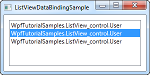

**Een eenvoudige ListView control met data binding**

Elke gebruiker wordt gerepresenteerd door de typenaam in de ListView. Dit is te verwachten omdat .NET niet weet wat je wil tonen en gewoon standaard .ToString() oproept van elk object en deze string gebruikt. Je kan de ToString() method zelf definieren om dit te verhelpen:

```csharp
public class User
{
	public string Name { get; set; }

	public int Age { get; set; }

	public override string ToString()
	{
		return this.Name + ", " + this.Age + " years old";
	}
}
```

 

**Een eenvoudige ListView control met data binding en gewijzigde ToString() method voorzien op de bron**

Vaak is dit voldoende, maar terugvallen op een eenvoudige string is niet altijd flexibel. Beter is gebruik maken van een template.

## ListView met ItemTemplate

WPF realiseert veel met templating. Een data template toekennen aan ListView is eenvoudig:

```csharp
<Window x:Class="WpfTutorialSamples.ListView_control.ListViewItemTemplateSample"
        xmlns="http://schemas.microsoft.com/winfx/2006/xaml/presentation"
        xmlns:x="http://schemas.microsoft.com/winfx/2006/xaml"
        Title="ListViewItemTemplateSample" Height="150" Width="350">
    <Grid>
		<ListView Margin="10" Name="lvDataBinding">
			<ListView.ItemTemplate>
				<DataTemplate>
					<WrapPanel>
						<TextBlock Text="Name: " />
						<TextBlock Text="{Binding Name}" FontWeight="Bold" />
						<TextBlock Text=", " />
						<TextBlock Text="Age: " />
						<TextBlock Text="{Binding Age}" FontWeight="Bold" />
						<TextBlock Text=" (" />
						<TextBlock Text="{Binding Mail}" TextDecorations="Underline" 
						Foreground="Blue" Cursor="Hand" />
						<TextBlock Text=")" />
					</WrapPanel>
				</DataTemplate>
			</ListView.ItemTemplate>
		</ListView>
	</Grid>
</Window>
```

```csharp
using System;
using System.Collections.Generic;
using System.Windows;

namespace WpfTutorialSamples.ListView_control
{
	public partial class ListViewItemTemplateSample : Window
	{
		public ListViewItemTemplateSample()
		{
			InitializeComponent();
			List<User> items = new List<User>();
			items.Add(new User() { Name = "John Doe", Age = 42, Mail = "john@doe-family.com" });
			items.Add(new User() { Name = "Jane Doe", Age = 39, Mail = "jane@doe-family.com" });
			items.Add(new User() { Name = "Sammy Doe", Age = 13, Mail = "sammy.doe@gmail.com" });
			lvDataBinding.ItemsSource = items;
		}
	}

	public class User
	{
		public string Name { get; set; }

		public int Age { get; set; }

		public string Mail { get; set; }
	}
}
```

 

**Een ListView control met data binding met een ItemTemplate**

Door gebruik te maken van GridView kan je verschillende kolommen organiseren in je ListView. We starten met een eenvoudig voorbeeld:

```csharp
<Window x:Class="WpfTutorialSamples.ListView_control.ListViewGridViewSample"
        xmlns="http://schemas.microsoft.com/winfx/2006/xaml/presentation"
        xmlns:x="http://schemas.microsoft.com/winfx/2006/xaml"
        Title="ListViewGridViewSample" Height="200" Width="400">
    <Grid>
		<ListView Margin="10" Name="lvUsers">
			<ListView.View>
				<GridView>
					<GridViewColumn Header="Name" Width="120" DisplayMemberBinding="{Binding Name}" />
					<GridViewColumn Header="Age" Width="50" DisplayMemberBinding="{Binding Age}" />
					<GridViewColumn Header="Mail" Width="150" DisplayMemberBinding="{Binding Mail}" />
				</GridView>
			</ListView.View>
		</ListView>
	</Grid>
</Window>
```

```csharp
using System;
using System.Collections.Generic;
using System.Windows;

namespace WpfTutorialSamples.ListView_control
{
	public partial class ListViewGridViewSample : Window
	{
		public ListViewGridViewSample()
		{
			InitializeComponent();
			List<User> items = new List<User>();
			items.Add(new User() { Name = "John Doe", Age = 42, Mail = "john@doe-family.com" });
			items.Add(new User() { Name = "Jane Doe", Age = 39, Mail = "jane@doe-family.com" });
			items.Add(new User() { Name = "Sammy Doe", Age = 7, Mail = "sammy.doe@gmail.com" });
			lvUsers.ItemsSource = items;
		}
	}

	public class User
	{
		public string Name { get; set; }

		public int Age { get; set; }

		public string Mail { get; set; }
	}
}
```

 

**ListView met een GridView voor layout**

We maken gebruik van de User class en binden deze aan een ListView. We deden dit vroeger al, maar het resultaat ziet er heel anders uit. Dat is het voordeel van data binding: dezelfde achterliggende gegevens en toch een heel ander uitzicht.

In XAML definieren we een View voor de ListView door gebruik te maken van de ListView.View property. We zetten dit op GridView, voorlopig het enige view type beschikbaar in WPF (je kan echter zelf je eigen view types aanmaken). De GridView zorgt voor het kolomgebaseerde uitzicht.

In de GridView definieren we 3 kolommen, eentje voor elk gegevenseelement dat we willen tonen. De Header property wordt gebruikt om de tekst op te geven die we willen tonen in de kolom en via de DisplayMemberBinding property binden we aan een waarde van onze User class.

### Templated celinhoud

DisplayMemberBinding property gebruiken limiteert ons tot het tonen van eenvoudige strings zonder eigen formattering. De WPF ListView is echter veel flexibeler. We kunnen een CellTemplate opnemen en volledige controle over de inhoud van een cel bereiken.

De GridViewColumn gebruikt DisplayMemberBinding als eerste prioriteit als deze voorzien is. De tweede keuze is de CellTemplate property welke we gebruiken in volgend voorbeeld:

```csharp
<Window x:Class="WpfTutorialSamples.ListView_control.ListViewGridViewCellTemplateSample"
        xmlns="http://schemas.microsoft.com/winfx/2006/xaml/presentation"
        xmlns:x="http://schemas.microsoft.com/winfx/2006/xaml"
        Title="ListViewGridViewCellTemplateSample" Height="200" Width="400">
    <Grid>
		<ListView Margin="10" Name="lvUsers">
			<ListView.View>
				<GridView>
					<GridViewColumn Header="Name" Width="120" DisplayMemberBinding="{Binding Name}" />
					<GridViewColumn Header="Age" Width="50" DisplayMemberBinding="{Binding Age}" />
					<GridViewColumn Header="Mail" Width="150">
						<GridViewColumn.CellTemplate>
							<DataTemplate>
								<TextBlock Text="{Binding Mail}" TextDecorations="Underline" 
								Foreground="Blue" Cursor="Hand" />
							</DataTemplate>
						</GridViewColumn.CellTemplate>
					</GridViewColumn>
				</GridView>
			</ListView.View>
		</ListView>
	</Grid>
</Window>
```

 

**Een ListView met een GridView die gebruik maakt van een eigen CellTemplate voor een van de kolommen**

# DataGrid (!)

De DataGrid control lijkt enorm op een ListView, wanneer we een GridView gebruiken, maar het biedt enorm veel extra functionaliteiten. Bijvoorbeeld, de DataGrid kan automatisch kolommen genereren, afhankelijk van de data die je het geeft. De DataGrid is ook standaard aanpasbaard, dat het toelaat dat de eindgebruikerde de waardes van de onderliggende data bron kan aanpassen.

De meest gebruikt toepassing voor de DataGrid is in combinatie met een database, maar gelijk de meeste WPF controls, werkt het evengoed met een in-memory bron, zoals een lijst van objecten. Sinds dat het eenvoudiger is om te demonstreren zullen we gebruik maken van de laatste in deze tutorial.

## Een eenvoudige DataGrid

Je kan starten met een DataGrid zonder het zetten van eender welke eigenschap, omdat het zoveel ondersteund. In het eerste voorbeeld, zullen dat doen, en dan toewijzen aan een lijst van onze eigen User objecten als de items bron:

```csharp
<Window x:Class="WpfTutorialSamples.DataGrid_control.SimpleDataGridSample"
    xmlns="http://schemas.microsoft.com/winfx/2006/xaml/presentation"
    xmlns:x="http://schemas.microsoft.com/winfx/2006/xaml"
    Title="SimpleDataGridSample" Height="180" Width="300">
    <Grid Margin="10">
        <DataGrid Name="dgSimple"></DataGrid>
    </Grid>
</Window>
```

```csharp
using System;
using System.Collections.Generic;
using System.Windows;

namespace WpfTutorialSamples.DataGrid_control
{
    public partial class SimpleDataGridSample : Window
    {
        public SimpleDataGridSample()
        {
            InitializeComponent();

            List<User> users = new List<User>();
            users.Add(new User() { Id = 1, Name = "John Doe", Birthday = new DateTime(1971, 7, 23) });
            users.Add(new User() { Id = 2, Name = "Jane Doe", Birthday = new DateTime(1974, 1, 17) });
            users.Add(new User() { Id = 3, Name = "Sammy Doe", Birthday = new DateTime(1991, 9, 2) });

            dgSimple.ItemsSource = users;
        }
    }

    public class User
    {
        public int Id { get; set; }

        public string Name { get; set; }

        public DateTime Birthday { get; set; }
    }
}
```

 

**Een eenvoudige DataGrid control**

Dat is alles wat je nodig hebt voor het starten van een DataGrid. De bron had even goed een database tabel of view kunnen zijn of zelfs een XML bestand - de DataGrid is niet kieskeurig waar het de data van krijgt.

Als je klikt in een van de cellen, zul je zien dat je toestemming heb om alle eigenschappen aan te passen. Als een leuke extra bonus, kan je poberen te klikken in een van de kolommen hoofdingen - je zal zien dat de DataGrid sorteren standaard ondersteunt!

De laatste en lege rij laat het toe om data bronnen toe te voegen, eenvoudig door het vullen van de cellen.

In het voorafgaande hebben we gekeken naar hoe eenvoudig het is om een WPF DataGrid werkend te krijgen. Een van de redenen waarom het zo eenvoudig was is het feit dat de DataGrid automatisch de gewenste kolommen genereert, gebaseerd op de data bron die je gebruikt.

Echter, in sommige situaties zal je manueel de getoonde kolommen willen definieren, ofwel omdat je niet alle eigenschappen/kolommen van de data bron wilt of omdat je in controle wilt zijn over welke inline editors gebruikt worden.

## Manueel gedefinieerde kolommen

Laten we een voorbeeld proberen dat enorm lijkt op het voorbeeld uit het vorige hoofdstuk, maar waar we de kolommen manueel defineren voor de meeste controle. Je kan de kolom types selecteren gebaseerdd op de data die je wilt tonen/aanpassen. Tijdens het schrijven zijn de volgende kolom types beschikbaar:

- DataGridTextColumn
- DataGridCheckBoxColumn
- DataGridComboBoxColumn
- DataGridHyperlinkColumn
- DataGridTemplateColumn

Vooral de laatste, de DataGridTemplateColumn, is interessant. Het laat je toe om eender welke soort inhoud te definieren, wat de mogelijkheid opent om gepersonaliseerde controler te gebruiken, ofwel van de WPF bibliotheek of zelfs van je eigen 3e partij controls. Hier is een voorbeeld:

```csharp
<Window x:Class="WpfTutorialSamples.DataGrid_control.DataGridColumnsSample"
        xmlns="http://schemas.microsoft.com/winfx/2006/xaml/presentation"
        xmlns:x="http://schemas.microsoft.com/winfx/2006/xaml"
        Title="DataGridColumnsSample" Height="200" Width="300">
    <Grid Margin="10">
		<DataGrid Name="dgUsers" AutoGenerateColumns="False">
			<DataGrid.Columns>

				<DataGridTextColumn Header="Name" Binding="{Binding Name}" />

				<DataGridTemplateColumn Header="Birthday">
					<DataGridTemplateColumn.CellTemplate>
						<DataTemplate>
							<DatePicker SelectedDate="{Binding Birthday}" BorderThickness="0" />
						</DataTemplate>
					</DataGridTemplateColumn.CellTemplate>
				</DataGridTemplateColumn>

			</DataGrid.Columns>
		</DataGrid>
	</Grid>
</Window>
```

```csharp
using System;
using System.Collections.Generic;
using System.Windows;

namespace WpfTutorialSamples.DataGrid_control
{
	public partial class DataGridColumnsSample : Window
	{
		public DataGridColumnsSample()
		{
			InitializeComponent();

			List<User> users = new List<User>();
			users.Add(new User() { Id = 1, Name = "John Doe", Birthday = new DateTime(1971, 7, 23) });
			users.Add(new User() { Id = 2, Name = "Jane Doe", Birthday = new DateTime(1974, 1, 17) });
			users.Add(new User() { Id = 3, Name = "Sammy Doe", Birthday = new DateTime(1991, 9, 2) });

			dgUsers.ItemsSource = users;
		}
	}

	public class User
	{
		public int Id { get; set; }

		public string Name { get; set; }

		public DateTime Birthday { get; set; }
	}
}
```

 

**Een DataGrid met manuele kolommen**

In de markup, hebben we de AutoGenerateColumns eigenschap toegevoegd aan de DataGrid, die we gelijk gezet hebben aan false, om de controle over de gebruikte kolommen te krijgen. Zoals je kan zien hebben we ook de ID kolom weg gelaten, omdat we beslisten dat deze niet belangrijk is voor dit voorbeeld. Voor de Name eigenschap hebben we gebruik gemaakt van een simpele tekst gebaseerde kolom, het meest interessante deel komt bij het voorbeeld van de verjaardag kolom, waar we gebruik hebben gemaakt van een DataGridTemplateColumn met een DatePicker control binnenin. Dit laat toe dat de eindgebruiker een datum kan kiezen van een kalender, in plaats van het manueel in te geven, zoals je kan zien op de screenshot.

## Samenvatting

Door het uitschakelen van automatisch gegenereerd kolommen bij het gebruik van de AutoGenerateColumns eigenschap krijg je volledige controle over welke kolommen getoond worden en hoe hun data getoond en aangepast moet worden. Zoals je kan zien in het voorbeeld van dit artikel, dit opent enkele interessante mogelijkheden waar je volledig de editor kan aanpassen en hierdoor de eindgebruiker ervaring kan verbeteren.

# Styles

Je kan een stijl onmiddellijk en direct definieren bij je control, bijvoorbeeld zo:

```csharp
<Window x:Class="WpfTutorialSamples.Styles.ControlSpecificStyleSample"
        xmlns="http://schemas.microsoft.com/winfx/2006/xaml/presentation"
        xmlns:x="http://schemas.microsoft.com/winfx/2006/xaml"
        Title="ControlSpecificStyleSample" Height="100" Width="300">
    <Grid Margin="10">
        <TextBlock Text="Style test">
            <TextBlock.Style>
                <Style>
                    <Setter Property="TextBlock.FontSize" Value="36" />
                </Style>
            </TextBlock.Style>
        </TextBlock>
    </Grid>
</Window>
```

 

**Voorbeeld van een stijl die enkel voor een enkele control geldt**

Met een stijl kan je meer doen dan enkel properties zetten.

## Local child control style

Door gebruik te maken van de Resources sectie van een control kan je onderliggende controls dirigeren:

```csharp
<Window x:Class="WpfTutorialSamples.Styles.SimpleStyleSample"
        xmlns="http://schemas.microsoft.com/winfx/2006/xaml/presentation"
        xmlns:x="http://schemas.microsoft.com/winfx/2006/xaml"
        Title="SimpleStyleSample" Height="200" Width="250">
    <StackPanel Margin="10">
        <StackPanel.Resources>
            <Style TargetType="TextBlock">
                <Setter Property="Foreground" Value="Gray" />
                <Setter Property="FontSize" Value="24" />
            </Style>
        </StackPanel.Resources>
        <TextBlock>Header 1</TextBlock>
        <TextBlock>Header 2</TextBlock>
        <TextBlock Foreground="Blue">Header 3</TextBlock>
    </StackPanel>
</Window>
```

 

*Een stijl die lokale onderliggende controls beinvloedt**

Op deze manier kan je een hele set van controls, die bijvoorbeeld samen op een dialoogvenster voorkomen, stijlen in plaats van elke control individueel een stijl mee te geven.

## Window-wide styles

Nog hogerop kan je de stijl op het niveau van het venster zelf definieren. Dit kan op dezelfde manier als in het geval van StackPanel hierboven. De stijl geldt dan voor alle controls op het venster (of de UserControl). Hier volgt een aangpast voorbeeld: 

```csharp
<Window x:Class="WpfTutorialSamples.Styles.WindowWideStyleSample"
        xmlns="http://schemas.microsoft.com/winfx/2006/xaml/presentation"
        xmlns:x="http://schemas.microsoft.com/winfx/2006/xaml"
        Title="WindowWideStyleSample" Height="200" Width="300">
    <Window.Resources>
        <Style TargetType="TextBlock">
            <Setter Property="Foreground" Value="Gray" />
            <Setter Property="FontSize" Value="24" />
        </Style>
    </Window.Resources>
    <StackPanel Margin="10">
        <TextBlock>Header 1</TextBlock>
        <TextBlock>Header 2</TextBlock>
        <TextBlock Foreground="Blue">Header 3</TextBlock>
    </StackPanel>
</Window>
```

 

**Een window-wide style**

Zoals je kan zien is het resultaat precies hetzelfde, maar als je bijkomende controls toevoegt aan het venster, is de stijl hierop nog steeds van toepassing. 

## Application-wide styles

Je kan een stijl ook vastleggen op het hoogste niveau, dat van de applicatie zelf. Dit gebeurt in het App.xaml bestand dat Visual Studio normaliter voor je aanmaakte. Een aangepast voorbeeld:

### App.xaml

```csharp
<Application x:Class="WpfTutorialSamples.App"
             xmlns="http://schemas.microsoft.com/winfx/2006/xaml/presentation"
             xmlns:x="http://schemas.microsoft.com/winfx/2006/xaml"
	 StartupUri="Styles/WindowWideStyleSample.xaml">
    <Application.Resources>
        <Style TargetType="TextBlock">
            <Setter Property="Foreground" Value="Gray" />
            <Setter Property="FontSize" Value="24" />
        </Style>
    </Application.Resources>
</Application>
```

### Window

```csharp
<Window x:Class="WpfTutorialSamples.Styles.WindowWideStyleSample"
        xmlns="http://schemas.microsoft.com/winfx/2006/xaml/presentation"
        xmlns:x="http://schemas.microsoft.com/winfx/2006/xaml"
        Title="ApplicationWideStyleSample" Height="200" Width="300">
    <StackPanel Margin="10">
        <TextBlock>Header 1</TextBlock>
        <TextBlock>Header 2</TextBlock>
        <TextBlock Foreground="Blue">Header 3</TextBlock>
    </StackPanel>
</Window>
```

 

**An application-wide style**

### Expliciete stijlen

Je hebt veel controle over hoe en wanneer je een stijl kan opleggen aan je controls, van locaal en individueel tot op applicatieniveau. Tot nu toe was een stijl steeds op alle onderliggende controls van toepassing. Dit hoeft echter niet zo te zijn: door de x:Key property op een stijl te zetten, kan je WPF vertellen dat je een specifieke stijl op een specifieke control wenst toe te passen. Een voorbeeld:

```csharp
<Window x:Class="WpfTutorialSamples.Styles.ExplicitStyleSample"
        xmlns="http://schemas.microsoft.com/winfx/2006/xaml/presentation"
        xmlns:x="http://schemas.microsoft.com/winfx/2006/xaml"
        Title="ExplicitStyleSample" Height="150" Width="300">
    <Window.Resources>
        <Style x:Key="HeaderStyle" TargetType="TextBlock">
            <Setter Property="Foreground" Value="Gray" />
            <Setter Property="FontSize" Value="24" />
        </Style>
    </Window.Resources>
    <StackPanel Margin="10">
        <TextBlock>Header 1</TextBlock>
        <TextBlock Style="{StaticResource HeaderStyle}">Header 2</TextBlock>
        <TextBlock>Header 3</TextBlock>
    </StackPanel>
</Window>
```

 

**Een expliciet gedefinieerde stijl**

Je ziet dat de stijl enkel op het middenste TextBlock wordt toegepast omdat de stijl een x:Key property draagt en bij dat TextBlock expliciet vermeld wordt dat de stijl erop toegepast moet worden.

# Menu control

Een van de meest bekende onderdelen van een Windows applicatie is de zogenaamde "menu". Doorgaans wordt maar een enkel hoofdmenu voorzien in een applicatie. 
Een menu is handig omdat deze veel opties kan aanbieden op weinig ruimte.
Items toevoegen aan een WPF Menu is heel eenvoudig: je kan ook  MenuItem elementen voorzien. Elk MenuItem kan subelementen hebben: dit laat toe hierarchische menus op te bouwen.

Een voorbeeld:

```csharp
<Window x:Class="WpfTutorialSamples.Common_interface_controls.MenuSample"
        xmlns="http://schemas.microsoft.com/winfx/2006/xaml/presentation"
        xmlns:x="http://schemas.microsoft.com/winfx/2006/xaml"
        Title="MenuSample" Height="200" Width="200">
    <DockPanel>
        <Menu DockPanel.Dock="Top">
            <MenuItem Header="_File">
                <MenuItem Header="_New" />
                <MenuItem Header="_Open" />
                <MenuItem Header="_Save" />
                <Separator />
                <MenuItem Header="_Exit" />
            </MenuItem>
        </Menu>
        <TextBox AcceptsReturn="True" />
    </DockPanel>
</Window>
```

 

Zoals bij de meeste Windows applicaties staat dit menu bovenaan, maar je kan deze control plaatsen waar je wenst en de grootte ervan aanpassen.

Wanneer je een "underscore" voor het eerste karakter van een label plaatst, dan zal WPF dit karakter interpreteren als een "accelerator key". Dit
betekent dat de gebruiker de Alt toets kan indrukken met het bewuste karakter om meteen de actie gekoppeld aan het menuelement uit te voeren.
Je kan dit ook gebruiken voor een subelement: druk Alt in en daarna de letters doorheen de menus.

Het is mogelijk om een icoontje te voorzien bij een menu-element en een checkbox voor een menu-element kan gebruikt worden om een eigenschap op of af
te zetten:

```csharp
<Window x:Class="WpfTutorialSamples.Common_interface_controls.MenuIconCheckableSample"
        xmlns="http://schemas.microsoft.com/winfx/2006/xaml/presentation"
        xmlns:x="http://schemas.microsoft.com/winfx/2006/xaml"
        Title="MenuIconCheckableSample" Height="150" Width="300">
    <DockPanel>
        <Menu DockPanel.Dock="Top">
            <MenuItem Header="_File">
                <MenuItem Header="_Exit" />
            </MenuItem>
            <MenuItem Header="_Tools">
                <MenuItem Header="_Manage users">
                    <MenuItem.Icon>
                        <Image Source="/WpfTutorialSamples;component/Images/user.png" />
                    </MenuItem.Icon>
                </MenuItem>
                <MenuItem Header="_Show groups" IsCheckable="True" IsChecked="True" />
            </MenuItem>
        </Menu>
        <TextBox AcceptsReturn="True" />
    </DockPanel>
</Window>
```

 

Het is mogelijk om met een eenvoudige Click event te werken, maar beter is het volgende.

```csharp
<Window x:Class="WpfTutorialSamples.Common_interface_controls.MenuWithCommandsSample"
        xmlns="http://schemas.microsoft.com/winfx/2006/xaml/presentation"
        xmlns:x="http://schemas.microsoft.com/winfx/2006/xaml"
        Title="MenuWithCommandsSample" Height="200" Width="300">
    <Window.CommandBindings>
        <CommandBinding Command="New" CanExecute="NewCommand_CanExecute" Executed="NewCommand_Executed" />
    </Window.CommandBindings>
    <DockPanel>
        <Menu DockPanel.Dock="Top">
            <MenuItem Header="_File">
                <MenuItem Command="New" />
                <Separator />
                <MenuItem Header="_Exit" />
            </MenuItem>
            <MenuItem Header="_Edit">
                <MenuItem Command="Cut" />
                <MenuItem Command="Copy" />
                <MenuItem Command="Paste" />
            </MenuItem>
        </Menu>

        <TextBox AcceptsReturn="True" Name="txtEditor" />
    </DockPanel>
</Window>
```

```csharp
using System;
using System.Windows;
using System.Windows.Input;

namespace WpfTutorialSamples.Common_interface_controls
{
	public partial class MenuWithCommandsSample : Window
	{
		public MenuWithCommandsSample()
		{
			InitializeComponent();
		}

		private void NewCommand_CanExecute(object sender, CanExecuteRoutedEventArgs e)
		{
			e.CanExecute = true;
		}

		private void NewCommand_Executed(object sender, ExecutedRoutedEventArgs e)
		{
			txtEditor.Text = "";
		}
	}
}
```
 

Door deze techniek te gebruiken, krijg je heel wat gratis bij: shortcuts, automatische activatie en deactivatie afhankelijk van de actieve control.

# StatusBar 

Een eenvoudige StatusBar

```csharp
<Window x:Class="WpfTutorialSamples.Common_interface_controls.StatusBarSample"
        xmlns="http://schemas.microsoft.com/winfx/2006/xaml/presentation"
        xmlns:x="http://schemas.microsoft.com/winfx/2006/xaml"
        Title="StatusBarSample" Height="150" Width="300">
	<DockPanel>
		<StatusBar DockPanel.Dock="Bottom">
			<StatusBarItem>
				<TextBlock Name="lblCursorPosition" />
			</StatusBarItem>
		</StatusBar>
		<TextBox AcceptsReturn="True" Name="txtEditor" SelectionChanged="txtEditor_SelectionChanged" />
	</DockPanel>
</Window>
```


```csharp
using System;
using System.Windows;

namespace WpfTutorialSamples.Common_interface_controls
{
	public partial class StatusBarSample : Window
	{
		public StatusBarSample()
		{
			InitializeComponent();
		}

		private void txtEditor_SelectionChanged(object sender, RoutedEventArgs e)
		{

			int row = txtEditor.GetLineIndexFromCharacterIndex(txtEditor.CaretIndex);
			int col = txtEditor.CaretIndex - txtEditor.GetCharacterIndexFromLineIndex(row);
			lblCursorPosition.Text = "Line " + (row + 1) + ", Char " + (col + 1);
		}
	}
}
```

 

Een meer geavanceerde StatusBar met ProgressBar

```csharp
<Window x:Class="WpfTutorialSamples.Common_interface_controls.StatusBarAdvancedSample"
        xmlns="http://schemas.microsoft.com/winfx/2006/xaml/presentation"
        xmlns:x="http://schemas.microsoft.com/winfx/2006/xaml"
        Title="StatusBarAdvancedSample" Height="150" Width="400">
    <DockPanel>
        <StatusBar DockPanel.Dock="Bottom">
            <StatusBar.ItemsPanel>
                <ItemsPanelTemplate>
                    <Grid>
                        <Grid.ColumnDefinitions>
                            <ColumnDefinition Width="100" />
                            <ColumnDefinition Width="Auto" />
                            <ColumnDefinition Width="*" />
                            <ColumnDefinition Width="Auto" />
                            <ColumnDefinition Width="100" />
                        </Grid.ColumnDefinitions>
                    </Grid>
                </ItemsPanelTemplate>
            </StatusBar.ItemsPanel>
            <StatusBarItem>
                <TextBlock Name="lblCursorPosition" />
            </StatusBarItem>
            <Separator Grid.Column="1" />
            <StatusBarItem Grid.Column="2">
                <TextBlock Text="c:\path\of\current\file.txt" />
            </StatusBarItem>
            <Separator Grid.Column="3" />
            <StatusBarItem Grid.Column="4">
                <ProgressBar Value="50" Width="90" Height="16" />
            </StatusBarItem>
        </StatusBar>
        <TextBox AcceptsReturn="True" Name="txtEditor" SelectionChanged="txtEditor_SelectionChanged" />
    </DockPanel>
</Window>
```

```csharp
using System;
using System.Windows;

namespace WpfTutorialSamples.Common_interface_controls
{
	public partial class StatusBarAdvancedSample : Window
	{
		public StatusBarAdvancedSample()
		{
			InitializeComponent();
		}

		private void txtEditor_SelectionChanged(object sender, RoutedEventArgs e)
		{
			int row = txtEditor.GetLineIndexFromCharacterIndex(txtEditor.CaretIndex);
			int col = txtEditor.CaretIndex - txtEditor.GetCharacterIndexFromLineIndex(row);
			lblCursorPosition.Text = "Line " + (row + 1) + ", Char " + (col + 1);
		}
	}
}
```

 

# Timer

In WinForms bestaat er een control Timer die op een gegeven interval afloopt en een actie uitvoert, al dan niet bij herhaling. WPF biedt dit ook aan, niet via een onzichtbare Timer control, maar de zogenaamde DispatcherTimer control. Deze control doet min of meer hetzelfde, maar in plaats van de control op je form te slepen, maak je de control aan in code-behind.

Bij DispatcherTimer class specificeer je een interval en aan het Tick event ken je een actie toe die wordt uitgevoerd wanneer het interval verstreken is. DispatcherTimer start pas als je de Start() method oproept of de IsEnabled property op true zet.

Een eenvoudig voorbeeld om een klok te tonen:

```csharp
<Window x:Class="WpfTutorialSamples.Misc.DispatcherTimerSample"
        xmlns="http://schemas.microsoft.com/winfx/2006/xaml/presentation"
        xmlns:x="http://schemas.microsoft.com/winfx/2006/xaml"
        Title="DispatcherTimerSample" Height="150" Width="250">
    <Grid>
        <Label Name="lblTime" FontSize="48" HorizontalAlignment="Center" VerticalAlignment="Center" />
    </Grid>
</Window>
```

```csharp
using System;
using System.Windows;
using System.Windows.Threading;

namespace WpfTutorialSamples.Misc
{
	public partial class DispatcherTimerSample : Window
	{
		public DispatcherTimerSample()
		{
			InitializeComponent();
			DispatcherTimer timer = new DispatcherTimer();
			timer.Interval = TimeSpan.FromSeconds(1);
			timer.Tick += timer_Tick;
			timer.Start();
		}

		void timer_Tick(object sender, EventArgs e)
		{
			lblTime.Content = DateTime.Now.ToLongTimeString();
		}
	}
}
```
 

**Een klok die DispatcherTimer gebruikt voor updates**

Het XAML gedeelte is heel eenvoudig - enkel een gecentreerd label met een grote font size.

De magie in dit voorbeeld vind je in de code-behind. In de constructor van het venster maken we de instantie van DispatcherTimer aan. We zetten property Interval op 1 seconde, schrijven ons in op het Tick event en starten de timer. In de event handler van het Tick event passen we eenvoudigweg de tekst van het label aan dat de tijd toont. DispatcherTimer "dispatches" het event op de gui thread van WPF, dus locking is niet vereist.

Gebruik de TimeSpan.From* methods, zoals FromSeconds of FromMinutes, of maak een nieuwe instantie aan van TimeSpan die aan je noden tegemoet komt.

Probeer eens de update-frequentie op te hogen tot op de milliseconde:

```csharp
using System;
using System.Windows;
using System.Windows.Threading;

namespace WpfTutorialSamples.Misc
{
	public partial class DispatcherTimerSample : Window
	{
		public DispatcherTimerSample()
		{
			InitializeComponent();
			DispatcherTimer timer = new DispatcherTimer();
			timer.Interval = TimeSpan.FromMilliseconds(1);
			timer.Tick += timer_Tick;
			timer.Start();
		}

		void timer_Tick(object sender, EventArgs e)
		{
			lblTime.Content = DateTime.Now.ToString("HH:mm:ss.fff");
		}
	}
}
```

 

**Een klok die gebruik maakt van DispatcherTimer en elke milliseconde afloopt**

Je kan een paar knoppen toevoegen aan het venster die Stop(), Start() en Restart() oproepen: zo implementeer je een stopwatch.

## Samenvatting

Wanneer je iets repetitief wenst uit te voeren, kan je DispatcherTimer gebruiken. Let wel op dat je niet een complexe taak te snel achter elkaar uitvoert. DispatcherTimer is niet 100% precies in alle gevallen. De operaties worden op de Dispatcher queue geplaatst, dus wanneer je computer zwaar belast is, wordt de uitvoering vertraagd. .NET garandeert wel dat de timer nooit afloopt voor het gewenste moment zich aandient. Het is mogelijk eventueel DispatcherPriority aan te passen om een bepaalde DispatcherTimer voorrang te geven bij uitvoering, maar meestal is het geen goed idee hiermee te knutselen.


