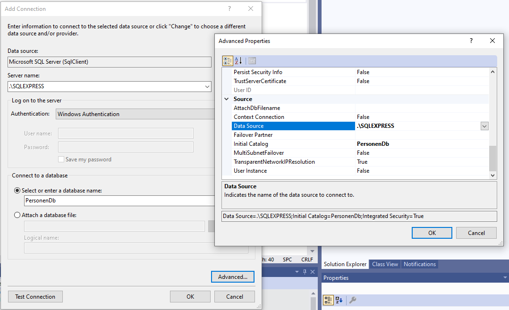
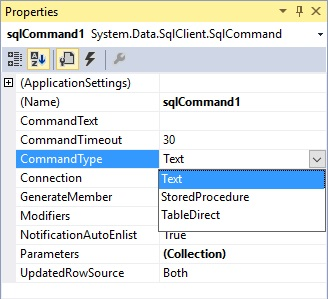

# ADO .NET

### System.Data of ADO.NET

In dit hoofdstuk bespreken we het benaderen van datasources als databanken.

De **System.Data** namespace in de klassenbibliotheek van het .NET Framework biedt enkel mogelijkheden (datatypes met ingebouwde functionaliteiten) die ons dit toestaan.

Men verwijst ook wel met de term *ADO.NET* naar deze datatypes en bijhorende functionaliteiten. ADO.NET is de opvolger van *ADO* uit het pre .NET tijdperk. ADO stond voor *ActiveX Data Objects*, de huidige voorzieningen hebben echter nog weinig te maken met de verouderde *ActiveX* technologie.

Microsoft Docs: ADO.NET Overview (Development Guide, Data and Modeling): http://msdn.microsoft.com/en-us/library/h43ks021(v=vs.110).aspx


### Connecties creëren en gebruiken

In volgende voorbeelden wordt gewerkt met een *MicroSoft SQL Server* database bestand (*.mdf*).

Afhankelijk van de geïnstalleerde versie van *Visual Studio* of geïnstalleerde updates op jouw systeem zal ook een bepaalde versie van *SQL Server (Express (LocalDB))* geïnstalleerd zijn. Het is bovendien mogelijk om zelf een volledige instantie van SQL Server “Express” gratis te installeren.

Om informatie uit een database te kunnen benaderen heb je nood aan een *verbinding* (*connectie*) met de database. Deze verbinding kan tot stand worden gebracht aan de hand van een *connection* *object*.

Afhankelijk van het type database management server (*Microsoft SQL Server*, *Oracle*, *MySQL*, *Microsoft Access*, ...) of het type van driver bruikbaar om dergelijke *dbms* te benaderen, zal je gebruik moeten maken van een connection object van een bepaald datatype:

- System.Data.SqlClient.SqlConnection voor Microsoft *SQL Server* databases.
- System.Data.OracleClient.OracleConnection voor *Oracle* databases.
- MySql.Data.MySqlClient.MySqlConnection voor *MySQL* databases.
- System.Data.Odbc.OdbcConnection of System.Data.OleDb.OleDbConnection voor *Microsoft Access* databases.

Zoals je ziet zijn vele van deze types vervat in de System.Data namespace van de klassenbibliotheek van het .NET FrameWork.

```c#
using System.Data.SqlClient;
SqlConnection conn = new SqlConnection();
```

#### Connectionstring

Bij creatie van een connection object kan je aan de constructor doorgeven welke datasource wordt geconnecteerd. Wat de lokatie is van waarop de datasource wordt geconnecteerd, wat de authenticatie (gebruikersnaam en wachtwoord) is voor het connecteren, ... .

Al deze informatie wordt samen in één string ondergebracht, de *connectionstring*.

```c#
string connectionString = @"Data Source=(LocalDB)\MSSQLLocalDB;AttachDbFilename=TestDb1.mdf;Integrated Security=True;Connect Timeout=30";
SqlConnection conn = new SqlConnection(connectionString);
```

Aan de constructor van het *connection object* kan je de *connectionstring* doorgeven.

Hoe de connectiestring er zal uitzien is dus afhankelijk van het type dbms waarvan je gebruik maakt, de fysieke locatie van je database bestanden of de naamgeving van je databaseserver of serverinstanties, de authenticatie methode, enzovoort.

The Connection String Reference: http://www.connectionstrings.com/

*Visual Studio* beschikt over uitstekende mogelijkheden om op basis van enkele configuratiestappen de connectionstring voor ons samen te stellen.

 Indien je dat zou wensen, kan je een connectionstring ook *at runtime* opbouwen. Zie: Connection String Builders (Development Guide, Data and Modeling, ADO.NET): http://msdn.microsoft.com/en-us/library/ms254947(v=vs.110).aspx

Om *at configuration time* (tussen compile- en runtime) de connectionstring nog aan te kunnen passen kan men overwegen deze informatie in een extern bestand (configuration bestand) op te nemen. Ook uit beveiligingsredenen kan dergelijke aanpak interessant zijn. Zie: Connection Strings and Configuration Files (Development Guide, Data and Modeling, ADO.NET): http://msdn.microsoft.com/en-us/library/ms254494(v=vs.110).aspx

#### Openen van een connectie

Dergelijk *connection object* stelt de verbinding voor maar is pas bruikbaar wanneer de connectie geopend wordt. Om de connectie te openen gebruik je de Open() method:

```c#
SqlConnection conn = new SqlConnection(connectionString);
conn.Open();
```

#### Sluiten van een connectie

Omdat de *data source* een schaarse bron is, gaan we de verbinding naar deze datasource zo snel mogelijk gaan sluiten. Om de connectie af te sluiten gebruik je de Close() method, indien deze connectie later nog opnieuw wordt geopend (via de Open() method), of Dispose() indien deze connectie verderop niet meer wordt gebruikt.

```c#
SqlConnection conn = new SqlConnection(connectionString);
 conn.Open();
 //...
 conn.Dispose();
```

Dit is vergelijkbaar met de Close() method voor System.IO *stream objecten* (bv StreamReader en StreamWriter) die de stream finaliseert. Ook voor deze stream objecten is er eigenlijk een Dispose(), maar het disposen (vrijgeven) van de resources gekoppeld aan deze stream gebeurt hier al bij het *closen* (Close()). Bijgevolg is er voor stream objecten geen noodzaak tot het aanroepen van deze Dispose() method.

Ter herinnering: het aanroepen van dergelijke finalisatie methods (Close(), Dispose(), ...) in een finally gedeelte van een try statement wordt beschouwd als *good practice*.

Dit zal ervoor zorgen dat altijd, zelfs indien het try statement *-zelf-* geen afhandeling voorziet van optredende excepties, toch nog finalisatie zal optreden.

```c#
SqlConnection conn;
try
{
   conn = new SqlConnection(connectionString);
   conn.Open();
   //...

  conn.Close();
}
catch(Exception e)
{

}
finally
{
  conn?.Dispose();
  conn = null;
}
```

Hetzelfde resultaat bekomt men met een using statement...

```c#
using (SqlConnection conn = new SqlConnection(connectionString))
 {
   conn.Open();
   //...
 }
```

Een using statement garandeert het *disposen* (aanroepen van de Dispose() method) van de resource, hier het database connection object, aan het eind van het using statement.

Zelfs al zou er een exception optreden in de body van het statement, dan nog zal de resource *gedisposed* worden nog vooraleer de call stack wordt afgedaald om te zoeken naar afhandeling. Hierbij wordt dus hetzelfde effect bekomen als bovenstaand try statement.

**Indien de connectie verderop nog wordt gebruikt, en dus opnieuw wordt geopend, moet je in plaats van Dispose() de Close() method te gebruiken.**

```c#
SqlConnection conn;
 conn = new SqlConnection(connectionString);
 conn.Open();
 //...
 conn.Close();
 //...
 conn.Open()
 //...
 conn.Close();
 //...
 conn.Open()
 //...
 conn.Dispose()
```


## Visual Studio Tooling

### Databank bestand creëren

Open het *Server Explorer* toolbox venster door in *Visual Studio* in de *View* menu te kiezen voor *Server Explorer*. Rechterklik op de *Data Connections* node en kies voor *Add Connection...*.

​                               

Verifiëer of het *Data source* veld staat ingesteld op *Microsoft SQL Server (SqlClient)*.


Indien niet zo, klik je op de *Change...* knop om deze instelling aan te passen.

 


Dit venster biedt je eventueel ook de mogelijkheid de hiermee samengestelde *connectionstring* op te vragen, via de knop "Advanced...". Deze waarde zou je kunnen kopiëren en straks inzetten in onze broncode.




 Klik je in het *Add Connection* venster op *OK* dan wordt een node toegevoegd aan het *Server Explorer* toolvenster. Tussendoor wordt om bevestiging van creatie gevraagd.


Resultaat:


### Tabel creëren en opvullen

Om vlot de nodige databank tabel te creëren maken we gebruik van *SQL creational language*. Rechterklik op de *PersonenDb.dbo node en kies voor *New Query*:


Neem volgende *SQL* over en kies in de *SQL* menu van *Visual Studio* voor *Execute* (in het venster bovenaan links de groene pijl):


```sql
CREATE TABLE [dbo].[Personen] (
   [Id]  INT IDENTITY(1, 1) NOT NULL,
   [Naam] TEXT NOT NULL,
   [Email] TEXT NULL,
   [Geboortedatum] DATETIME NULL,
   PRIMARY KEY CLUSTERED([Id] ASC)
 );
 
 INSERT INTO Personen (Naam, Email, Geboortedatum) VALUES ('Jan', 'jan@hotmail.com', '2001-01-27');
 INSERT INTO Personen (Naam, Email, Geboortedatum) VALUES ('Pol', 'pol@gmail.com', '2002-02-28');
 INSERT INTO Personen (Naam, Email, Geboortedatum) VALUES ('Piet', 'piet@hotmail.com', '2002-02-28');
```

Als alles goed loopt krijg je onderaan het scherm te zien dat de gebruikte *SQL manipulation language* (de *insert* statements) drie rijen heeft betroffen.

```output
(1 row(s) affected)
(1 row(s) affected)
(1 row(s) affected)
```

- Wikipedia: Data definiton language: https://en.wikipedia.org/wiki/Data_definition_language- 
- Wikipedia: Insert (SQL): https://en.wikipedia.org/wiki/Insert_(SQL)

Aan de hand van deze werkwijze kan je ook andere *SQL* statements, zowel ter creatie (*creational language*), manipulatie (*manipulational language*) of raapleging (*selection language*) uitvoeren.

 Het in *Visual Studio* gecreëerde tablad (*SQLQuery1.sql*) mag je sluiten en hoef je niet te bewaren. 

### Tabel definitie of informatie verkennen

Indien je in de *Server Explorer* de *PersonenDb.dbo en *Tables* node uitvouwt vindt je een node terug voor de gecreëerde tabel. Rechterklik eventueel op de node en kies voor *Open Table Definition* of *Show Table Data* indien je het dataschema of de opgevulde informatie wil verkennen of zelfs aanpassen:


### ADO .NET gebruiken

Voor .NET Core, gebruik nuget: klik rechts op project, selecteer “Manage Nuget Packages…” en kies onder “Browse”:  “Microsoft.Data.SqlClient”. Bevestig de licentie en zie hoe de noodzakelijke packages onder “Dependencies” toegevoegd worden.

Vergeet niet de connection string aan te passen naar deze welke je kan vinden onder: Server Explorer > Data Connections: rechterklik naar Properties en dan Connections > Connection string.


### ExecuteScalar en parameters

Om één gegeven in de databank onder te brengen, wordt de methode **ExecuteScalar** gebruikt. Deze methode geeft de eerste kolom van de eerste rij van de resultaat-set van het SELECT SQL-statement. Omdat het resultaat van het gegevenstype Object is, moet er meestal een conversie van het type plaats vinden. Voordeel: minder code dan met ExecuteReader.

Interessant om een identity waarde terug te krijgen na een insert.

In een SQL-statement kunnen ook **parameters** gebruikt worden. Via code wordt een waarde toegekend aan deze parameters. In SQL Server worden parameters aangeduid met een @.

```c#
        static public int AddPerson(string newName, string email, string connString)
        {
            Int32 newProdID = 0;
            string sql = "INSERT INTO Personen (Naam, Email, Geboortedatum) VALUES (@Name, @Email, @BirthDate); SELECT CAST(scope_identity() AS int)";

            using (SqlConnection conn = new(connString))
            {
                SqlCommand cmd = new(sql, conn);
                cmd.Parameters.Add("@Name", SqlDbType.VarChar);
                cmd.Parameters["@Name"].Value = newName;
                cmd.Parameters.Add("@Email", SqlDbType.VarChar);
                cmd.Parameters["@Email"].Value = email;
                cmd.Parameters.Add("@BirthDate", SqlDbType.DateTime);
                cmd.Parameters["@BirthDate"].Value = DateTime.Now;
                try
                {
                    conn.Open();
                    newProdID = (Int32)cmd.ExecuteScalar();
                }
                catch (Exception ex)
                {
                    Console.WriteLine(ex.Message);
                }
            }
            return (int)newProdID;
        }
```

### **Uitlezen van de databank**

#### **Command en DataReader object**

Indien je record-informatie van een datasource wil uitlezen kan je gebruik maken van een *datareader* (System.Data.SqlClient.SqlDataReader) object. Een *data reader* is een *connected* (*verbonden*/*life*) browser object om door bepaalde record informatie te navigeren.

 Aan de hand van een *command* (SqlCommand) object, die zowel op de hoogte is van de te gebruiken verbinding als de selectie query, kan je een *data reader* instantiëren.  Dit via de ExecuteReader() method...

```c#
        public static void PrintPersonsTable(SqlConnection c)
        {
            SqlCommand command = new("SELECT Id, Naam, Email, Geboortedatum FROM Personen;", c);
            SqlDataReader dataReader = command.ExecuteReader();
            if (dataReader.HasRows)
            {
                while (dataReader.Read())
                {
                    int id = (int)dataReader["Id"];
                    string naam = (string)dataReader["Naam"];
                    string email = (string)dataReader["Email"];
                    DateTime geboortedatum = (DateTime)dataReader["Geboortedatum"];
                    Console.WriteLine($"{id} | {naam} | {email} | {geboortedatum.ToShortDateString()}");
                }
            }
            else { Console.WriteLine("Geen personen gevonden."); }
            dataReader.Close();
        }
```

```output
1 | Jan | jan @hotmail.com | 27/01/2001
2 | Pol | pol @gmail.com | 28/02/2002
3 | Piet | piet @hotmail.com | 29/03/2003
```

Elke Read() opdracht zal binnen de *reader* de *cursor* laten wijzen naar het volgende record.  *False* wordt opgeleverd indien geen verdere record informatie wordt gevonden.
Een opzet als while (dataReader.Read()) wordt bijgevolg vaak gebruikt om alle record informatie te benaderen. De HasRows property wordt gebruikt om na te gaan of er wel records werden gevonden.
Tussen vierkante haakjes kan je verwijzen naar de uit te lezen *kolom*. De in object vorm opgeleverde waarde wordt in het voorbeeld telkens gecast naar het gewenste datatype.
Ook een *data reader* wordt expliciet gefinaliseerd, dit is mogelijk aan de hand van de Close() method. 

### Data aanpassen

#### **ExecuteNonQuery**

*Command* objecten kunnen ook gebruikt worden om *SQL data manipulation language* (*delete*, *insert* en *update* instructies) mee uit te voeren. In dat geval gebruik je de **ExecuteNonQuery()** method...

```c#
namespace Databanken
{
   namespace BasisObjecten.ManipulerenVanInformatie
   {
     using System;
     using Microsoft.Data.SqlClient;

     class Program
     {
       static void Main()
       {
         var connectionString = @"";
         using (SqlConnection conn = new SqlConnection(connectionString))
         {
           conn.Open();

           PrintPersonsTable(conn);

           Console.Write("Aanpassen naam in James van persoon met id?: ");
           string updateSql = $"UPDATE Personen SET Naam = 'James' WHERE Id = {Console.ReadLine()}; ";
           SqlCommand updateCommand = new SqlCommand(updateSql, conn);
           updateCommand.ExecuteNonQuery();

           Console.WriteLine("Invoegen nieuwe persoon met naam John, geboortedatum 10 oktober 1979...");
           string insertSql = $"INSERT INTO Personen (Naam, Email, Geboortedatum) VALUES ('John', 'john@mail.be', '1979-10-31');";
           SqlCommand insertCommand = new SqlCommand(insertSql, conn);
           insertCommand.ExecuteNonQuery();
           Console.Write("Verwijderen persoon met id?: ");
           string deleteSql = $"DELETE FROM Personen WHERE Id = {Console.ReadLine()};";
           SqlCommand deleteCommand = new SqlCommand(deleteSql, conn);
           deleteCommand.ExecuteNonQuery();

           PrintPersonsTable(conn);
         }
         Console.ReadLine();
       }
       public static void PrintPersonsTable(SqlConnection c)
       {
         SqlCommand command = new SqlCommand("SELECT Id, Naam, Email, Geboortedatum FROM Personen;", c);
         SqlDataReader dataReader = command.ExecuteReader();
         if (dataReader.HasRows)
         {
           while (dataReader.Read())
           {
             int id = (int)dataReader["Id"];
             string naam = (string)dataReader["Naam"];
             string email = (string)dataReader["Email"];
             DateTime geboortedatum = (DateTime)dataReader["Geboortedatum"];
             Console.WriteLine($"{id} | {naam} | {email} | {geboortedatum.ToShortDateString()}");
           }
         }
         else { Console.WriteLine("Geen personen(records) gevonden."); }
         dataReader.Close();
       }
     }
   }
}
```

```output
1 | Jan | jan @hotmail.com | 27/01/2001
2 | Pol | pol @gmail.com | 28/02/2002
3 | Piet | piet @hotmail.com | 29/03/2003
Aanpassen naam in James van persoon met id?: *2*
Invoegen nieuwe persoon met naam John, geboortedatum 10 oktober 1979...
Verwijderen persoon met id?: *3*
1 | Jan | jan @hotmail.com | 27/01/2001
2 | James | pol @gmail.com | 28/02/2002
4 | John | john @mail.be | 31/10/1979
```

**Microsoft SQL Server Manager Studio**

1. Installeren en opstarten
2. Databank aanmaken
3. Tabel aanmaken
4. Query uitvoeren (F5 en commentaar)
5. SQL exporteren en bewaren

### Stored procedures

Naast SQL-statements kunnen ook **stored procedures** gebruikt worden om gegevens uit een database te halen. 

Een procedure is in het algemeen een **reeks instructies** die na elkaar moeten worden uitgevoerd. Stored procedures zijn - zoals de naam het zegt - in de database opgeslagen procedures. Deze procedures bestaan uit SQL statements. Bijvoorbeeld een taak waarin wordt geselecteerd uit een tabel met orders die verwerkt moeten worden tot een tabel met verzendingen.

Een voordeel van stored procedures is de **snelle verwerking** van de data doordat het programma in de database zelf draait en daarmee bovenop de data zit. De verwerking gaat, vooral door het ontbreken van netwerk overhead, sneller dan verwerking door een programma dat op een andere machine draait.

Een tweede voordeel bestaat erin dat je SQL statements kan **schrijven en testen** in een aparte omgeving. Pas als de stored procedures getest zijn en goed bevonden ga ze aanroepen of gebruiken in .NET, Java, PHP of een andere programmeertaal. 

**Nadeel: distributie van coding.**

Voor het definiëren en testen van stored procedures kan je gebruik maken van SQL Server Management Studio.

Voor meer compleet overzicht van stored procedures, te gebruiken op de NorthWind Microsoft database, zie: https://www.w3schools.com/sql/sql_stored_procedures.asp.

We bekijken hier heel bondig de ondersteuning voor stored procedures in Visual Studio.

Met de property CommandType wordt bepaalt hoe de property CommandText geïnterpreteerd moet worden. De mogelijkheden zijn:

- Text: SQL-statement
- StoredProcedure: naam van een stored procedure in een SQL database
- TableDirect: alle gegevens van de tabel worden opgehaald.

 

Open de ServerExplorer en klik rechts op Stored Procedures om via *Add New Stored Procedure* een nieuwe stored procedure toe te voegen.

Geef de procedure de naam **Teenager** en voeg de onderstaande SQL-instructies toe.

```sql
CREATE PROCEDURE dbo.Teenager
as select Naam, Email, geboortedatum from Personen where geboortedatum > DATEADD(year,-18,GETDATE());
```

Als bij CommandType de optie Stored Procedure geselecteerd wordt, dan kan gekozen worden tussen de opgeslagen Stored Procedures.

De Stored procedure kan  getest worden door in het snelmenu van de Stored Procedure te kiezen voor Execute.

Wanneer je de stored procedure wenst te gebruiken vanuit C# code, dan doe je dat als volgt:

```c#
			    // set stored procedure name
                string spName = @"dbo.[Teenager]";

                // define the SqlCommand object
                SqlCommand cmd = new(spName, conn);

                /*
                //Set SqlParameter - the id parameter value will be set from the command line
                SqlParameter param1 = new();
                param1.ParameterName = "@ID";
                param1.SqlDbType = SqlDbType.Int;
                param1.Value = int.Parse(args[0].ToString());

                //add the parameter to the SqlCommand object
                cmd.Parameters.Add(param1);
                */

                //set the SqlCommand type to stored procedure and execute
                cmd.CommandType = CommandType.StoredProcedure;
                SqlDataReader dr = cmd.ExecuteReader();

                Console.WriteLine(Environment.NewLine + "Retrieving stored procedure data from database..." + Environment.NewLine);

                //check if there are records
                if (dr.HasRows)
                {
                    while (dr.Read())
                    {
                        var naam = (string)dr["Naam"];
                        var email = (string)dr["Email"];
                        var geboortedatum = (DateTime)dr["Geboortedatum"];
                        Console.WriteLine($"{naam} | {email} | {geboortedatum.ToShortDateString()}");
                    }
                }
                else
                {
                    Console.WriteLine("No stored procedure data found.");
                }
```

