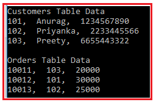

##  Inleiding Disconnected Toegang

In het vorige hoofdstuk “Connected Toegang” was een constante verbinding met de database vereist. In dit hoofdstuk wordt de data offline gebruikt. Een tijdelijke verbinding met de database is uiteraard noodzakelijk om de data op te halen. Maar daarna is de data offline beschikbaar en kan de data bewerkt worden. Het is zelfs mogelijk om helemaal zonder verbinding te werken en een volledige dataset met relaties op te bouwen in het geheugen.

## DataTable

Zoals een tabel in SQL, zal de DataTable ook relationele data in tabelvorm weergeven en deze data zal in het geheugen worden opgeslagen. Wanneer je een instantie van een DataTable creëert, heeft deze standaard geen tabel-schema, d.w.z. dat deze standaard geen kolommen of constraints heeft. U kunt een tabel schema maken door kolommen en constraints aan de tabel toe te voegen. Zodra je het schema (d.w.z. kolommen en constraints) voor de DataTable hebt gedefinieerd, kun je rijen toevoegen aan de data tabel. Om DataTable te kunnen gebruiken, moet u de System.Data-naamruimte opnemen.

Opmerking: De ADO.NET DataTable is een centraal object dat onafhankelijk kan worden gebruikt of kan worden gebruikt door andere objecten, zoals DataSet en de DataView. 


### Constructoren:

1. **DataTable()**: wordt gebruikt om een nieuwe instantie van de System.Data.DataTable klasse te initialiseren zonder argumenten.
2. **DataTable(string tableName)**: wordt gebruikt om een nieuwe instantie van de System.Data.DataTable klasse te initialiseren met de opgegeven tabelnaam. Hier is de Parameter tableName de naam die aan de tabel moet worden gegeven. Indien tableName null is of een lege string, wordt een standaardnaam gegeven bij toevoeging aan de System.Data.DataTableCollection.
3. **DataTable(SerializationInfo info, StreamingContext context)**: r wordt gebruikt om een nieuwe instantie van de klasse System.Data.DataTable te initialiseren met de System.Runtime.Serialization.SerializationInfo en de System.Runtime.Serialization.StreamingContext. Hier specificeert de parameter info de gegevens die nodig zijn om een object te serialiseren of deserialiseren en de parameter context specificeert de bron en bestemming van een gegeven geserialiseerde stroom.
4. **DataTable(string tableName, string tableNamespace)**: hiermee wordt een nieuwe instantie van de klasse System.Data.DataTable geïnitialiseerd met de opgegeven tabelnaam en namespace. Hier specificeert de parameter tableName de naam die aan de tabel moet worden gegeven. Indien tableName null is of een lege string, wordt een standaard naam gegeven bij toevoeging aan de System.Data.DataTableCollection. De tweede parameter, tableNamespace, specificeert de namespace voor de XML-weergave van de gegevens die in de DataTable zijn opgeslagen.

### Eigenschappen van ADO.NET DataTable:

1. **Colums**: Deze wordt gebruikt om de verzameling kolommen op te halen die bij deze tabel horen.

2. **Constraints**: t wordt gebruikt om de verzameling van constraints te krijgen die door deze tabel worden onderhouden.

3. **DataSet**: Wordt gebruikt om de DataSet op te halen waartoe deze tabel behoort.

4. **DefaultView** (Standaardweergave): Wordt gebruikt om een aangepaste weergave van de tabel op te halen die een gefilterde weergave kan bevatten.

5. **HasErrors** (Heeft fouten): Wordt gebruikt om een waarde op te halen die aangeeft of er fouten zijn in een van de rijen in de tabel van de DataSet.

6. **MinimumCapacity**: Wordt gebruikt om de initiële startgrootte voor deze tabel te krijgen of in te stellen.

7. **PrimaryKey**: Wordt gebruikt om een array van kolommen op te halen of in te stellen die fungeren als primaire sleutels voor de gegevenstabel.

8. **Rows**: Wordt gebruikt om de verzameling rijen op te halen die bij deze tabel horen.

9. **TableName (Tabelnaam)**: Wordt gebruikt om de naam van de DataTable te krijgen of in te stellen.

   

   ### Methoden DataTable in ADO.NET:

1. AcceptChanges(): wordt gebruikt om alle wijzigingen die in deze tabel zijn aangebracht vast te leggen.
2. Clear(): wordt gebruikt om de DataTable te wissen van alle gegevens.
3. Clone(): wordt gebruikt om de structuur van de DataTable te klonen.
4. Copy(): wordt gebruikt om zowel de structuur als de gegevens van de DataTable te kopiëren.
5. CreateDataReader(): wordt gebruikt om een DataTableReader terug te geven die overeenkomt met de gegevens binnen deze DataTable.
6. CreateInstance(): wordt gebruikt om een nieuwe instantie van DataTable te maken.
7. GetRowType(): wordt gebruikt om het rijtype op te halen.
8. GetSchema(): wordt gebruikt om het schema van de tabel op te halen.
9. ImportRow(DataRow): wordt gebruikt om een DataRow naar een DataTable te kopiëren.
10. Load(IDataReader): wordt gebruikt om een DataTable te vullen met waarden uit een gegevensbron met behulp van de meegeleverde IDataReader.
11. Join(DataTable, Booleaans): wordt gebruikt om de opgegeven DataTable samen te voegen met de huidige DataTable.
12. NewRow(): wordt gebruikt om een nieuwe DataRow aan te maken met hetzelfde schema als de tabel.
13. Select(): wordt gebruikt om een array van alle DataRow objecten op te halen.
14. WriteXml(String): wordt gebruikt om de huidige inhoud van de DataTable als XML te schrijven met behulp van het opgegeven bestand.

```c#
using System;
using System.Data;
using System.Data.SqlClient;

namespace AdoNetConsoleApplication
{
    class Program
    {
        static void Main(string[] args)
        {
            try
            {
                //Creating data table instance
                DataTable dataTable = new DataTable("Student");

                //Add the DataColumn using all properties
                DataColumn Id = new DataColumn("ID");
                Id.DataType = typeof(int);
                Id.Unique = true;
                Id.AllowDBNull = false;
                Id.Caption = "Student ID";
                dataTable.Columns.Add(Id);
                
                //Add the DataColumn few properties
                DataColumn Name = new DataColumn("Name");
                Name.MaxLength = 50;
                Name.AllowDBNull = false;
                dataTable.Columns.Add(Name);
                
                //Add the DataColumn using defaults
                DataColumn Email = new DataColumn("Email");
                dataTable.Columns.Add(Email);
                
                //Setting the Primary Key
                dataTable.PrimaryKey = new DataColumn[] { Id };
                
                //Add New DataRow by creating the DataRow object
                DataRow row1 = dataTable.NewRow();
                row1["Id"] = 101;
                row1["Name"] = "Anurag";
                row1["Email"] = "Anurag@dotnettutorials.net";
                dataTable.Rows.Add(row1);

                //Adding new DataRow by simply adding the values
                dataTable.Rows.Add(102, "Mohanty", "Mohanty@dotnettutorials.net");

                foreach (DataRow row in dataTable.Rows)
                {
                    Console.WriteLine(row["Id"] + ",  " + row["Name"] + ",  " + row["Email"]);
                }
            }
            catch (Exception e)
            {
                Console.WriteLine("OOPs, something went wrong.\n" + e);
            }
        }
    }
}
```


### DataColumn eigenschappen

In het bovenstaande voorbeeld hebben we enkele van de eigenschappen van DataColumn gebruikt. Hieronder volgt de lijst van alle beschikbare van DataColumn klassen.

1. AllowDBNull: Deze eigenschap wordt gebruikt om een waarde te krijgen of in te stellen die aangeeft of de kolom al dan niet null-waarden zal aanvaarden.

2. Autoincrement: Deze eigenschap wordt gebruikt wanneer u de kolomwaarden automatisch wilt verhogen.

3. AutoincrementSeed: Deze eigenschap wordt gebruikt om de startwaarde voor de automatisch vermeerderde kolom te krijgen of in te stellen.

4. AutoincrementStep: Deze eigenschap wordt gebruikt om de increment te krijgen of in te stellen die wordt gebruikt door een kolom waarvan de Autoincrement eigenschap is ingesteld op true.

5. Caption: Deze eigenschap wordt gebruikt om het opschrift voor de kolom te krijgen of in te stellen.

6. ColumnName: Deze eigenschap wordt gebruikt om de naam van de kolom te krijgen of in te stellen.

7. Expression: Deze eigenschap wordt gebruikt om de expressie te krijgen of in te stellen die wordt gebruikt om rijen te filteren, de waarden in een kolom te berekenen of een aggregaatkolom te maken.

8. Max. lengte: Deze eigenschap wordt gebruikt om de maximale lengte van een tekstkolom te krijgen of in te stellen.

9. Unique: Deze eigenschap wordt gebruikt om een waarde te krijgen of in te stellen die aangeeft of de waarden in elke rij van de kolom uniek moeten zijn.

   

   In ons voorbeeld hebben we de meeste van de bovenstaande eigenschappen besproken. Laat ons één belangrijke eigenschap begrijpen, nl. Autoincrement.

```c#
using System;
using System.Data;
namespace AdoNetConsoleApplication
{
    class Program
    {
        static void Main(string[] args)
        {
            try
            {
                //Creating data table instance
                DataTable dataTable = new DataTable("Student");
                
                DataColumn Id = new DataColumn
                {
                    ColumnName = "Id",
                    DataType = System.Type.GetType("System.Int32"),
                    AutoIncrement = true,
                    AutoIncrementSeed = 1000,
                    AutoIncrementStep = 10
                };
                dataTable.Columns.Add(Id);
                
                //Add the DataColumn few properties
                DataColumn Name = new DataColumn("Name");
                Name.MaxLength = 50;
                Name.AllowDBNull = false;
                dataTable.Columns.Add(Name);
                
                //Add the DataColumn using defaults
                DataColumn Email = new DataColumn("Email");
                dataTable.Columns.Add(Email);
                
                //Add New DataRow by creating the DataRow object
                DataRow row1 = dataTable.NewRow();
                
                row1["Name"] = "Anurag";
                row1["Email"] = "Anurag@dotnettutorials.net";
                dataTable.Rows.Add(row1);
               
                //Adding new DataRow by simply adding the values
                //Supply null for auto increment column
                dataTable.Rows.Add(null, "Mohanty", "Mohanty@dotnettutorials.net");
                foreach (DataRow row in dataTable.Rows)
                {
                    Console.WriteLine(row["Id"] + ",  " + row["Name"] + ",  " + row["Email"]);
                }
            }
            catch (Exception e)
            {
                Console.WriteLine("OOPs, something went wrong.\n" + e);
            }
            Console.ReadKey();
        }
    }
}
```


Maak de database StudentDb aan:

```sql
CREATE DATABASE StudentDB;
GO
USE StudentDB;
GO
CREATE TABLE Student(
 Id INT PRIMARY KEY,
 Name VARCHAR(100),
 Email VARCHAR(50),
 Mobile VARCHAR(50)
)
GO
INSERT INTO Student VALUES (101, 'Anurag', 'Anurag@dotnettutorial.net', '1234567890')
INSERT INTO Student VALUES (102, 'Priyanka', 'Priyanka@dotnettutorial.net', '2233445566')
INSERT INTO Student VALUES (103, 'Preety', 'Preety@dotnettutorial.net', '6655443322')
INSERT INTO Student VALUES (104, 'Sambit', 'Sambit@dotnettutorial.net', '9876543210')
GO
```

Gebruik een DataTable om de tabel student "disconnected" op te lezen:

```c#
using System;
using System.Data;
using System.Data.SqlClient;
namespace AdoNetConsoleApplication
{
    class Program
    {
        static void Main(string[] args)
        {
            try
            {
                string ConnectionString = "data source=.; database=StudentDB; integrated security=SSPI";
                using (SqlConnection connection = new SqlConnection(ConnectionString))
                {
                    SqlDataAdapter da = new SqlDataAdapter("select * from student", connection);
                    DataTable dt = new DataTable();
                    da.Fill(dt);
                    
                    foreach (DataRow row in dt.Rows)
                    {
                        Console.WriteLine(row["Name"] + ",  " + row["Email"] + ",  " + row["Mobile"]);
                    }
                }
            }
            catch (Exception e)
            {
                Console.WriteLine("OOPs, something went wrong.\n" + e);
            }
            Console.ReadKey();
        }
    }
}
```


### Copy en Clone

Indien u een volledige kopie wenst te maken van een gegevenstabel, dan moet u de methode Copy van het DataTable object gebruiken, die niet alleen de data van de DataTable zal kopiëren, maar ook het schema. Maar als je het schema van de gegevenstabel wilt kopiëren zonder de gegevens, dan moet je de Clone methode van de gegevenstabel gebruiken. Het volgende voorbeeld toont het gebruik van zowel de clone als de copy methode.

```c#
using System;
using System.Data;
using System.Data.SqlClient;
namespace AdoNetConsoleApplication
{
    class Program
    {
        static void Main(string[] args)
        {
            try
            {
                string ConnectionString = "data source=.; database=StudentDB; integrated security=SSPI";
                using (SqlConnection connection = new SqlConnection(ConnectionString))
                {
                    SqlDataAdapter da = new SqlDataAdapter("select * from student", connection);
                    DataTable originalDataTable = new DataTable();
                    da.Fill(originalDataTable);
                    Console.WriteLine("Original Data Table : originalDataTable");
                    foreach (DataRow row in originalDataTable.Rows)
                    {
                        Console.WriteLine(row["Name"] + ",  " + row["Email"] + ",  " + row["Mobile"]);
                    }
                    Console.WriteLine();
                    Console.WriteLine("Copy Data Table : copyDataTable");
                    DataTable copyDataTable = originalDataTable.Copy();
                    if (copyDataTable != null)
                    {
                        foreach (DataRow row in copyDataTable.Rows)
                        {
                            Console.WriteLine(row["Name"] + ",  " + row["Email"] + ",  " + row["Mobile"]);
                        }
                    }
                    Console.WriteLine();
                    Console.WriteLine("Clone Data Table : cloneDataTable");
                    DataTable cloneDataTable = originalDataTable.Clone();
                    if (cloneDataTable.Rows.Count > 0)
                    {
                        foreach (DataRow row in cloneDataTable.Rows)
                        {
                            Console.WriteLine(row["Name"] + ",  " + row["Email"] + ",  " + row["Mobile"]);
                        }
                    }
                    else
                    {
                        Console.WriteLine("cloneDataTable is Empty");
                        Console.WriteLine("Adding Data to cloneDataTable");
                        cloneDataTable.Rows.Add(101, "Test1", "Test1@dotnettutorial.net", "1234567890");
                        cloneDataTable.Rows.Add(101, "Test2", "Test1@dotnettutorial.net", "1234567890");
                        foreach (DataRow row in cloneDataTable.Rows)
                        {
                            Console.WriteLine(row["Name"] + ",  " + row["Email"] + ",  " + row["Mobile"]);
                        }
                    }
                    
                }
            }
            catch (Exception e)
            {
                Console.WriteLine("OOPs, something went wrong.\n" + e);
            }
            Console.ReadKey();
        }
    }
}
```


### Verwijderen

Je kan een DataRow verwijderen uit de DataRowCollection door de Remove methode van de DataRowCollection op te roepen, of door de Delete methode van het DataRow object op te roepen.

De methode Remove verwijdert de rij uit de collectie, terwijl de methode Delete de DataRow markeert voor verwijdering. De eigenlijke verwijdering zal gebeuren wanneer je de AcceptChanges methode aanroept. Indien je wil terugdraaien, dan moet je de RejectChanges methode gebruiken die terugdraait naar de vorige toestand. De RejectChanges methode zal de Originele data rij versie kopiëren naar de Huidige data rij versie.

```c#
using System;
using System.Data;
using System.Data.SqlClient;
namespace AdoNetConsoleApplication
{
    class Program
    {
        static void Main(string[] args)
        {
            try
            {
                string ConnectionString = "data source=.; database=StudentDB; integrated security=SSPI";
                using (SqlConnection connection = new SqlConnection(ConnectionString))
                {
                    SqlDataAdapter da = new SqlDataAdapter("select * from student", connection);
                    DataTable originalDataTable = new DataTable();
                    da.Fill(originalDataTable);
                    Console.WriteLine("Before Deletion");
                    foreach (DataRow row in originalDataTable.Rows)
                    {
                        Console.WriteLine(row["Name"] + ",  " + row["Email"] + ",  " + row["Mobile"]);
                    }
                    Console.WriteLine();
                    foreach (DataRow row in originalDataTable.Rows)
                    {
                        if (Convert.ToInt32(row["Id"]) == 101)
                        {
                            row.Delete();
                            Console.WriteLine("Row with Id 101 Deleted");
                        }
                    }
                    originalDataTable.AcceptChanges();
                    Console.WriteLine();
                    Console.WriteLine("After Deletion");
                    foreach (DataRow row in originalDataTable.Rows)
                    {
                        Console.WriteLine(row["Name"] + ",  " + row["Email"] + ",  " + row["Mobile"]);
                    }
                }
            }
            catch (Exception e)
            {
                Console.WriteLine("OOPs, something went wrong.\n" + e);
            }
            Console.ReadKey();
        }
    }
}
```


### Reject changes

```c#
using System;
using System.Data;
using System.Data.SqlClient;
namespace AdoNetConsoleApplication
{
    class Program
    {
        static void Main(string[] args)
        {
            try
            {
                string ConnectionString = "data source=.; database=StudentDB; integrated security=SSPI";
                using (SqlConnection connection = new SqlConnection(ConnectionString))
                {
                    SqlDataAdapter da = new SqlDataAdapter("select * from student", connection);
                    DataTable originalDataTable = new DataTable();
                    da.Fill(originalDataTable);
                    Console.WriteLine("Before Deletion");
                    foreach (DataRow row in originalDataTable.Rows)
                    {
                        Console.WriteLine(row["Name"] + ",  " + row["Email"] + ",  " + row["Mobile"]);
                    }
                    Console.WriteLine();
                    foreach (DataRow row in originalDataTable.Rows)
                    {
                        if (Convert.ToInt32(row["Id"]) == 101)
                        {
                            row.Delete();
                            Console.WriteLine("Row with Id 101 Deleted");
                        }
                    }
                    
                    //Rollbacking the Data
                    originalDataTable.RejectChanges();
                    Console.WriteLine();
                    Console.WriteLine("Rollbacking the Changes");
                    foreach (DataRow row in originalDataTable.Rows)
                    {
                        Console.WriteLine(row["Name"] + ",  " + row["Email"] + ",  " + row["Mobile"]);
                    }
                }
            }
            catch (Exception e)
            {
                Console.WriteLine("OOPs, something went wrong.\n" + e);
            }
            Console.ReadKey();
        }
    }
}
```

## Dataset

Een dataset bevat één of meer tabellen en een tabel wordt vertegenwoordigd door DataTable. Een DataTable vertegenwoordigt een gegevensbron die gegevens in rij- en kolomopmaak opslaat.

Eigenlijk is een dataset een relationele database (of een deel van een relationele database) die zich volledig in het geheugen van de PC bevindt. Tijdens de verwerking is er helemaal geen verbinding met de database. Alleen op het ogenblik dat de gegevens in de DataSet geladen worden en op het ogenblik dat de aangepaste gegevens vanuit de DataSet naar de database weggeschreven worden, is er een verbinding met de database.

De DataSet vertegenwoordigt een subset van de database in het geheugen. Dat betekent dat de ADO.NET DataSet een verzameling gegevenstabellen is die de relationele gegevens in het geheugen bevat in tabelvorm.

Er is geen continue open of actieve verbinding met de database voor nodig. De DataSet is gebaseerd op de "disconnected architecture". Dit is de reden waarom hij wordt gebruikt om gegevens op te halen zonder interactie met een gegevensbron. We zullen de disconnected architectuur van de dataset bespreken in onze volgende artikelen.

Opmerking: De klasse ADO.NET DataSet is de kerncomponent voor het verschaffen van toegang tot gegevens in een gedistribueerde en ontkoppelde omgeving. De ADO.NET DataSet class behoort tot de System.Data namespace.


Kijk eens naar de onderstaande afbeelding. Zoals u kunt zien, hebben we hier een DataTable gemaakt met de naam Customer. Vervolgens hebben we drie datakolommen gecreëerd en deze drie kolommen toegevoegd aan de Customer data tabel. Tenslotte hebben we twee data rijen aangemaakt en deze twee data rijen toegevoegd aan de Customer data tabel.


Kijk eens naar de volgende afbeelding. Hier kunt u zien dat we een DataTable hebben aangemaakt met de naam Orders. Vervolgens hebben we drie datakolommen aangemaakt (Id, CustomerId, en Bedrag) en deze drie kolommen toegevoegd aan de tabel Orders. Tenslotte hebben we twee data rijen aangemaakt en deze data rijen toegevoegd aan de tabel Orders.


Zoals we reeds besproken hebben is de DataSet een verzameling van DataTables. Laten we dus een DataSet-object maken en vervolgens de twee gegevenstabellen (Klanten en Bestellingen) aan de DataSet toevoegen. Kijk eens naar de volgende afbeelding. Hier hebben we eerst een instantie van de DataSet gemaakt en vervolgens de twee gegevenstabellen toegevoegd met behulp van de eigenschap Tables van het DataSet-object.


Laten we nu eens kijken hoe we de gegevenstabel uit de dataset kunnen halen. Je kunt de gegevenstabel op twee manieren ophalen uit een dataset, namelijk met behulp van de indexpositie en met behulp van de tabelnaam (indien opgegeven).


```c#
using System;
using System.Data;
namespace AdoNetConsoleApplication
{
    class Program
    {
        static void Main(string[] args)
        {
            try
            {
                // Creating Customer table
                DataTable Customer = new DataTable("Customer");
                //Creating column and schema
                DataColumn CustomerId = new DataColumn("ID", typeof(Int32));
                Customer.Columns.Add(CustomerId);
                DataColumn CustomerName = new DataColumn("Name", typeof(string));
                Customer.Columns.Add(CustomerName);
                DataColumn CustomerMobile = new DataColumn("Mobile", typeof(string));
                Customer.Columns.Add(CustomerMobile);
                //Adding Data Rows into Customer table
                Customer.Rows.Add(101, "Anurag", "2233445566");
                Customer.Rows.Add(202, "Manoj", "1234567890");
                
                // Creating Orders table
                DataTable Orders = new DataTable("Orders");
                //Creating column and schema
                DataColumn OrderId = new DataColumn("ID", typeof(Int32));
                Orders.Columns.Add(OrderId);
                DataColumn CustId = new DataColumn("CustomerId", typeof(Int32));
                Orders.Columns.Add(CustId);
                DataColumn OrderAmount = new DataColumn("Amount", typeof(Int32));
                Orders.Columns.Add(OrderAmount);
                
                //Adding Data Rows into Orders table
                Orders.Rows.Add(10001, 101, 20000);
                Orders.Rows.Add(10002, 102, 30000);
               
                //Creating DataSet object
                DataSet dataSet = new DataSet();
                //Adding DataTables into DataSet
                dataSet.Tables.Add(Customer);
                dataSet.Tables.Add(Orders);
                //Customer Table
                Console.WriteLine("Customer Table Data: ");
                //Fetching DataTable from dataset using the Index position
                foreach (DataRow row in dataSet.Tables[0].Rows)
                {
                    Console.WriteLine(row["ID"] + ",  " + row["Name"] + ",  " + row["Mobile"]);
                }
                Console.WriteLine();
                //Orders Table
                Console.WriteLine("Orders Table Data: ");
                //Fetching DataTable from the DataSet using the table name
                foreach (DataRow row in dataSet.Tables["Orders"].Rows)
                {
                    Console.WriteLine(row["ID"] + ",  " + row["CustomerId"] + ",  " + row["Amount"]);
                }
            }
            catch (Exception e)
            {
                Console.WriteLine("OOPs, something went wrong.\n" + e);
            }
            Console.ReadKey();
        }
    }
}
```

Uitvoer:


Constructors

1. DataSet(): Deze initialiseert een nieuwe instantie van de System.Data.DataSet klasse.

2. DataSet(string dataSetName): Deze initialiseert een nieuwe instantie van een System.Data.DataSet klasse met de gegeven naam. Hier specificeert de stringparameter dataSetName de naam van de System.Data.DataSet.

3. DataSet(SerializationInfo info, StreamingContext context): Hiermee initialiseert u een nieuwe instantie van een System.Data.DataSet-klasse die de gegeven serialisatie-info en -context heeft. Hier is de parameter info de data die nodig is om een object te serialiseren of deserialiseren. De context specificeert de bron en bestemming van een gegeven geserialiseerde stroom.

4. DataSet(SerializationInfo info, StreamingContext context, bool ConstructSchema): Hiermee initialiseer je een nieuwe instantie van de klasse System.Data.DataSet.

   

   Eigenschappen van DataSet

1. CaseSensitive: Deze wordt gebruikt om een waarde te krijgen of in te stellen die aangeeft of stringvergelijkingen binnen System.Data.DataTable objecten hoofdlettergevoelig zijn. Ze geeft "true" terug als tekenreeksvergelijkingen hoofdlettergevoelig zijn; anders "false". De standaardwaarde is false.

2. StandaardViewManager: Wordt gebruikt om een aangepaste weergave te krijgen van de gegevens in de System.Data.DataSet om filteren, zoeken en navigeren mogelijk te maken met behulp van een aangepaste System.Data.DataViewManager.

3. DataSetName: Wordt gebruikt om de naam van de huidige System.Data.DataSet op te halen of in te stellen.

4. EnforceConstraints: Wordt gebruikt om een waarde te krijgen of in te stellen die aangeeft of beperkingsregels worden gevolgd bij een poging tot bijwerken.

5. HasErrors (Heeft fouten): Wordt gebruikt om een waarde te krijgen die aangeeft of er fouten zijn in een van de System.Data.DataTable-objecten binnen deze System.Data.DataSet.

6. IsInitialized: Wordt gebruikt om een waarde te krijgen die aangeeft of de System.Data.DataSet is geïnitialiseerd. De waarde "true" geeft aan dat de component is geïnitialiseerd; anders "false".

7. Prefix: Wordt gebruikt om een XML-prefix te krijgen of in te stellen die de naamruimte van de System.Data.DataSet aliassen.

8. Locale: Wordt gebruikt om de locale-informatie te krijgen of in te stellen die wordt gebruikt om strings binnen de tabel te vergelijken.

9. Namespace: Wordt gebruikt om de namespace van de System.Data.DataSet te krijgen of in te stellen.

10. Site: Wordt gebruikt om een System.ComponentModel.ISite voor de System.Data.DataSet te krijgen of in te stellen.

11. Relations: Wordt gebruikt om de verzameling relaties op te halen die tabellen koppelen en navigatie van parent tabellen naar child tabellen mogelijk maken.

12. Tabellen: Wordt gebruikt om de verzameling tabellen in de System.Data.DataSet op te halen.

    

    Methoden van de ADO.NET DataSet Class

1. BeginInit(): Begint de initialisatie van een System.Data.DataSet die op een formulier wordt gebruikt of door een ander component wordt gebruikt. De initialisatie vindt plaats tijdens runtime.
2. Clear(): Hiermee wordt de System.Data.DataSet van alle gegevens ontdaan door alle rijen in alle tabellen te verwijderen.
3. Clone(): Deze kopieert de structuur van de System.Data.DataSet, inclusief alle System.Data.DataTable schema's, relaties en constraints. Kopieert geen gegevens.
4. Copy(): Kopieert zowel de structuur als de gegevens voor deze System.Data.DataSet.
5. CreateDataReader(): Geeft een System.Data.DataTableReader terug met één resultatenset per System.Data.DataTable, in dezelfde volgorde als de tabellen voorkomen in de System.Data.DataSet.Tables collectie.
6. CreateDataReader(params DataTable[] dataTables): Geeft een System.Data.DataTableReader terug met één resultatenset per System.Data.DataTable. Hier specificeert de parameter dataTables een array van DataTables die de volgorde aangeeft van de resultaatreeksen die in de System.Data.DataTableReader moeten worden geretourneerd
7. EndInit(): Hiermee wordt de initialisatie van een System.Data.DataSet beëindigd die op een formulier wordt gebruikt of door een ander component wordt gebruikt. De initialisatie vindt plaats tijdens runtime.
8. GetXml(): Geeft de XML-weergave terug van de gegevens die in de System.Data.DataSet zijn opgeslagen.
   GetXmlSchema(): Geeft als resultaat het XML-schema voor de XML-weergave van de gegevens die in de System.Data.DataSet zijn opgeslagen.

Welke moet ik gebruiken: DataReader of DataSet?

DataSet:

- Wanneer je de data lokaal wil cachen in je applicatie zodat je de data kan manipuleren.
- Wanneer je dynamisch met de data wilt werken, d.w.z. de data binden aan windows form control.
- Wanneer u wilt werken met losgekoppelde architectuur.

DataReader:

Wanneer u een aantal andere functionaliteiten nodig heeft die hierboven zijn genoemd, dan dient u DataReader te gebruiken die de performance van uw applicatie zal verbeteren. DataReader werkt op een connected-oriented architectuur, d.w.z. het vereist een open verbinding met de database.

## DataSet  en SQLServer


### ShoppingCartDB

```sql
CREATE DATABASE ShoppingCartDB;
GO
USE ShoppingCartDB;
GO
CREATE TABLE Customers(
 ID INT PRIMARY KEY,
 Name VARCHAR(100),
 Mobile VARCHAR(50)
)
GO
INSERT INTO Customers VALUES (101, 'Anurag', '1234567890')
INSERT INTO Customers VALUES (102, 'Priyanka', '2233445566')
INSERT INTO Customers VALUES (103, 'Preety', '6655443322')
GO
CREATE TABLE Orders(
 ID INT PRIMARY KEY,
 CustomerId INT,
 Amount INT
)
GO
INSERT INTO Orders VALUES (10011, 103, 20000)
INSERT INTO Orders VALUES (10012, 101, 30000)
INSERT INTO Orders VALUES (10013, 102, 25000)
GO
```

We tonen de inhoud van de Customers tabel op standard output en gebruiken hiervoor DataSet:

```c#
using System;
using System.Data;
using System.Data.SqlClient;
namespace AdoNetConsoleApplication
{
    class Program
    {
        static void Main(string[] args)
        {
            try
            {
                string ConnectionString = "data source=.; database=ShoppingCartDB; integrated security=SSPI";
                using (SqlConnection connection = new SqlConnection(ConnectionString))
                {
                    SqlDataAdapter dataAdapter = new SqlDataAdapter("select * from customers", connection);
                    //Creating DataSet Object
                    DataSet dataSet = new DataSet();
                    //Filling the DataSet
                    dataAdapter.Fill(dataSet);
                    //Iterating through the DataSet 
                    foreach (DataRow row in dataSet.Tables[0].Rows)
                    {
                        Console.WriteLine(row["Id"] + ",  " + row["Name"] + ",  " + row["Mobile"]);
                    }
                }
                Console.ReadKey();
            }
            catch (Exception e)
            {
                Console.WriteLine("OOPs, something went wrong.\n" + e);
            }
            Console.ReadKey();
        }
    }
}
```

Uitvoer:


Dit kan ook geïmplementeerd worden als volgt:


Het is ook mogelijk dat uw SQL Query meerdere tabellen teruggeeft. Laten we dit met een voorbeeld begrijpen. Nu onze zakelijke eis is om de klanten en orders tabel gegevens op te halen en moet worden weergegeven op de Console. Hier kunt u toegang krijgen tot de eerste tabel van de dataset met behulp van een integrale index 0 of string Tabelnaam. Aan de andere kant kunt u toegang krijgen tot de tweede tabel met behulp van de integrale index 1 of de stringnaam Table1.

```C#
using System;
using System.Data;
using System.Data.SqlClient;
namespace AdoNetConsoleApplication
{
    class Program
    {
        static void Main(string[] args)
        {
            try
            {
                string ConnectionString = "data source=.; database=ShoppingCartDB; integrated security=SSPI";
                using (SqlConnection connection = new SqlConnection(ConnectionString))
                {
                    //Sql Command return data from customers and orders table
                    SqlDataAdapter dataAdapter = new SqlDataAdapter("select * from customers; select * from orders", connection);
                    DataSet dataSet = new DataSet();                    
                    dataAdapter.Fill(dataSet);
                    // First Table
                    Console.WriteLine("Table 1 Data");
                    foreach (DataRow row in dataSet.Tables[0].Rows)
                    {
                        Console.WriteLine(row["Id"] + ",  " + row["Name"] + ",  " + row["Mobile"]);
                    }
                    Console.WriteLine();
                    // Second Table
                    Console.WriteLine("Table 2 Data");
                    foreach (DataRow row in dataSet.Tables[1].Rows)
                    {
                        Console.WriteLine(row["Id"] + ",  " + row["CustomerId"] + ",  " + row["Amount"]);
                    }
                }
                
                Console.ReadKey();
            }
            catch (Exception e)
            {
                Console.WriteLine("OOPs, something went wrong.\n" + e);
            }
            Console.ReadKey();
        }
    }
}
```

Uitvoer:


Door gebruik te maken van de tabelnaam:

```c#
using System;
using System.Data;
using System.Data.SqlClient;
namespace AdoNetConsoleApplication
{
    class Program
    {
        static void Main(string[] args)
        {
            try
            {
                string ConnectionString = "data source=.; database=ShoppingCartDB; integrated security=SSPI";
                using (SqlConnection connection = new SqlConnection(ConnectionString))
                {
                    //Sql Command return data from customers and orders table
                    SqlDataAdapter dataAdapter = new SqlDataAdapter("select * from customers; select * from orders", connection);
                    DataSet dataSet = new DataSet();                    
                    dataAdapter.Fill(dataSet);
                    // First Table
                    Console.WriteLine("Table 1 Data");
                    foreach (DataRow row in dataSet.Tables["Table"].Rows)
                    {
                        Console.WriteLine(row["Id"] + ",  " + row["Name"] + ",  " + row["Mobile"]);
                    }
                    Console.WriteLine();
                    // Second Table
                    Console.WriteLine("Table 2 Data");
                    foreach (DataRow row in dataSet.Tables["Table1"].Rows)
                    {
                        Console.WriteLine(row["Id"] + ",  " + row["CustomerId"] + ",  " + row["Amount"]);
                    }
                }
                
                Console.ReadKey();
            }
            catch (Exception e)
            {
                Console.WriteLine("OOPs, something went wrong.\n" + e);
            }
            Console.ReadKey();
        }
    }
}
```

### Zet de tabelnaam expliciet in DataSet

Indien uw dataset gegevens van meerdere tabellen zal bevatten, dan is het zeer moeilijk voor u om te identificeren met behulp van de integrale indexpositie of met behulp van de standaardnaam. In zo'n scenario is het altijd aan te bevelen een expliciete naam te geven aan de tabel.

Laat ons dit begrijpen met een voorbeeld. Nu moeten we de eerste tabel instellen als Klanten en de tweede tabel als Bestellingen en dan zullen we zien hoe we deze aangepaste tabelnamen kunnen gebruiken om de eigenlijke tabelgegevens op te halen. U kunt de tabelnaam instellen met de eigenschap TableName zoals hieronder getoond.


Het volledige voorbeeld:

```c#
using System;
using System.Data;
using System.Data.SqlClient;
namespace AdoNetConsoleApplication
{
    class Program
    {
        static void Main(string[] args)
        {
            try
            {
                string ConnectionString = "data source=.; database=ShoppingCartDB; integrated security=SSPI";
                using (SqlConnection connection = new SqlConnection(ConnectionString))
                {
                    //Sql Command return data from customers and orders table
                    SqlDataAdapter dataAdapter = new SqlDataAdapter("select * from customers; select * from orders", connection);
                    DataSet dataSet = new DataSet();                    
                    dataAdapter.Fill(dataSet);
                    //Setting the table name explicitly
                    dataSet.Tables[0].TableName = "Customers";
                    dataSet.Tables[1].TableName = "Orders";
                   
                    Console.WriteLine("Customers Table Data");
                    //Fetching the table using the custom table name
                    foreach (DataRow row in dataSet.Tables["Customers"].Rows)
                    {
                        Console.WriteLine(row["Id"] + ",  " + row["Name"] + ",  " + row["Mobile"]);
                    }
                    Console.WriteLine();
                    // Second Table
                    Console.WriteLine("Orders Table Data");
                    //Fetching the table using the custom table name
                    foreach (DataRow row in dataSet.Tables["Orders"].Rows)
                    {
                        Console.WriteLine(row["Id"] + ",  " + row["CustomerId"] + ",  " + row["Amount"]);
                    }
                }
                
                Console.ReadKey();
            }
            catch (Exception e)
            {
                Console.WriteLine("OOPs, something went wrong.\n" + e);
            }
            Console.ReadKey();
        }
    }
}
```

Uitvoer:



DataSet staat centraal bij de ondersteuning van losgekoppelde, gedistribueerde gegevensscenario's met ADO.NET. De DataSet is een in het geheugen opgeslagen representatie van gegevens die een consistent relationeel programmeermodel biedt, ongeacht de gegevensbron. Hij kan worden gebruikt met meerdere en verschillende gegevensbronnen, met XML-gegevens, of om gegevens lokaal in de toepassing te beheren. De DataSet vertegenwoordigt een volledige reeks gegevens, inclusief gerelateerde tabellen, constraints en relaties tussen de tabellen. De volgende afbeelding toont het DataSet-objectmodel.


De methoden en objecten in een DataSet zijn consistent met die in het relationele databasemodel. De DataSet kan zijn inhoud ook als XML persisteren en opnieuw laden, en zijn schema als XML-schemadefinitietaal (XSD) schema. Zie XML gebruiken in een DataSet voor meer informatie.

### DataTableCollection

Een ADO.NET DataSet bevat een verzameling van nul of meer tabellen die worden voorgesteld door DataTable-objecten. De DataTableCollection bevat alle DataTable-objecten in een DataSet.

Een DataTable wordt gedefinieerd in de System.Data-naamruimte en vertegenwoordigt een enkele tabel met gegevens die zich in het geheugen bevinden. Hij bevat een verzameling kolommen die wordt voorgesteld door een DataColumnCollection en constraints die worden voorgesteld door een ConstraintCollection, die samen het schema van de tabel bepalen. Een DataTable bevat ook een verzameling rijen, voorgesteld door de DataRowCollection, die de gegevens in de tabel bevat. Een DataRow bewaart niet alleen zijn huidige status, maar ook zijn huidige en zijn oorspronkelijke versie om wijzigingen in de in de rij opgeslagen waarden te identificeren.

### DataView klasse

Met een DataView kun je verschillende weergaven maken van de gegevens die zijn opgeslagen in een DataTable, een mogelijkheid die vaak wordt gebruikt in data-bindingstoepassingen. Met behulp van een DataView kan je de gegevens in een tabel met verschillende sorteervolgorde tonen, en je kan de gegevens filteren op basis van de toestand van de rij of op basis van een filterexpressie. Voor meer informatie, zie DataViews.

### DataRelationCollection

Een DataSet bevat relaties in zijn DataRelationCollection-object. Een relatie, voorgesteld door het DataRelation-object, associeert rijen in een DataTable met rijen in een andere DataTable. Een relatie is analoog aan een join path dat kan bestaan tussen primaire en foreign key kolommen in een relationele database. Een DataRelation identificeert overeenkomende kolommen in twee tabellen van een DataSet.

Relaties maken navigatie van de ene tabel naar de andere in een DataSet mogelijk. De essentiële elementen van een DataRelation zijn de naam van de relatie, de naam van de tabellen die gerelateerd zijn, en de gerelateerde kolommen in elke tabel. Relaties kunnen worden opgebouwd met meer dan één kolom per tabel door een array van DataColumn-objecten op te geven als de belangrijkste kolommen. Wanneer u een relatie toevoegt aan de DataRelationCollection, kunt u optioneel een UniqueKeyConstraint en een ForeignKeyConstraint toevoegen om integriteitsbeperkingen af te dwingen wanneer er wijzigingen worden aangebracht in gerelateerde kolomwaarden.

### XML

U kunt een DataSet vullen vanuit een XML-stream of -document. U kunt de XML-stream of het XML-document gebruiken om gegevens, schema-informatie of beide aan de DataSet te leveren. De informatie uit de XML-stream of het XML-document kan worden gecombineerd met bestaande gegevens of schema-informatie die al in de DataSet aanwezig is.

### ExtendedProperties

De DataSet, DataTable en DataColumn hebben allemaal een eigenschap ExtendedProperties. ExtendedProperties is een PropertyCollection waarin je aangepaste informatie kunt plaatsen, zoals het SELECT statement dat gebruikt werd om de resultatenset te genereren of het tijdstip waarop de data gegenereerd werd. De ExtendedProperties collectie wordt gepersisteerd met de schema informatie voor de DataSet.

### LINQ to DataSet

LINQ to DataSet biedt in de taal geïntegreerde query-mogelijkheden voor losgekoppelde gegevens die in een DataSet zijn opgeslagen. LINQ to DataSet gebruikt standaard LINQ-syntaxis en biedt compile-time syntaxiscontrole, statische typering en IntelliSense-ondersteuning wanneer u de Visual Studio IDE gebruikt.