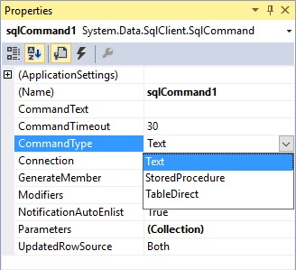
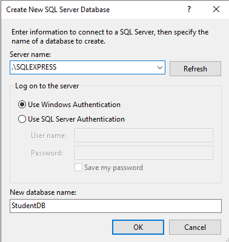

### Stored procedures

Naast SQL-statements kunnen ook **stored procedures** gebruikt worden om gegevens uit een database te halen. 

Een procedure is in het algemeen een **reeks instructies** die na elkaar moeten worden uitgevoerd. Stored procedures zijn - zoals de naam het zegt - in de database opgeslagen procedures. Deze procedures bestaan uit SQL statements. Bijvoorbeeld een taak waarin wordt geselecteerd uit een tabel met orders die verwerkt moeten worden tot een tabel met verzendingen.

Een voordeel van stored procedures is de **snelle verwerking** van de data doordat het programma in de database zelf draait en daarmee bovenop de data zit. De verwerking gaat, vooral door het ontbreken van netwerk overhead, sneller dan verwerking door een programma dat op een andere machine draait.

Een tweede voordeel bestaat erin dat je SQL statements kan **schrijven en testen** in een aparte omgeving. Pas als de stored procedures getest zijn en goed bevonden ga ze aanroepen of gebruiken in .NET, Java, PHP of een andere programmeertaal. 

**Nadeel: distributie van coding.**

Voor het definiëren en testen van stored procedures kan je gebruik maken van SQL Server Management Studio.

Voor meer compleet overzicht van stored procedures, te gebruiken op de NorthWind Microsoft database, zie: https://www.w3schools.com/sql/sql_stored_procedures.asp.

We bekijken hier heel bondig de ondersteuning voor stored procedures in Visual Studio.

Met de property CommandType wordt bepaalt hoe de property CommandText geïnterpreteerd moet worden. De mogelijkheden zijn:

- Text: SQL-statement
- StoredProcedure: naam van een stored procedure in een SQL database
- TableDirect: alle gegevens van de tabel worden opgehaald.

 

Open de ServerExplorer en klik rechts op Stored Procedures om via *Add New Stored Procedure* een nieuwe stored procedure toe te voegen.

Geef de procedure de naam **Teenager** en voeg de onderstaande SQL-instructies toe.

```sql
CREATE PROCEDURE dbo.Teenager
as select Naam, Email, geboortedatum from Personen where geboortedatum > DATEADD(year,-18,GETDATE());
```

Als bij CommandType de optie Stored Procedure geselecteerd wordt, dan kan gekozen worden tussen de opgeslagen Stored Procedures.

De Stored procedure kan  getest worden door in het snelmenu van de Stored Procedure te kiezen voor Execute.

Wanneer je de stored procedure wenst te gebruiken vanuit C# code, dan doe je dat als volgt:

```c#
			    // set stored procedure name
                string spName = @"dbo.[Teenager]";

                // define the SqlCommand object
                SqlCommand cmd = new(spName, conn);

                /*
                //Set SqlParameter - the id parameter value will be set from the command line
                SqlParameter param1 = new();
                param1.ParameterName = "@ID";
                param1.SqlDbType = SqlDbType.Int;
                param1.Value = int.Parse(args[0].ToString());

                //add the parameter to the SqlCommand object
                cmd.Parameters.Add(param1);
                */

                //set the SqlCommand type to stored procedure and execute
                cmd.CommandType = CommandType.StoredProcedure;
                SqlDataReader dr = cmd.ExecuteReader();

                Console.WriteLine(Environment.NewLine + "Retrieving stored procedure data from database..." + Environment.NewLine);

                //check if there are records
                if (dr.HasRows)
                {
                    while (dr.Read())
                    {
                        var naam = (string)dr["Naam"];
                        var email = (string)dr["Email"];
                        var geboortedatum = (DateTime)dr["Geboortedatum"];
                        Console.WriteLine($"{naam} | {email} | {geboortedatum.ToShortDateString()}");
                    }
                }
                else
                {
                    Console.WriteLine("No stored procedure data found.");
                }
```

We geven nog een voorbeeld.

#### Maak databank StudentDB aan 



... met volgende DDL:

```sql
USE StudentDB;
GO
CREATE TABLE Student(
 [Id] [int] IDENTITY(100,1) PRIMARY KEY,
 [Name] [nvarchar](100) NULL,
 [Email] [nvarchar](50) NULL,
 [Mobile] [nvarchar](50) NULL,
)
GO
INSERT INTO Student VALUES ('Anurag','Anurag@hogent.net','1234567890')
INSERT INTO Student VALUES ('Priyanka','Priyanka@hogent.net','2233445566')
INSERT INTO Student VALUES ('Preety','Preety@hogent.net','6655443322')
INSERT INTO Student VALUES ('Sambit','Sambit@hogent.net','9876543210')
```

#### Stored procedure zonder parameter

```sql
CREATE PROCEDURE spGetStudents
AS
BEGIN
     SELECT Id, Name, Email, Mobile
  FROM Student
END
```

```c#
using System;
using System.Data;
using Microsoft.Data.SqlClient;

namespace ADOUsingStoredProcedure
{
    class Program
    {
        static void Main(string[] args)
        {
            try
            {
                string ConnectionString = @"Data Source=.\SQLEXPRESS;Initial Catalog=StudentDB;Integrated Security=True;Pooling=False";
                using (SqlConnection connection = new(ConnectionString))
                {
                    SqlCommand cmd = new("spGetStudents", connection)
                    {
                        CommandType = CommandType.StoredProcedure
                    };
                    connection.Open();
                    SqlDataReader sdr = cmd.ExecuteReader();
                    while (sdr.Read())
                    {
                        Console.WriteLine(sdr["Id"] + ",  "+sdr["Name"] + ",  " + sdr["Email"] + ",  " + sdr["Mobile"]);
                    }
                }             
            }
            catch (Exception e)
            {
                Console.WriteLine("OOPs, something went wrong.\n" + e.Message);
            }
            Console.ReadKey();
        }
    }
}
```

#### Stored procedure met input parameter

```sql
CREATE PROCEDURE spGetStudentById
(
   @Id INT
)
AS
BEGIN
     SELECT Id, Name, Email, Mobile
  FROM Student
  WHERE Id = @Id
END
```

```c#
using System;
using System.Data;
using Microsoft.Data.SqlClient;

namespace ADOUsingStoredProcedure
{
    class Program
    {
        static void Main(string[] args)
        {
            try
            {
                string ConnectionString = @"Data Source=.\SQLEXPRESS;Initial Catalog=StudentDB;Integrated Security=True;Pooling=False";
                using (SqlConnection connection = new SqlConnection(ConnectionString))
                {
                  
                    //Create the command object
                    SqlCommand cmd = new()
                    {
                        CommandText = "spGetStudentById",
                        Connection = connection,
                        CommandType = CommandType.StoredProcedure
                    };
                    //Set SqlParameter
                    SqlParameter param1 = new()
                    {
                        ParameterName = "@Id", //Parameter name defined in stored procedure
                        SqlDbType = SqlDbType.Int, //Data Type of Parameter
                        Value = 101, //Value passes to the paramtere
                        Direction = ParameterDirection.Input //Specify the parameter as input
                    };
                    //add the parameter to the SqlCommand object
                    cmd.Parameters.Add(param1);
                    connection.Open();
                    SqlDataReader sdr = cmd.ExecuteReader();
                    while (sdr.Read())
                    {
                        Console.WriteLine(sdr["Id"] + ",  "+sdr["Name"] + ",  " + sdr["Email"] + ",  " + sdr["Mobile"]);
                    }
                }             
            }
            catch (Exception e)
            {
                Console.WriteLine("OOPs, something went wrong.\n" + e.Message);
            }
            Console.ReadKey();
        }
    }
}
```

#### Stored procedure met input en output parameter

```sql
CREATE PROCEDURE spCreateStudent
(
 @Name VARCHAR(100),
 @Email VARCHAR(50),
 @Mobile VARCHAR(50),
 @Id int Out  
)
AS
BEGIN
     INSERT INTO Student VALUES (@Name,@Email,@Mobile)
  SELECT @Id = SCOPE_IDENTITY()  
END
```

```c#
using System;
using System.Data;
using Microsoft.Data.SqlClient;

namespace ADOUsingStoredProcedure
{
    class Program
    {
        static void Main(string[] args)
        {
            try
            {
                string ConnectionString = @"Data Source=.\SQLEXPRESS;Initial Catalog=StudentDB;Integrated Security=True;Pooling=False";
                using (SqlConnection connection = new(ConnectionString))
                {
                    //Create the command object
                    SqlCommand cmd = new SqlCommand()
                    {
                        CommandText = "spCreateStudent",
                        Connection = connection,
                        CommandType = CommandType.StoredProcedure
                    };
                    //Set SqlParameter
                    SqlParameter param1 = new()
                    {
                        ParameterName = "@Name", //Parameter name defined in stored procedure
                        SqlDbType = SqlDbType.NVarChar, //Data Type of Parameter
                        Value = "Test",
                        Direction = ParameterDirection.Input //Specify the parameter as input
                    };
                    //add the parameter to the SqlCommand object
                    cmd.Parameters.Add(param1);
                    //Another approach to add input parameter
                    cmd.Parameters.AddWithValue("@Email", "Test@dotnettutorial.net");
                    cmd.Parameters.AddWithValue("@Mobile", "1234567890");
                    
                    //Set SqlParameter
                    SqlParameter outParameter = new()
                    {
                        ParameterName = "@Id", //Parameter name defined in stored procedure
                        SqlDbType = SqlDbType.Int, //Data Type of Parameter
                        Direction = ParameterDirection.Output //Specify the parameter as ouput
                    };
                    //add the parameter to the SqlCommand object
                    cmd.Parameters.Add(outParameter);
                    
                    connection.Open();
                    cmd.ExecuteNonQuery();
                    
                    Console.WriteLine("Newely Generated Student ID : " + outParameter.Value.ToString());
                }             
            }
            catch (Exception e)
            {
                Console.WriteLine("OOPs, something went wrong.\n" + e.Message);
            }
            Console.ReadKey();
        }
    }
}
```

### 