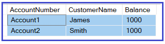
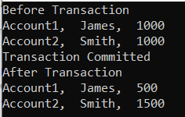
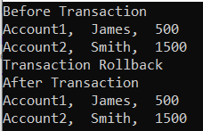

### Transactions

Het belangrijkste in de wereld van vandaag is data en de meest uitdagende taak is om deze data consistent te houden. De database systemen slaan de gegevens op en ADO.NET is een van de gegevenstoegangstechnologieën om toegang te krijgen tot de gegevens die in de database zijn opgeslagen.

Laten we eerst begrijpen wat bedoeld wordt met consistentie van gegevens en dan zullen we begrijpen waarom we transacties nodig hebben. Kijk hiervoor eens naar het volgende diagram. Hier kunt u zien dat we een Accounts tabel hebben met twee Accounts.



Maak 500 over van Account1 naar Account2. Hiervoor moeten we twee update statements schrijven zoals hieronder getoond. Het eerste update statement trekt 500 af van Account1 en het tweede update statement voegt 500 toe aan Account2:

```sql
UPDATE Accounts SET Saldo = Saldo - 500 WHERE AccountNumber = 'Account1';
UPDATE Accounts SET Saldo = Saldo + 500 WHERE AccountNumber = 'Account2';
```

Onze bedoeling is dat de gegevens consistent zijn. Zodra de update statements zijn uitgevoerd, moeten de gegevens in een consistente staat zijn. Laten we nu de volgende gevallen begrijpen.

**Geval 1:**
Het eerste update statement is succesvol uitgevoerd, maar het tweede update statement is mislukt. In dat geval is er 500 afgetrokken van Account1, maar dat bedrag is niet toegevoegd aan Account2, wat resulteert in inconsistentie van de gegevens.

**Geval 2:**
Het eerste update statement is mislukt maar het tweede update statement is met succes uitgevoerd. In dat geval wordt 500 niet afgetrokken van Account1, maar wordt 500 toegevoegd aan Account2, waardoor er inconsistentie in de gegevens ontstaat.

**Geval 3:**
Wanneer beide update statements Failed zijn, dan zijn de gegevens in een consistente staat.

**Geval4:**
Wanneer beide update statements Successful zijn, dan zijn de gegevens ook in een consistente staat. Dat wil zeggen 500 wordt afgetrokken van Account1 en 500 wordt toegevoegd aan Account2.

Van de vier hierboven besproken gevallen, hebben we geen problemen in geval 3 en 4. Tegelijkertijd kunnen we ook niet de garantie geven dat elke keer beide update statements mislukken en slagen. Dat betekent dat we iets speciaals moeten doen om geval 1 en 2 af te handelen, zodat de gegevens in een consistente toestand blijven en daarvoor moeten we transacties gebruiken.

#### Wat is een transactie?

Een transactie is een reeks operaties (meerdere DML operaties) die ervoor zorgen dat alle databasebewerkingen slagen of dat ze allemaal mislukken om de consistentie van de gegevens te waarborgen. Dit betekent dat het werk nooit half gedaan is, of alles is gedaan of er is niets gedaan.
ADO.NET ondersteunt zowel enkelvoudige databasetransacties als gedistribueerde transacties. De enkele databasetransactie wordt geïmplementeerd met behulp van de .NET beheerde providers voor Transactie- en Verbindingsklassen, die tot de System.Data naamruimte behoren.


Er zijn veel verschillende manieren die we kunnen gebruiken om Transactie te implementeren met behulp van ADO.NET en C#. 

Deze zijn als volgt:

1. Enkele Database Transactie met behulp van *BeginTransaction*
2. Gedistribueerde transactie met behulp van TransactionScope, die behoort tot System.Transactions namespace
3. Gedistribueerde transactie met behulp van *ServicedComponent*

#### Enkele databasetransactie met behulp van BeginTransactie

Laten we eens kijken hoe we een enkele databasetransactie kunnen implementeren met behulp van BeginTransaction. We gaan hetzelfde voorbeeld van een geldoverdracht implementeren. Hier voeren we twee update-statements uit met behulp van ADO.NET Transaction. Hiervoor gaan we in deze demo de volgende Accounts tabel gebruiken.


Maak een tabel Accounts aan:

```c#
CREATE TABLE Accounts
(
     AccountNumber VARCHAR(60) PRIMARY KEY,
     CustomerName VARCHAR(60),
     Balance int
);
GO
INSERT INTO Accounts VALUES('Account1', 'James', 1000);
INSERT INTO Accounts VALUES('Account2', 'Smith', 1000);
GO
```

**Stap 1:** 

Eerst moet je het verbindingsobject maken en openen. 

```c#
SqlConnection connection = new SqlConnection(ConnectionString)
connection.Open();
```

**Stap 2:** 

Dan moet je het **SqlTransaction** object creëren en om dit te doen, moet je de **BeginTransaction** methode op het connection object aanroepen:

```c#
SqlTransaction transaction = connection.BeginTransaction();
```

**Stap 3:** 

Als alles goed gaat dan commit je de transactie. Roep daartoe de **Commit** methode op het transactie object aan zoals hieronder getoond:

```c#
transaction.Commit();
```

**Step 4:** 

Als er iets fout gaat, voer je een rollback uit van de transactie:

```c#
transaction.Rollback();
```

Volledig voorbeeld:

```c#
using System;
using Microsoft.Data.SqlClient;

namespace ADOTransactionsDemo
{
    class Program
    {
        public static string ConnectionString = @"Data Source=.\SQLEXPRESS;Initial Catalog=StudentDB;Integrated Security=True;Pooling=False";
        static void Main(string[] args)
        {
            try
            {
                Console.WriteLine("Before Transaction");
                GetAccountsData();
                MoneyTransfer();
                Console.WriteLine("After Transaction");
                GetAccountsData();
            }
            catch (Exception e)
            {
                Console.WriteLine("OOPs, something went wrong" + e.Message);
            }
            Console.ReadKey();
        }
        private static void MoneyTransfer()
        {
            using (SqlConnection connection = new(ConnectionString))
            {
                // The connection needs to be open before we begin a transaction
                connection.Open();
                // Create the transaction object by calling the BeginTransaction method on connection object
                SqlTransaction transaction = connection.BeginTransaction();
                try
                {
                    // Associate the first update command with the transaction
                    SqlCommand cmd = new SqlCommand("UPDATE Accounts SET Balance = Balance - 500 WHERE AccountNumber = 'Account1'", connection, transaction);
                    cmd.ExecuteNonQuery();
                    // Associate the second update command with the transaction
                    cmd = new SqlCommand("UPDATE Accounts SET Balance = Balance + 500 WHERE AccountNumber = 'Account2'", connection, transaction);
                    cmd.ExecuteNonQuery();
                    // If everythinhg goes well then commit the transaction
                    transaction.Commit();
                    Console.WriteLine("Transaction Committed");
                }
                catch
                {
                    // If anything goes wrong, rollback the transaction
                    transaction.Rollback();
                    Console.WriteLine("Transaction Rollback");
                }
            }
        }
        private static void GetAccountsData()
        {
            using (SqlConnection connection = new SqlConnection(ConnectionString))
            {
                connection.Open();
                SqlCommand cmd = new("Select * from Accounts", connection);
                SqlDataReader sdr = cmd.ExecuteReader();
                while (sdr.Read())
                {
                    Console.WriteLine(sdr["AccountNumber"] + ",  " + sdr["CustomerName"] + ",  " + sdr["Balance"]);
                }
            }
        }
    }
}
```

Uitvoer:



#### Verifieer de consistentie

Laten we het programma wijzigen zoals hieronder getoond. In de volgende code introduceren we opzettelijk een wijziging die de applicatie zou laten crashen at runtime na het uitvoeren van het eerste update statement. 

```c#
using System;
using Microsoft.Data.SqlClient;

namespace ADOTransactionsDemo
{
    class Program
    {
        public static string ConnectionString = @"Data Source=.\SQLEXPRESS;Initial Catalog=StudentDB;Integrated Security=True;Pooling=False";
        
        static void Main(string[] args)
        {
            try
            {
                Console.WriteLine("Before Transaction");
                GetAccountsData();
                MoneyTransfer();
                Console.WriteLine("After Transaction");
                GetAccountsData();
            }
            catch (Exception e)
            {
                Console.WriteLine("OOPs, something went wrong" + e.Message);
            }
            Console.ReadKey();
        }
        private static void MoneyTransfer()
        {
            using (SqlConnection connection = new(ConnectionString))
            {
                // The connection needs to be open before we begin a transaction
                connection.Open();
                // Create the transaction object by calling the BeginTransaction method on connection object
                SqlTransaction transaction = connection.BeginTransaction();
                try
                {
                    // Associate the first update command with the transaction
                    SqlCommand cmd = new("UPDATE Accounts SET Balance = Balance - 500 WHERE AccountNumber = 'Account1'",
                        connection, transaction);
                    cmd.ExecuteNonQuery();
                    // Associate the second update command with the transaction
                    cmd = new("UPDATE MyAccounts SET Balance = Balance + 500 WHERE AccountNumber = 'Account2'", 
                        connection, transaction);
                    cmd.ExecuteNonQuery();
                    // If everythinhg goes well then commit the transaction
                    transaction.Commit();
                    Console.WriteLine("Transaction Committed");
                }
                catch
                {
                    // If anything goes wrong, rollback the transaction
                    transaction.Rollback();
                    Console.WriteLine("Transaction Rollback");
                }
            }
        }
        private static void GetAccountsData()
        {
            using (SqlConnection connection = new(ConnectionString))
            {
                connection.Open();
                SqlCommand cmd = new SqlCommand("Select * from Accounts", connection);
                SqlDataReader sdr = cmd.ExecuteReader();
                while (sdr.Read())
                {
                    Console.WriteLine(sdr["AccountNumber"] + ",  " + sdr["CustomerName"] + ",  " + sdr["Balance"]);
                }
            }
        }
    }
}
```

Je ziet dat een volledige rollback wordt uitgevoerd van de transactie:



Opgelet: zolang een transactie open staat, bijvoorbeeld in de debugger, worden andere operaties op de betrokken tabel(len) geblokkeerd.

