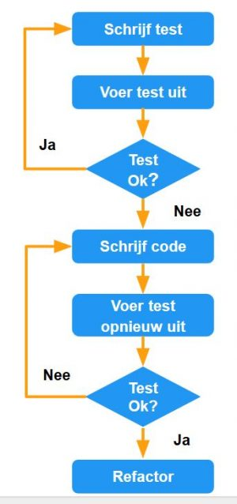

# Unit testing

## Inleiding: wat en waarom?

Controleer steeds of je **business code** werkt zoals je verwacht door unit testen aan te maken en uit te voeren. Een unit test focust zich hoofdzakelijk op je *business code* en niet op aspecten van je applicatie die hier extern aan zijn, zoals bijvoorbeeld de interactie met de databank: dit is meer het domein van **integratietesten**. 

Vaak is het geen slecht idee om de ontwikkeling van je applicatie te starten met je domeinlogica en een set unit testen: op die manier blijft de kern van je applicatie gezond. Delen (classes) van je applicatie die maken dat deze laag lijkt te werken maar die later een effectieve implementatie moeten krijgen, noemt men *stubs* of beter nog **mocks**.

Waarom spreken we precies van *unit* testen? Unit-testen is een methode om stukjes broncode (units) afzonderlijk te testen. Bij unit-testen zal voor iedere unit een of meer tests ontwikkeld worden. Hierbij worden dan verschillende test-cases doorlopen. In het ideale geval zijn alle testcases onafhankelijk van andere tests. Eventueel worden zogenaamde bijkomende mock-objecten gemaakt om de unittests gescheiden uit te kunnen voeren.

Unit-testen opstellen is typisch een taak voor de softwareontwikkelaar en/of het test-team. Dit in tegenstelling tot eindgebruikertests. Ook het doel is anders:

- met unit-testen controleert de ontwikkelaar of delen van de software goed werken of blijven werken gegeven bepaalde invoer (correct of foutief).

- met gebruikerstesten controleert men in samenwerking met de gebruiker (of alleen de gebruiker) of de software reageert op de manier zoals de gebruiker verwacht dat hij zou reageren.

## Voordelen

- bij het **aanpassen van software**: unit-testen is gebaseerd op het gebruik van test-cases. Deze worden voorafgaand aan de test opgesteld, meestal zelfs tijdens het ontwikkelen van de software. De verschillende testcases vormen op deze manier een omschrijving van een goede werking van de unit. Wanneer in een later stadium aanpassingen of correcties uitgevoerd moeten worden op de unit, is betrekkelijk eenvoudig na te gaan voor de ontwikkelaar of de wijzigingen de unit in het gedrag niet hebben beïnvloed. De test die dan wordt uitgevoerd noemt men Regressietest.

- bij het **integreren van softwaremodules**: unit-testen gebeurt op afzonderlijke units, meestal door de ontwikkelaar. Als de ontwikkelaar tevreden is wordt de unit opgeleverd. De volgende stap is het testen van de geïntegreerde units in de Integratietests.

- bij het up-to-date houden van **documentatie**: documentatie bijhouden van software is een van de lastigste en vervelendste klusjes. Meestal wordt dit niet goed gedaan, wat resulteert in grote verschillen tussen de documentatie en de software. Unittests en testcase omschrijvingen zou men kunnen beschouwen als "live" documentatie. Iedere wijziging (groot of klein, ontwerpwijziging of bugfix) zal getest moeten worden. Wanneer men dit doet op basis van unittesten, dan zijn de testcases de meest recente beschrijvingen van de correcte werking van een unit en vormen zij dus de meest recente documentatie van de software.

**Visual Studio bevat allerlei tools** om het werken met unit testing te vereenvoudigen. Met *Live Unit Testing* is het zelfs mogelijk om te detecteren welke testen plots falen door je codewijzigingen omdat je testen op deze manier in de achtergrond uitgevoerd worden terwijl je aan het ontwikkelen bent. De tools die Visual Studio beschikbaar stelt, zullen in een latere walkthrough toegelicht worden.

**Werken met unit tests brengt het meeste op indien je van bij aanvang van je project ermee start**: 
    - je sleept minder fouten mee.
    - denkt beter na over je code. 
h   Vaak is het bovendien onbegonnen werk om nadat een project is opgeleverd, nog met dezelfde granulariteit een set unit testen uit te werken (je code is er niet zo geschikt voor, wat refactoring en dus heel wat tijd impliceert; niemand wenst trouwens na oplevering hier nog aanzienlijke tijd en resources aan te besteden).

Nadat we kennis maken met unit testing tonen we hoe Visual Studio test projecten en test methods kan genereren gebaseerd op je code: je bent niet altijd verplicht deze manueel aan te maken. Met *IntelliTest* kan je trouwens ook testgegevens en een suite van unit tests aanmaken.

## AAA patroon

Het **AAA** (Arrange, Act, Assert) patroon is een gekende manier om unit testen te schrijven voor je method:

- De **Arrange** sectie van een unit test method initializeert objecten en kent de waarden van de gegevens toe die aan de method worden meegegeven.

- De **Act** sectie roept de te testen method op met de ingestelde parameters.

- De **Assert** sectie verifieert dat de actie van de geteste method precies beantwoordt aan het gedrag dat we verwachten.

# Walkthrough: Unit tests voor managed C# code

We doorlopen de creatie en de uitvoering van een verzameling unit tests met behulp van het Microsoft unit test framework en Visual Studio 2019 **Test Explorer**. Je begint met een C# project dat onder ontwikkeling is, maakt testen aan die toelaten de code op de proef te stellen, voert deze testen uit en onderzoekt de resultaten. Daarna pas je de project code aan en voer je de testen opnieuw uit.

## Creeer een project dat je wenst te testen

1. Open Visual Studio.

2. Op het start venster, kies **Create a new project**.

3. Zoek en selecteer de C# **Console App (.NET Core)** project template en klik **Next**.

4. Noem het project **Bank** en klik vervolgens op **Create**.

   Het Bank project wordt aangemaakt en getoond in **Solution Explorer** met het *Program.cs* bestand open in de code editor.

   > [!NOOT]
   > Indien *Program.cs*  niet geopend is in de editor, dubbel-klik op bestand *Program.cs* in **Solution Explorer** om het te openen.

5. Vervang de inhoud van *Program.cs* door de volgende C# code die een class *BankAccount* definieert:

   ```csharp
   using System;

   namespace BankAccountNS
   {
       /// <summary>
       /// Bank account demo class.
       /// </summary>
       public class BankAccount
       {
           private readonly string m_customerName;
           private double m_balance;

           private BankAccount() { }

           public BankAccount(string customerName, double balance)
           {
               m_customerName = customerName;
               m_balance = balance;
           }

           public string CustomerName
           {
               get { return m_customerName; }
           }

           public double Balance
           {
               get { return m_balance; }
           }

           public void Debit(double amount)
           {
               if (amount > m_balance)
               {
                   throw new ArgumentOutOfRangeException("amount");
               }

               if (amount < 0)
               {
                   throw new ArgumentOutOfRangeException("amount");
               }

               m_balance += amount; // intentionally incorrect code
           }

           public void Credit(double amount)
           {
               if (amount < 0)
               {
                   throw new ArgumentOutOfRangeException("amount");
               }

               m_balance += amount;
           }

           public static void Main()
           {
               BankAccount ba = new BankAccount("Mr. Tom Vervoort", 11.99);

               ba.Credit(5.77);
               ba.Debit(11.22);
               Console.WriteLine("Current balance is ${0}", ba.Balance);
           }
       }
   }
   ```

6. Hernoem het bestand naar *BankAccount.cs* door rechts te klikken en **Rename** te kiezen in **Solution Explorer**.

7. In het **Build** menu, klik **Build Solution**.

Je hebt nu een project met methods die je kan testen. In deze walkthrough focuseren we onze testen op de `Debit` method. De `Debit` method wordt opgeroepen wanneer geld van een rekening gehaald wordt.

## Creeer een unit test project

1. In het **File** menu selecteer **Add** > **New Project**.

   > [!TIP]
   > Je kan ook rechts klikken op de "solution" in **Solution Explorer** and kiezen voor **Add** > **New Project**.

2. Zoek en kies de C# **MSTest Test Project (.NET Core)** project template, en klik op **Next**.

3. Noem het project **BankTests**.

4. Klik op **Create**.

   Het **BankTests** project wordt toegevoegd aan de **Bank** solution.

5. In het **BankTests** project, voeg een referentie toe naar het **Bank** project.

   In **Solution Explorer**, selecteer **Dependencies** onder het **BankTests** project en kies **Add Reference** uit het rechterklik-menu.

6. In de **Reference Manager** dialog box, expandeer **Projects**, selecteer **Solution** en klik het **Bank** item aan.

7. Klik op **OK**.

## Creeer de test class

Creeer een test class om class `BankAccount` te testen. Je kan bestand *UnitTest1.cs* gebruiken dat aangemaakt is door de project template, maar je kan het bestand en de class een betere naam geven.

### Hernoem bestand en class

1. Om het bestand te hernoemen, selecteer in **Solution Explorer**, het *UnitTest1.cs* bestand in het BankTests project. Klik **Rename** in het rechterklikmenu en hernoem het bestand naar *BankAccountTests.cs*.

2. Om de class te hernoemen class, positioneer de cursus op `UnitTest1` in je code editor, rechterklik en kies **Rename**. Tik in **BankAccountTests** en druk op **Enter**.

Het *BankAccountTests.cs* bestand bevat de volgende code:

```csharp
using Microsoft.VisualStudio.TestTools.UnitTesting;

namespace BankTests
{
    [TestClass]
    public class BankAccountTests
    {
        [TestMethod]
        public void TestMethod1()
        {
        }
    }
}
```

### Voeg een using statement toe

Voeg een using statement toe aan de test class om code te kunnen oproepen van het project dat je test zonder een volledig gekwalificeerde naam te moeten gebruiken. Voeg bovenaan in het bestand toe:

```csharp
using BankAccountNS;
```

### Test class vereisten

Een test class moet:

- Een attribuut `[TestClass]` hebben om uitgevoerd te kunnen worden in Test Explorer.

- Een test method hebben die herkend kan worden door Test Explorer aan de hand van een `[TestMethod]` attribuut.

Je kan in een test project classes opnemen die geen `[TestClass]` attribuut dragen en je kan methods hebben zonder `[TestMethod]` attribuut. Deze methods en classes kunnen opgeroepen worden door je test methods.

## Creeer een eerste test method

In deze procedure zal je unit test methods schrijven om het gedrag van de `Debit` method van de `BankAccount` class te testen.

Minstens drie gedragingen moeten gecontroleerd worden:

- De method werpt een `System.ArgumentOutOfRangeException` op indien het debet bedrag groter is dan het bedrag op rekening.

- De method werpt een `System.ArgumentOutOfRangeException` op indien het debet bedrag kleiner is dan 0.

- Indien het debet bedrag geldig is, telt de method het bedrag af van het bedrag op rekening.

> [!TIP]
> Je mag de default `TestMethod1` method verwijderen aangezien we deze niet gebruiken.

### Creeer een test method

De eerste test verifieert dat een geldig bedrag (minder of gelijk aan het bedrag op rekening en groter dan 0) afgehaald wordt. Voeg de volgende method toe aan de `BankAccountTests` class:

```csharp
[TestMethod]
public void Debit_WithValidAmount_UpdatesBalance()
{
    // Arrange
    double beginningBalance = 11.99;
    double debitAmount = 4.55;
    double expected = 7.44;
    BankAccount account = new BankAccount("Mr. Tom Vervoort", beginningBalance);

    // Act
    account.Debit(debitAmount);

    // Assert
    double actual = account.Balance;
    Assert.AreEqual(expected, actual, 0.001, "Account not debited correctly");
}
```

Deze method spreekt voor zich: er wordt een nieuw `BankAccount` object aangemaakt met een startbedrag en hiervan wordt een geldig bedrag afgehouden. De `Microsoft.VisualStudio.TestTools.UnitTesting.Assert.AreEqual()` method wordt gebruikt om na te gaan of de eindbalans naar verwachting is.

### Test method vereisten

Een test method moet aan volgende vereisten voldoen:

- de test method is voorzien van het `[TestMethod]` attribuut.

- `void` wordt teruggegeven.

- Parameters zijn niet toegelaten.

## Bouw de test en voer deze uit

1. In het **Build** menu kies **Build Solution**.

2. Indien **Test Explorer** nog niet geopend is, open deze via **Test** > **Windows** > **Test Explorer** in de top menu.

3. Kies **Run All** om de test uit te voeren.

Terwijl de test loopt, wordt de status bovenaan het **Test Explorer** venster geanimeerd. Wanneer de test uitgevoerd is, zal de status groen kleuren indien alle testen succesvol uitgevoerd konden worden of rood kleuren wanneer er een test faalde. In dit geval faalt de test.

4. Select the method in **Test Explorer** to view the details at the bottom of the window.

## Verbeter je code en voer de testen opnieuw uit

Het testresultaat bevat een boodschap die de fout beschrijft. Voor de `AreEqual` method toont de boodschap wat er verwacht werd en wat er eigenlijk vastgesteld werd. Je verwachte dat het bedrag op rekening afnam, maar het bedrag dat eraf moest, kwam erbij.

De unit test bracht een bug boven: het afgehaalde bedrag werd *toegevoegd* aan het bedrag op rekening in plaats van *afgetrokken*.

### Verbeter de bug

Om de fout te verbeteren pas in bestand *BankAccount.cs* de volgende lijn aan:

```csharp
m_balance += amount;
```

with:

```csharp
m_balance -= amount;
```

### Voer de test opnieuw uit

In **Test Explorer**, kies **Run All** om de test opnieuw uit te voeren. De rode status wordt groen om aan te tonen dat de test lukte.


## Gebruik unit testen om je code te verbeteren

Deze sectie beschrijft hoe het iteratieve proces van analyse, unit test ontwikkeling en refactoring kan helpen om je productiecode robuuster en effectiever te maken.

### Analyzeer de problemen

Je hebt reeds een test method aangemaakt om te controleren dat een geldig bedrag correct werd afgeteld in de `Debit` method. Verifieer nu of de method een `System.ArgumentOutOfRangeException` oproept indien het debet bedrag:

- groter is dan het bedrag op rekening
- kleiner is dan 0.

### Maak nieuwe unit tests aan en voer deze uit

Creeer een method om na te gaan of alles goed verloopt wanneer het debet bedrag kleiner is dan 0:

```csharp
[TestMethod]
public void Debit_WhenAmountIsLessThanZero_ShouldThrowArgumentOutOfRange()
{
    // Arrange
    double beginningBalance = 11.99;
    double debitAmount = -100.00;
    BankAccount account = new BankAccount("Mr. Tom Vervoort", beginningBalance);

    // Act and assert
    Assert.ThrowsException<System.ArgumentOutOfRangeException>(() => account.Debit(debitAmount));
}
```

Gebruik de `Microsoft.VisualStudio.TestTools.UnitTesting.Assert.ThrowsException` method om na te gaan of de juiste uitzondering werd opgeworpen. Deze method doet de test falen tenzij een `System.ArgumentOutOfRangeException` uitzondering wordt opgeworpen. Je kan de code tijdelijk aanpassen om een meer generieke uitzondering `System.ApplicationException` op te werpen: dit werkt ook.

Om het geval te testen waarbij het debet bedrag groter is dan het bedrag op rekening, doe het volgende:

1. Maak een nieuwe test method aan met de naam `Debit_WhenAmountIsMoreThanBalance_ShouldThrowArgumentOutOfRange`.

2. Copieer de zogenaamde *method body* van method `Debit_WhenAmountIsLessThanZero_ShouldThrowArgumentOutOfRange` naar de nieuwe method.

3. Wijs een getal groter dan het bedrag op rekening toe aan `debitAmount`.

Voer de twee testen uit en kijk na of ze slagen.

### Vervolg de analyse.

De method die getest wordt, kan verder verbeterd worden. Met de huidige implementatie kunnen we niet weten welke conditie tot de uitzondering leidde (`amount > m_balance` of `amount < 0`) die opgeworpen werd tijdens het uitvoeren van de test. We weten enkel dat `ArgumentOutOfRangeException` opgeroepen werd. Veel beter is dat we weten welke conditie in `BankAccount.Debit` tot de uitzondering leidde (`amount > m_balance` of `amount < 0`) zodat we er zeker van kunnen zijn dat de method zijn argumenten correct nakijkt.

Bestudeer de method opnieuw (`BankAccount.Debit`) en merk op dat in beide gevallen dezelfde constructor van `ArgumentOutOfRangeException` gebruikt wordt:

```csharp
throw new ArgumentOutOfRangeException("amount");
```

Er is nog een constructor die toelaat veel meer informatie mee te geven: `System.ArgumentOutOfRangeException` kan de argumentnaam, de argumentwaarde en een boodschap die je zelf kiest, als argument meekrijgen. Je kan de code die getest wordt, nu aanpassen zodat deze de bewuste constructor gebruikt. Beter nog, je kan publieke type members gebruiken om de fouten te specificeren.

### Refactor de code die getest wordt

Definieer twee constanten voor de foutboodschappen op niveau van je class. Plaats deze onder de class `BankAccount` die getest wordt:

```csharp
public const string DebitAmountExceedsBalanceMessage = "Debit amount exceeds balance";
public const string DebitAmountLessThanZeroMessage = "Debit amount is less than zero";
```

Wijzig vervolgens de conditionele statements in de `Debit` method:

```csharp
if (amount > m_balance)
{
    throw new System.ArgumentOutOfRangeException("amount", amount, DebitAmountExceedsBalanceMessage);
}

if (amount < 0)
{
    throw new System.ArgumentOutOfRangeException("amount", amount, DebitAmountLessThanZeroMessage);
}
```

### Refactor de test methods

Refactor de test methods door de oproep van `Microsoft.VisualStudio.TestTools.UnitTesting.Assert.ThrowsException` te verwijderen. Wrap het oproepen van `Debit()` in een `try/catch` blok, vang de verwachte uitzondering op, and verifieer de geassocieerde boodschap. `Microsoft.VisualStudio.TestTools.UnitTesting.StringAssert.Contains()` method biedt de mogelijkheid om twee strings te vergelijken.

`Debit_WhenAmountIsMoreThanBalance_ShouldThrowArgumentOutOfRange` kan er bijgevolg volgende vorm aannemen:

```csharp
[TestMethod]
public void Debit_WhenAmountIsMoreThanBalance_ShouldThrowArgumentOutOfRange()
{
    // Arrange
    double beginningBalance = 11.99;
    double debitAmount = 20.0;
    BankAccount account = new BankAccount("Mr. Tom Vervoort", beginningBalance);

    // Act
    try
    {
        account.Debit(debitAmount);
    }
    catch (System.ArgumentOutOfRangeException e)
    {
        // Assert
        StringAssert.Contains(e.Message, BankAccount.DebitAmountExceedsBalanceMessage);
    }
}
```

### Hertest, herschrijf en heranalyseer

Neem aan dat er een bug zit in de method die we testen. De `Debit` method werpt niet eens een uitzondering op (System.ArgumentOutOfRangeException). Zoals de code momenteel is, wordt het geval niet eens afgehandeld. Indien de `debitAmount` waarde geldig is (dus minder dan de balans en groter dan nul), wordt geen uitzondering opgevangen en de assert voert nooit uit. Toch slaag de test method. Dit is niet goed want je wenst dat de test method faalt wanneer er geen uitzondering opgeworpen wordt.

Dit is een bug in de test method. Om dit op te lossen voeg je een `Microsoft.VisualStudio.TestTools.UnitTesting.Assert.Fail` assert toe aan het einde van de test method om het geval op te vangen waarin geen uitzondering opgeworpen wordt.

Wanneer je de test opnieuw uitvoert, zie je dat de test nu *faalt* wanneer de correcte uitzondering wordt opgevangen. Het `catch` block vangt de uitzondering op, maar de method blijft uitvoeren en faalt bij de nieuwe `Microsoft.VisualStudio.TestTools.UnitTesting.Assert.Fail` assert. Om dit op te lossen voeg je een `return` statement toe na `StringAssert` in de `catch` block. Voer de test opnieuw uit om na te gaan dat je het probleem hebt opgelost. De definitieve versie van `Debit_WhenAmountIsMoreThanBalance_ShouldThrowArgumentOutOfRange` ziet er zo uit:

```csharp
[TestMethod]
public void Debit_WhenAmountIsMoreThanBalance_ShouldThrowArgumentOutOfRange()
{
    // Arrange
    double beginningBalance = 11.99;
    double debitAmount = 20.0;
    BankAccount account = new BankAccount("Mr. Tom Vervoort", beginningBalance);

    // Act
    try
    {
        account.Debit(debitAmount);
    }
    catch (System.ArgumentOutOfRangeException e)
    {
        // Assert
        StringAssert.Contains(e.Message, BankAccount.DebitAmountExceedsBalanceMessage);
        return;
    }

    Assert.Fail("The expected exception was not thrown.");
}
```

### Tot slot

De verbeteringen aan de test code leidden tot meer robuuste en informatieve test methods. Belangrijker: de code die getest wordt, werd ook verbeterd.

> [!TIP]
> Deze walkthrough gebruikt het Microsoft unit test framework voor managed code. **Test Explorer** kan ook testen van third-party unit test frameworks uitvoeren die adapters hebben voor **Test Explorer**.

## Maak unit test projects en test methods aan

Vaak kan je sneller test projecten en test stubs aanmaken op een automatische manier, maar manueel gaat uiteraard ook, zoals we hierboven zagen.

### Genereer een unit test project en unit test stubs

1. vanuit het code editor venster rechter-klik en kies **Create Unit Tests**.

   

   > [!NOOT]
   > De **Create Unit Tests** menuopdracht is enkel beschikbaar voor managed code.

2. Klik **OK** om de default waarden te aanvaarden bij het aanmaken van je unit tests, of wijzig eventueel de namen van project en testen.

   

3. De unit test stubs worden aangemaakt in een nieuw unit test project voor alle methods in de class.

   

## Schrijf je tests

Het unit test framework dat je gebruikt en Visual Studio IntelliSense zullen je begeleiden bij het schrijven van de testen.

## Zet timeouts voor je unit tests

Als je het MSTest framework gebruikt, kan je een attribuut gebruiken om een timeout in te stellen bij een specifieke individuele test:

```csharp
[TestMethod]
[Timeout(2000)]  // Milliseconds
public void My_Test()
{ ...
}
```

Je kan de timeout ook instellen op "oneindig":

```csharp
[TestMethod]
[Timeout(TestTimeout.Infinite)]  // Milliseconds
public void My_Test ()
{ ...
}
```

## Voer testen uit in Test Explorer

Wanneer je een test project bouwt, verschijnen de testen onder **Test Explorer**. Indien **Test Explorer** niet zichtbaar is, kies dan onder **Test** in het Visual Studio menu **Windows** > **Test Explorer**.


Terwijl je testen uitvoert, schrijft en opnieuw uitvoert, toont **Test Explorer** de resultaten in groepen **Failed Tests**, **Passed Tests**, **Skipped Tests** en **Not Run Tests**. De toolbar laat je toe een andere groep te kiezen.

Je kan ook filters toepassen op de testen door gebruik te maken van tekst in de globale search box of door een van de voorgedefinieerde filters te kiezen. Je kan eender welke selectie van testen steeds opnieuw uitvoeren. Details van een test method worden getoond wanneer je een specifieke method aanklikt.

### Voer testen uit en bekijk deze

De **Test Explorer** toolbar helpt je testen organiseren.


Je kan opteren voor **Run All** indien je alle testen wenst uit te voeren of voor **Run** indien je een subset wenst uit te voeren. Kies **Open Test** vanuit het rechterklikmenu (Keyboard: **F12**) om de source code van de geselecteerde test te zien.

Indien individuele testen geen onderlinge afhankelijkheden hebben die een orde opleggen onderling kan je opteren voor *parallel test execution* bij de instellingen (toolbar). Dit kan de tijd benodigd voor het uitvoeren van de testen gevoelig inkorten.

### Voer testen uit na elke build

Om je testen uit te voeren na elke locale build, open het settings (instellingen) icoon in de Test Explorer toolbar en selecteer **Run Tests After Build**.

### Filter en groepeer de lijst van testen

Wanneer je veel testen hebt, kan de **Test Explorer** search box van nut zijn om te filteren. Je kan ook een voorgedefinieerde filter kiezen.


## Best Practices

### Inleiding

Ontwikkelaars hebben vaak een liefde-haat-verhouding tot het werken met unit tests. Visual Studio biedt uitstekende ondersteuning, maar vaak blijkt de stap om met het opzetten van testen te starten, te groot, hoe minimaal deze ook is. De voordelen zijn nochtans, bij uitstek na verloop van tijd, heel groot. Je kan met gerust gemoed drastischer codewijzigingen doorvoeren: de set unit tests toont waar je fouten maakte. Door te starten met unit tests op je business laag kan je snel tot een applicatie komen die iets lijkt te doen wat in de goede richting ligt.

De volledige voorbeeldocde voor dit onderdeel "Best Practices" vind je in 

### AAA Concept

Een benadering die veel gebruikt wordt door de industrie en die je toelaat unit tests te schrijven volgens een herhaalbaar en inzichtelijk patroon. Vaak wordt boven de AAA-delen in commentaar het onderdeel vermeld:

// Arrange
    - initialiseer een class, mock een interface (zie een latere walkthrough)
// Act
    - we ageren op de opzet en roepen de te testen code op.
// Assert
    - we "bevestigen" dat het resultaat van de opgeroepen code gelijk is aan wat we verwachten

### Naming Convention

Het is een goed idee om in de naam van de unit test aan te geven wat er getest wordt. Er zijn vele "naming conventions" maar een goede is bijvoorbeeld:
    - de naam van de method die getest wordt (bijvoorbeeld *Reverse*)
    - gevolgd door een korte beschrijving van het test scenario (bijvoorbeeld *ShouldThrowArgumentException*)
    - gevolgd door de verwachting van het scenario (bijvoorbeeld *IfWordIsNull*)
    - waarbij elk onderdeel gescheiden wordt door een underscore

```csharp
public void Reverse_ShouldThrowArgumentException_IfWordIsNull()
{
	...
}
```

## Beschikbare Assert methods

De vergelijking bij Assert methods houdt rekening met het gegevenstype: 10L (long) is bijvoorbeeld verschilllend van 10 (int). Naast de AreEqual() method, bestaan er nog vele andere. Probeer altijd de meest geschikte te gebruiken in functie van leesbaarheid en onderhoudbaarheid.

- **AreNotEqual()**: wanneer we wensen te verifieren dat twee objecten NIET gelijk zijn (de andere "Niet" methods bespreken we verder hier niet meer)
- **AreSame()**: controleert of twee objecten naar hetzelfde object verwijzen (vergelijkt met ==).
- **Equals()**: vergelijkt twee objecten met de Equals() method.
- **Fail()**: veroorzaakt het falen van de test; meestal gebruikt met een voorwaarde en optionele parameters zoals de foutmelding en parameters.
- **Inconclusive()**: vergelijkbaar met Fail(), maar wijst op het niet beslist zijn van de test.
- **IsFalse()**: verifieert of een uitdrukking False is.
- **IsInstanceOfType()**: verifieert of een object een instantie van de specifieke class is.
- **IsNull()**: verifieert dat de waarde null is.
- **IsTrue()**: verifieert dat een uitdrukking True is.
- **ReplaceNullChars()**: vervangt null karakters ("\0") door "\\0". Veel gebruikt bij feedback.
- **ThrowsException()**: voert de opgegeven delegate uit en verifieert of er wel een uitzondering opgeworpen wordt van het type dat als generiek argument is meegegeven. Van deze method bestaat ook een asynchrone versie die noemt ThrowsExceptionAsync().

Opgelet: de ReferenceEquals() method is een method die op alle classes bestaat en is geen inderdeel van deze set Assert() methods.

## Initialisatie en opkuis

Wanneer je methods van een class test, kan het gebeuren dat je de class meermaals wenst te initialiseren, namelijk net voor de uitvoering van elke test. Hiervoor kan je het [TestInitialize] attribuut in MSTest (of ([SetUp] in NUnit of de constructur xUnit.NET) gebruiken.

Zo kunnen we ook gebruik maken van het [TestCleanup] attribuut in MSTest ([TearDown] in NUnit of een implementatie van de IDisposable interface in xUnit.NET) om objecten op te kuisen wanneer alle testen uitgevoerd zijn.

In het voorbeeld hieronder, waarin we vooruit lopen op volgende les, schrijven we de initialisatie slechts eenmaal en een instantie van de class zal opgezet worden elkens voor elke test uitgevoerd wordt:

```csharp
ILogger _log;
IWordUtils _wordUtils;

[TestInitialize]
public void Initialize()
{
	_log = Mock.Of<ILogger<WordUtils>>();
	_wordUtils = new WordUtils(_log);
}

[TestMethod]
public void Reverse_ShouldBeWordInReverse_IfWordIsValid()
{
	string word = "mountain";
	string reverseWord = _wordUtils.Reverse(word);
	reverseWord.ShouldBe("niatnuom");
}

[TestCleanup]
public void Cleanup()
{
	// Optionally dispose or cleanup objects
	...
}
```

# Test Driven Development (TDD)

## Inleiding

Bij softwareontwikkeling is Test Driven development  (TDD) tegenwoordig een veel gebruikte methode. TDD is een methode waarbij, in kleine incrementele stappen, unit tests worden gemaakt, en in dezelfde kleine incrementele stappen wordt de code gemaakt om aan die tests te voldoen.

Dit is het tegenovergestelde van een traditionele aanpak van softwareontwikkeling waarbij eerst de code wordt gemaakt en er vervolgens wordt  getest.

## Wat is TDD?

### Vooraf

De kern van TDD draait om vijf eenvoudige stappen, die tijdens de hele levenscyclus van de softwareontwikkeling herhaald worden. Het doel van deze stappen (en van TDD in het algemeen) is ervoor te zorgen dat de code eenvoudig en efficiënt is en tegelijkertijd aan alle functionele eisen voldoet.

De volgende stappen worden steeds opnieuw uitgevoerd door de ontwikkelaar:
    - schrijf een unit test die een aspect van het programma test
    - voer de test uit, deze moet mislukken omdat in het programma de functionaliteit nog ontbreekt
    - schrijf “net genoeg” code, zo eenvoudig mogelijk, om de test te laten slagen
    - voer de unit test opnieuw uit
    - als de test slaagt, ga dan verder met de volgende test, en anders herschrijf / wijzig de code om de test te laten slagen
    - Onderstaande flowchart is een visualisatie van deze 5 stappen:


**Test driven development flowchart**

### Schrijf een unit test

Bij TDD begint de ontwikkeling van elke nieuwe functie met het schrijven van een unit test. Deze unit test kan niet anders dan mislukken omdat deze is geschreven voordat de code voor de betreffende functie is geschreven. Wanneer de unit test onverhoopt toch slaagt, dan is of de gewenste functionaliteit al gebouwd of is de unit test niet goed.

### Voer unit test uit

Het uitvoeren van de nieuwe unit test moet aantonen dat de test niet per ongeluk slaagt zonder dat er nieuwe code is geschreven. Kortom, de test moet falen.

### Schrijf code

De volgende stap is het schrijven van een stukje code die ervoor zorgt dat de unit test slaagt. De nieuwe code hoeft in dit stadium nog niet perfect te zijn en kan de unit test bijvoorbeeld op een onelegante manier laten slagen. Dat is opzich geen probleem om dat in een latere stap de code kan worden verbeterd.
Belangrijk uitgangspunt is, dat de geschreven code alleen is gemaakt om de unit test te laten slagen. Niet meer en niet minder.

### Voer unit test opnieuw uit

Voer de unit test opnieuw uit en controleer of de unit test slaagt. Wanneer dat het geval is kan doorgegaan worden met de volgende stap, anders dient de code te worden aangepast om er voor te zorgen dat de unit test alsnog slaagt.

### Refactor

Indien nodig kan de code nu worden opgeschoond. Hierbij speelt het verwijderen van dubbele code een essentiële rol. Na het opschonen worden alle beschikbare unit test opnieuw uitgevoerd om te controleren dat er door het schonen geen regressie is ontstaan.

### Voordelen van TDD

- Het kan leiden tot eenvoudige en modulaire code. Dit bevordert de onderhoudbaarheid van de code.
- Het kan ontwikkelaars helpen om fouten eerder te vinden dan anders zou gebeuren. En zoals Boehm al in 1979 heeft aangetoond: hoe eerder fouten worden gevonden des te goedkoper het oplossen is.
- De unit testen kunnen dienen als een soort documentatie waardoor de code makkelijk te begrijpen is.
- Op de lange termijn kan het de ontwikkeltijd versnellen.
- Het helpt ontwikkelaars om gefocused te blijven op het bieden van de eenvoudigste oplossingen voor een probleem.

### Nadelen van TDD

- TDD vergt in het begin van een project veel tijd en moeite waardoor het kan lijken dat de ontwikkeling langzamer gaat dan anders.
- Het is moeilijk om goede unit test te schrijven die de essentie afdekt.
- Wanneer de functionaliteit wijzigt dan moeten de unit tests ook worden aangepast. Dit kan leiden tot veel meer inspanning als er veel functionele wijzigingen zijn.
