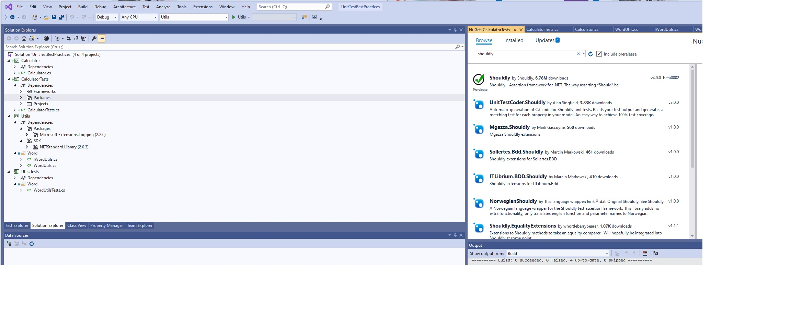
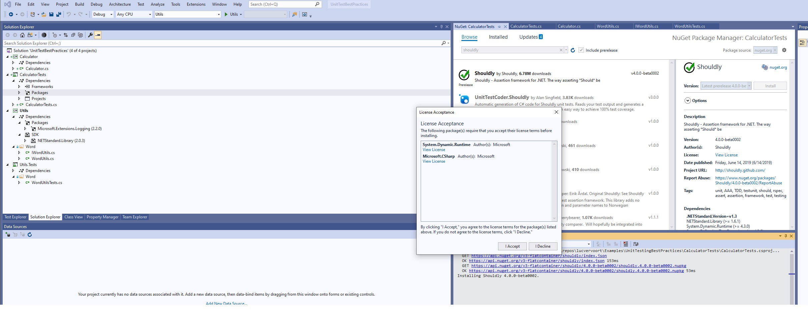

# Testing tools in Visual Studio

> [!NOOT]
> Unit testing is beschikbaar in alle versies van Visual Studio. Tools als Live Unit Testing, IntelliTest en Coded UI Test zijn enkel beschikbaar in de Visual Studio Enterprise editie.

## Test Explorer

Het **Test Explorer** venster helpt ontwikkelaars unit tests aan te maken, te beheren en uit te voeren.


## Live Unit Testing

**Live Unit Testing** voert unit tests automatisch uit in de achtergrond, toont grafisch code coverage (zie hieronder) en testresultaten in de Visual Studio code editor.
Bij een rechterklik in een bestand met unit tests laat het contextmenu je toe om *Live Unit Testing* op te starten: in het output venster onder "Live Unit Testing" verschijnt dan de melding "Live Unit Testing started.". Wijzig je code: zo vlug je stopt met tikken, gaat *Live Unit Testing* aan de slag.

## IntelliTest

**IntelliTest** genereert automatisch unit tests voor je managed code. **IntelliTest** verbetert *code coverage* (zie verder) en reduceert de inspanning die je moet doen om testen te schrijven en te onderhouden.


## Code coverage

*Code coverage* bepaalt hoeveel code van je product feitelijk getest worden door je suite van unit tests: om effectief te beschermen tegen bugs, ligt dit percentage best zo hoog mogelijk. Een firma kan een minimum percentage opleggen, bijvoorbeeld 90%.

*Code coverage* is een optie wanneer je test methods uitvoert met Test Explorer. Het resultaat is het percentage van de code die uitgevoerd en dus getest werd.

## Shouldly Framework

### Voordelen

- Betere leesbaarheid van de test zelf: eenvoudigere asserties
- Betere leesbaarheid van rapportering als de test fout gaat

### Nadelen

- Te installeren met Nuget:





### Voorbeelden

We bekijken hoe we een eenvodige int-waarde testen. Met Shouldly wordt dit veel leesbaarder:

```csharp
var value = 5;
value.ShouldBe(5);
value.ShouldBeGreaterThan(4);
value.ShouldBeGreaterThanOrEqualTo(5);
value.ShouldBeInRange(0, 10);
value.ShouldBeLessThan(6);
value.ShouldBeOneOf(2, 5, 7);
```

Specifiek voor het string type bestaan er veel handige asserties:

```csharp
var myString = "Tom";
myString.ShouldNotBeEmpty();
myString.ShouldNotBe(null);
myString.ShouldStartWith("T");
myString.ShouldEndWith("om");
myString.ShouldNotContain("Luc");
myString.ShouldBe("TOM", Case.Insensitive);
```

Het is bovendien mogelijk om Actions te testen of de uitvoeringstijd van Actions, wat performantietesten mogelijk maakt:

```csharp
Should.NotThrow(() => SuccessMethod());
Should.CompleteIn(() => SuccessMethod(), TimeSpan.FromMilliseconds(50));
```

Ook wanneer een test faalt, is de feedback van Shouldly beter leesbaar:

```csharp
int value = 5;
value.ShouldBeGreaterThan(6);
```

Deze test faalt en toont volgende foutmelding:

```c
    value
        should be greater than
    6
        but was
    5
```

Deze boodschap is zeer duidelijk: ze bevat zelfs de naam van de geteste variabele. Voor een enum ziet dit er als volgt uit:

```csharp
var numbers = new[] { 1, 2, 4 };
numbers.ShouldBe(new []{1, 2, 3});
```

```c
    numbers
        should be
    [1, 2, 3]
        but was
    [1, 2, 4]
        difference
    [1, 2, *4*]
```

Dit is veel duidelijker dan met MSTest:

```csharp
var numbers = new[] { 1, 2, 4 };
CollectionAssert.AreEqual(new[] { 1, 2, 3 }, numbers);
```

```c
CollectionAssert.AreEqual failed. (Element at index 2 do not match.)
```

Aanvullende voorbeelden:

```csharp
Should.NotThrow(() => FailingMethod());
```

```c
    Should
        not throw 
    System.ApplicationException
        but does
```

```csharp
Should.CompleteIn(() => LongMethod(), TimeSpan.FromMilliseconds(50));
```

```c
    Task
        should complete in
    00:00:00.0500000
        but did not
```

Wie de mogelijkheden van Shouldly wil uitdiepen, kijkt bijvoorbeeld naar: https://shouldly.readthedocs.io/en/latest/.

## Moq Mocking Framework: informatief

Moq (uitgesproken "Mok") is de enige mocking bibliotheek voor .NET die van de grond af ontworpen werd om volledig gebruik te maken van .NET Linq expression trees en lambda expressies. Hierdoor is Moq productief, type-safe en handig voor refactoring. Moq kan interfaces en classes "mocken".

Maar eerst .. wat is "mocken"?

Unit testen mogen niet afhankelijk zijn van iets in de periferie, bijvoorbeeld bronnen (resources) van het besturingssysteem, dit om steeds snel en volledig voorspelbaar te zijn, niet afhankelijk van iets buiten de test, en steeds enkel te testen wat moet getest worden.

We nemen als voorbeeld System.IO.Directory.GetFiles. In een unit test gaan we typisch niet direct deze statische method oproepen, maar onze eigen implementatie voorzien.

We starten met de interface:

```csharp
using System.Collections.Generic;

namespace MockFiles
{
    public interface IDirectoryHelper
    {
        ICollection<string> GetFiles(string path);
    }
}

using System.Collections.Generic;
 
namespace MockFiles
{
    public interface IDirectoryHelper
    {
        ICollection<string> GetFiles(string path);
    }
}
```

met als implementatie van IDirectoryHelper:

```csharp
using System.Collections.Generic;
using System.IO;

namespace MockFiles
{
    public class DirectoryHelper : IDirectoryHelper
    {
        public ICollection<string> GetFiles(string path)
        {
            string[] files = Directory.GetFiles(path);
            return files;
        }
    }
}
```

In onze Console app testen we of wel wel degelijk de locale bestanden terugkrijgen:

```csharp
using System;
using System.Collections.Generic;

namespace MockFiles
{
    class Program
    {
        static void Main(string[] args)
        {
            IDirectoryHelper directoryHelper = new DirectoryHelper();
            ICollection<string> files = directoryHelper.GetFiles(@"C:\");

            foreach (var file in files)
                Console.WriteLine(file);

            Console.WriteLine("\r\nPress any key...");
            Console.ReadKey();
        }
    }
}
```

Je ziet dat we inderdaad de werkelijke bestanden opgelijst krijgen. In een unit test willen we dit echter **SIMULEREN**. We zouden dit kunnen oplossen door onze eigen unit test implementatie van IDirectoryHelper te voorzien:

```csharp
using System.Collections.Generic;
using System.IO;

namespace MockFiles
{
    public class TestDirectoryHelper : IDirectoryHelper
    {
        public ICollection<string> GetFiles(string path)
        {
            return new string[] = { "test1.txt", "test2.txt" };
        }
    }
}
```

en in het testprogramma:

```csharp
using Microsoft.VisualStudio.TestTools.UnitTesting;
using System.Collections.Generic;

namespace UnitTests
{
    [TestClass]
    public class UnitTest1
    {
        private IDirectoryHelper _directoryHelper = new TestDirectoryHelper();

        [TestMethod]
        public void GetFiles_Test()
        {
            ICollection<string> files = _directoryHelper.GetFiles(@"C:\");

            Assert.IsNotNull(files);
            Assert.IsTrue(files.Count == 2);
            Assert.IsTrue(files.Contains(_file1));
        }
    }
}
```

Met Moq kan dit echter rechtstreeks. Moq moet echter wel met nuget geinstalleerd worden voor je applicatie:


```csharp
using Microsoft.VisualStudio.TestTools.UnitTesting;
using MockFiles;
using Moq;
using System.Collections.Generic;

namespace UnitTests
{
    [TestClass]
    public class UnitTest1
    {
        private IDirectoryHelper _directoryHelper;
        private readonly string _file1 = "test1.txt";
        private readonly string _file2 = "test2.txt";

        [TestInitialize]
        public void Initialize()
        {
            // We creeren een mock implementatie van de interface ...
            _directoryHelper = Mock.Of<IDirectoryHelper>();

            // ... en specificeren dat voor eender welke string die als parameter wordt doorgegeven, we steeds een nieuwe lijst met de twee bestanden teruggeven:
            Mock.Get(_directoryHelper)
                .Setup(x => x.GetFiles(It.IsAny<string>()))
                .Returns((string x) =>
                    new List<string>
                    {
                        _file1,
                        _file2
                    });
        }

        [TestMethod]
        public void GetFiles_Test()
        {
            ICollection<string> files = _directoryHelper.GetFiles(@"C:\");

            Assert.IsNotNull(files);
            Assert.IsTrue(files.Count == 2);
            Assert.IsTrue(files.Contains(_file1));
        }
    }
}
```

In dit kleine voorbeeld lijkt dit nog niet meteen erg nuttig, en zelfs iets complexer dan nodig, maar wanneer je werkt met complexere interfaces in een ruimere context, kan dit heel handig zijn.

Bekijk ook volgende voorbeelden. Als bijvoorbeeld "ping" als parameter wordt meegegeven, komt als antwoord terug "ack" met als return value "true". Je hoeft het maar te specificeren ... . Je kan ook zeggen: "eender welke string" met It.IsAny<string>(). Dit werkt trouwens met elke class of type, niet enkel met string. Je kan zelfs specificeren bij welke waarde als parameter welke exception moet opgeworpen worden.

```csharp
using Moq;

// Assumptions:

public interface ITest
{
    Demo Demo { get; set; }
    string Name { get; set; }
    int Value { get; set; }
    bool DoSomething(string value);
    bool DoSomething(int number, string value);
    string DoSomethingStringy(string value);
    bool TryParse(string value, out string outputValue);
    bool Submit(ref Bar bar);
    int GetCount();
    bool Add(int value);
}

public class Demo
{
    public virtual SubClass SubClass { get; set; }
    public virtual bool Submit() { return false; }
}

public class SubClass
{
    public virtual string Name { get; set; }
}


var mock = new Mock<ITest>();
mock.Setup(o => o.DoSomething("ping")).Returns(true);

// out arguments
var outString = "ack";
// TryParse will return true, and the out argument will return "ack", lazy evaluated
mock.Setup(o => o.TryParse("ping", out outString)).Returns(true);

// ref arguments
var instance = new Demo();
// Only matches if the ref argument to the invocation is the same instance
mock.Setup(o => o.Submit(ref instance)).Returns(true);

// access invocation arguments when returning a value
mock.Setup(x => x.DoSomethingStringy(It.IsAny<string>())).Returns((string s) => s.ToLower());

// throwing when invoked with specific parameters
mock.Setup(o => o.DoSomething("reset")).Throws<InvalidOperationException>();
mock.Setup(o => o.DoSomething("")).Throws(new ArgumentException("command"));

// lazy evaluating return value
var count = 1;
mock.Setup(o => o.GetCount()).Returns(() => count);
```
