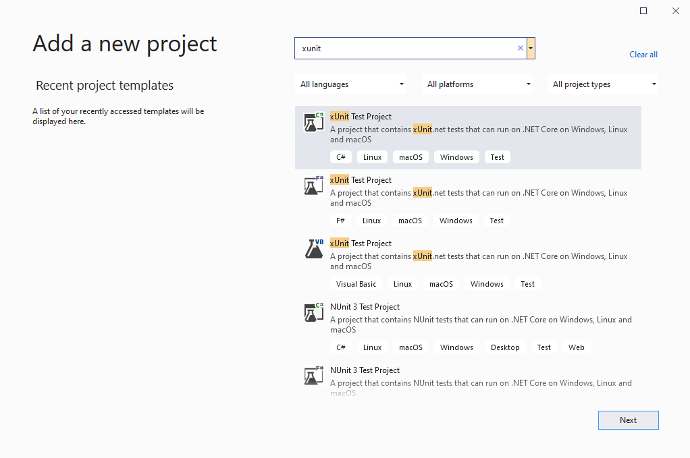
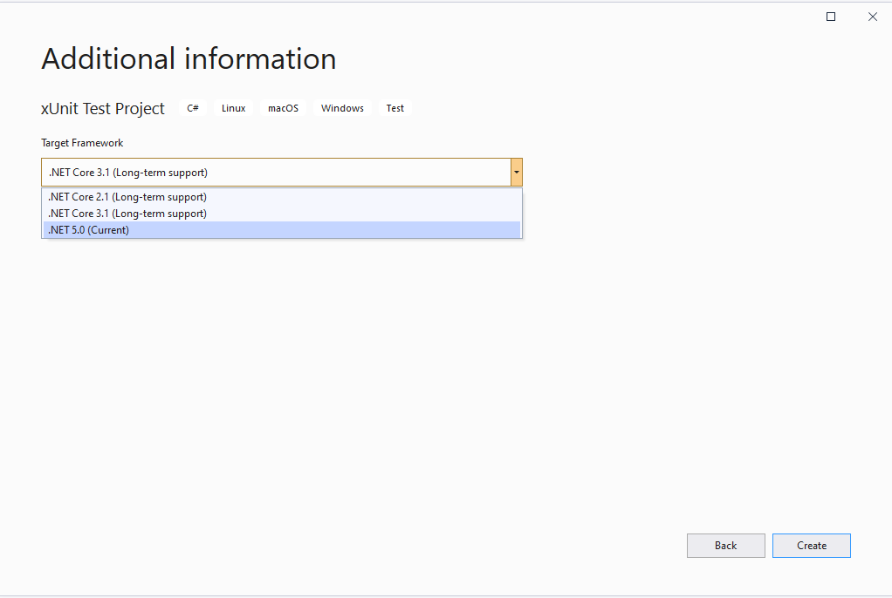
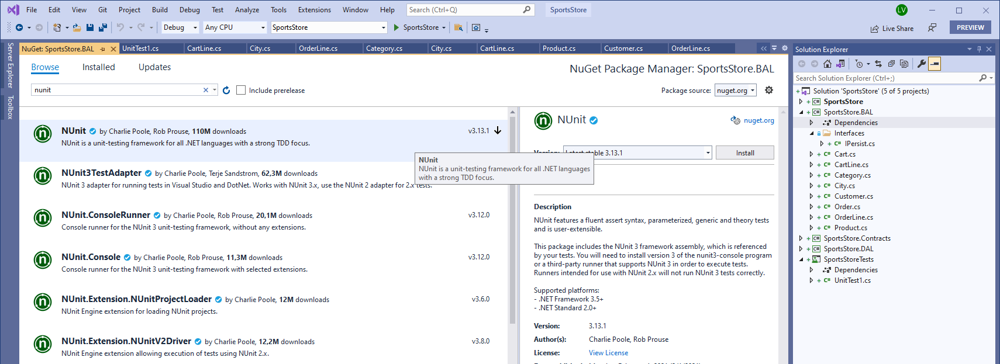
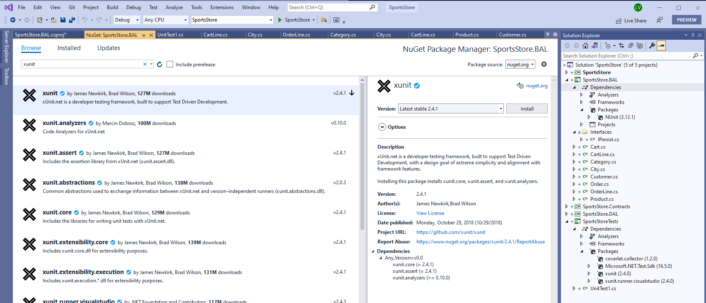
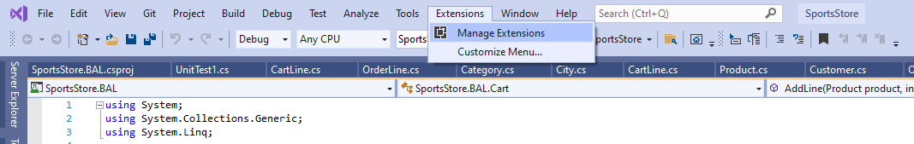
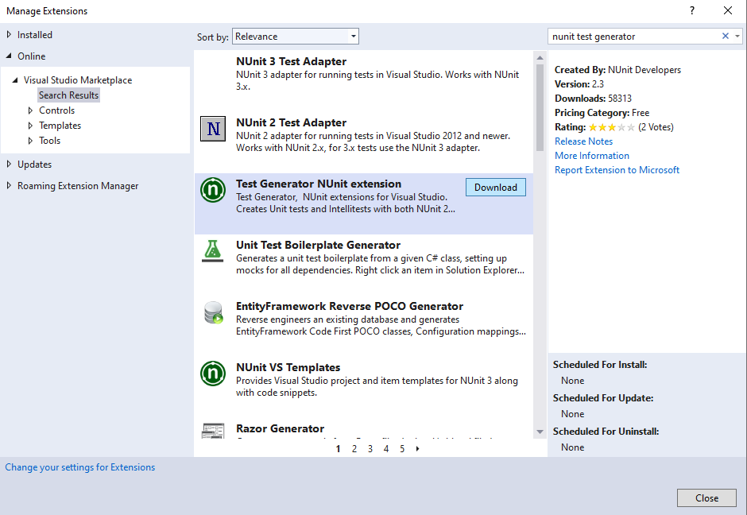
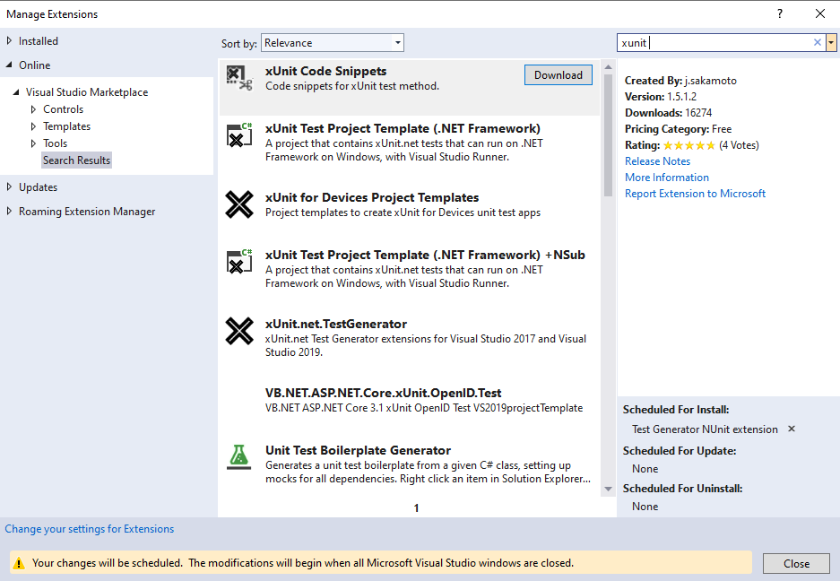
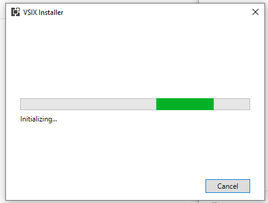
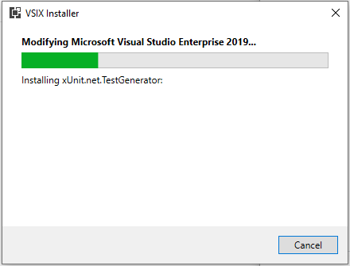
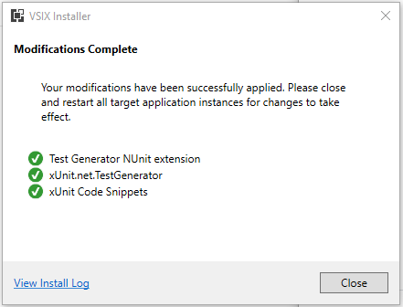

# xUnit





## Installeer andere unit test frameworks met nuget manager






## Voeg test generatoren toe via VS extensions







https://marketplace.visualstudio.com/items?itemName=jsakamoto.xUnitCodeSnippets

## Hoe gebruiken

### Voeg xUnit Fact toe

Je kan een **xUnit Fact method** toevoegen als volgt:

- `xtestm` [Tab]
  of
- `fact` [Tab]

Deze snippet zal expanded worden tot volgende c# code:

```csharp
[Fact]
public void MyTestMethod()
{
    throw new NotImplementedException();
}
```

#### ... met Display Name

- `dfact` [Tab]

```csharp
[Fact(DisplayName = "")]
public void MyTestMethod()
{
    throw new NotImplementedException();
}
```

### Voeg xUnit Theory toe

Tik:

- `theory` [Tab]

Deze snippet zal expanded worden tot volgende c# code:

```csharp
[Theory]
public void MyTheory()
{
    throw new NotImplementedException();
}
```

#### ... met Display Name

- `dtheory` [Tab]

```csharp
[Theory(DisplayName = "")]
public void MyTheory()
{
    throw new NotImplementedException();
}
```

### Voeg xUnit Test Class toe

- `xtestc` [Tab]

Deze snippet zal expanded worden tot volgende c# code:

```csharp
public class MyTestClass
{
    [Fact]
    public void MyTestFact()
    {
        throw new NotImplementedException();
    }
}
```

## Voeg "async" versies toe

- `afact`

```csharp
[Fact]
public async Task MyTestFact()
{
    throw new NotImplementedException();
}
```

- `dafact`

```csharp
[Fact(DisplayName = "")]
public async Task MyTestFact()
{
    throw new NotImplementedException();
}
```

- `atheory`

```csharp
[Theory]
public async Task MyTheory()
{
    throw new NotImplementedException();
}
```

- `datheory`

```csharp
[Theory(DisplayName = "")]
public async Task MyTheory()
{
    throw new NotImplementedException();
}
```

## Herstart Visual Studio

Wanneer je Visual Studio 2019 stopt, zullen de extensies geïnstalleerd worden: wacht tot deze acties beëindigd zijn.





