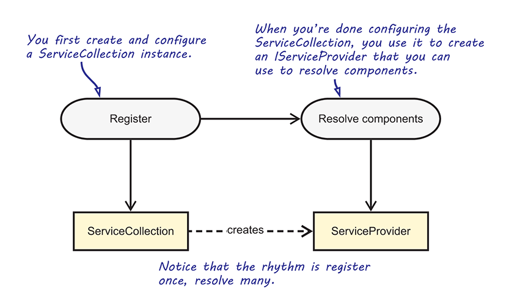

# Programmeren Gevorderd Semester 2 DAG (2021)

## Vooraf: Tien Geboden (week 1: 9/2)

* [YouTube Video](https://www.youtube.com/watch?v=tNBln0tv6oE&list=PLM3q9wWBZWb-0G5rKQOVK-W0ihR5-561c&index=5&t=72s)
* Samengevat:
  1. **VS 2019 Enterprise** 16.8.0 en hoger
  2. **.NET 5.0** C#
  3. Gebruik het **unit testing** framework en geen console app, tenzij anders gevraagd; een console app mag wel bijkomend
  4. Een **bestand per klasse**
  5. **Method volledig zichtbaar** op je VS scherm
  6. Unit testing **code coverage: >= 80%**
  7. Voorzie je code van zinvolle **commentaar** en #region markeringen
  8. Plaats je properties eerst
  9. Gebruik een _ voor private variabelen

# .NET 5.0

* Installeer Visual Studio 2019 versie 16.8.0 of hoger (vandaag is de hoogste versie: 16.9.0 Preview 5.0)
* Opvolger .NET Core 3.1 en tegelijk het einde van de "Frameworks", .NET Core, Mono, enzovoort - voorbij met de hoofdpijn! Door COVID-19 zal pas .NET 6 in november 2021 de unificatiebeweging volledig afronden, inclusief .NET MAUI, de Universal UI, een evolutie van Xamarin.Forms, en ondersteuning voor Android en iOS.
* https://dotnet.microsoft.com/download/dotnet/5.0

## 1. Object oriented programming

1. Herhaling
   1. [OOP](./Documents/OOP.md)
   2. [Object als argument en return value](./Documents/Objecten.md)
   3. [Constructor, destructor](./Documents/Constructors.md)
   4. [Static](./Documents/Static.md)
2. [Overerving](./Documents/Overerving.md)
3. [Abstracte klassen](./Documents/AbstracteKlassen.md)
4. [Polymorfisme](./Documents/Polymorfisme.md)
5. [Null reference](./Documents/NullReference.md)
6. [System.Object](./Documents/SystemObject.md)
7. [Compositie](./Documents/Compositie.md)

## 2. Herhalingsoefening

* [Begeleide oefening: een bierwinkel...](./Documents/PG_OObasics_oef1_opdracht.pdf)
* **Maak volgende oefening en dien deze in voor de tussentijdse evaluatie:**
  * [Opdracht](./Documents/OpgaveCollections.pdf)
  * [Scheepvaart: analyse](./Documents/OefeningCollectionsOvererving.pdf)

## 3. Exceptions

- [Exception handling](./Documents/ExceptionHandling.md)

## 4. Interfaces

* [Interfaces](./Documents/Interfaces1.md)

## 5. Unit testing

Bekijk volgende video's (YouTube):

  1. [Business code en test assemblies (12:13)](https://www.youtube.com/watch?v=ayJYhxs4e6I&list=PLM3q9wWBZWb-0G5rKQOVK-W0ihR5-561c&index=6&t=151s)
  2. [Code quality (3:51)](https://www.youtube.com/watch?v=WAVBJhTV4Ms&list=PLM3q9wWBZWb-0G5rKQOVK-W0ihR5-561c&index=7)
  3. [Running and debugging tests (8:20)](https://www.youtube.com/watch?v=tKhnw61JC6U&list=PLM3q9wWBZWb-0G5rKQOVK-W0ihR5-561c&index=8)
  4. [Test logger (2:01)](https://www.youtube.com/watch?v=mSJ3up_2Ecs&list=PLM3q9wWBZWb-0G5rKQOVK-W0ihR5-561c&index=9)
  5. [Assembly dependencies (1:37)](https://www.youtube.com/watch?v=pDinrXTXoI8&list=PLM3q9wWBZWb-0G5rKQOVK-W0ihR5-561c&index=10)
  6. [Unit testing snippets (4:58)](https://www.youtube.com/watch?v=3pyTcAzONMw&list=PLM3q9wWBZWb-0G5rKQOVK-W0ihR5-561c&index=11&t=39s)

Lees volgende pagina's:

  1. [Unit testing](./Documents/UnitTestingTDD2.md)
  4. [Test methods: beknopt overzicht](./Documents/UnitTestingTestMethods.pdf)

Oefen op volgende *walk through* en werk de oplossing zelfstandig uit met Visual Studio 2019:

  1. [Bank account: TDD](./Documents/UnitTestingWalkthrough.pdf)

**Maak volgende oefening en dien deze in voor de tussentijdse evaluatie:**

* [Code kata unit testing: een korte oefening](./Documents/unittestkata1.md) <!-- https://osherove.com/tdd-kata-1/ -->

## 6. Git

Bekijk volgende video's:

1. [Git in VS2019 (3:34)](https://www.youtube.com/watch?v=wQdGC8HvKBE&list=PLM3q9wWBZWb-0G5rKQOVK-W0ihR5-561c&index=1&t=2s)
2. [Git Commit (3:17)](https://www.youtube.com/watch?v=jYiIBGsu3SI&list=PLM3q9wWBZWb-0G5rKQOVK-W0ihR5-561c&index=2&t=22s)
3. [Git Push (1:12)](https://www.youtube.com/watch?v=yxJDqfXhNAQ&list=PLM3q9wWBZWb-0G5rKQOVK-W0ihR5-561c&index=3&t=1s)
4. [Git Command Line (1:56)](https://www.youtube.com/watch?v=npqBMnmahs4&list=PLM3q9wWBZWb-0G5rKQOVK-W0ihR5-561c&index=4&t=7s)

Meer informatie: [Werken met Git](./Documents/WerkenMetGit.md)

## 7. Lambda, delegate, event, extension method

2. [Presentatie](./Documents/DelegatesEvents.pdf)
2. Events: een eenvoudig voorbeeld en een vergelijking met werken via een interface
2. Video's: https://www.youtube.com/playlist?list=PLM3q9wWBZWb90CajLrVZcenmxIBCqyaFq (de twee laatste video's leggen oefening Klant/Ober/Kok uit, zie Presentatie)

**Maak volgende oefening en dien deze in:**

* [Winkelmanagement](./Documents/winkelmanagement.md)

## 8. IO

1. [Eerste stappen](./Documents/FileIO.md)
2. [Presentatie](./Documents/FileIO.pdf)

**Maak volgende oefening:**

* [Adresinformatie](./Documents/OpgaveAdresinfo.md) met [invoergegevens](./Documents/adresInfo.zip)

## 9. LINQ

1. [Stap voor stap](./Documents/Linq.md)
3. [Oefening: SportsStore](./Documents/SportsStore.md)

**Maak volgende oefening en dien deze in voor de tussentijdse evaluatie:**

* [Oefening](./Documents/LinqOpgave.pdf): [gegevens](./Documents/LinqAdresInfo.txt)

## 10. C# uitdieping

1. [Null coalescing](./Documents/NullCoalescing.md)
2. [Null conditional operator](./Documents/NullConditionalOperator.md)

1. Condities: [switch statement](./Documents/switch.md)
2. [Willem Tell](./Documents/WillemTellTernary.md): speciale inheritance keywords, speciale operatoren zoals ternary ?:
3. [Culture](./Documents/Culture.md)
4. [Reflection](./Documents/Reflection.md)

<!--

1. [Reguliere expressies](./Documents/Regex.md)
2. [Debugging](./Documents/Debugging.md)
3. [Geheugen management](./Documents/GeheugenManagement.md)
4. [Parameters doorgeven by reference](./Documents/OutEnRef.md)
5. [In, out, ref parameters: video](https://youtu.be/BpBc-Nhmlzk)
6. [Jagged arrays](./Documents/JaggedArrays.md)
7. [C# 9.0](./Documents/Cs9.md)

-->

## 11. XUnit

* [Automated tests](./Documents/AutomatedTests.pdf)
* [Test first](./Documents/TestFirst.pdf)
* [xUnit en Visual Studio 2019: test frameworks en generatoren](./Documents/xUnit1.md)
* [xUnit Cheat Sheet](./Documents/xUnit2.md)
* [xUnit](./Documents/xUnitPart1.pdf)

<!--

## --. TCP communicatie (nuget)

[SimpleTCP](./Documents/SimpleTCP.md)

## --. Jason (nuget)

-->

## 12. ADO .NET

1. [Microsoft SQL Server](./Documents/InstallSqlExpress.md)
2. [ADO .NET: eerste stappen](./Documents/adonet1.md)
3. [ADO .NET: transacties](./Documents/adonetTransactions.md)
4. [DataSet, DataTable: disconnected](./Documents/adonet3.md)
5. [3-Tier model](./Documents/adonet2.md)
6. [Bulk upload](./Documents/ADONETBulkUpload.md)

```output
- Week 8 (30/3 - 2/4): groep A - tussentijdse evaluatie (tweede kans mogelijk tot en met eerste kans eindevaluatie)
```

```output
3/4/2021 - 18/4/2021: paasvakantie
- Week 12 (26/4 - 2/5): groep C - tussentijdse evaluatie (tweede kans mogelijk tot en met eerste kans eindevaluatie)
```

## 13. Eindopdracht

1. [Beschrijving](./Documents/PG_Eval2_OpgaveAdresbeheer_001.pdf): zie ook Chamilo onder opdrachten
2. Tips
   1. Gebruik de "bulk upload" techniek beschreven in hoofdstuk ADO .NET
   2. Meerlagig (meer dan 3):
      1. console app voor het opladen van de gegevens
      2. domeinlaag voor de business logica
      3. ADO .NET repository
      4. unit test suite
      5. WPF
   3. XML bestand uitlezen
      1. Zelf lijn per lijn uit elkaar puzzelen
      2. XML parser gebruiken: bekijk bijvoorbeeld in hoofdstuk LINQ de paragraaf die "Paginatie" behandelt
   4. WPF: vrij, maar implementeer wat in de opdracht staat
      1. MaterialDesign wordt geapprecieerd, maar is niet verplicht

## 14. WPF

### 14.1. Eerste stappen (di 20/4)

* [Walkthrough](./Documents/WPF/WPFIntro.md)
* [Platform Uno of MAUI](./Documents/WPF/UnoOrMaui.md)
* [Inleiding](./Documents/WPF/WPF_1_XAML.md)
* Opzet voorbeeldapplicatie
  * SQLServer databank
  * Repository: ADO .NET
  * Domeinlaag

### 14.2. Klantenbeheer: lagenmodel (vr 23/4)

- WPF in depth
  - [Events](./Documents/WPF/WPF_2_Events.md)              
  - [Application](./Documents/WPF/WPF_3_AppCommandLine.md)
  - [Resources](./Documents/WPF/WPF_4_Resources.md)           
  - [Exceptions](./Documents/WPF/WPF_5_Exceptions.md)
  - [Basic Controls](./Documents/WPF/WPF_6_ControlsBasic.md): Button, TextBlock, TextBox
  - [Layout Management](./Documents/WPF/WPF_7_LayoutManagement.md): Grid "basics"
  - [List Controls](./Documents/WPF/WPF_11_ControlsList.md): DataGrid "basics"

* Voorbeeldapplicatie: "Customer"
  * Repository: ADO .NET
  * Domeinlaag
  * XUnit testen
  * WPF main
  * Optioneel: console app voor testdoeleinden

### 14.3. (di 27/4)

* WPF
  * [Basic Controls](./Documents/WPF/WPF_6_ControlsBasic.md)
  * [Menu and Status Bar](./Documents/WPF/WPF_13_MenuStatusBar.md)
  * [Interfaces](./Documents/Interfaces1.md)
* Evaluatie Team C

### 14.4. (vr 30/04)

- Evaluatie Team C

- Team A en C: zelfstudie aan de hand van korte video's

  - WPF
    
    - [MaterialDesign (14:02)](https://www.youtube.com/watch?v=F0V01mYER5E&list=PLM3q9wWBZWb-_ZzoI8AFDxJRLYWTXDyYE&index=1)
    - [Debugging (8:59)](https://www.youtube.com/watch?v=CHhgN5DoOMM&list=PLM3q9wWBZWb9ZkhEDkQLqQ43qtDSL_ANJ&index=1)
    - [Debugging Binding Problems (8:21)](https://www.youtube.com/watch?v=gr4Ye8EvvU0&list=PLM3q9wWBZWb9ZkhEDkQLqQ43qtDSL_ANJ&index=2)
    - [Debugging Binding Problems Revisited (3:37)](https://www.youtube.com/watch?v=TMpHLmDDwQo&list=PLM3q9wWBZWb9ZkhEDkQLqQ43qtDSL_ANJ&index=3)
    - [Styles (4:54)](https://www.youtube.com/watch?v=kC9-Xow-aEg&list=PLM3q9wWBZWb9ZkhEDkQLqQ43qtDSL_ANJ&index=4)
    
  - Optioneel: Sciensano
    
    - [Deel 1](https://www.youtube.com/watch?v=RcGVsTkHRpY&list=PLM3q9wWBZWb-gcO0tYtviQsohiNkQZzqd&index=1&t=3s)
    
    - [Deel 2](https://www.youtube.com/watch?v=LPqaEm9ZWfE&list=PLM3q9wWBZWb-gcO0tYtviQsohiNkQZzqd&index=2)
    
    - [Deel 3](https://www.youtube.com/watch?v=p0DVhGSPne0&list=PLM3q9wWBZWb-gcO0tYtviQsohiNkQZzqd&index=3)
    
    - [WPF Covid Charts](https://www.youtube.com/watch?v=CzUEeWvsK18&list=PLM3q9wWBZWb_KX2UcyyFCXg1boSRP0N7N&index=2)

### 14.5. Basic controls, layout management, data binding 

### (di 4/5)

- WPF

  - Herhaling

    - Interfaces: hoe leg ik een "contract" op: ICrud
    - Singleton patroon
    - ObservableCollection, IPropertyNotifyChanged: Mode=TwoWay
    - Menu en StatusBar
    - Een venster centraal op je scherm plaatsen
    - Layout management: Grid, DockPanel

  - Resources: icons

    - Icoontjes: Build Action "Content", "Copy if newer"
    - Icoontjes bij elke menu item
    - Icoon voor button: zie App.xaml, Resources (kan ook op niveau van venster)
    - Icoon voor venster

  - Applicatie afsluiten bij het sluiten van het hoofdvenster

  - Nieuw venster openen en verbergen bij sluiten: notie UI-thread

  - OPTIONEEL: Microsoft IOC container

    

    * Registratie in App.xaml.cs (vergelijk taalinstelling, globale exception handler): 

      ```c#
      ServiceCollection.AddTransient<IInterface, Class>()
      ```

    * Elders ophalen van een nieuwe instantie van Class die IInterface implementeert: 

      ```c#
    ServiceProvider.GetRequiredService<IInterface>()
      ```
    
    * Meer informatie met betrekking tot IOC: zie [Unity](./Documents/Patterns/Ioc.md).

  - Voorbeeld van een MessageBox: zie verwijder klant

  - Controleer TextBox per toetsaanslag om een knop beschikbaar te stellen of niet

  - Vertaling en taalinstelling:

    - public class in Translations.resx

    - Per alternatieve taal: een bijkomend .resx bestand zonder code behind

    - Editeer je vertalingen via Visual Studio

    - In App.xaml.cs (vergelijk globale exception handler): 

      ```c#
      Translations.Culture = new System.Globalization.CultureInfo("nl-BE"); // en-US nl-BE
      ```
  
  - Groepswerk: maak een venster voor productbeheer en implementeer databanktoegang...

### 14.6. WPF: laatste loodjes (vr 7/5)

- WPF

  - DataGrid: sync databank

  - Connection string in een xml configuratiebestand: RepositoryConfig.settings

  - [ValueConverter](./Documents/WPF/WPF_9_ValueConverter.md)

  - [Advanced Controls](./Documents/WPF/WPF_10_ControlsAdvanced.md)   

  - [List Controls](./Documents/WPF/WPF_11_ControlsList.md)

  - [Styles](./Documents/WPF/WPF_12_Styles.md)            

  - [Timer](./Documents/WPF/WPF_14_Timer.md)

  - Command pattern: een inleiding

  - Debugging en tracing met [SeriLog](https://serilog.net/): [een inleiding](./Documents/SeriLog.md)

    <!--

### 14.7. WPF: XUnit testing, TCP en UDP, SSL (di 11/5)

- WPF
  - Pages met MahApps
- Uitdieping C#
  - [In, out, ref parameters, heap en stack geheugen (20:09)](https://www.youtube.com/watch?v=BpBc-Nhmlzk&list=PLM3q9wWBZWb_KX2UcyyFCXg1boSRP0N7N&index=1&t=338s)
  - Communicatie: TCP, UDP, websockets
  - Security

### Inhaalweek (di 18/5)

### Inhaalweek (vr 21/5)

## --. SOLID

* [Interfaces](./Documents/Interfaces1.md)
* [5 principes](./Documents/SOLID.md)

## --. Uitdieping

2. [Generics](./Documents/Generics.md)
3. [UML naar code](./Documents/UMLNaarCode.md)

```
- Laatste week mei, eerste week juni: eindevaluatie - voorstelling eindopdracht (twee kansen)
- Eerste examendag: 25/5/2021
- Laatste examendag: 22/6/2021
```

## Oefeningen

* [Ondersteundende opdrachten](./Documents/Opdrachten.md)
-->

## 15. Nuttige extra's

* [Overzicht boeken, tutorials, websites, ...](./Documents/NuttigeExtras.md)

